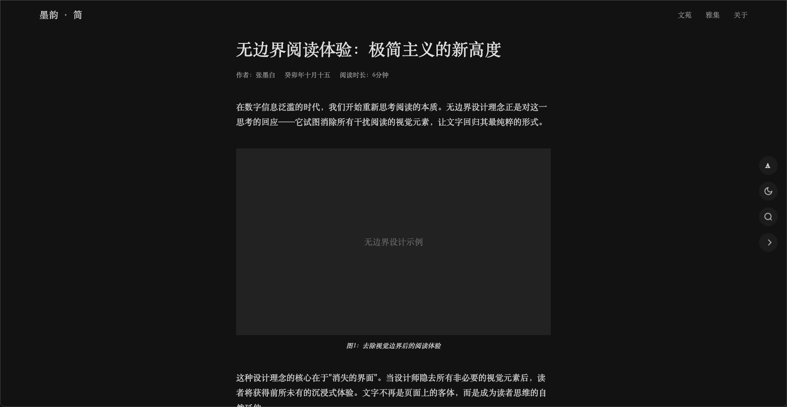
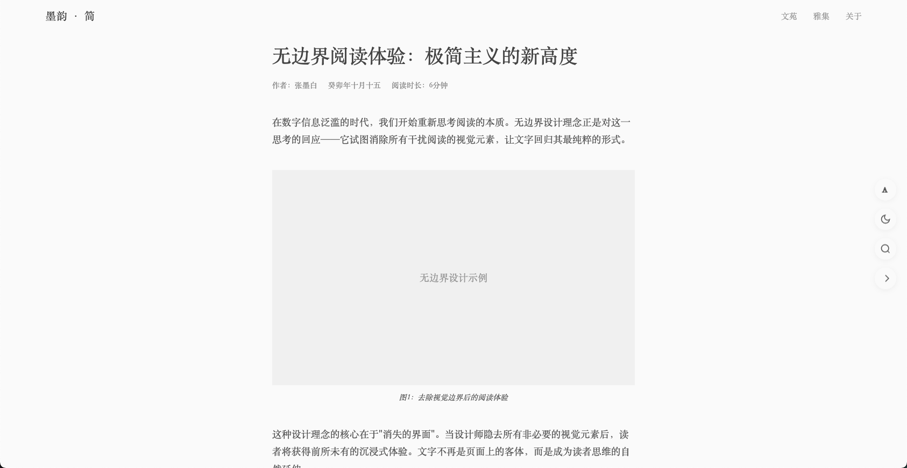

# up-blogs

一套 **极简** 风格的自定义 `vitepress` 博客模板，遵循让阅读回归本源的宗旨和极简的理念。

首先是自用，目前正在开发阶段，等达到一定完成度，讲抽离成一套主题模板进行开源。

TODO

[X] 黑白模式切换

[ ] 文章列表

[ ] 年份转换为天干地支纪年
[X] 支持iconify 图标
[ ] 移动端适配
[ ] 支持评论

[ ] 想到再补充...

