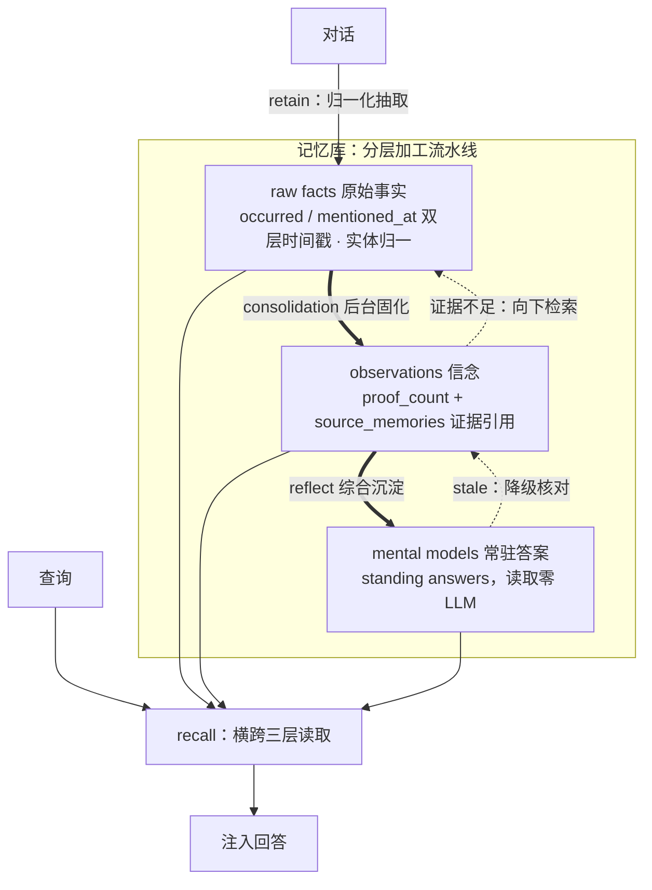
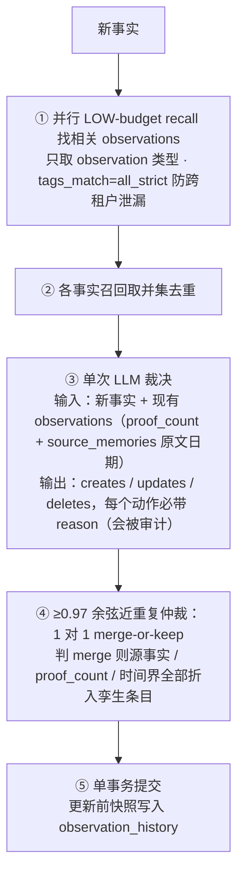
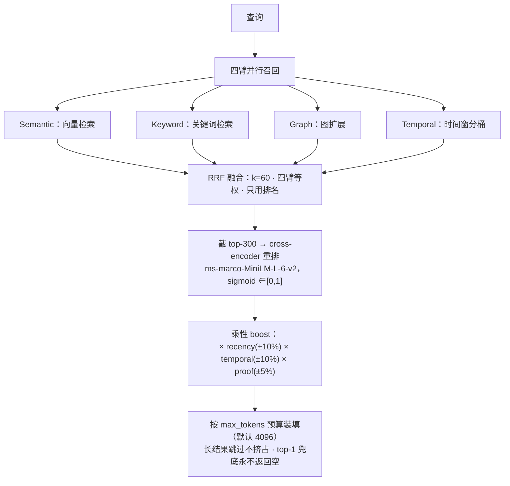
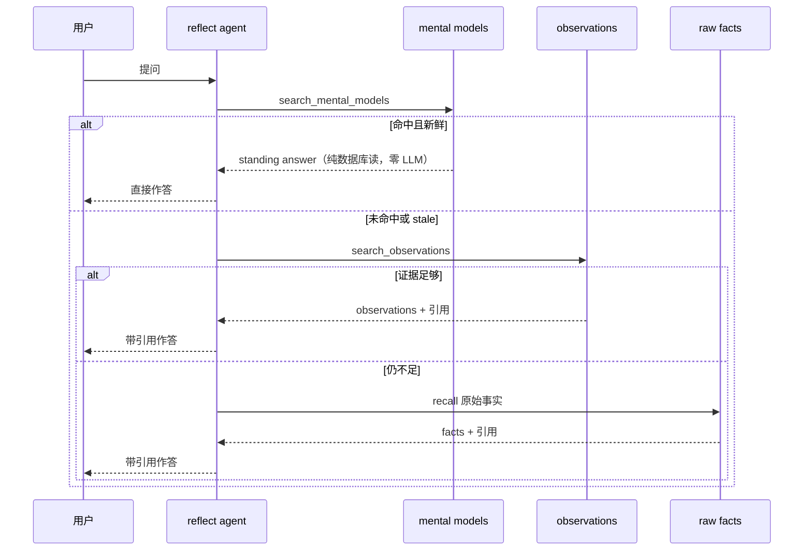

# 窗口是 RAM，记忆是磁盘：把 Hindsight 拆开，看 Agent 记忆的写入、读取与第三态

> 2026-09-29

先问一个会把大多数 agent 问倒的问题："Alice 现在在哪家公司上班？"——三月的对话里她说在 Google，上周她说跳槽去了 Meta。把历史切块存进向量库的 agent，会把两条都捞出来塞给你，让你自己裁决；把原文全塞进 1M token 窗口的 agent，会把两段原文并排摆在你面前。而一个有记忆的 agent 应该只答一句："Alice works at Meta (previously thought to work at Google)"。括号里那半句，是旧信念被新证据更新后留下的痕迹——这个句式不是即兴发挥，是写在 Hindsight 固化提示词里的规则示例（consolidation/prompts.py，文中引文我都核对过原文）。三种回答的差别不在检索精度，而在于：前两种系统只有存储，第三种有信念维护。

这篇文章把 Hindsight 当解剖样本而非主角，拆三组可迁移的设计模式：记忆怎么写入、怎么读出、怎么在后台重组自己。

## 窗口是 RAM，记忆是磁盘：立论与解剖总图

窗口和记忆是两个问题。窗口是被动的、无差别的全文可见，所有内容平铺在注意力面前；记忆是主动的、有取舍的分层存取，留什么、怎么组织、何时取用，每一环都是决策。窗口回答"一次能看多少"，记忆回答"该留什么"——窗口扩大不消灭后者，正如内存扩容不能替你管硬盘。类比体系结构就是标题那句话：窗口是 RAM，记忆是磁盘，RAM 再大，断电即空。

Hindsight 官方博客《Your 1M-Token Context Window Is Not Memory》（2026-07-22）列过四个窗口补不了的缺陷，比"窗口不够大"的直觉狠得多。一，会话结束即失忆，杀手句原文是 "A ten-million-token window that resets every session remembers exactly as much as a two-thousand-token one: nothing."。二，context rot：lost-in-the-middle（arXiv:2307.03172）测出搁在窗口中部的事实，准确率比两端低 30% 以上；Chroma 对 18 个前沿模型的研究发现，衰减远未到窗口上限就开始、幅度 30-50%，而且是悬崖式——32K 还行，64K 崩。三，窗口是 raw dump 不是知识：它不知道 300 条消息前的 "Ben" 和眼下的 "he" 是同一人，也不知道三月的决定六月被推翻。四，窗口再大也要做选择，而选择本身就是记忆的全部工作。官方留了一句检验法，值得贴在显示器边上："Should your agent remember this after the session ends?"

解剖样本的立场先交代。Hindsight 是 Vectorize 的开源项目（MIT），2025-10-30 建仓、2025-12-16 发布，11 个月 42.3k stars，第二个 20k 只用了 45 天（GitHub API 核实）。但热度要拆开看：HN 的 launch 帖至今 4 分 2 评论（news.ycombinator.com/item?id=46294975），增长靠的是 GitHub Trending、集成生态和内容矩阵，属于 bookmark 热度，不是技术共识。所以下文只解剖设计、不背书排名，它的账单、局限和榜单口径，留给"账单、边界与争议"一节专门处理。

论文（arXiv:2512.12818）把它组织成三个操作——retain 写入、recall 读取、reflect 重组——和四个逻辑网络：world facts、agent experiences、entity summaries、evolving beliefs。落到代码，可以压成一张解剖总图：

这张图的重点不是三个框，是方向：这不是一个向量库，是一条分层加工流水线。底层是 retain 写入的归一化事实，中层是后台 consolidation 从事实固化出的信念，顶层是 reflect 从信念综合出的常驻答案；每一层都比下一层更压缩、更 settled、读取更便宜。"越往上越省"这个结构，是后面所有设计的出发点。下文按这个顺序拆：写入两讲、读取一讲，然后是 reflect——论文把它叫第三个操作，我更愿意叫它记忆的第三个态：不挡在请求路径上，在后台慢慢发生，所以单独一讲。最后算账、上手。

## 写入第一课：retain 把对话归一化成带双层时间戳的事实

朴素 RAG 的写入是"切块 + embedding"：原文分片、算向量、入库，结束。Hindsight 的写入可以叫"归一化"：时间归一、实体归一、关系显式化。写入时多付的这些功，都是在为读取时的复合查询买期权——这话先按下，读到检索那节兑现。

抽取发生在 retain 的提示词里（fact_extraction.py 的 _BASE_FACT_EXTRACTION_PROMPT）。每条事实抽 what/when/where/who/why 五要素；做指代消解，"my roommate" 配上前文的 Emily，落地成 "Emily (user's roommate)"；fact_kind 分 event（可定日期的事）和 conversation（偏好、状态这类没有发生时点的话）；fact_type 按"谁在说话"分 world（外部事实，含用户偏好）和 experience（agent 自己做过的事）。

双层时间是这套写入语义里最重要的机制。每条事实带 occurred_*（事件何时发生）和 mentioned_at（何时得知）两套时间戳，官方文档的例子是"2025 年 1 月告诉你，Alice 2024 年 6 月结婚"：只有发生时间，历史查询没法做；只有得知时间，before/after 推理无从谈起。历史查询、recency 排序、时序推理各取所需，缺一不可。它也是后文"矛盾写成时间叙事"的地基。

粗日期有条铁律："in 2015" 必须铺满 2015-01-01 到 2015-12-31，绝不折叠到首日；conversation 类不设 occurred 日期。为什么这么较真？issue #3893 是现成的反面案例："the 2026 summit" 被存成 2026-01-01，到了八月，recency 把它当成 8 个月旧的旧闻往下压。修复是让 recency 按期间末端计龄并封顶在中性（reranking.py）。写入端偷的懒，读取端要用一次线上事故来还——这类账后面还会反复出现。

实体归一用模糊名字匹配加共现加时间邻近，"Alice"、"Alice Chen"、"Alice C." 归成一个人；单次 retain 内变体合并的上限是 250 个新名字。官方自己承认风险：名字相近的新实体可能被错误并入已有实体（retain.md:93）。归一后的实体连成图，四类边：实体边、时间边（越近越强）、语义边（相似度 ≥0.7 才建边）、因果边（显式 cause-effect）。

成本埋个伏笔（详账见"账单、边界与争议"一节）：五种抽取模式里 concise 是默认，官方称砍掉 90% 无谓输出；chunks 模式零 LLM；retain_mission 可收窄抽取面。写入端是 LLM 密集的，这个结构性代价跑不掉。

## 写入第二课：observations→beliefs，证据固化流水线

朴素 RAG 记忆有两个致命伤，这条流水线解决的正是它们。一个是记忆覆盖：新事实进来，旧事实被静默替换，谁替换的、凭什么、替换前是什么，全部丢失。另一个是记忆腐烂：过时事实永远躺在库里，检索到就照说不误。Hindsight 的固化流水线（consolidation）把"记忆更新"从数据库 upsert 升级为带证据链与审计轨迹的信念维护——新证据到来时，动作是强化、弱化或扩展，不是覆盖。

流水线五步（consolidator.py:2500-2600，代码级核对）：

五步里有三处需要停下来细看。第一处是①本身：每条新事实要先并行跑一次"找相关现有 observations"的 recall，budget 压到 LOW，匹配条件里还要求 tags_match=all_strict——tags 是贴在每条记忆上的租户标签，充当可见性边界，全部严格匹配才允许召回，免得固化时把 A 租户的事实并进 B 租户的 observation。这一步等于记忆系统用自己的读取引擎找写入的合并目标。这个递归设计初看绕，细想是必然：不召回就不知道该跟谁合并，而召回本来就是这套系统最擅长的事。第二处是③：单次 LLM 调用里，新事实和现有 observations 一起上桌，后者带着 proof_count 和逐条 source_memories 原文加日期——模型不是在"改数据库"，是在看着全部证据做裁决。第三处是⑤的单事务提交，issue #3876 是血泪：旧版 DELETE 成功而后续 CREATE 失败，知识被静默删除，操作还报 completed。原子性这种传统数据库里的常识，LLM 管道要靠一次事故才长得回来。

裁决的尺度写在九条固化规则里（consolidation/prompts.py:37-55），不全列，挑四条最有味道的。规则 1，PREFER UPDATE OVER CREATE，理由原文是 "One canonical observation with many source facts is always better than many siblings"（prompts.py:39）。规则 7，PRESERVE HISTORY，重大事件类的 observation 永不删除。规则 8，NO COMPUTATION："I have 2 dogs" 加 "a dog named Rex" 绝不许算成 3 条，"never do arithmetic or logical deductions"（prompts.py:53）——宁可少推断，不许编证据。规则 5 要求级联更新所有受影响的 observations。

矛盾语义单独说，它就是开头 Alice 场景的官方答案。矛盾不覆盖，写时间叙事："User was previously a React enthusiast…, but has now switched to Vue"；直接更正时保留前认知："Alice works at Meta (previously thought to work at Google)"。旧信念不是被删掉，是被新证据推翻后留在了句子里——审计轨迹直接长进了答案文本。

proof_count 的定义容易被望文生义。它不是计数器，是去重后的源事实数，每次合并时重算（迁移博客《Bring the Facts, Not the Beliefs》2026-09-23，加 consolidator.py 的 UPDATE SQL：source_memory_ids=array_agg(DISTINCT)、proof_count=count(DISTINCT)）。UPDATE 路径同时做三件事：tags 取并集——还是那道安全边界，合并后的 observation 继承全部贡献者的标签，谁贡献过源事实，谁就仍然看得见它；时间界用 LEAST/GREATEST 扩展；更新前快照写进独立的 observation_history 表。这个独立历史表本身就是一次真实事故的疤：曾用单个 JSONB 列存历史，高频强化的 observation 撑爆了 Postgres 256MB 的 jsonb 上限，官方代码注释里留着原话。

近重复有双防线。LLM 层：就算模型无视规则造了近似重复，新 observation 与现有条目余弦相似度 ≥0.97（config.py:1750 的 DEFAULT_CONSOLIDATION_DEDUP_THRESHOLD）也会触发一次 1 对 1 的 merge-or-keep 仲裁——读两段全文判合并还是保留，判 merge 则源事实、proof_count、时间界全部折入孪生条目。

检索层这道防线更有意思。固化用的召回专门改用 interleave 轮转融合——各臂轮流各取一名，保证每一臂的第一名都占一个槽位——而非 RRF 或 cross-encoder，因为后两者都会把"语义第 1 名的孪生 observation"挤出预算：cross-encoder 把它压到第 37 名，RRF 把它挤出 512 token 预算，LLM 看不见合并目标，就会创建重复（定性论证在 fusion.py:112-130 的 docstring，实测数字记在 consolidator.py:3278-3281 的注释里）。于是同一个系统里两处检索用两套融合策略，因为服务对象不同：一处喂 LLM 找合并目标，一处喂最终排序。

最后一条红线，写给会被"信念更新"四个字带偏的读者：这不是贝叶斯更新。没有概率分布，没有置信度数值，没有概率化的强化弱化；它是 LLM 的离散决策（create/update/delete）加去重源事实计数、证据引用、历史快照。准确的表述是"upsert 语义升级为带证据链的信念维护"，贝叶斯只配当思想对照，不配当机制描述——写成后者，会被懂行的人抓住。

## 读取语义：四路召回、RRF 融合与一次教科书级翻车

"上周谁承诺过什么"——这个查询里同时有时间窗（上周）和实体关系（谁、对谁、承诺了什么）。单路向量检索只能找到"谈到承诺的文本"，对时间和关系全盲。所以 recall 是四路并行，经典 IR 的多路召回在 agent memory 场景复活，只是每一路都为记忆场景做了特化：

| 臂 | 机制 | 门道 |
| --- | --- | --- |
| Semantic | pgvector HNSW | 默认 bge-small-en-v1.5，384 维，约 130MB，本地自动下载 |
| Keyword | 名义 BM25 | native 后端其实是 tsvector 的 TF-IDF；5 个可插拔后端里，Citus 横向扩展下只有 ParadeDB pg_search 有真 BM25 |
| Graph | 加性打分，总 ∈[0,3] | tanh(共享实体数×0.5) + 语义链[0.7,1.0] + 因果链[0,1]；用加性是因为乘性会把只有因果连接的记忆清零 |
| Temporal | 时间窗 + 分桶 | 查询里的时间表达解析成日期窗；窗内按语义相关性选而非新近度，再按时段分桶取每桶最强 |

Temporal 臂多看一眼：窗内不按新近度选，否则"2023 年发生了什么"永远只捞到十二月的事；分桶取每桶最强，答案才覆盖全年，而不是挤在最密的一段。

四臂的分数不可比——cosine 和 BM25 的量纲不同——所以融合只用排名：RRF，score = Σ 1/(k + rank)，k=60（Cormack SIGIR09 的经典参数，fusion.py:29 默认），四臂等权。

融合排完截 top-300，过 cross-encoder（默认 ms-marco-MiniLM-L-6-v2，logit 过 sigmoid 归一到 [0,1]），再乘三个 boost：

`final = CE × recency × temporal × proof`

三个 boost 长同一个样子：boost = 1 + α × (信号 − 0.5)，信号归一化到 [0,1]、0.5 是中性点，α 分别取 0.2/0.2/0.1——所以 recency、temporal 各自最多 ±10%，proof 最多 ±5%；三个同时拉满是 1.10 × 1.10 × 1.05 ≈ +27%，同时踩底是 0.90 × 0.90 × 0.95 ≈ −23%。proof 的信号曲线是 clamp(0.5 + ln(proof_count)/10)：1 条证据正好落在 0.5、中性，150 条以上顶到 1、封顶 +5%（reranking.py:197-203）。这里有个闭环：写入端辛苦维护的 proof_count，流进了读取端的排序公式——写入和读取在这里接线。

为什么乘不加？reranking.py:174 的注释给了理由：加性会让一条不相关的记忆仅凭新近就压过强相关记忆；乘性保证次要信号永远与基础相关性成比例。新近度最多 ±10%，翻不了语义的盘——知道什么信号不该赢，是排序设计的品味所在。

重排完还要过 token 预算裁剪，这一步是面向 agent 而非人类的：结果按 final_score 降序装填，直到 max_tokens（默认 4096）耗尽；装不下的长结果跳过，继续装后面的短结果——一条长事实不挤掉排后面的短事实；全装不下仍返回 top-1，匹配到的查询永不返回空。

budget（low/mid/high）和 max_tokens 是两个独立旋钮：前者控搜索深度（fixed 模式 100/300/1000 候选，adaptive 模式按 max_tokens 的 2.5%/7.5%/25% 配额，clamp 在 [20,2000]），后者控返回上下文大小（2048/4096/8192，约 2/4/8 页）。官方配方直白：chatbot 用 low+2048，文档问答 mid+4096，研究型 high+8192。延迟上 recall 典型 100-600ms，瓶颈在 CPU 上的 cross-encoder。

一次 recall 七道工序，每道都是旋钮，也都是翻车点。最脆的恰是融合层，而且它翻过的车被完整写进了代码（recall_boost.py:38-41 的 docstring，issue #3956）：最初实现"偏好某一路"的方式，是给该臂的 RRF 贡献乘权重 w，high 档取 7。但 k=60 的 RRF 在 300 候选窗内分数动态范围只有 5.9 倍，w 一超 5.9，排序就退化成字典序（代码原话 "lexicographic"）——偏好臂的第 360 名压过其他臂的第 1 名，300 个槽位全被占满，实测 recall@20 从 0.97 跌到 0.40。修复是改在排名空间加权（divisor 取 2/4/8），让排序与 k、cap、池大小全部无关。这条教训可以记成口诀：分数不可比，就别在分数空间加权。多路融合的调参脆弱是结构性的，不是细心就能躲过去的那种。

## 第三态：reflect 与 mental models，用离线计算换在线延迟

写入了、能读了，还差一块：谁在后台深度重组记忆库？这是记忆的第三个态——离线的自我重组，也是 Hindsight 区别于"高级 RAG"的地方。

reflect 不是一次检索，是工具循环（reflect/agent.py:516）：六个工具——search_mental_models、read_mental_models、search_observations、recall、expand、done——上限 10 轮迭代。护栏很严：必须先取证才许作答；引用要校验，只有真实检索到的 ID 能被引用；系统提示词第一行是反幻觉铁律 "You MUST ONLY use information from retrieved tool results"（reflect/prompts.py:233）。检索沿阶梯向下：mental models → observations → raw facts，每层比下层更便宜、更 settled，先查有没有现成答案，没有再降级。

有个工程细节很见功力。reflect 可以配 disposition 三特质——skepticism、literalism、empathy 各 1-5——加一段自然语言 mission，实现上必须把特质的文字释义一起注入提示词。原因写在 prompts.py:177 的注释里：弱模型会把 "skepticism=5" 当元数据，答得和 =1 一模一样（gemini-2.5-flash-lite 上抓到过）。数字不解释，就只是装饰。与 disposition 的软影响相对，directives 是硬规则，可按 tag 限定作用域。structured_output 做成两段式：先推理出自然语言答案，再第二次调用投影成 JSON——一次调用里既推理又格式化，两头都容易坏。

mental models 一句话能说清：standing answer，常驻答案。你定义一次问题，系统后台写好答案，随 bank 学习持续重写。读取的金句在 mental-models.mdx:22："Fetching a mental model is a database read. No retrieval, no synthesis, no LLM call, no waiting." 用空间和离线计算换在线延迟，标准的空间换时间；还有个一致性红利——两个用户问同一问题，读到的是同一份文档，不是两次独立生成、细节可能不一致的答案。刷新由 refresh_after_consolidation 或 refresh_cron（UTC）二选一触发，带作用域检查：只有自己 scope 内的记忆变了才重建，忙碌的 bank 不让无关模型空转。过期也讲究：stale 的模型仍展示，但不再短路检索阶梯，agent 得向下层核对——旧答案不能直接采信，但告诉你该去哪层核对。

mental model 是检索阶梯的短路开关，staleness 是开关上的保险丝。但离线重组也把 LLM 的不稳定性搬进了常驻答案，增量化就是为此：delta 模式只施加新知识暗示的修改，未变部分逐字节保留。理由官方说得直白（mental-models.mdx:50）："Generating text is what the model does; copying it verbatim is not." 让 LLM 重写文档，重写几百次必然漂移——bullet 变数字、大小写变、句子被悄悄改写。

边界有实打实的事故。issue #3355：40,619 节点、815,676 链接、15,648 observations 的 bank 上，单次 refresh_mental_model 确定性吃到 17.7GB RSS 被 OOM kill（v0.9.0，三天修复；recall_max_tokens 压到 512 也只是延缓初始爬升）。官方黑盒评测仓库 hindsight-system-evals 的知识页收敛测试还抓到两个真实回归：一个页面上一波说 "Release 0.9.3 was deployed to production on 18 March 2026"，下一波改口 "No release was deployed"——事实在早前波次，出了 delta 窗口；另一个数着 3 个客户、再来 4 个，报告变成 4。根因相同：delta 步骤把"基于新批次写成的综合"当成了权威。

顺带一句 knowledge pages：面向用户的 mental model，wiki 式文件夹树，hindsight fs mount 能挂载成真实的 markdown 文件。页面是投影不是存储——删了不丢数据，随时从已抽取、去重、和解过的记忆重建。

## 账单、边界与争议：解剖台上的并发症

并发症不是工程失误清单，是设计模式的内在代价。performance.md 里那句设计哲学——为读优化、写时付账（write once, read many）——决定了账单在写入端、体验在读取端；而 LLM-in-the-loop 的记忆系统，记忆质量的上限就是抽取和固化模型的水平。

写入端的账单有多重？issue #1573：一位真实用户 30 分钟烧掉 3.31M token（Cerebras 上约 $5），根因是 tool_use/tool_result 块占了 retain 载荷 85% 的字节，而 retainToolCalls 开关要重启才生效；Ollama Cloud 上单次 retain 700-800 秒，consolidation 常规 50 分钟起步，最长一次 3,009 秒。维护者当天响应排查，态度没问题，但"零成本挂上记忆"的叙事到这里就不成立了。降本手段官方给了：Anthropic Message Batches 半价；固化系统前缀刻意做成 bank 无关，全部 bank 共享一个 Gemini CachedContent；按操作选模型，retain 官方推荐 gpt-oss-20b，博客标题就叫 "Hindsight Doesn't Need a Smart Model"——抽取任务结构化，小模型反而合适。延迟全景：recall 100-600ms，reflect 800-3000ms，retain 每批 500-2000ms。

可靠性天花板官方文档自己承认：抽取非确定——同一文档两次跑，一次出事实一次一条不出，官方原话 "Treat a zero as this document needs another pass"；实体消解可能把新名字错并进已有实体；迁移导入别人的 observations 会绕过去重机制制造污染（官方 2026-09-23 的博客《Bring the Facts, Not the Beliefs》正面回应并给出修复命令）。

一手用户复盘也有一份，来自 Praveen Kumar Sridhar 的《From Honcho to Hindsight》（2026-09-13）：8,455 条 conclusions 迁进 13 个历史 bank，金句是 "The move preserved the history. It also preserved the clutter."，最后清掉 3,881 条；他发现归档检索要约 10 秒，超出客户端启动 recall 路径约 3 秒的时限，一次 Codex 会话因此漏掉了已存的事实；他自搭的压测（注意：用的是朴素相似度检索器，不是 Hindsight 的检索器）显示重复记忆挤占有用事实——256 token 配额下必需事实到达率从 51/72 跌到 21/72，完整交接从 8/24 跌到 0/24，去重只能恢复基线。他的定位很清醒："Hindsight was the backend I was trying for that arrangement, not a winner selected by a head-to-head benchmark." 这句话比任何榜单都值得抄在选型笔记的第一页。

榜单的口径必须说清。AMB（agentmemorybenchmark.ai）是 Vectorize 自建的，宣言原话 "That's why we built Agent Memory Benchmark"；harness 开源在 github.com/vectorize-io/agent-memory-benchmark，人人可复跑，但榜首数字是自家跑的。README 里"弗吉尼亚理工 Sanghani Center 独立复现"也要打折——论文作者名单里就有 VT 的 Naren Ramakrishnan，这是合作研究，不是第三方独立验证，严谨的写法是"与弗吉尼亚理工合作者共同验证、论文同行评审中"；至于"华盛顿邮报复现"，我这次没找到一手出处，不写。

数字本身可以引，但标清来源：论文版本（v0.1.0，2025-12）报 LongMemEval 91.4%、LoCoMo 89.61%，对比最强先前开源系统 75.78%，20B 模型从 39% 提到 83.6%；BEAM 的 10M-token 档 64.1% 对 Honcho 的 40.6%，且 1M（73.9%）高于 500K（71.1%），官方把这当作架构生效的证据。真正的元争议在别处：Hindsight 自己论证 LoCoMo/LongMemEval 是 32K 窗口时代的产物，如今 context-stuffing 也能打平。"记忆系统该测什么"至今没有共识，数字军备竞赛还在厂商自己手里——Zep、Memori、OKF、agentmemoryleaderboard.ai，各有各的榜。

## 当天上手：给 Claude Code 挂上这层架构

看完解剖，上手反而简单，五条路我都核实过。最省事的一条：docker run ghcr.io/vectorize-io/hindsight:latest，自带内嵌数据库 pg0，不用另装 Postgres，API 在 8888、UI 在 9999；再配一个 LLM provider 就能跑——25+ 家都行，也可以直接用现有订阅：openai-codex 对应 ChatGPT Plus/Pro，claude-code 对应 Claude Pro/Max，cursor 和 github-copilot 都免 API key。

MCP 服务是内建的、默认开启，endpoint 是 http://localhost:8888/mcp/{bank_id}/（单 bank 模式 27 个工具，/mcp/ 多 bank 模式 30 个；bank 选择优先级：URL 路径 > X-Bank-Id 头 > 默认）。Claude Code 接入就一行：`claude mcp add --transport http hindsight http://localhost:8888/mcp/<bank>`。想在应用里接，pip install hindsight-litellm 之后 wrap_openai(OpenAI(), bank_id=..., hindsight_api_url='http://localhost:8888') 或 wrap_anthropic()（wrappers.py:1690/1793），每次调用自动注入召回记忆加后台 retain，hindsight_* 参数可以逐调用覆盖 bank、budget、fact 类型、reflect 还是 recall。编码 agent 有全家桶：npx @vectorize-io/hindsight-coding-agents install all，一条命令给 18 个编码 agent（Claude Code、Codex、Cursor、Copilot CLI、opencode、Cline 等）挂共享记忆，默认每仓库一个 bank，自动从 git 历史和过往会话摄取。不想起服务就纯 Python 内嵌：pip install hindsight-all，默认的嵌入和重排模型（bge-small-en-v1.5 + ms-marco-MiniLM-L-6-v2）零配置自动下载。

挂的时候带着账单意识：起步按检索那节的配方选 budget 和 max_tokens；tool_use 密集的会话先关 retainToolCalls 再重启；小范围先试 retain 的 token 消耗、观察 consolidation 的行为，再全量接入。

解剖到最后，最深的交换浮出来了：我们把记忆从确定性存储交给了概率性策展。数据库永不犯错，但永不理解；LLM 能理解，但会犯错。回看解剖台，proof_count、历史快照、单事务提交、0.97 仲裁、delta 增量化——几乎每一个机制，都是在给这个根本交换打补丁。

所以真正的问题不是"Hindsight 好不好用"，而是：当你的 agent 的"记忆"本质上是另一个模型的"判断"时，你愿意把多少信任预算从存储层挪到策展层？账单那一节列出的并发症——抽取不确定、实体误并、delta 窗口外的旧事实——全长在同一条根上。这个问题任何要做长期记忆的 agent 系统都逃不掉，无论它叫什么名字。
