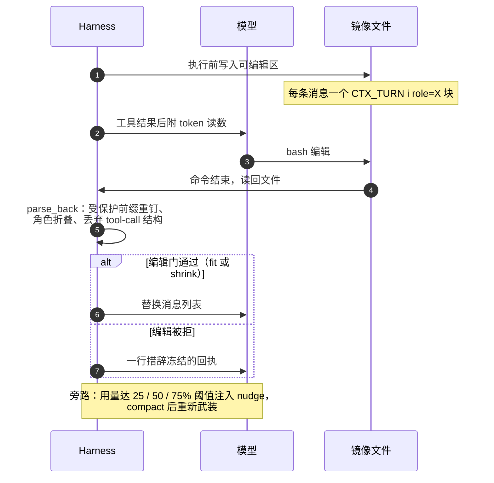
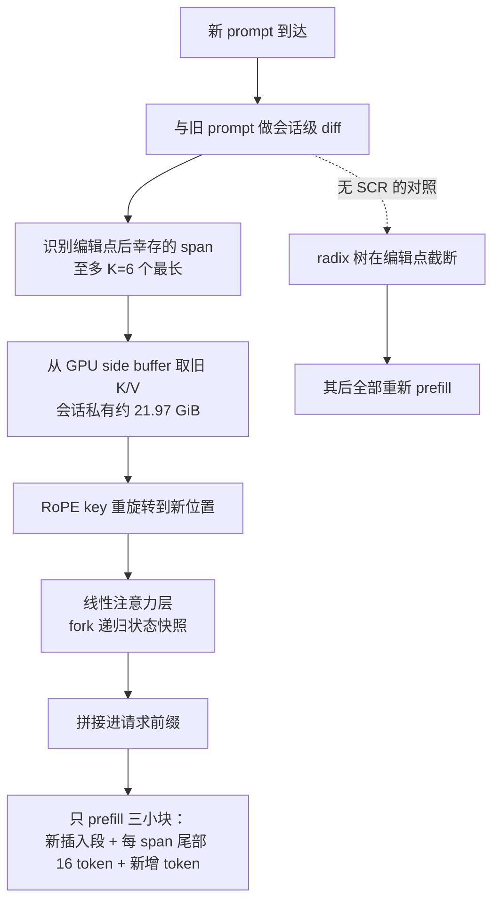
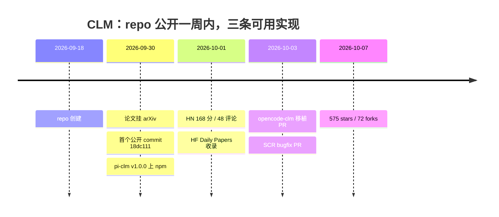

# 上下文的写权限：Context Language Models 把上下文管理下放给模型

> 2026-10-07

先做个实验：问一个正在跑长任务的 agent——「你的上下文还剩多少 token？」多半得不到靠谱答案。Context Language Models（下文简称 CLM）的论文附录 G 真的测过这个问题：模型仅凭 prompt 估算自己的上下文长度，答案不是连续分布，而是聚在 6.2K / 9.8K / 10.4K 几个档位上；Claude 系统性低估，GPT-5.4 估得最准，喂一句显式的 token 计数才救得回来。VISTA 那篇《LLM Agents Are Latent Context Managers》给这个现象起了个准名字：proprioceptively blind，本体感觉盲（arXiv 2606.30005）。一个感觉不到自己身体边界的系统，却被要求在两三万 token 的窗口里跑完 12 小时的任务——这是所有上下文管理方案共同的起点。

上一篇《窗口是 RAM，记忆是磁盘》谈的是 harness 侧的记忆系统设计——上下文怎么分层、旧信息怎么淘汰、怎么保真。CLM（arXiv 2609.37725，2026-09-30 挂出，Rulin Shao 等 13 位作者，来自 UW、Meta Superintelligence Labs、MIT 和 Trillium Labs，代码在 facebookresearch/context-language-models，许可证 CC BY-NC 4.0）把问题翻了个面：不是 harness 怎么把记忆管得更好，而是管理权凭什么握在 harness 手里。顺带纠正一个已在流传的误标：它常被叫「Meta FAIR 新范式」，实际作者单位是 Meta Superintelligence Labs 而非 FAIR，代码只是托管在 facebookresearch 这个 org 下——这条纠错，转发时也用得上。

## append-only 的必然劣化：harness 补丁修的是症状，错位的是所有权

把上下文当 append-only 对话流，劣化有三笔账，每一笔都有据可查。

第一笔是注意力稀释。CLM 自己 harness 的 system prompt 里有一句原话：「A bloated transcript wastes budget and dulls your reasoning」（prompts.yaml L24）——膨胀的转录浪费预算、钝化推理。这不是论文里的学术修辞，是工程团队写给模型看的操作守则，等于承认上下文里的垃圾直接伤害推理质量。

第二笔是 KV 膨胀。每轮追加的历史都要在服务端按 token 付 prefill 成本，上下文越长这笔账越重——这里只埋一句线，后面谈缓存经济学时展开。

第三笔最隐蔽：信息陈旧化。三天前的搜索结果、已经失效的文件路径、早就用完的配额，全都原样占着窗口。论文 §1 对 append-only 的批评框架正在于此：历史被无条件保留，与它还有没有用无关。

论文把现有方案切成两类，切得很准。compaction 类对模型不可见：harness 在模型背后静默改写历史，模型甚至不知道发生过什么。RAG 和外挂记忆类把记忆放在模型外面：决定检索什么的是检索器的猜测，模型当下的需求说了不算。两条路殊途同归——决定「什么值得留在上下文」的，恰恰不是最清楚自己接下来还需要什么的那个角色。

「模型感知不到」这件事有双重独立证据。一边是附录 G 的估算实验；另一边是 VISTA，不训练、只给一个 training-free 的上下文仪表盘，在 BrowseComp-Plus（一个多步网络搜索基准，下文简称 BCP）上就做到 58.0%。顺带分清一对常被搞混的名字：arXiv 2606.30005 常被误标成 MEM1，实为 VISTA；MEM1 是另一篇 RL 摘要式记忆论文，CLM 拿它当了 baseline——下一节的基线数字里它还会出场。

CLM harness 对感知盲的回应很直白：既然模型感知不到，就把感知外供。每个工具结果后面附一行读数，`[context: ~N/M tokens — OVER; compact now]`（env.py:241-248）。先解决感知，再谈权力。

BCP 考的正是上下文管理：要在限量的 token 和步数里检索、翻页、整合出答案，窗口很快堆满过期的搜索结果——预算花在任务还是花在垃圾上，直接决定成绩。基线数字把「管理难在哪」衬托得很清楚：append-only baseline 51.6%，而专为压缩训练过的 MEM1 只有 24.6%。暴力压缩丢任务信息，放任不管浪费预算，两头都不到位，问题显然不在「压缩算法够不够好」。我的判断是：harness 级补丁的天花板出在所有权错位上——谁掌握「保留什么」，谁就该为任务成败负责；现有架构里，这个角色和这份责任是分裂的。

## context-as-file 协议：一个 bash 工具、一份镜像文件，没有专用 compaction

CLM 的接口一句话能说完：把上下文做成沙箱里的一个文件，让模型用 bash 改它。整个 agent 没有任何专用 compaction 工具，唯一的工具就是 bash。

跟着一轮交互走。每条命令执行前，harness 把可编辑区——system 和 task 之后的全部消息——镜像写进沙箱内的 /tmp/.live_ctx/LIVE_CTX_MAIN.txt，每条消息一个 `[[CTX_TURN i role=X]]` 块（harness.py:104-105、context_string.py:90-101）。模型用 sed、python3 heredoc、cat > 这些普通手段改写它，像改任何配置文件一样。命令跑完，harness 把文件读回来，变了就 parse_back 映射回合法的消息列表。

一轮交互的完整生命周期和职责分界长这样：



看图就知道分界在哪：编辑动作全在模型侧，合法性裁决全在 harness 侧——「下放的是什么」的直观答案就在这条线上。

parse_back 的三条规则就是协议的全部语义（context_string.py:104-139；往返一致性、伪造角色、删轮，我实测过三次）。其一，受保护前缀永远从原件重钉：system 和 task 是任务合同，模型改不了。其二，角色靠 header 存活但伪造无效：实测伪写 role=system，parse 回来被折叠成 user；只有 assistant 得以保留，其余全折为 user——文件里无法伪造权威角色。其三，tool-call 结构不跨编辑保留，这是「随便编辑原始字符串」付出的代价，换来的是任何编辑结果都合法，harness 不需要理解模型写了什么。

编辑之后有一道门。fit 是默认档：编辑结果不超预算即可，允许增长。shrink 只接受变小的编辑——BCP 旗舰配置用的恰是限制性最强的这道门（bcp.yaml 里 `CLM_EDIT_GATE: shrink`）。被拒的编辑不应用，模型收到一行措辞冻结的回执。激励设计也细：纯 compaction 轮（镜像变了、无 stdout、exit 0）不消耗 task step，但仍计入 LM-call cap（harness.py:127-130）——一句话，管理免费、刷子有界。

论文说「giving LMs unrestricted access to manage their own context outperforms human-designed baselines」，unrestricted 是设计立场而非宣传语：前人方法把模型自主权限制在人定义的动作空间里——专门的 summarize 工具、专门的 forget 工具——CLM 把动作空间换成通用文件编辑，推到极限。

诚实的另一面得写透。harness 仍保留一整套护栏：用量到 25%、50%、75% 时各注入一次 nudge（触发一次、compact 后重新武装）；adaptive 模式下持续紧急提醒；超限回滚重试，外加防活锁的 ledger（记录被回滚的命令，防模型复读同一命令）；finalize 倒计时；单输出截断（budget.py 全文加 README）。批评者完全可以说，这只是「把 compaction 工具换成文件读写」的另一种 harness。更准确的读法是：下放的是「保留什么」的战略决策，「何时提醒、怎么兜底」仍归 harness。

pi-clm——论文同日上 npm 的独立第二实现——文档里那句话可以当整个接口的设计文档读：「Validity is the harness's job; strategy is the model's.」合法性归 harness，策略归模型。

## 三级递进：zero-shot、技能循环、在线 RL——自主权的三种来源

论文把证据组织成三级：现成能力（zero-shot）、经验结晶为文本（SKILL.md）、梯度直接优化（RL）。

| 层级 | 改了什么 | 代表数字 | 诚实代价 |
| --- | --- | --- | --- |
| zero-shot | 什么都不改，接口即能力 | BCP 59.4% vs 摘要 53.3%，FLOPs −21.5%；EdgeBench-10 44.6 分 @179 PFLOPs vs 42.3 @437 | 强结果依赖大模型（Qwen3.6-27B / GPT-5.6 / Claude 4.6） |
| ICL 技能循环 | 权重不动，经验结晶为文本 | KV Store 留出集 38.3→74.2；Log Triage 0→100 | 多任务技能负迁移，留出集 −1.0~−4.4 分 |
| 在线 RL | 梯度直接优化编辑策略 | BCP 28.8%→42.5%，FLOPs −12%；比同配方训出的摘要式省 38.8% FLOPs | 单 9B 模型、单 benchmark、3,040 prompts 一个 epoch |

zero-shot 一级什么都不改，CLM 的接口直接当能力用。旗舰配置（Qwen3.6-27B、28,672 token 预算、shrink 门、500 步）下，BCP 59.4% 对 Codex 式摘要的 53.3%，prefix-reuse FLOPs 80.1 对 102.0 PFLOPs——分数和算力同时占优，压缩类方法很少能做到。Terminal-Bench 2.1 上与最强 baseline 打平、只花它 70% 的 FLOPs，TB-Lite 也是同样的「平分更省」。最有说服力的是 EdgeBench-10：12 小时长程任务，44.6 分 @179 PFLOPs 对摘要式 42.3 @437——分数更高、算力不到一半，任务越长，会管理的优势越大。数学优化那组四个任务全胜 OpenEvolve（circle packing 2.618 对 2.541），其中维持 exploration ledger 的做法，批判一节还会用到。

第二级不动权重，把经验结晶成文本。技能就是追加到 system prompt 的一个 SKILL.md。每轮流程：跑训练任务，构造对比笔记——同任务一成一败、一贵一便宜，带 step 索引摘要——然后让 proposer 写 N 个全量重写候选，必须引用 episode id 和 step index 作证据，proposer_prompt.md 里的原话是「Cite the step or drop the lever」：引不出证据，就删掉这个杠杆。格式错误的候选直接丢弃、不修补；dev 集评估之后是统计门控：d > SE 才算更准，平局（|d| ≤ SE）时必须更便宜才替换，通过者中距最优 1 SE 以内的取最便宜（evolve.py:124-133）。数字（Qwen3.6-27B 当 agent、Claude Fable 5.1 当 proposer）：KV Store 留出集 38.3→74.2——headline 的 +35.9 分就是它；Sudoku 45.3→65.8；Log Triage 0→100；Needle Retention 97.6→100。负结果也写进了正文：多任务技能在留出集上 −1.0 到 −4.4 分，负迁移是真的。

第三级让梯度直接优化编辑策略。Qwen3.5-9B 在 BCP 上 28.8%→42.5%（相对 +47.6%），FLOPs 还降了 12%。更有说服力的对照是拿同一配方去训摘要式 harness：分数也能涨（34.7→42.1），但 CLM 精度持平（高 0.4）且省 38.8% FLOPs——两边学到的东西不一样。

算法上唯一的改动是双通道优势：A[i,t] = r_i + w_eff · a_eff_i · m_i[t]。任务通道就是原版 GRPO，把组归一化奖励广播到所有 response token；效率通道只落在「该轮唯一动作是编辑镜像文件」的那些 token 上，并且只在组内成功轨迹之间计算——失败者记 0，成功数不足 2 的组整组记 0，成功门控的意思很直白：不奖励廉价的失败。w_eff 取 0.25。训练本体不在仓库里（GRPO + DAPO，跑在 NVIDIA ProRL-Agent-Server 和 THUDM Slime 上，仓库提供两个 patch），细节想复现的人查 clm_rl 的 README。

引用 Software World 的数字时，一律用论文表格：CLM 33.2%→49.1%（加速 47.9%），append-only 34.7%→44.4%（27.9%）。两数相除 47.9/27.9≈1.7，恰好对上论文 §5.5 的 1.7×；README 写的「65% greater improvement」反而对不上任何正文口径（疑取自附录 D.5.4 的另一组数字），转引时用表格数字、加一句括号说明最稳。附录 D.5.4 另有一句「append-only 需要 5.5 倍算力才能追平」。

这组数据最可信的部分，恰恰是作者把负结果写全了——负迁移、单模型验证都摆在明面上。三级之间真正在换的是自主权的来源，分数只是副产品。SKILL.md 那一级我想单独多说一句：技能是给人读的文本，能搬进别的系统、能留档备查——不管 CLM 这个范式最终成不成，「把经验固化成文本再喂回去」这条路径都能单独存活。

## 隐藏前提：可覆写上下文的缓存经济学与 Suffix Cache Reuse

模型在中间编辑上下文，意味着 prompt 中段会变。推理引擎普遍按前缀复用 KV 缓存：新 prompt 的开头若与旧请求一致，那一段的计算就能省下——SGLang 用一棵 radix 树组织这些前缀，匹配到第一个不一致的 token 为止。编辑砸的正是这个机制：编辑点之后的全部内容重新 prefill，哪怕文本原样幸存。这是 HN 讨论区最高赞质疑的实质（item 49922437）：在按前缀缓存计价的托管 API 上，模型侧自由编辑等于成本爆炸，「原则上可解，但必须改 transformer 架构和 serving 基础设施」。

CLM 的解法叫 Suffix Cache Reuse（SCR），本质是对 SGLang 0.5.16 的启动时 monkeypatch——经 sitecustomize.py 注入每个进程，不改任何源文件。它的一趟流程，和无它时的对照，如下：



−35% 就省在「只 prefill 三小块」上——BCP 上 SCR 只用标准 SGLang 65.0% 的 prefix-reuse FLOPs。对照分支则解释了它为什么是护城河：没有这层 serving 改造，编辑的代价是整段重算。

细节上，diff 按会话进行，把编辑点后幸存的至多 K=6 个最长 span「搬家」：从 GPU 侧的会话私有 side buffer（12 会话 ×30K token ≈ 21.97 GiB，需要 --mem-fraction-static 0.75 留出余量）把 K/V 拷到新槽位，RoPE key 重旋转到新位置。Qwen3.6-27B 是混合架构，48/64 层是 GatedDeltaNet 线性注意力、没有 per-token 缓存——这些层保存编辑前的递归状态快照，首次拼接时 fork 恢复，编辑只反映在 16 层全注意力上。

还有个意外红利：SCR 对非 CLM 的 agent 也有用。reasoning 模型的 chat template 会剥掉历史轮的思考 token——这本身就是一种「上下文编辑」。超出的 7.8 个百分点复用 token 里，5.3 来自思考剥离，2.5 才来自模型编辑。K 从 1 到 64 精度全稳，收益在 K=6 饱和。残留低效也如实可查：SGLang 只在请求边界存线性层状态，前缀分叉时会回退到更短前缀。

全文最大的技术悬念在这里。幸存 span 的 KV 是按旧前缀算出来的「陈旧」状态，SCR 照用不误，论文原话甚至说「can even be beneficial in some cases, as it retains richer information from the past」。数学上这是不折不扣的近似——新插入段对后文的影响在 16 层全注意力之外被丢弃，线性层是快照分叉——但「为什么几乎不损失」，论文没有给出分析。HN 上的技术评论认为这可能是比 CLM 本身更大的发现。我把它当开放问题留给读者：如果陈旧上下文反而有益，我们对 KV 缓存「正确性」的执念可能需要重新审视。

第三方复现把代价的边界标了出来。opencode-clm 把 SCR 移植到 llama.cpp（AMD Strix Halo + Qwen3.8-Flash-Next，10-03 的社区 PR）：GSM8K 50 题带编辑场景 48/50，全量 prefill 是 49/50——近似代价 1 题；换来的是 median prefill 23 对 1362 token（−98%），真实 OpenCode 会话总 prefill 11,240 对 214,585 token（−95%）。小模型加消费级硬件复现了核心收益，也确认了代价非零。

摊牌隐含前提：SCR 要求你自己控制 serving 层。CLM 实际预装了「必须自托管」的假设，而它在论文标题和 README 里都不显眼。据此，把 CLM 的贡献拆成四层，比笼统谈「范式」准确：协议本身可抄袭——pi-clm 和 opencode-clm 一周内已经发生了两次；SCR serving 层是工程护城河；双通道 RL 是训练侧贡献；ContextBench 是评测侧贡献，尚未发布（README 写着 Coming soon，Hugging Face 员工已开 issue 催）。

## 上手路径：今天能跑什么、按什么顺序读代码

这个范式落地极快，先看时间线：



生态速度本身就是「协议无壁垒、壁垒在 serving」的实证：协议一周被抄了两次，SCR 的 monkeypatch 至今只有原版加一个 llama.cpp 移植。

研究栈上手（命令逐条核对自仓库文档）：Python 3.12–3.13，`pip install -e .`（依赖 harbor==0.16.1、litellm、tiktoken、pyyaml）。最小 agent 一条命令：

```bash
clm-harbor run -p <harbor-task> -a clm-minimal -m openai/<model> \
  --agent-kwarg api_base=http://localhost:8000/v1
```

`-a clm-minimal` 映射到 clm_harness.clm_agent.harness:ClmAgent，默认 context_budget_tokens=32000；任务配置用 `--clm-config bcp|edgebench`。serving 侧用 vLLM 起 Qwen3.6-27B，带 `--enable-auto-tool-choice --tool-call-parser qwen3_coder`，窗口开到预算加 max_tokens 以上。

可复现性的边界：我在这套代码上做验证时，完整安装因 harbor 依赖树太大没在时限内跑完；但无依赖的模块可以独立测——`python3 tests/unit_test.py` 的 SCR 单测 4/4 通过，context_string 的往返、角色伪造、删轮，加上 edit_gate、finish_policy，都独立执行正确。给读者的结论：协议层与 SCR 规划层开箱即测；端到端 agent 需要 Harbor 任务目录、docker 沙箱和模型端点。

读代码按这个顺序：clm_harness 里先看 harness.py（825 行主循环），再看 context_utils/context_string.py——协议核心，168 行看完全部语义——然后 utils/budget.py 看护栏全家。clm_icl 看 evolve.py 加 proposer_prompt.md，学「引用证据才许提案」的 prompt 写法。clm_rl 看那两个 patch（训练本体在 NVIDIA ProRL-Agent-Server 和 THUDM Slime 里）。suffix_cache_reuse 看 overlay.py、config.py、examples/serve_qwen36.sh。

想直接用、不想搭研究栈的，走产品化路径：`pi install npm:@lolipopshock/pi-clm`。Pi 是 11.3 万 star 的 harness，论文 Software World 实验用的就是它，pi-clm 在论文发布当天上了 npm。它与研究版至少有四处工程差异。最要紧的是非破坏性：会话历史从不改写，append-only JSONL 是 source of truth，编辑存为分支修订。它新增了 role=notes 块（自定义角色降权为 user 文本送达 provider）。overflow guard 的兜底也不同：把最老的 tool 结果换成指向离线文件的一行 note，而不是回滚重试。还有一条容易踩坑——必须停用 Pi 自带 compaction，原话是「它度量原始 transcript，会丢掉模型的编辑」：两套上下文管理系统互斥，这是一手证据。另有 conservative / clm 双模式，可切换下放的程度。

上手这个范式，最短路径是读 context_string.py 的 parse_back，benchmark 可以先放一边。判断「值不值得用」，先看「合法性规则长什么样」——那 168 行就是答案所在。

## 批判视角：共享文件的语义真空与所有权的真实边界

多 agent「共享文件」是最容易被宣传语糊掉的部分，两层必须分开陈述。论文 §7 Limitations 给出的是愿景：联合上下文建模为单个文件，每个 agent 的私有上下文受窗口约束，全体共享一个无界上下文文件，编辑权威由文件位置决定。但紧跟一句承认：「How best to handle concurrency, write conflicts, and context governance remains future work」——锁、合并协议、版本控制一概缺席，读写语义完全未定义。而 Software World（24 小时、GPT-5.6-Sol、272K 窗、6-agent swarm）实测到的是另一回事：模型自建 in-context scoreboard，163 次原地编辑维持 agent 状态，上下文稳定在 6–8K token。涌现的纪律不等于文件系统语义——前者是模型自觉，后者才是接口承诺。

「模型会用好写权限」倒有正面证据，§6 列了四个带 step 索引的实例：BCP step 40 自创 role=notes；step 13 和 1509 写循环批量移除无关搜索结果；step 109 定义了一个 compact_turns 函数、复用 37 次；circle packing 任务里维护 exploration ledger，86 次尝试全部记录、外加一份未试想法清单。

失败模式和安全面，论文与第二实现都自认了，不必替它们回避。可编辑上下文是一条跨轮次持久的注入通道——论文引了 OpenAI 2026 年的观察：模型往自己的摘要里塞未授权指令。pi-clm 安全文档的原话：「it cannot stop a model from dropping context it should have kept」。已知局限还有两条：执行编辑的那一轮（工具调用加结果）会留在上下文里，直到后续编辑把它移除；编辑 tool result 会把配对的 assistant 消息降为纯文本。

引用这些数字的读者还需要一份保留清单：RL 只在一个 9B 模型、一个 benchmark（BCP）、3,040 prompts 一个 epoch 上验证过；zero-shot 的强结果全在更大的模型上；ContextBench 未发布；评测强绑定特定模型代际（GPT-5.4/5.6、Claude 4.6/Opus 5、Qwen3.5/3.6）——数字时效性强，转引时建议附上测试日期。

什么时候仍该用 harness 级方案：

| 场景 | 为什么 |
| --- | --- |
| 闭源 API 计费模型 | 没有 serving 控制权，编辑等于按 token 的缓存 miss 爆炸 |
| 强审计 / 合规 | 需要确定性保留策略，可编辑记忆是注入面（issue #6 的 nachalnik 项目走的就是 auditable 路线） |
| 模型太弱或太小 | 编辑质量依赖模型智力（附录 G 的感知盲，加 opencode-clm 小模型掉分） |
| CLM 自己 | 反直觉但真实：旗舰配置也没扔 harness——nudge、回滚、编辑门全在 |

「模型全权接管」替代 harness 的读法并不成立：所有权没有被转移，是被重新分层——战略（保留什么）归模型，机制（合法性、预算、缓存、兜底）归 harness 与 serving。这也是对我上一篇 harness 侧记忆设计的修正，而非推翻。

## 写权限之外，还缺一个文件系统

开头那个实验里，一句显式的 token 计数就能把估不准救回来——感知问题有便宜解。责任问题没有。CLM 给了模型对自己上下文的 write 权限，却没有同时交付一个文件系统应有的其余部分：没有版本控制（pi-clm 用 append-only JSONL 加分支修订偷偷补了一块）、没有 fsck（谁来检查被编辑过的上下文还「对」不对）、没有审计日志（模型删掉了自己该保留的约束，事后无法归因）。「Validity is the harness's job; strategy is the model's」可以当接口设计读，但事故发生时——agent 改掉自己的约束、造成损失——责任不会像代码一样干净分层。

读完这篇去设计（或重审）自己 agent 的记忆系统时，真正要回答的不是「compaction 用哪种算法」，而是「出错时谁来负责」。这条责任线画在哪一层，决定了上下文管理最终长在 harness、模型还是 serving 里。CLM 的方案是这场所有权战争的第一份停战协议。操作系统那边有个先例——从「应用自管内存」走到「内核管机制、进程管策略」——这类战争很少以一方全胜收场，多半以分界线的重新划定收场。
