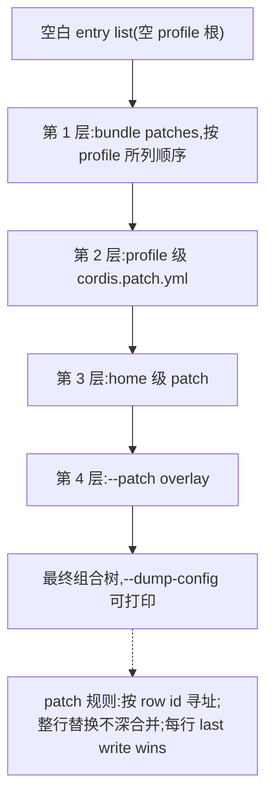

# DeepSeek Harness(dsh)深度研究

> 2026 年 8 月 13 日,DeepSeek 开源了自己的 agent harness——dsh。一个月内生态爆发,头部插件 star 过万。这篇调研基于官方仓库一手文档(commit 477b4f4,v0.1.7-rc.2,2026-09-24)写成,机制结论全部可溯源;生态热度数据来自社区榜单,已逐项标注时点与信度。

## 0 引言:为什么值得研究一个 harness

**本章要点**

- 2026-08-13,dsh 以 MIT 许可证开源,与 V4-Pro API 同日发布,当天约 2.75 万 GitHub star(时点数据,未独立复核)。
- 本报告把 agent harness 定义为模型之外的运行时层;公开基准里的"模型分数",实际是模型与 harness 配置的组合分数(本研究定义)。
- 全文事实以官方仓库 commit `477b4f4`(dsh 0.1.7-rc.2)快照为基准,证据分确认/倾向/未知三级。

### 0.1 研究背景与对象界定

#### 0.1.1 开源时点与首发数据

2026-08-13,DeepSeek 把 DeepSeek Harness(下称 dsh)以 MIT 许可证开源,定位为 agent harness 的 developer preview,与 V4-Pro API 同日发布。发布当天,它拿到约 2.75 万 GitHub star。这个数字是 VentureBeat 记录的时点快照 <sup>[1]</sup>,未独立复核(媒体报道,时点数据)。

研究对象的边界就此划定:dsh 是 harness,不是模型。模型在 dsh 里只是可替换的配置项。

#### 0.1.2 什么是 agent harness

本报告把 agent harness 定义为模型之外的运行时层,职责有四:

- 工具执行
- 权限与审批
- 会话持久化
- 用户界面

据此可以说,公开基准里一个"模型分数",实际是模型与 harness 配置的组合分数(本研究定义,第 1 章给出证据支撑)。

dsh 的官方自述与这个定义吻合:整个运行时构建于 Cordis 框架之上,官方的说法是 everything-is-a-plugin(一切皆插件)<sup>[2]</sup><sup>[3]</sup>。模型适配器、工具注册表、会话日志,连 agent loop 本身,都可由配置替换。

有一条边界要亮出来:Claude Code 与 Codex 同样是 harness,只是未拿"harness"当独立叙事的名头。dsh 的新意在命名与彻底插件化,不是首创了这个品类(观点)。

#### 0.1.3 研究口径与证据分级

事实基准是官方仓库 commit `477b4f4`(2026-09-24,dsh 0.1.7-rc.2)的一手文档;web 生态报道与社区榜单只作辅助。对象还在 developer preview 期,官方 README 明示将出现破坏兼容性的变更。因此文中全部命令与数字都是该快照的时点事实,不承诺后续版本沿用。

证据分级(确认/倾向/未知)贯穿全文:低信度材料只作线索,不作结论。方法定义与术语表见第 8 章。

### 0.2 核心发现速览

#### 0.2.1 五个关键发现

五个发现,每个一句话:

- 一切皆插件,且是一套可学完的原语:插件装载、patch 整行替换、`!!js` 配置求值,从模型适配器到 agent loop 走同一通道。代价是配置文件具备执行能力;上游 bundle 升级时,用户 patch 会静默丢失字段,升级兼容成了最大的维护税。
- 生态是官方缺口催出来的。开源约一个月,头部插件几乎全在补官方没做的事:桌面端、终端界面、插件市场、用量与上下文观测;官方自己只提供本地 Web UI。
- 安全是流程性信任,不是结构性隔离。插件代码在宿主进程内、沙箱外运行;GitHub 安装即执行包代码;`!!js` 让配置可执行;官方自认未做安全审计。防线只剩审批流程与用户审查义务,生产使用须自行容器化隔离。
- 自建路径有三条,构成能力阶梯:写插件(复用全部官方能力)、组 profile(复用并重排)、SDK/ACP 嵌入(复用引擎、自建外壳)。越往下复用越少、控制越多。选型先问"改 agent 行为,还是只要引擎"。
- 文档工程在暗中发力。每包有 README,架构决策留档,工具目录由 boot 用真实上下文生成以防漏登记。第三方插件与教程能在一个月内成规模,这份文档密度是重要前提。

五条发现的完整论证、反例与信度标注分布在第 1、3、4、5、6 章,此处不展开。

#### 0.2.2 全书阅读路径

各章讲什么,一表看清;细节留给各章:

| 章 | 讲什么 |
| --- | --- |
| 1 | dsh 的完整功能能力面、运行形态与产品边界 |
| 2 | 安装、五种 profile 选型与日常操作 |
| 3 | Cordis 之上的组合式架构;`--dump-config` 打印的启动树如何由四层 patch 叠加而成 |
| 4 | 插件机制:三形态、patch 语义与信任边界 |
| 5 | 生态中最受欢迎的 10 大插件,以及"受欢迎"的证据边界 |
| 6 | 三条自建路径的选型框架与最小实操 |
| 7 | 收拢结论 |
| 8(附录) | 证据分级方法与术语表 |

各章独立成篇,按需跳读即可。唯一的约定是术语:跨章出现时,一律以第 8 章的定义为准。

---

**本章引用**


---


### 本节来源

1. VentureBeat, "DeepSeek Harness launches as open source rival to Claude Code, alongside V4-Pro on API with higher prices". 2026-08-13(全文抓取 2026-09-25).

2. README.zh.md(本地快照,对应 github.com/deepseek-ai/DeepSeek-Harness,英文 README.md 同步核对). 2026-09-24. commit `477b4f4`.

3. 本地一手文档合集:docs/architecture.md、docs/tool-catalog.md、SAFETY.md、docs/subsystems/ 16 篇、docs/rescope.md. 2026-09-24. 同 s1 快照.


## 1 功能:一个 harness 的完整能力面

**本章要点**

- 能力面覆盖 19 个子系统,两条设计取向贯穿:一切能力都是可从配置替换的插件;工具目录由脚本生成,新工具不可能漏登记(确认,一手文档)。
- 五种运行形态覆盖人、脚本、程序三类驱动;模型是配置项,适配器可插拔,harness 不绑定任何模型厂商(确认,一手文档)。
- 三条边界带着读:官方自认未做安全审计;基准成绩与 harness 配置耦合;对标 Claude Code/Codex 的产品化外围尚未补齐(第一条一手,后两条二手报道,信度逐处标注)。

本章盘点 dsh 的能力面:由哪些子系统构成、以何种形态运行、与模型是什么关系。事实基准是 2026-09-24 快照,commit `477b4f4`,版本 0.1.7-rc.2 <sup>[1]</sup><sup>[2]</sup>。证据口径:未加注的事实出自该快照的一手仓库文档(T1);VentureBeat 报道为二手(T2);单源弱证据逐处标信度。

### 1.1 能力面全景

**表 1 dsh 能力面全景(2026-09-24 快照,commit `477b4f4`)**

| 子系统 | 能力要点 | 边界与限制 |
|---|---|---|
| 编码与工具执行 | 60 个顶层包条目中 24 个为 tool-* 工具包;工具目录由脚本 boot 真实上下文、读取 `ctx.tools.schemas()` 生成 <sup>[1]</sup><sup>[2]</sup> | 目录与代码同源,preview 期随版本变动 <sup>[2]</sup> |
| run_code(PTC 式) | 注册表保留传输,位于可过滤能力层之外,`mode: ptc`/`mode: both`,嵌套子调用设并发上限 <sup>[2]</sup> | 与逐次工具调用的互操作机制快照未载 |
| subagent | 命名注册表 `ctx.subagents`,6 个 provider 并存 <sup>[2]</sup> | 按名注册,选择权在调用侧 <sup>[2]</sup> |
| agent-team(实验) | implicit-root Team:成员身份、邮箱信箱、任务、共享 checkout;context 为 fresh 或 fork <sup>[2]</sup> | 官方标注实验性 <sup>[2]</sup> |
| workflow | 模型编写编排 SCRIPT 启动 subagent;每上下文单引擎 <sup>[2]</sup> | 能力限于 SCRIPT 所写范围 <sup>[2]</sup> |
| browser-use | 3 个实验后端:Playwright MCP/Chrome DevTools MCP/Stagehand,初始引擎 Chromium <sup>[2]</sup> | 实验性 npm 包,需显式激活 <sup>[2]</sup> |
| computer-use | 共享能力名 computer use,上游实现名 Cua Driver;MCP 接入或平台原生 npm 运行时 <sup>[2]</sup> | 依赖上游平台覆盖 |
| MCP | opt-in 服务器;工具带取消、权限检查、结果记录、图片输出 <sup>[2]</sup> | 逐台显式配置 <sup>[2]</sup> |
| LSP | 恰好 4 个语义查询,封闭联合、编译期强制;stdio provider <sup>[2]</sup> | 查询集合不可扩展 <sup>[2]</sup> |
| plan/todo/skill | plan 软引导,贡献 `exit_plan_mode` 与 `/plan`;todo 三态整表快照;skill 五包家族 <sup>[2]</sup> | todo 无 id、无优先级,last-write-wins <sup>[2]</sup> |
| schedule/webhook | Host 级提醒送达原会话,RFC 3339 UTC 规范化,cron 五字段+显式时区;webhook 认证投递转普通 root 会话 <sup>[2]</sup> | webhook fire-and-forget,不存投递状态 <sup>[2]</sup> |
| jobs/终端/SSH | `ctx.jobs` 后台作业;持久 PTY 终端;SSH 远程文件系统、子进程、沙箱 <sup>[2]</sup> | 长时作业生命周期细节见后章 |
| 沙箱与审批 | Linux bwrap/Landlock、macOS Seatbelt、Windows ACL restricted-token;除 `allowed-once` 外 fail closed <sup>[2]</sup> | 沙箱只管文件系统效果 <sup>[2]</sup> |

表 1 共 13 行,覆盖 19 个子系统。两条设计取向贯穿其中(确认,一手文档):

- 能力即插件:模型适配器、工具注册表、会话日志、agent loop 本身都能从配置替换 <sup>[2]</sup>。表里每一行原则上同位替换即可,不必改源码。
- 文档与代码同源:工具目录由生成脚本逐个 boot 真实上下文产出。官方表述是 "a new tool cannot be silently undocumented"(新工具不可能悄悄漏登记)<sup>[2]</sup>。

边界也摆在表里:browser-use、computer-use、agent-team 带实验标记,LSP 收敛为封闭联合。扩展自由与接口稳定,在子系统之间分布不均 <sup>[2]</sup>。

#### 1.1.1 编码与工具执行

这一节讲写代码相关的能力底座:工具从哪来、目录怎么防漏、`run_code` 特殊在哪。

先看规模。packages/ 顶层 60 个条目中,24 个是 tool-* 工具包;apps/ 下 4 个应用:cli、desktop、desktop-host、web <sup>[1]</sup>。

工具目录的防漏机制是本章最值得记的设计。目录由生成脚本产出:脚本对每个工具插件在真实上下文上 boot,再读取 `ctx.tools.schemas()`,所以新增工具必然进入目录 <sup>[2]</sup>。官方原文:

> "this generator BOOTS each tool plugin on a real context and reads `ctx.tools.schemas()` … a new tool cannot be silently undocumented." —— 工具目录生成机制(官方文档,一手)<sup>[2]</sup>

`run_code` 是另一条路子。它是 PTC 式能力(该缩写的全称快照文档未给出),由工具注册表所有,位于可过滤能力层之外的保留传输。支持 `mode: ptc` 与 `mode: both` 两种模式;嵌套子调用设并发上限 <sup>[2]</sup>。

#### 1.1.2 多 agent 协作

这一节讲 dsh 怎么把别的 agent 当能力用:subagent 六路并存,agent-team 组队,workflow 编排。

subagent 经命名注册表 `ctx.subagents` 组织,六个 provider 在同一上下文并存:spawn-in-process、fork-in-process、acp、codex、claude-code、dsh-sdk <sup>[2]</sup>。后四个值得单独说:dsh 能把其他 agent 运行时当子代理调用,对象包括经 SDK 的 dsh 自身,以及其他厂商的 codex 与 claude-code。

agent-team 是实验功能,官方标注实验性 <sup>[2]</sup>。形态为 implicit-root Team:成员带身份与邮箱信箱,可以被分配任务,共享一个 checkout。成员 context 有两种来路:fresh 或 fork <sup>[2]</sup>。

workflow 靠一个缝实现。缝(seam)指子系统之间预留的扩展点:agent 可以跑一段模型编写的编排 SCRIPT 去启动 subagent,每个上下文一个引擎 <sup>[2]</sup>。官方定义:

> "The workflow seam lets an agent run a model-written orchestration SCRIPT that starts subagents." —— workflow 子系统定义(官方文档,一手)<sup>[2]</sup>

#### 1.1.3 浏览器、电脑与外部协议

这一节讲给模型接感官的三条路:浏览器、桌面控制,以及 MCP 与 LSP 两类标准协议。

browser-use 由一个共享服务加三个实验后端构成:Playwright MCP、Chrome DevTools MCP、Stagehand。初始浏览器引擎为 Chromium。三者都是公开 npm 包,需要显式激活 <sup>[2]</sup>。

computer-use 的名字有两层,官方分得很清:

> "The shared DSH capability is called **computer use**; **Cua Driver** names the upstream implementation." —— 能力名与实现名的区分(官方文档,一手)<sup>[2]</sup>

接入路径两条:经 MCP 接入已安装的 `cua-driver` 可执行文件;或走平台原生 npm 运行时 <sup>[2]</sup>。

MCP(Model Context Protocol,模型上下文协议)服务器为 opt-in,逐台显式配置。每台配置的服务器贡献普通 harness 工具,自带取消、权限检查、结果记录与图片输出;新旧协议版本的协商由官方 SDK 负责 <sup>[2]</sup>。

LSP(Language Server Protocol,语言服务器协议)恰好暴露 4 个语义查询,经 stdio 通用 provider 接入 <sup>[2]</sup>。查询集合是封闭联合,编译期强制,不可扩展:

> "The seam and model expose exactly four semantic queries; the union is closed" —— LSP 查询集合的封闭约束(官方文档,一手)<sup>[2]</sup>

#### 1.1.4 日常协作类能力:计划、任务、技能、定时与远程

这一节讲执行治理的八项机制:计划、任务、技能、定时、外部触发、后台作业、终端与远程。逐项列表太散,收进一张表:

| 能力 | 一句话说明 | 关键细节 |
|---|---|---|
| plan(计划模式) | 软引导,不做强制 | 独立于沙箱模式与审批策略;贡献 `exit_plan_mode` 工具与 `/plan` 命令 <sup>[2]</sup> |
| todo(任务清单) | 整表快照式写入 | `todo/write`;三态 status;无 id、无优先级;每次写入整表替换,后写覆盖先写(last-write-wins)<sup>[2]</sup> |
| skill(技能) | 可选指令,不是会话事件 | 家族五包:dsh-skill、skill-filesystem、skill-badge、skill-office、tool-skill <sup>[2]</sup> |
| schedule(定时) | Host 级提醒,送达原会话 | 独立于 Session 激活存储;时间经 RFC 3339 UTC 规范化;cron 为五字段加显式时区 <sup>[2]</sup> |
| webhook(外部触发) | 经认证的外部投递转为可选的普通 root 会话 | fire-and-forget,不存投递与完成状态 <sup>[2]</sup> |
| jobs(后台作业) | 后台作业运行时 | `ctx.jobs`,面向长时生产者 <sup>[2]</sup> |
| PTY 终端 | 持久伪终端 | pseudo-terminal,缩写 PTY <sup>[2]</sup> |
| SSH 远程 | 接入远程主机 | 覆盖远程文件系统、子进程与沙箱 <sup>[2]</sup> |

八项里有三个语义容易踩坑:plan 是软引导,不参与沙箱与审批的强制;todo 每次写入替换整表,后写覆盖先写;webhook 的投递发出后不存状态,需要确认回执的链路不能依赖它(确认,一手文档)。

#### 1.1.5 沙箱与审批

这一节讲 dsh 的两道闸门:沙箱管文件系统效果,审批管放行。两道闸门都有限制。

沙箱后端按平台划分:Linux 用 bwrap(bubblewrap)与 Landlock(Linux 内核访问控制机制),macOS 用 Seatbelt(macOS 系统沙箱),Windows 用 ACL restricted-token;另有 SSH 远程后端 <sup>[2]</sup>。覆盖面官方一句话说死:

> "`SandboxMode` governs filesystem effects only." —— 沙箱的覆盖边界(官方文档,一手)<sup>[2]</sup>

进程、网络等维度不在覆盖之内。

审批经 `ctx.approval` 答复瀑布,消费封闭结局,默认姿态是拒绝:

> "consume the closed outcome and fail closed unless it is `allowed-once`" —— 审批的 fail-closed 语义(官方文档,一手)<sup>[2]</sup>

也就是说,除 `allowed-once`(仅本次放行)外一律 fail closed(无有效放行即拒绝);ACP 提供一次性机器决策 <sup>[2]</sup>。交互侧,`ask_user_question` 暂停工具调用,直到活动 UI 返回人类答案 <sup>[2]</sup>。权限预设把沙箱与审批捆成命名档位,出厂两档:workspace-write 与 danger-full-access <sup>[2]</sup>。

可以推断:沙箱只覆盖文件系统效果,宿主进程内的代码执行不受它约束。机制佐证属于后章范围,本章素材未载。(推断)

### 1.2 运行形态与产品边界

这一节讲 dsh 怎么跑、跟对手比差在哪、安全上要警惕什么。

#### 1.2.1 五种运行形态

这一节讲 dsh 以哪些形态运行,以及各自的入口。

五种形态以 shipped profile 模板交付:web、headless、sdk、sdk-minimal、acp <sup>[2]</sup>。逐个看入口:

Web UI 用一条命令启动:

```
npx @deepseek-ai/dsh web
```

启动在 `http://127.0.0.1:3080`,本机启动时自动打开浏览器 <sup>[3]</sup>。

- Electron 桌面端:内置 Desktop Host,默认端口 19387,profile 配置可覆盖,与 CLI 共享产品数据 <sup>[2]</sup>。
- SDK:提供 Python 与 TypeScript 客户端 <sup>[1]</sup><sup>[2]</sup>,传输为 stdio 上的 JSON-RPC (待证)。
- ACP(Agent Client Protocol,代理客户端协议):面向持久 agent,并在审批层提供一次性机器决策 <sup>[2]</sup>。

各形态的安装、profile 选择与日常操作见第 2 章,此处不展开。

#### 1.2.2 对标 Claude Code 与 Codex

这一节借 VentureBeat 的对标表看 DSH 差在哪。先声明:这是二手媒体判断,信度逐处标注。

**表 2 DSH 与 Claude Code/Codex 对标(VentureBeat,2026-08,二手 T2)**

| 维度 | Claude Code | Codex | DSH(0.1.7-rc.2) |
|---|---|---|---|
| 托管后台 agent 服务 | 有 <sup>[4]</sup> | 有 <sup>[4]</sup> | 未文档化为 DeepSeek 托管服务 <sup>[4]</sup> |
| 成品 GitHub 原生 PR 工作流 | 有 <sup>[4]</sup> | 有 <sup>[4]</sup> | 无成品;存在 github-review 指南 <sup>[4]</sup><sup>[5]</sup> |
| 界面形态 | 含 IDE/移动/Slack 等更广面 <sup>[4]</sup> | 含 IDE/移动/Slack 等更广面 <sup>[4]</sup> | 本地 Web、headless、SDK、ACP、桌面 <sup>[2]</sup><sup>[4]</sup> |
| 可扩展性 | 原表评级素材未录 * | 原表评级素材未录 * | "Exceptional: virtually every component is replaceable" <sup>[4]</sup> |

\* VentureBeat 对标表对两家的可扩展性评级未在素材中摘录,此处不作断言。

表 2 的三项差距指向同一件事:DSH 的产品化外围尚未补齐。VentureBeat 原话是 "not yet a full replacement for either product's broader developer experience"(还替代不了两家产品更完整的开发者体验)<sup>[4]</sup>。该判断为二手媒体对标(信度中高);表里的「有/无」以官方文档是否记载为准,不等于功能绝对缺失。

反例检索也做了:以 "vs Claude Code""criticism""review" 等关键词检索,除上述差距与 1.2.3 的漏洞报道外,未发现针对 dsh 插件架构本身的负面技术评测。HN 讨论帖存在,但正文未取回,社区批评的具体内容未知 <sup>[6]</sup>(低信度,已知盲区)。docs/user/guide/github-review.md 的存在说明 GitHub review 场景以配置 workspace 的形态交付,而非成品 PR 集成 <sup>[5]</sup>(存在性证据,场景完成度未核)。

#### 1.2.3 安全边界

这一节讲两条负面证据:官方自己的安全通告,和 2026-09 的媒体漏洞报道。

SAFETY.md 的自我定位,先看原文:

> "It has not undergone a security audit and must not be treated as secure or production-ready." —— SAFETY.md 安全通告(官方文档,一手)<sup>[2]</sup>

它同时警告沙箱与审批 "do not guarantee isolation or prevent damage"(不保证隔离,也不防止损害)<sup>[2]</sup>。README 明示未来将出现破坏兼容性的变更 <sup>[3]</sup>。

媒体侧,2026-09 The Hacker News 报道《DeepSeek Harness Flaw Let AI Agents Disable Their Own File Sandbox Without Approval》<sup>[7]</sup>。信度要说清:标题级确认,正文未取回;漏洞向量、是否影响 0.1.7-rc.2 快照,均未验证(低信度,只作线索)。

结合 1.1.5 看:沙箱只管文件系统效果 <sup>[2]</sup>,审批 fail closed 只作用于受审批路径。由此推断,preview 期的安全软肋在模型工具层之外,即宿主进程与插件供应链。这个判断需要后章素材支撑,本章不定论。(推断)

### 1.3 与模型的关系:基准耦合争议

这一节回答两个问题:dsh 离开 DeepSeek 模型还能不能用;基准成绩里混着什么变量。

#### 1.3.1 基准成绩与 harness 配置耦合

这一节讲一个评测方法论问题:模型分数里混着 harness 变量。

VentureBeat 报道:与 harness 同日发布的 V4-Pro-0813,其 Code Agent 成绩部分用 "its upcoming DeepSeek Harness in 'minimal mode'"(尚未发布的 dsh 的 minimal 模式)测得,并指出部分成绩 "depend on the harness configuration"(依赖 harness 配置)<sup>[4]</sup>。素材中对应的具体成绩:Terminal Bench 2.1 拿到 87.9 <sup>[4]</sup>。信度:二手转述官方表注,官方原表未独立核对(待证)。

可以推断:同一模型在不同 harness 配置下的成绩不可直接比较。评估 coding agent 成绩,须同时记录 harness 及其配置档位;厂商既当模型方又当 harness 方时,这个变量必须显式披露。(推断)

#### 1.3.2 模型可插拔

这一节讲 harness 与模型的解耦:换模型是改配置,不用改代码。

模型选择是配置项。VentureBeat 对标表记录 DSH 支持 DeepSeek、Anthropic、OpenAI 与自定义端点 <sup>[4]</sup>;kimi 与 glm 端点见于素材图谱,未入本章引用池,标待证 (待证)。产品事实层面:模型适配器本身是可替换插件 <sup>[2]</sup>,五种运行形态均不绑定单一模型供应商 <sup>[2]</sup>。harness 与模型在产品上解耦。

一条边界要摆明(本报告观点,非来源原文):Claude Code 与 Codex 同样是 harness,只是没有拿 harness 当产品名来讲。dsh 的新意在命名与彻底插件化;论品类,它不算首创。

---

**本章引用**


---


### 本节来源

1. 本地仓库实测:package.json、git log、`ls packages`、tool-* 清单、`ls apps`(HEAD 477b4f4). 2026-09-24. 本地快照 /tmp/pi-github-repos/deepseek-ai/DeepSeek-Harness.

2. 本地一手文档合集:docs/architecture.md、docs/tool-catalog.md、SAFETY.md、docs/subsystems/ 16 篇、docs/rescope.md. 2026-09-24. 同 s1 快照.

3. README.zh.md(本地快照,对应 github.com/deepseek-ai/DeepSeek-Harness,英文 README.md 同步核对). 2026-09-24. commit `477b4f4`.

4. VentureBeat, "DeepSeek Harness launches as open source rival to Claude Code, alongside V4-Pro on API with higher prices". 2026-08-13(全文抓取 2026-09-25).

5. docs/user/guide/github-review.md(存在性确认,内容未展开). 2026-09-24. 同 s3 快照.

6. Hacker News item 49285244 "DeepSeek Harness developer preview"(标题级,正文未取回). 2026-08/09. news.ycombinator.com/item?id=49285244.

7. The Hacker News, "DeepSeek Harness Flaw Let AI Agents Disable Their Own File Sandbox Without Approval"(标题级,正文未取回). 2026-09. thehackernews.com/2026/09/deepseek-harness-fla


## 2 使用方式:从安装到日常操作

**本章要点**

- 三条安装途径装的是同一个引擎:npm 体验、源码改代码、SDK wheel 做 Python 集成;状态归 `DSH_HOME` 与 profile 目录,不归安装位置(推断)。
- profile 选型看「谁驱动 agent」:人选 web,脚本与 CI 选 headless,程序按协议挑 sdk 或 acp;sdk-minimal 是刻意对照组,权限拉满,必须隔离运行。
- CLI 参数归属、模型配置三通道、审批两预设各有硬边界;排错先分清「这段参数归谁解析」。

事实基准:官方仓库快照 v0.1.7-rc.2(commit 477b4f4,2026-09-24)。项目处于 developer preview 期,官方 README 明示将有破坏性兼容变更,本文数字与命令均为该时点事实 <sup>[1]</sup>。profile 组合与层叠的设计原理见第 3 章,本章点到为止。

### 2.1 安装

三条官方途径对应三类需求:快速体验走 npm,改代码走源码,Python 集成走 SDK wheel。

表 2-1 安装途径对比

| 途径 | 命令 | 前置 | 适用 |
|---|---|---|---|
| npm 直启 | `npx @deepseek-ai/dsh web` | Node.js `^22.19.0 \|\| >=24.0.0` <sup>[2]</sup> | 快速体验、日常交互 |
| 源码构建 | `git clone` → `pnpm install` → `pnpm run build` → `pnpm dsh web` | 另需 pnpm,钉 `pnpm@11.7.0` <sup>[2]</sup> | 插件开发、读源码 |
| Python SDK | `python -m pip install deepseek-harness-sdk` <sup>[3]</sup> | Python ≥3.10;平台矩阵见 2.1.2 <sup>[4]</sup> | Python/JSON-RPC 集成 |

命令出自 README §Run 与 python-sdk 指南,版本约束出自 root package.json <sup>[1]</sup><sup>[4]</sup><sup>[2]</sup>。取舍只有两点:要不要改代码,运行时归谁管。

npm 直启零构建,但 dsh 以调用目录为默认文件系统位置,先 `cd` 进项目目录再启动。源码多一步 build,换来可调试的 packages/ 树。SDK wheel 自带运行时,无需系统 Node.js,代价是锁定官方平台矩阵。

三条途径装的是同一个引擎,状态归属 `DSH_HOME` 与 profile 目录,而非安装位置(推断)。

#### 2.1.1 npm 一条命令直启

```sh
npx @deepseek-ai/dsh web
```

装好 Node.js 后一条命令,无需 clone。默认在 `http://127.0.0.1:3080` 启动 Web UI 并自动打开浏览器;`--no-open` 只起服务不开浏览器;SSH 启动则只打印 URL <sup>[1]</sup>。

Node 版本以一手为准:root package.json 的 engines 字段为 `^22.19.0 || >=24.0.0` <sup>[2]</sup>。CSDN 教程称「Node v20+ 可用」,与 engines 直接冲突;反例检索未找到任何支持 v20 的官方来源,裁决一手 package.json 胜出,按 v20 安装可能直接失败 <sup>[5]</sup>。

同一教程还称仅 web/headless 两个 profile 首用自动初始化,一手明确为五个内置 profile 全部自动初始化 <sup>[6]</sup>。

#### 2.1.2 源码构建与 Python SDK

```sh
git clone https://github.com/deepseek-ai/deepseek-harness.git
cd deepseek-harness
pnpm install
pnpm run build
pnpm dsh web
```

`pnpm run build` 产出仓库构建物。`pnpm dsh <args>` 跑 TypeScript 入口并把参数原样转发,不重新构建 <sup>[1]</sup>。

```sh
git clone https://github.com/deepseek-ai/deepseek-harness.git
cd deepseek-harness
python -m venv .venv
. .venv/bin/activate
python -m pip install deepseek-harness-sdk
```

Windows PowerShell 变体为 `py -3.10 -m venv .venv` 与 `.venv\Scripts\Activate.ps1` <sup>[4]</sup>。

PyPI 官方链路包为 `deepseek-harness-sdk` 与 `deepseek-harness-runtime-bin`,版本 0.1.1rc1(访问 2026-09-25)<sup>[3]</sup>。wheel 封装的就是同一条 `dsh` 命令、自带运行时,SDK 启动即 `dsh --profile sdk` <sup>[4]</sup>。

平台矩阵为 Linux x64/arm64、macOS 14+ arm64、Windows x64。前置还包括 DeepSeek 兼容端点凭据,以及官方要求的隔离 workspace 与隔离 DSH_HOME <sup>[4]</sup>。

#### 2.1.3 三个安装陷阱

- **`pip install deepseek-harness` 疑似无关假包**(倾向级,未定证)。官方安装文档只写 `deepseek-harness-sdk`;对 `pypi.org/project/deepseek-harness/` 的直接抓取失败,该包是否存在、归属如何,均无法证实 <sup>[3]</sup>。
  - 第三方教程称它拉取的是无关的 V4 protocol adapter(单源)<sup>[7]</sup>。对照官方包名后倾向成立,操作上无条件只装 `deepseek-harness-sdk`。
  - 核验:查该 PyPI 页 Author 字段,或 `pypi.org/pypi/deepseek-harness/json`。
- **第三方文档站勿当官方。** deepseekdocs.com、deepseekplugin.com 等检索命中站点均非官方域名;官方入口只有 github.com/deepseek-ai/deepseek-harness 与 deepseek-harness.github.io。
  - preview 期命令行为可能已变:第三方命令只能当线索,照做前对一手核对。
  - 本研究仅逐条核对过 CSDN 一篇,已发现两处偏差(见 2.1.1)<sup>[5]</sup>。
- **项目自带 `.env` 被拒启。** DSH 拒绝让仓库内 `.env` 生效,否则仓库就能决定流量去向。这是针对代理设置的保护,优先级规则见 2.3.3 <sup>[8]</sup>。

### 2.2 五种 profile 的选型

profile 是「插件 bundle patch 层的有序栈 + 用户 overrides」。`dsh <name>` 是 `dsh --profile <name>` 的缩写,缩写名须紧跟 `dsh` <sup>[6]</sup>。五个内置 profile 首次使用自动从模板初始化 <sup>[6]</sup>。`desktop` 名保留给 Electron 桌面端,CLI 拒绝对它的启动/导出/插件管理请求 <sup>[9]</sup>。

#### 2.2.1 五 profile 选型表

表 2-2 五 profile 选型表(各行出自对应 bundle README <sup>[10]</sup>)

| profile | 命令 | 场景 | 关键 flags 与边界 |
|---|---|---|---|
| web | `dsh web` | 交互式浏览器工作 | `--host`、`--port`(默认 3080)、`--trusted-host`(可重复)、`--no-open`;不能绑定所有网卡 |
| headless | `dsh --profile headless "任务"` | 脚本、CI、一次性任务 | 任务文本走位置参数或 stdin;`--json` 事件流、`--session-id` 续会话;不开端口不留进程;退出码 0=完成、1=中止/出错 |
| sdk | `dsh --profile sdk` | 被 Python/JSON-RPC 客户端驱动 | stdio JSON-RPC 服务;基于 dsh-base 全量工具集 |
| sdk-minimal | `dsh --profile sdk-minimal` | 小而显式运行时的 SDK 客户端 | 不含 dsh-base,仅一个持久 shell(超时 300 秒);固定 danger-full-access,须隔离运行(见 2.2.2) |
| acp | `dsh --profile acp` | 编辑器等自动化客户端 | stdio ACP(Agent Client Protocol)帧直到断连;基于 dsh-base |

怎么选?看谁来驱动 agent:

- 人来驱动 → web
- 脚本或 CI → headless(退出码 0/1 与 `--session-id` 就是为流水线设计的)
- 程序驱动 → 按协议挑 sdk(JSON-RPC)或 acp;两者工具集相同,都是 dsh-base 全量

从 web 切到其余 dsh-base 系 profile,能力集不变,变的是外壳。同一任务在两个 profile 下表现不一致?先查外壳——flags、审批、stdio 契约——再怀疑插件。sdk-minimal 不在这套逻辑里,它是刻意做出来的对照组。

#### 2.2.2 sdk-minimal 的危险面

sdk-minimal 有三件事必须知道(确认,一手文档)<sup>[10]</sup><sup>[1]</sup>:

- 没有 dsh-base。文件系统工具、settings、托管凭据、遥测、压缩、子代理全部缺席,只给一个持久 shell(Linux/macOS 是 bash,Windows 是 pwsh,300 秒超时)<sup>[10]</sup>。
- 权限固定 danger-full-access。shell 能改进程可见的任何文件,官方原话:配合一次性 checkout 或容器使用 <sup>[4]</sup>。
- 调参面只剩三个环境变量:`DSH_SYSTEM_PROMPT`(人设)、`DSH_MODEL`(兜底模型,默认 `deepseek-v4-flash`)、`DSH_CONTEXT_WINDOW`(上下文容量)。会话以未压缩 JSONL 存于 `<dsh_home>/sessions`,凭据走 `DEEPSEEK_API_KEY`。

三件事叠起来等于:托管防线全关、权限拉满。有真实文件的项目别从它起步;嵌入场景选 `dsh --profile sdk`,并隔离在容器或一次性 workspace 里(推断)。

#### 2.2.3 自定义 profile

```sh
dsh --profile <新名> --from-default-profile web
```

自定义 profile 从五个内置模板之一复制生成,约束两条:新名不得与内置名冲突;目标 profile 目录必须不存在 <sup>[6]</sup>。

缺失且未定义的 profile 直接报错,提示经 `dsh plugin --profile <name> add <package>` 补救 <sup>[6]</sup>。`desktop` 名保留 <sup>[9]</sup>。

模板复制拿到的只是一份可改的 patch 栈,组合原理见第 3 章。

### 2.3 Web UI 三步上手与模型配置

这一节走通 Web UI 的前三步,再讲模型配置的三条通道。

#### 2.3.1 Web UI 三步上手

1. **Settings → Models**:DeepSeek 卡片只有一个 API-key 输入框。填 platform.deepseek.com 的 key 并保存,模型路由立即生效,无需重启服务器 <sup>[11]</sup>。
2. **Choose workspace**:添加并选中 `dsh` 启动时所在的项目目录。未选 workspace 前,会话输入框(composer)不可用,且无替代入口 <sup>[12]</sup>。
3. **发第一条任务**:官方示例句为 "Summarize this repository and identify its main packages."。agent 可读写文件、跑命令、委派子任务、维护计划;触及当前权限策略需审批的操作,会先询问 <sup>[12]</sup>。

#### 2.3.2 模型配置三通道

表 2-3 模型配置三通道(各行出自 providers.md <sup>[11]</sup>)

| 通道 | 入口 | 边界 |
|---|---|---|
| DeepSeek 官方 | Settings → Models 卡片填 key | 保存即生效,免重启 |
| 第三方内置目录 | Add model provider → Third-party,填各家 key | 目录含 `anthropic`、`openai`、`moonshotai`(Kimi)、`zai`(GLM)等;OAuth 登录类(如 Codex)暂不支持 |
| 自定义 OpenAI 兼容端点 | Custom model API:小写 Provider ID、base URL、API 协议(三选一)、凭据、至少一个模型 | Provider ID 永久不可改;一个 provider 只讲一种协议,双协议网关要建两个;Fetch available models 是便利功能、不保证成功,失败就手填 model id |

三协议为 `openai-completions` / `openai-responses` / `anthropic-messages` <sup>[11]</sup>。

自定义 provider 的配置写入当前 profile 的 `cordis.patch.yml`,web 即 `$DSH_HOME/profiles/web/cordis.patch.yml`。reasoningEfforts、请求头、超时、重试等进阶字段直接编辑该文件,适配器下次请求时重读、无需重启。同机浏览器可点 Settings 头部的 Open configuration file 打开 <sup>[11]</sup>。

选中某模型即新会话默认,已发请求的会话沿用各自模型。默认指向已删除 provider 时,composer 阻塞输入 <sup>[11]</sup>。

三通道的分野在「谁定义协议与模型列表」:

- DeepSeek 官方:零配置。
- 内置目录:协议细节外包给目录包,受其覆盖面限制。
- 自定义端点:最灵活。

Provider ID 被请求、会话与凭据引用挂靠,命名按永久决策对待。选用顺序建议:官方 key → 内置目录 → 自建端点(作者建议)。

#### 2.3.3 凭证与安全

- API key 只写:页面保存后仅返回脱敏描述符,明文存于 `$DSH_HOME/.credentials.yaml`,settings 只保留凭据引用 <sup>[11]</sup>。
- 环境变量走 shell profile 或 `$DSH_HOME/.env`(默认 `~/.dsh/.env`)。导出的环境变量优先于 `.env` 文件;项目自带 `.env` 拒绝生效(同 2.1.3)<sup>[8]</sup>。

DSH 把凭证收敛为两个受控位置:托管 credentials 文件与受控 env 文件,并把项目目录显式排除。由此推断操作含义:CI 用导出变量,单机用页面托管或 `$DSH_HOME/.env`,不借项目 `.env` 做多环境切换(推断)。

### 2.4 CLI 参数边界与配置检视

这一节先划参数归属的边界,再给四个检视命令与审批预设。

#### 2.4.1 启动器参数边界

启动器只解析自己的 flags;第一个不认识的 token 之后,全部参数原样移交所选 app <sup>[6]</sup>。`dsh --profile web --port 8080` 的 `--port` 属 web app,`dsh --help` 才是启动器的帮助。其余边界规则逐条如下:

- `-V/--version` 须在 app 参数边界之前。
- 启动器 flags 必须在 app 参数之前。
- app 参数里的字面 `--` 要写成 `-- --`。
- `plugin` 仅在紧跟 `dsh` 时是插件管理命令;选了 profile 之后,它只是普通 app 参数。
- 名为 plugin 的 profile,用 `dsh --profile plugin` 启动。

失败语义 <sup>[2]</sup>:

- 重复 `--profile` 被拒绝。
- 致命配置/启动失败、无效命令、跨模式选项,均以非零码退出。
- SIGINT/SIGTERM 先 dispose 再退出。

排错先分清:「这段参数归谁解析」。

#### 2.4.2 检视四命令与审批预设

```sh
dsh --profile web --dump-default-config   # 只打印 bundle 层
dsh --profile web --dump-config           # 再叠 profile patch + home patch + --patch 覆盖
dsh --profile web --patch ./extra.yml --dump-config
dsh --dump-config-schema                  # 输出 JSON Schema 2020-12
```

三个 dump 互斥,拒绝 app 参数与 `desktop` 名,不启动运行树。每行注释标明来源与改过它的 overlay;`--dump-config` 会初始化缺失的 profile 文件;结果里 `!!js` 表达式保持未求值 <sup>[6]</sup>。

`--patch ./extra.yml` 即试叠加:按 argv 顺序叠到层叠序最上层,验证 patch 效果而不落盘。层叠顺序如下,后者覆盖前者 <sup>[2]</sup>:

1. bundle patch(按 `dsh.profile.bundles` 声明序)
2. profile `cordis.patch.yml`
3. home 级 `$DSH_HOME/cordis.patch.yml`(机器级偏好,高于 per-profile 层)
4. `--patch`

patch 按 row id 整行替换 config,不做深合并,可 insert 新行 <sup>[6]</sup>。组合机制的设计原理与整行替换的升级代价,第 3 章展开。

审批与权限预设 <sup>[3]</sup>:

- 审批 seam(`dsh-user-approval`)的结果是闭合枚举 `allowed-once / rejected / cancelled / unavailable`,fail-closed:调用方在 rejected/cancelled/unavailable 上一律拒绝。
- `allowed-once` 只批准被问的那一次。
- 会话级 ApprovalPolicy 两档。`ask` 为默认,交给人/机器 answerer 链,无人应答落 `unavailable`;`never` 不问任何人,确定性 `rejected`,面向 CI/无人值守。
- 出厂权限预设把沙箱与审批打包成两个旋钮:`workspace-write`(sandbox=workspace-write + approval=ask)与 `danger-full-access`(sandbox=danger-full-access + approval=never)。
- `custom` 为只可显示的派生态,`auto` 归 Auto review 集成,两者为保留名。

**本章引用**


---


### 本节来源

1. 本地官方仓库 docs/user/guide/python-sdk.md(SDK 安装、平台矩阵、minimal 属性),快照 2026-09-24。

2. 本地官方仓库 apps/cli/reference/README.md(五 profile 自动初始化、层叠顺序、dump 三旗标、参数边界、plugin 转发 pnpm),快照 2026-09-24。

3. (源待补)


### 本节来源

1. 本地官方仓库 README.md(§Run、§Developer preview),v0.1.7-rc.2,快照 2026-09-24,github.com/deepseek-ai/deepseek-harness。

2. 本地官方仓库根 package.json(engines、packageManager pnpm@11.7.0、version 0.1.7-rc.2)与 apps/cli/package.json(bin dsh),快照 2026-09-24。

3. pypi.org/project/deepseek-harness-sdk/ 与 pypi.org/project/deepseek-harness-runtime-bin/(v0.1.1rc1,检索结果级),访问 2026-09-25。

4. 本地官方仓库 docs/user/guide/python-sdk.md(SDK 安装、平台矩阵、minimal 属性),快照 2026-09-24。

5. 《DeepSeek Harness 安装全指南:npm / 源码 / Python SDK 三种方式一次搞定》,CSDN,[https://deepseek.csdn.net/6a7ec0e010ee7a33f29ae724.html](https://deepseek.csdn.net/6a7ec0e010ee7a33f29ae724.html) ,访问 2026-09-25,发布日期未标注。三手,数值断言被一手推翻处已标注。

6. 本地官方仓库 apps/cli/reference/README.md(五 profile 自动初始化、层叠顺序、dump 三旗标、参数边界、plugin 转发 pnpm),快照 2026-09-24。

7. qwe.edu.pl《DeepSeek use Developer Preview: How to Run It》,2026-08-13。三手单源,pip 假包为倾向级线索,未定证。

8. 本地官方仓库 docs/user/guide/network-proxy.md(`$DSH_HOME/.env` 优先级、项目 .env 拒绝),快照 2026-09-24。

9. 本地官方仓库 apps/cli/README.md(Entry modes、Profiles、HMR 段),快照 2026-09-24。

10. 本地官方仓库 packages/bundle/{web-app,headless,sdk-app,sdk-minimal,acp-app}/README.md(五 profile 用法、headless 退出码、sdk-minimal 属性),快照 2026-09-24。

11. 本地官方仓库 docs/user/guide/providers.md(三通道、三协议、credentials.yaml、进阶字段路径),快照 2026-09-24。

12. 本地官方仓库 docs/user/guide/index.md(Use the Web UI 三步),快照 2026-09-24。


## 3 架构方案:Cordis 之上的组合式运行时

**本章要点**

- 运行时一切部件皆插件,注册即可逆 effect:插件卸载,注册按声明回卷。
- 启动树是四层 patch 按「最后写入者胜」整行叠加的结果,bundle 只是一份静态 patch 文档。
- 54 个能力族经接缝三角色接入三道 waterfall 流水线;会话日志是唯一事实源,世代文件永不改名。

第 2 章已经演示过 `dsh --profile web --dump-config` 能打印整棵启动树。这条命令为什么成立?答案有三层:

- 运行时一切部件皆插件(3.1)
- 启动树是四层 patch 按「最后写入者胜」叠加的结果(3.2)
- 54 个能力族经接缝接入执行流水线(3.3)

版本基准:本地官方仓库快照 commit `477b4f4`(2026-09-24,dsh 0.1.7-rc.2)<sup>[1]</sup>。patch 操作语法留待第 4 章,本章只讲「层」的原理。

### 3.1 Cordis 运行时五概念

#### 3.1.1 插件、服务仓库与加载序

dsh 把 Cordis 框架直接当作运行时地基,源码内嵌在仓库里(见 3.1.3)<sup>[2]</sup>。按架构文档的说法,插件向共享 context 贡献服务、类型化事件和可逆 effect。

> "Every part of the product is a plugin" —— docs/architecture.md 的承诺:产品每个部分都是插件。

模型适配器、工具注册表、会话日志、agent 循环,全部是插件,每个都能从配置层替换(each is replaceable from configuration)<sup>[2]</sup>。

primer 把运行时归结为五个概念,前三个在这里 <sup>[1]</sup>:

- **plugin 即 Service**,共三种形态:带可选 `inject` 与 `apply(ctx)` 字段的函数、对象,以及生命周期由框架挂载的 `Service` 子类 <sup>[3]</sup>。
- **context 是服务仓库**:服务认领稳定 key,如 `ctx.tools`、`ctx.llm`、`ctx.sessions`;消费方按 key 查找服务,不导入具体实现 <sup>[3]</sup>。
- **inject 决定加载序**:声明了依赖的插件会等待所依赖的服务出现;顺序由服务需求表达,不需要手工排启动序 <sup>[3]</sup>。

加载序由此从工程问题变成声明问题,这正是 `--dump-config` 能静态打印整棵树的前提(推断)。

#### 3.1.2 事件派发的五种 mode

第四个概念是 typed events:事件是公共契约,mode 标注决定 listener 的调用方式,catalog 校验声明与调用点一致 <sup>[3]</sup>。五种 mode 如下 <sup>[1]</sup>:

| Mode | 等待完成? | 派发顺序 | 有返回值? |
|---|---|---|---|
| `emit` | 否 | 按注册顺序观察 | 无 |
| `waterfall` | 否 | 按注册顺序观察 | 有 |
| `parallel` | 是 | 全部 listener 并行观察 | 无 |
| `serial` | 是 | 按注册顺序观察 | 有 |
| `bail` | 否 | 按注册顺序,直到一个 listener 中止 | 有 |

先看 waterfall 和 emit 的差别。两者都不等待,但 waterfall 的 listener 会收到 `(...args, next)`:调 `next()` 就把控制权交给下一个服务,不调就是短路 <sup>[3]</sup>。这正是 around middleware:监听器包住整条链,超时、重试属包裹型策略;改写结果且不委托,属接管型。bail 是一票否决,parallel 适合并行观测,serial 适合需要聚合返回值的有序处理。单个事件实际取哪种 mode,以插件声明为准(推断)。

#### 3.1.3 可逆 effect 与自持框架

第五个概念:注册即可逆 effect。"Registrations are reversible effects." Prompt 段、tool schema、适配器、provider、listener 都经 `ctx.effect()` 或 `ctx.on()` 安装,重载与卸载会可预期地回卷这些注册("so reload and teardown unwind them predictably")<sup>[3]</sup>。每条注册都应有 disposer,热重载因此不需要独立的清理路径 <sup>[3]</sup>。

框架层走自持路线:Cordis 等 9 个包的源码被复制进 monorepo,让框架层 auditable, patchable, pinned(可审计、可打补丁、版本钉死)<sup>[4]</sup>。

自持的代价写在 vendor 修改清单里:本地修改共 22 条(确认,一手文档)<sup>[4]</sup>。核心是对 `fiber.ts` 的生命周期硬化,官方说法是 locally closes three reentrant disposal gaps(本地补上三个可重入的处置缺口)。fiber 是 Cordis 里承载单个插件装载、活跃到卸载全过程的执行单元。三条修正分别是:

- effect owner 包装先于 setup 注册
- UNLOADING 期间拒绝新建 effect
- 子 fiber 处置通知

其余修改包括 include 补丁语义修复、Node 24.12 loader 形状检测 <sup>[4]</sup>。

自持换来可审计与钉死的版本,代价是上游升级要手动重放这 22 条修改(推断)。disposal 补丁的存在本身也说明:回卷路径在真实 Node 环境并不天然可靠(推断)。

*本节来源:* <sup>[2]</sup> docs/architecture.md(本地仓库 commit 477b4f4,2026-09-24;github.com/deepseek-ai/DeepSeek-Harness);<sup>[3]</sup> docs/cordis-primer.md(同上);<sup>[4]</sup> vendor/README.md(清单表与修改日志 1–22 条);<sup>[1]</sup> 本地仓库 `git log -1`,commit 477b4f4(2026-09-24 21:39:59 +0800)

### 3.2 profile/bundle/layer 组合模型

#### 3.2.1 四层叠加与整行替换

profile 是存在 Harness home 里的命名组合:列出要叠加的 bundles、装载组合树之外的插件,并容纳用户级 `cordis.patch.yml`。`web`、`headless`、`sdk`、`sdk-minimal`、`acp` 五个模板随包发行 <sup>[2]</sup>。

层序是官方文档原话 <sup>[2]</sup>:

> "Layers apply to an empty entry list in this order: each bundle in the profile's listed order, then the profile's `cordis.patch.yml`, then the home-level one, then any `--patch` overlay. A patch targets a row by id and replaces its whole config, or inserts new rows." —— docs/architecture.md:四层依次叠加,从 bundle patches 开始,profile 级、home 级 patch 到 `--patch` overlay 收尾;patch 按 id 寻址,整行替换或插入新行。



替换按整行进行,不做深合并:patch 以 id 定位行,替换整份 config 或插入新行,各行 with the last write winning per row(每行最后写入者胜)(待证)(池外标注:packages/bundle/base/cordis.patch.yml 文件头,经 dive_04 §2 摘录)。推论:想保留的字段必须整行重述(restate every setting you want to keep)<sup>[5]</sup>。`--dump-config` 打印的每一行,同样能被用户 patch 替换 <sup>[2]</sup>。

整行替换加 last-write-wins,覆盖关系因此可以静态判定(推断)。隐患在 schema 演进:上游给某行 config 加了新字段,下层一份旧整行盖回去,新字段就静默丢失(推断)。可观测性是官方明确给的:被跳过的 bundle 记入 `skippedBundles` 并打印,坏目标触发 stderr 警告 <sup>[5]</sup>;至于兼容性,官方没有承诺(推断)。

#### 3.2.2 共享首层与 sdk-minimal 例外

第 1 层通常由 dsh-base 承担。它是 `web`、`headless`、`sdk`、`acp` 四个 profile 的共享首层,提供七类能力(确认,一手文档)<sup>[2]</sup>:

- 模型适配器
- 工具
- 持久化
- 沙箱与审批策略
- settings
- 凭证
- 遥测

`sdk-minimal` 是刻意做出的例外:one bundle owns its complete explicit SDK tree and does not apply `dsh-base`(一个 bundle 自带完整的显式 SDK 树,不套 dsh-base)<sup>[2]</sup>。模式差异不进 base:base 启用 config-only 的 `dsh-hmr`,headless/SDK/ACP 关闭该行,`sdk-minimal` 直接不含 <sup>[2]</sup>。

bundle 的本质,官方一句话说尽 <sup>[3]</sup>:

> "The bundle is a static patch document: one `insert` list applied over the empty profile root" —— packages/bundle/base/README.md:bundle 不是代码包,是一份静态 patch 文档,一份 insert 列表,叠在空 profile 根上。

它不挂服务、不发事件、无运行态;各行自己的行为与不变量,归属各行的包 <sup>[6]</sup>。bundle 被压成纯 patch 文档,为的就是它插入的每一行仍能被上层按 id 改写(推断)。

#### 3.2.3 boot 层的三道准入

官方口号是 There is no privileged core to patch(没有可供 patch 的特权核心):扩展 dsh,就是在其他插件旁边挂一个新插件;插件卸载,它注册的 effect 随之回卷 <sup>[2]</sup>。

但组合边界上有三道准入 <sup>[4]</sup>:

- **peer 版本校验**:导入插件前,DSH 把它对 `@deepseek-ai/dsh` 与 `@deepseek-ai/dsh-*` 的 `peerDependencies` 逐条对照唯一的运行时版本,每个声明区间必须匹配;官方同时说明,这不是针对恶意包代码的沙箱(not a sandbox against malicious package code)<sup>[7]</sup>。
- **拒绝范围有限**:拒绝只发生在 DSH 自己拥有的组合副本内 <sup>[7]</sup>。
- **全局必需服务 7 个**:`agent-loop`、`webserver`、`modules`、`connection`、`headless-runner`、`acp`、`sdk-jsonrpc-server` <sup>[7]</sup>。

豁免走白名单:精确 `package@version` 对精确 DSH 版本的列表,存于各 profile 的 `compatibility.json` <sup>[7]</sup>。另有脚本拒绝绕过 `dsh` 的 Node 应用路径 <sup>[8]</sup>。

口号在服务替换层面成立,在治理层面不成立:扩展无特权,治理有特权(推断)。治理层自己也做成插件化库,不是藏起来的 monolith(推断)。

*本节来源:* <sup>[6]</sup> packages/bundle/base/README.md(同上);<sup>[7]</sup> packages/boot/app-boot/README.md(同上);<sup>[5]</sup> packages/bundle/base/README.md("restate every setting you want to keep")与 packages/boot/app-boot/README.md(skippedBundles、stderr 警告);<sup>[8]</sup> scripts/verify-application-entrypoints.ts(架构文档引用);(待证) packages/bundle/base/cordis.patch.yml 文件头(池外,dive_03 未设句柄)

### 3.3 包分层与执行流水线

#### 3.3.1 54 个包与接缝三角色

组合的原料在 packages/ 目录:顶层 60 条目,即 54 个包目录加 6 个元文件。官方规定 Every package is scoped `@deepseek-ai/dsh-*` and lives in exactly one group(每个包都在 `@deepseek-ai/dsh-*` 域下,且只属于一个分组)<sup>[9]</sup>。

组织原语是接缝(seam),官方定义如下 <sup>[2]</sup><sup>[5]</sup>:

> "A **seam** is a swappable capability with three roles: a **Service Definition** declaring the interface, a **Service Provider** implementing it, and a **Consumer** using it, commonly a model-facing tool." —— docs/capability-seams.md:接缝是可替换的能力,分三个角色:声明接口的 Service Definition、给出实现的 Service Provider、使用它的 Consumer,Consumer 常见形态是模型可见的工具。

拆开说:Definition 声明接口,Provider 给实现,Consumer 来使用。包到能力的映射如下(spine 行摘自 <sup>[2]</sup>,分组摘自 <sup>[9]</sup>):

| 包/分组 | 职责 | ctx key |
|---|---|---|
| core/session | append-only `SessionEvent` 日志 + 内存存储 | `ctx.sessions` |
| core/system-prompt | Prompt 段与 tool-schema 组装 | `ctx.systemPrompt` |
| core/tools | 带守卫的工具注册表与执行流水线 | `ctx.tools` |
| core/agent | `Agent` 接口、live registry、`agent/*` 事件 | `ctx.agents` |
| core/agent-loop | 接口的默认驱动实现 | `ctx.agentLoop` |
| core/scope | per-agent 作用域注册原语 | 库,无 key |
| llm/llm | 消息/流词汇 + 适配器接缝 | `ctx.llm` |
| webhook/webhook | 认证投递与 Workspace Session 创建 | `ctx.webhookRuntime` |
| llm/ | provider 中立调用、适配器、retry、token 计量 | — |
| subprocess/ shell/ terminal/ ptc-runtime/ sandbox/ | 子进程与 bash 接缝、PTY、PTC 执行、bwrap/Landlock/Seatbelt 隔离 | — |
| fs/ lsp/ skill/ subagent/ | 文件接缝与文件工具、LSP、技能、委派(6 类 provider 并存 <sup>[10]</sup>) | — |
| compaction/ spill/ session/ session-query/ storage/ | 压缩与溢出(可选)、持久化与投影、检索 | — |
| api/ typert/ sdk/ acp/ boot/ host/ client/ | BFF 与 RPC 网关、JSON-RPC 协议、ACP 自动化、boot 胶水、Web host、浏览器壳 | — |
| interaction/ guard/ hooks/ mcp/ bundle/ preset/ extensions/ | 审批/权限 preset、循环卫生守卫、hook 桥、MCP 工具化、可安装 patch、per-session 组合、运行时自我修改 | — |

依赖规则一句话:Extension plugins depend on Service Definitions, never concrete providers(扩展插件依赖 Service Definition,不依赖具体 provider)<sup>[9]</sup>。`dsh-agent-loop` 本身可换;UI、hook、tool 插件依赖的是 `dsh-agent` <sup>[9]</sup>。扩展面向接口写,换 provider 实现不牵动消费方。同一接缝也允许多个 provider 并存:委派接缝就有 spawn-in-process、fork-in-process、acp、codex、claude-code、dsh-sdk 六种 <sup>[10]</sup>。

spine 是各 profile 必在的常驻层,分组按 profile 取舍;一包恰好一组,是可发现性上的取舍(推断)。

#### 3.3.2 工具执行的三道瀑布

官方对链路的总括:`tools/pre-execute` waterfall 先跑,单调守卫跟上,`tools/execute` 与 `tools/post-execute` 两道瀑布收尾;三道瀑布都可以变换这次调用 <sup>[11]</sup>。完整顺序如下(确认,一手文档)<sup>[6]</sup>:

1. `tool/call` 事件先落日志。
2. `tools/pre-execute` waterfall:hooks、permission、sandbox。
3. 审批 one-shot,走 `ctx.approval`:缺席或无法回答一律 deny,fail-closed。
4. 单调守卫:产出 deny/abstain,守卫身份受保护。
5. `tools/execute` 环绕:超时、重试、指标。
6. 工具体执行。
7. `fs/write-intent`、`fs/edit-intent` 门。
8. `tools/post-execute`:accept/block/replace/add context。
9. 注册表外归一化与 `finalizeContent`。
10. `tools/result` 冻结权威结果。
11. `tool/result` 产出单一 model-facing 结果。

粒度语义两句话:step 是一次模型请求加上它调用的工具;turn 是零个或多个 step <sup>[2]</sup>。

waterfall 契约是固定的:`agent/pre-step`、`agent/request`、`llm/stream` 与三个 `tools/*` 事件的 listener 必须调 `next()` 委托(must call `next()` to delegate);`agent/turn-stopping` 例外,是 serial,没有 `next()` <sup>[2]</sup>。

这条链把 3.1.2 的语义表落了地:三道瀑布包裹调用,审批与守卫都排在工具体前面,「拒绝」和「无法回答」走同一条路(推断)。

#### 3.3.3 世代化日志与可选接缝

持久化以日志为唯一事实:会话日志就是模型所见上下文的来源,`deriveMessages()` 从日志投影出模型历史 <sup>[2]</sup>。配套不变量是 Model-visible means logged(模型可见即已记录):运行时会检查模型请求能否从日志重建 <sup>[2]</sup>。

存储用 JSONL 世代制。v0 用 `session.jsonl[.zstd]`,v1 起用小写 `session.vN.jsonl[.zstd]`;已提交世代的路径 never renamed, replaced, or deleted(不改名、不替换、不删除)<sup>[2]</sup>。provider 独占物理分帧、压缩、世代选择与排他发布;迁移包每包只做一个 `vN -> vN+1` 步 <sup>[2]</sup>。

两个可选接缝挂在这套日志之上。spill 通过 `ctx.spillStore` 持久化调用方文本,返回模型可见的定位符与取回指引 <sup>[12]</sup>。compaction 按 Definition(`ctx.compaction`)、Provider、Consumer 三角色拆分;三个事件全部 log-only,刻意不扩展 SurfaceEventType;锁先 `compaction/start` 后 `compaction/end`,崩溃留下的是可检测的孤儿锁,不是虚假完成 <sup>[13]</sup>。

「永不改名」保证历史字节永远找得回来(推断)。两个接缝都不是必需件,最小组合可以整体缺席(推断)。

#### 3.3.4 GUI 与 SDK 的位置

GUI 在 dsh 里不是特权层。唯一的 HTTP 载体是 `dsh-host-webserver`:一个基于 `node:http` 的插件,提供 `ctx.webServer` 与命名路由注册表,却 knows no harness concepts(不懂任何 harness 概念),既不属于 agent loop,也不是 capability seam <sup>[14]</sup>。`/api` 桥、插件包、HMR 事件流,全由其他插件注册路由 <sup>[14]</sup>。host 只接受 `127.0.0.1` 或 `0.0.0.0` 的 bind,自身没有 TLS 与认证;`dsh web` 强制 loopback,认证由 Connection 插件提供 <sup>[14]</sup>。

浏览器侧同样是 Cordis 应用 <sup>[15]</sup>。四个基础:

- Client Modules:插件图
- API Gateway:类型化通信
- Slots:组合 React UI
- Conversation:会话视图

所有权分六层,自上而下:

1. Host application
2. Transport/API assembly:`client/connection`、`api/gateway`、`api/remotes`
3. Client models:React-free 镜像
4. UI adapters
5. Conversation data
6. Composition and rendering:`ui-slots`、`ui-renderer`、`ui-layout`

外部进程嵌入走 SDK。官方定位:drive a complete DeepSeek Harness runtime over newline-delimited JSON-RPC(用按换行分隔的 JSON-RPC 驱动一套完整的 DeepSeek Harness 运行时)<sup>[16]</sup>。TS client 以命名 profile 加有序 patch 启动 `dsh`,server 接 stdio;Python SDK 用同一协议启动 `dsh --profile sdk` <sup>[16]</sup>。

GUI 与引擎的解耦在组合层完成,GUI 只是另一批插件;SDK 也不是新通道,启动的仍是同一套 profile 组合机制(推断)。

本章收拢为三句:一切部件皆插件,注册皆可逆 effect(3.1);配置是四层 patch 的 last-write-wins 叠加,bundle 只是纯 patch 文档(3.2);54 个能力族经 seam 三角色进入三瀑布流水线与世代化持久化(3.3)。第 4 章进入插件机制本身:怎么写插件,以及 Loader 与 patch 的工程语义。

*本节来源:* <sup>[9]</sup> packages/README.md(同上仓库);<sup>[17]</sup> docs/capability-seams.md(同上);<sup>[10]</sup> docs/subsystems/subagent.md(同上);<sup>[11]</sup> docs/tool-execution-pipeline.md(同上);<sup>[12]</sup> docs/subsystems/spill.md(同上);<sup>[13]</sup> docs/subsystems/compaction.md(同上);<sup>[14]</sup> docs/subsystems/web-server.md(同上);<sup>[15]</sup> docs/subsystems/web-client.md(同上);<sup>[16]</sup> packages/sdk/README.md(同上)

---


### 本节来源

1. | Mode | 等待完成? | 派发顺序 | 有返回值? |

2. docs/architecture.md(本地仓库 commit 477b4f4,2026-09-24

3. packages/bundle/base/README.md(同上)

4. packages/boot/app-boot/README.md(同上)

5. docs/capability-seams.md(同上)

6. docs/tool-execution-pipeline.md(同上)


### 本节来源

1. 本地仓库 `git log -1`,commit 477b4f4(2026-09-24 21:39:59 +0800)

2. docs/architecture.md(本地仓库 commit 477b4f4,2026-09-24

3. | Mode | 等待完成? | 派发顺序 | 有返回值? |

4. vendor/README.md(清单表与修改日志 1–22 条)

5. packages/bundle/base/README.md("restate every setting you want to keep")与 packages/boot/app-boot/README.md(skippedBundles、stderr 警告)

6. packages/bundle/base/README.md(同上)

7. packages/boot/app-boot/README.md(同上)

8. scripts/verify-application-entrypoints.ts(架构文档引用)

9. packages/README.md(同上仓库)

10. docs/subsystems/subagent.md(同上)

11. docs/tool-execution-pipeline.md(同上)

12. docs/subsystems/spill.md(同上)

13. docs/subsystems/compaction.md(同上)

14. docs/subsystems/web-server.md(同上)

15. docs/subsystems/web-client.md(本地官方仓库,HEAD 477b4f4,2026-09-24;四基础为 Client Modules/API Gateway/Slots/Conversation,六层所有权见该文档)

16. packages/sdk/README.md(同上)

17. docs/capability-seams.md(同上)


## 4 插件机制:一切皆插件的工程语义

**本章要点**

- 「一切皆插件」是字面意义:能力装载(4.1)、配置替换(4.2)、连配置文件本身(`!!js` 表达式就是代码)都走同一套原语。
- patch 替换整行配置,不做合并;bundle 升级不会带着旧 override 走。给每个 entry 写显式 `id`,是成本最低的稳定性投资。
- 插件信任模型是流程性而非结构性:插件代码在进程内、workspace 沙箱外执行,装入那一刻即与凭证、文件同处一个信任域(4.4.4)。

依据与版本:本地官方仓库一手文档,HEAD `477b4f4`(2026-09-24);报告基准版本 0.1.7-rc.2。版本记录:v1,2026-09-25;v2,2026-09-26。

第 3 章讲了四层组合序与三瀑布流水线,那是「层」的静态视图。这一章往上看:插件怎么被装载,怎么被替换。

dsh 全部能力构建在 vendored Cordis 框架上(`@deepseek-ai/cordis` 4.0.0-rc.7,fork 自 cordiverse/cordis <sup>[1]</sup>)。官方给 Cordis 的定位只有一句(确认,一手文档):

> "every capability — tools, LLM adapters, file access, the agent loop itself — is a plugin mounted into a shared context" —— 一切能力,工具、LLM 适配器、文件访问、agent 循环本身,都是挂进共享上下文的插件(docs/cordis-tutorial/01-first-plugin.md)<sup>[2]</sup>

「一切皆插件」由此有三层工程含义:

- 能力以同一套原语装载与卸载(4.1、4.4.1)。
- 配置行可被后续层按 id 整行替换(4.2)。
- 配置文件本身可执行,`!!js` 表达式就是代码(4.2.2、4.4.4)。

### 4.1 插件是什么

#### 4.1.1 三形态定义

插件就是一个 TypeScript 模块:框架装载它时调用导出的 `apply` 函数,传入 ctx(context,上下文对象),插件经 ctx 注册能力 <sup>[2]</sup><sup>[3]</sup>。形态有三种(确认,一手文档)<sup>[1]</sup>:

- 函数插件:`export function apply(ctx)`。最简单,多数场景够用。
- 对象插件:`{ name, apply(ctx){} }`。把可选的 `name` 展示元数据并进同一对象。
- Service 子类:以 `super(ctx, 'name')` 注册为具名服务,供他人 `inject`。适合对外暴露服务的插件。

开发文档给出同一句定义:

> "In Harness, a plugin is a TypeScript module that exports an `apply` function. The framework calls `apply` when loading the plugin and passes a `ctx` context object through which the plugin registers capabilities" —— 插件是导出 apply 函数的 TypeScript 模块,框架装载时调用它,经传入的 ctx 注册能力(docs/user/develop/basic/index.md)<sup>[3]</sup>

两份独立文档表述一致,定义按已确认采信(确认,双文档互证)。

最小函数插件,教程 01 逐字照录 <sup>[2]</sup>。这是插件源文件的全部内容:导出一个 `apply`,就是装载入口。

```ts
import type { Context } from '@deepseek-ai/cordis'

export const name = 'hello'

export function apply(ctx: Context) {
  console.log('hello from my first plugin')
}
```

配套组合文件 `cordis.yml`,同样逐字(同上)<sup>[2]</sup>。这是把插件挂进应用的全部配置:一行 entry,`name` 指向模块说明符。

```yaml
- name: './hello.ts'
```

两个文件没有一行框架引导代码。教程的说法:插件只描述自己贡献什么,组装交给 `cordis.yml` <sup>[2]</sup>。`cordis.yml` 是 entry 列表,`name` 是模块说明符,相对路径或 npm 包名都可以。

#### 4.1.2 Loader 与 Entry 语义

这一节讲插件怎么被装进来:Loader 管 EntryTree,Entry 是组合文件里的一行。

Loader(装载器,`@deepseek-ai/cordis-plugin-loader`)持有 EntryTree,按 name 导入模块、应用 config、保持插件图与 entry 同步 <sup>[4]</sup>。

Entry(条目)是组合文件的一行,选项如下(确认,一手文档)<sup>[2]</sup>:

| 选项 | 含义 |
|---|---|
| `id` | 稳定标识,用于解析、更新、移除 |
| `name` | 被导入的模块说明符 |
| `config` | 行配置 |
| `group` | 该行 config 是子 entry 列表 |
| `disabled` | 停用该 entry,阻止其启动 |
| `inject` | 为该 entry 添加必需服务,或拦截 config |

entries 并发启动,行位置不保证装载顺序;顺序来自服务依赖(`inject`),不来自文件里谁写在前面 <sup>[2]</sup>。要控制顺序就声明 `inject`,让 Cordis 把插件压在 PENDING(待命态,见 4.4.1),直到依赖服务可用 <sup>[5]</sup>。挪动行位置没有用。

显式 id 的价值在 HMR(hot module replacement,热替换:不重启进程而替换模块或配置)时最直观。热载按 id 做 diff,只动变化的行;没有 id 的 entry 每次读取都会领到一个新生成的 id,配置文件一有改动就被当成「删掉再加回来」,哪怕它自己那几行一字未动,也会整体重挂,effects 全部回收再重建 <sup>[6]</sup>。对有状态插件,这等于完全重启。

给每个 entry 写显式 `id`,是成本最低的稳定性投资。

### 4.2 配置即代码:patch 与 !!js

#### 4.2.1 cordis.patch.yml 三类操作

这一节讲 dsh 怎么改配置:唯一原语是 patch,全部操作以行为单位。

patch(组合补丁)是 dsh 替换配置的唯一原语。row(行)是组合文件中以 id 寻址的一条 entry 记录,patch 的全部操作以 row 为单位。

base bundle 的组合方式(确认,一手文档)<sup>[3]</sup>:整份组合以单条 insert 一次打在空 profile 根上;此后所有 bundle patch 与用户 profile 的 `cordis.patch.yml` 都按 id 寻址这些行,同一行最后写入者胜出。patch 替换目标行的整个 `config`,不做合并 <sup>[7]</sup>。

三类操作(确认,一手文档)<sup>[4]</sup>:

- 替换某行的整个 config,要保留的字段必须重述。
- 插入新行。
- 启动时插值 `!!js` 表达式。

两个边界(确认,一手文档)<sup>[4]</sup>:

- 引用一个不存在的行:只打 stderr 警告,不中断。
- 空文件或纯注释文件:直接 fail boot。停用一层要写 `[]`,不要留空。

整行替换不是深合并。漏重述一个字段,就丢一个字段;bundle 升级若给某行新增字段或改默认值,旧 override 不会自动跟着变 <sup>[7]</sup>。这种「升级不跟随」可以视为上游升级最大的维护税(推断)。

#### 4.2.2 !!js 求值规则

`!!js` 让配置文件能跑 JavaScript 表达式,由 loader 求值。

`!!js` 是 YAML 的 JavaScript 表达式标签:配置文件可内嵌表达式,装载时求值。Include(`@deepseek-ai/cordis-plugin-include`)负责把 `!!js` 解析成表达式节点。官方 primer 的求值规则拆成四条(确认,一手文档)<sup>[5]</sup>:

- config 插值:在该行声明的 injections 激活之后求值,对象是该插件自身的 ctx,所以能拿到 `ctx.serviceName`。
- disabled 插值:在每次 mount 决策时求值,对象是 loader context。
- Include 保留嵌套行的表达式,直到目标行激活。
- 其余 entry 元数据保持字面量。

vendor 修改 #18 把元数据边界说死:`disabled` 是唯一被插值的元数据字段 <sup>[1]</sup>。config 值插值与 entry 元数据插值是两条路径。primer 与 vendor 日志口径不同但不矛盾,容易混淆,这里明示。

base patch 官方实例,逐字照录(packages/bundle/base/cordis.patch.yml)<sup>[7]</sup>。这是 base bundle 组合补丁的两行:第一行用 `!!js` 做环境门控,第二行把平台探测写进 config 值。

```yaml
- id: plugin-manager
  name: '@deepseek-ai/dsh-plugin-manager'
  disabled: !!js "!ctx.get('profileContext')"

- id: deepseek-account
  name: '@deepseek-ai/dsh-deepseek-account-platform'
  config:
    desktopPlatform: !!js "ctx.get('profileContext')?.name === 'desktop' && ['darwin', 'win32'].includes(process.platform) ? process.platform : null"
```

第一行:没有 `profileContext` 就禁用 plugin-manager。第二行:profile 上下文名为 desktop 且系统是 darwin/win32 时,把 `process.platform` 写进 config,否则置 null。能力面:同一份组合多环境复用 <sup>[7]</sup>。

风险面:表达式跑在 loader 求值上下文里,够得着 Node 全局对象;兼容准入明确说自己「不是针对恶意包代码的沙箱」(not a sandbox against malicious package code)<sup>[8]</sup>;SAFETY.md 也把不可信插件与错误配置并列为损害来源 <sup>[9]</sup>。

门控能力与任意代码执行是同一枚硬币的两面:接受 patch,就是接受「配置可在启动时执行表达式」。这是 4.4.4 信任边界的组成部分。

#### 4.2.3 HMR

base bundle 自带热重载,默认只热配置,不热代码。

dsh-hmr 是 base bundle 自带的热重载插件,默认 config-only:base 以 `root: []` 启用它,只热载配置,覆盖 profile manifest、两级用户 patch,以及 bundle 层的重读重放。要热替换模块源码,需显式 opt-in,把 `config.root` 设为 `["."]`(确认,一手文档)<sup>[10]</sup>。

默认开关(确认,一手文档)<sup>[6]</sup>:headless、SDK、ACP 三个 bundle 在 YAML 里禁用了这个 entry;web 默认开启。后续 profile patch 可以再打开。不开 HMR 时,一切变更等重启生效。

并发只有一条硬规则(确认,一手文档)<sup>[6]</sup>:模块替换、Include 刷新、profile 配置变更共享同一个队列,串行执行。包安装刻意排在队列外,它改的是磁盘依赖,不是运行时组合。

教程的行为链(确认,一手文档)<sup>[7]</sup>:编辑 `hello.ts` 保存,旧实例全部 effects 回收,新代码重载;编辑 `cordis.yml` 本身也会被拾取,loader 按 id diff(见 4.1.2)。

### 4.3 插件类型谱系与元数据

#### 4.3.1 类型谱系表

「一切皆插件」落到代码上是七个注册面。下表按注册通道归并,写插件时对号入座:

| 类型 | 注册通道 | 说明与出处 |
|---|---|---|
| tool | `ctx.tools.register(...)`(常配 `defineTool`) | 注册模型可调用工具;disposer 自动挂在调用方插件上,随卸载回收 <sup>[2]</sup><sup>[11]</sup> |
| 模型适配器 | `extends LlmAdapter` + `async *stream(options): AsyncIterable<StreamChunk>` | 把 provider 中立请求翻译为具体 provider API 调用;`inject: ['llm']`,Config 用 Schemastery 声明 <sup>[12]</sup> |
| UI 客户端 | `package.json` 的 `dsh.client` 字段 | 声明 `inject`(依赖的客户端模块包)、`platform: "web"`、`immediately`、`external`,由 client 模块图按依赖装配 <sup>[1]</sup> |
| 主题 | `ctx.theme` | 第三方主题经此注册 alias-token 覆盖 <sup>[13]</sup> |
| bundle | `dsh.bundle.patch` 字段 | 指向组合文件,一次安装一批配置行,是配置的分发单元 <sup>[1]</sup><sup>[8]</sup> |
| subagent provider | experimental 包群 | agent-team / tool-agent-team / webworker-runtime / agent-team-profile 等 provider 并存 <sup>[14]</sup> |
| preset | 组合行 | agent 预设本身也是 entry;plugin-inventory 报告每个 preset 的 flattened plugin rows <sup>[15]</sup> |

读表注意三点:

- 七类不是并列抽象。tool 与模型适配器是运行时能力,UI 客户端与主题是浏览器侧装配,bundle 与 preset 是配置组织单位;同一个包可以同时占多类。
- 管理基础设施自身也是普通插件行。plugin-manager、hmr、config-editor、settings 都在 base patch 里,与其他行同构 <sup>[7]</sup>;boot 层保留的只是准入特权(peer 校验与必需行清单,见 4.4.3),不是扩展方式的特权。
- 「七类」是笔者为归并做的分法(推断),官方按包组织、无统一类型清单,读者以「注册通道」列为准。单一原语的扩展模型,也解释了为什么学 dsh 只需一套概念 (待证)。

#### 4.3.2 package.json dsh 字段

包侧元数据统一收在 `package.json` 的 `dsh` 字段下。三种典型声明如下。

bundle 声明(packages/bundle/base/package.json)<sup>[1]</sup>。这是 bundle 包的声明:本包附带一层组合补丁。

```json
"dsh": { "bundle": { "patch": "./cordis.patch.yml" } }
```

client 声明(packages/experimental/inspector/package.json)<sup>[1]</sup>。这是 bundle 与 client 并存的声明:`platform: "web"` 加 `immediately: true`,浏览器侧立即加载。

```json
"dsh": {"client": {"inject": [], "platform": "web", "immediately": true}, "bundle": {"patch": "./cordis.patch.yml"}}
```

profile 声明(最小自定义 profile 实例,素材出处见 (待证))。这是最小自定义 profile:`dsh.profile.bundles` 是 package.json 里的有序 bundle 列表。

```json
"dsh": {"profile": {"bundles": ["@deepseek-ai/dsh-base"]}}
```

client 的 `inject` 可以很重:voice-input 列出 7 个客户端模块,还加了 `external` 排除项 <sup>[1]</sup>。浏览器插件按依赖图显式声明装配。

顺序语义(确认,一手文档)<sup>[8]</sup>:停用 bundle 只摘层、保留依赖;启用 bundle 追加到列表末尾。后层胜出,追加位置会改变配置优先级。

展示元数据:bundle 与行可携带按 locale 组织的 `meta`(title/description),Client 按语言选择,缺省回落 `package.json`;图标来自 `package.json.icon` <sup>[16]</sup><sup>[17]</sup>。第三方主题插件的实战与这套字段一一对应 (待证)(中置信二手)。

### 4.4 生命周期、管理与安全

#### 4.4.1 fiber 状态机

每个插件的装载单元叫 fiber,状态机六态;排查「插件没生效」,先对照它。

Cordis 把每个插件的装载单元称为 fiber(纤维:一棵带完整生命周期的子树)。状态机(教程 02 逐字,确认,一手文档)<sup>[9]</sup>:

```
PENDING → LOADING → ACTIVE → UNLOADING → DISPOSED
                 ↘ FAILED
```

状态含义(转译自教程 02)<sup>[9]</sup>:

| 状态 | 含义 |
|---|---|
| PENDING | 已声明,但所需服务尚未就绪 |
| LOADING | `apply` 正在执行 |
| ACTIVE | `apply` 已执行完成 |
| FAILED | `apply` 抛错,或 config 校验失败 |
| UNLOADING | disposers 正在执行 |
| DISPOSED | 全部清理完毕 |

两个语义决定日常体验(确认,一手文档):

- 依赖追踪贯穿运行期 <sup>[5]</sup>。运行中依赖的服务消失,比如提供方被卸载或热替换,所有依赖方插件连带卸载;服务回归,再自动重载。
- 清理逆序但异步并发 <sup>[11]</sup>。经 Cordis API 的注册都是 effect(可逆注册),随所属插件卸载自动 undo。disposers 按注册逆序启动,但多个异步 disposer 并发执行。需要严格先后的清理,必须并在同一个 disposer 里自行 await。

失败策略分轻重(确认,一手文档)<sup>[4]</sup>:enabled 的插件失败,产生 labelled warning,应用继续跑。全局 required 清单固定七项:`agent-loop`、`webserver`、`modules`、`connection`、`headless-runner`、`acp`、`sdk-jsonrpc-server`;其中任一项失败,整个应用 disposal 后以非零码退出。

另有一个静默陷阱 (待证):`inject` 声明的服务无人提供时,插件停在 PENDING,零输出零报错。「插件没生效」的第一排查项,就是对照状态机看是否卡在 PENDING。

#### 4.4.2 插件清单快照与管理页

这一节讲两个诊断入口:只读的 `pluginInventory/list` 快照,和 Web 端的 Plugins 管理页。

`pluginInventory/list` 是 Remote-only 只读服务,每行对应一个非 group 的 Loader entry,字段有四样:entry id、精确模块说明符、含禁用祖先组的有效启用态、root Fiber 相位 <sup>[15]</sup>。

相位语义(转译自 README,确认,一手文档)<sup>[10]</sup>:

| 相位 | 含义 |
|---|---|
| `pending` | entry 等待加载 |
| `loading` | 正在读取 |
| `active` | 正在运行 |
| `failed` | fiber 已 reject |
| `unloading` | 正在拆除 |
| `null` | 没有存活的 root Fiber |

相位的取值与 4.4.1 的 fiber 状态机一一对应:快照是状态机的一次投影,不是事件流。所以它只回答「现在怎么样」,回答不了「怎么变成这样」。

四个能力边界,决定它只适合展示与诊断(确认,一手文档)<sup>[10]</sup>:

- 不能变更插件。
- 没有历史,也没有变更订阅。
- 无层归因:查不出某行来自哪个 bundle、profile 或 override。
- `disposed` 相位被折叠为 `null`,分不清「尚未挂载」与「正常卸载完毕」,排查需结合日志。

Web 侧 Plugins 管理页(确认,一手文档)<sup>[11]</sup>:

- 可切 bundle 与行级开关。
- `pluginManager.inspect` 先读元数据,再安装。
- 安装输出可展开、可取消;失败按 manifest + lockfile 回滚。
- pnpm 构建脚本逐个批准(「Allow these scripts and retry」)。
- 注册源并行探测 npmjs 与 npmmirror,1500ms,缓存 5 分钟。

Settings 的插件列表只读;带配置页的插件在它自己的页面上编辑,不在 Settings 里 <sup>[17]</sup>。

#### 4.4.3 dsh plugin 命令与 peer 校验

这一节讲命令行怎么管理插件,兼容性怎么把关。

`dsh plugin` CLI 与 `plugin_manager` 工具共享 operations.ts,管理对象是当前 profile <sup>[16]</sup>。转发语义 (待证):`dsh plugin --profile <name> <args...>` 把参数转发给 profile 目录里的 pnpm,所有 pnpm 动词都可用。add/remove 本质就是转发 pnpm。

bundle 卸载是固定的三步阶梯,失败即中止,后续步骤不执行(确认,一手文档)<sup>[8]</sup>:

1. 从 `dsh.profile.bundles` 移除该 bundle。
2. 卸载它的运行时贡献。
3. 执行 `pnpm remove`。

生效时机分两类(确认,一手文档)<sup>[16]</sup><sup>[6]</sup>:

- 行开关:本质是编辑 profile patch 中最后一条匹配 override 的 `disabled`,没有就追加。走 4.2.3 的 HMR 路径,HMR 开着即生效,关着等重启。
- 安装/卸载:动 `dsh.profile.bundles` 与磁盘依赖。包安装刻意在 HMR 队列之外,需要重启应用。

版本兼容是安装与启动双重校验(确认,一手文档)<sup>[16]</sup><sup>[4]</sup>:

- 装前:按插件声明的 peerDependencies 对单一 runtime 版本核对,不兼容先拒;什么都不会下载,构建脚本也不会跑。
- 启动时:再核一次。被拒行变成 detached 的 `disabled: true` 行;被拒 bundle 整体跳过,列入 `skippedBundles`。

豁免登记在 profile 自己的 `compatibility.json`,写法是精确 `package-name@version` 对精确 DSH 版本列表。需要 `acceptRisk: true`,并先警告不兼容插件可能导致崩溃或数据丢失。豁免不随任何一侧升级继承:插件升级、DSH 升级都不继承(确认,一手文档)<sup>[16]</sup><sup>[8]</sup>。豁免命令面 version-exemptions/allow-version/revoke-version 见 (待证)。

这条通道也是第 5 章社区插件进入 profile 的统一入口:npm 包、GitHub 仓库、tarball、本地路径四种来源,都先经 `inspect` 读元数据再安装 <sup>[16]</sup>。具体插件不在本章展开。

#### 4.4.4 信任边界

结论先行:dsh 对插件的信任模型是**流程性**的(审批、豁免、告知义务),不是**结构性**的(隔离、权限声明)。插件代码与宿主之间没有能力隔离。四层防线与残余风险:

| 层 | 机制 | 依据 | 残余风险 |
|---|---|---|---|
| 框架自持 | Cordis 全家 vendored 进 monorepo,让 harness 完全拥有自己的框架层(可审计、可打补丁、可钉版本),上游偏离逐条留档 | <sup>[1]</sup> | 钉在 4.0.0-rc.7,上游修复不自动跟进 |
| 安装审批 | `plugin_manager` 每个操作需 `danger-full-access` 或逐调用批准 | <sup>[16]</sup> | 批准后代码即在进程内执行 |
| 兼容性准入 | 安装/启动双重 peer 校验 + 显式豁免 | <sup>[16]</sup><sup>[8]</sup> | 「不是针对恶意包代码的沙箱」 |
| 用户审查义务 | 放行前先审查插件、配置与待执行的命令 | <sup>[9]</sup> | 义务在用户,框架不强制 |

四层里前三层都是准入与告知流程,没有一层约束已安装代码的运行时行为。最硬的边界是下面三条,全部出自一手文档:

- 执行域:profile 变更跨会话持久;已安装的 Host 代码在进程内、workspace 沙箱之外执行 <sup>[16]</sup>。沙箱约束的是模型工具调用,不约束插件代码。
- 安装即执行代码:GitHub 安装取源码、不跑 build;`allowBuilds` 被官方定性为「安装时在本机执行该包代码的许可」(待证)。允许构建脚本等于允许任意代码在安装时于本机运行,应视为安装即信任。
- 只读诊断也在执行代码:`--dump-config-schema` 会真正 import 插件模块读 schema,官方只提醒「只对你已信任其插件的 profile 运行」<sup>[8]</sup>。「不启动就不执行」的直觉不成立。

SAFETY.md 把边界说得很直白(确认,一手文档)<sup>[12]</sup>:

> "Do not rely on DeepSeek Harness as the sole security control for untrusted workloads" —— 不要把 dsh 当作不可信负载的唯一安全控制(SAFETY.md,仓库根)<sup>[9]</sup>

SAFETY.md 其余两条原意:错误模型输出、缺陷、错误配置、恶意输入或不可信插件,可能损坏主机、增删文件、泄露数据或凭据;它没有经过安全审计 <sup>[9]</sup>。

检索范围内没有发现插件签名、审计机制或 capabilities manifest(权限声明清单)的一手描述。「流程性而非结构性」是推断,不是来源原话:它基于 <sup>[16]</sup><sup>[8]</sup><sup>[9]</sup> 里运行时权限模型的缺席;若 tool-execution-pipeline 文档另有权限模型,以彼为准。(推断)

对使用者:第三方插件装入那一刻,即与凭证、文件同处一个信任域。生产使用前,容器化隔离与人工源码审查是必要补位,不是可选项。

---

**本章引用**

注:「同上」均指 <sup>[1]</sup> 所记的仓库与版本。


---


### 本节来源

1. docs/cordis-tutorial/01-first-plugin.md(同上)

2. vendor/loader/README.md(同上)

3. packages/bundle/base/cordis.patch.yml(同上)

4. packages/boot/app-boot/README.md(同上)

5. docs/cordis-primer.md(同上)

6. packages/boot/hmr/README.md(同上)

7. docs/cordis-tutorial/06-composition-and-hmr.md(同上)

8. packages/boot/plugin-manager/README.md(同上)

9. docs/cordis-tutorial/02-lifecycle-and-effects.md(同上)

10. packages/host/plugin-inventory/README.md(同上)

11. packages/client/ui-plugin-manager/README.md(同上)

12. SAFETY.md(仓库根,同上)


### 本节来源

1. vendor/README.md + packages/{bundle/base,experimental/inspector,experimental/client-ui-voice-input}/package.json(本地官方仓库,HEAD 477b4f4,2026-09-24;「同上」均指此仓库此版本)

2. docs/cordis-tutorial/01-first-plugin.md(同上)

3. docs/user/develop/basic/index.md(同上)

4. vendor/loader/README.md(同上)

5. docs/cordis-tutorial/03-services.md(同上)

6. docs/cordis-tutorial/06-composition-and-hmr.md(同上)

7. packages/bundle/base/cordis.patch.yml(同上)

8. packages/boot/app-boot/README.md(同上)

9. SAFETY.md(仓库根,同上)

10. packages/boot/hmr/README.md(同上)

11. docs/cordis-tutorial/02-lifecycle-and-effects.md(同上)

12. docs/user/develop/practice/llm-adapter.md(同上)

13. packages/client/ui-theme/README.md(同上)

14. packages/experimental/{agent-team,tool-agent-team,webworker-runtime,agent-team-profile}/(本地路径列举,同上)

15. packages/host/plugin-inventory/README.md(同上)

16. packages/boot/plugin-manager/README.md(同上)

17. packages/client/ui-plugin-manager/README.md(同上)

18. source_check 工件（responseId `mugzg6qvrn5zuf`）：AtomGit/GitCode《DeepSeek Harness 插件开发入门》博客 [https://blog.gitcode.com/c22dd004d2a3156b742ce92441a00ddc.html](https://blog.gitcode.com/c22dd004d2a3156b742ce92441a00ddc.html) ；dsh-plugin-demo 模板


## 5 生态:最受欢迎的 10 大 dsh 插件

**本章要点**

- 生态规模可观但口径混乱:topic 全量 16,330 仓、Oh-My-DSH 精选 1,117 个、媒体自报 1,700+,三个数字差一个数量级,只能分口径陈述。
- Top 10 按「独立收录源数优先、stars 次之」定级,10 席中 6 席是界面/交互类,补的全是官方没做的形态缺口。
- star 数全是自媒体转述的时点数(未一手核验,一律加「约」),「最受欢迎」只是低-中信度的时点判断,不构成高确定性事实。

第 4 章厘清了机制:插件经 `dsh plugin add` 进入组合,安装/卸载落在 bundle 重启边界、不在 patch 热重载队列,GitHub 安装即信任,allowBuilds 等于安装时执行包代码。这一章看机制之上长出了什么:生态的量级口径、Top 10 榜单,以及榜单之外的另一种读法。

证据底座先交代清楚:GitHub topic 一手页(2026-09-25 实测),加九份第三方榜单(2026-08-15 至 08-21 发布,三份读了全文、六份仅标题级)。榜单数据大量来自自媒体,信度低到中;star 数均为自媒体转述的时点数,未一手核验,一律加「约」。

### 5.1 生态全景

这一节讲三件事:生态有多大、插件从哪装、榜单从哪来。

#### 5.1.1 三个口径:全量、精选、媒体自报

同一个「生态有多大」,三个口径给出差了一个数量级的答案,只能分开陈述,不能互换。

| 口径 | 数值 | 统计方式与时点 | 信度 | 来源 |
|---|---|---|---|---|
| topic 全量仓库 | 16,330 个 | GitHub topic 页一手实测,2026-09-25 | 计数一手;当插件数用则低(含噪音) | <sup>[1]</sup> |
| Oh-My-DSH 精选 | 1,117 插件 / 监测 1,521 仓 / 累计约 301,295 star | 目录方自报,截至 2026-08-15 | 中(单源自报,无交叉) | <sup>[2]</sup> |
| awesome-dsh-plugin | 218 个 | 第三方精选清单,2026-08 时点 | 中 | <sup>[2]</sup><sup>[1]</sup> |
| 媒体自报总数 | 1,700+ | 自媒体文,2026-08-19 | 低-中(自报,无方法论) | <sup>[3]</sup> |

全量 16,330 与精选 1,117 之间约 1.5 万仓的落差,主要是 ruflo、PicGo 这类蹭标签仓库的噪音,topic 数字只能当量级上限信号 <sup>[1]</sup>。精选与媒体自报的「生态插件总数已达 1,700+」之间约六百的落差,说明「插件」边界模糊:技能包、主题算不算插件,各口径处理不一。可以推断,真实可辨识的插件大概率在千级(精选目录量级),不是 topic 呈现的万级(推断,非结论)。

#### 5.1.2 发现渠道与安装命令

发现渠道只有两个,都来自官方 README:GitHub topic `dsh-plugin`,和安装协议 `dsh plugin add "github:owner/repo#ref"` <sup>[1]</sup>。

```bash
dsh plugin --profile web add "github:owner/repo#main"
```

榜单里出现的安装命令都是这个形态 <sup>[2]</sup><sup>[3]</sup>。

生效踩坑:两份榜单独立记录了同一条坑,安装后启动要带 `--patch`,否则部分插件不生效 <sup>[2]</sup><sup>[3]</sup>。这与第 4 章的边界描述(包安装不在 patch 热重载队列、需重启)方向一致,但榜单没给机制解释,成因归哪一层是推断,不是结论。

#### 5.1.3 九份榜单与定级方法

dsh 开源约一个月内,已出现九份相互独立的推荐榜单:知乎 16 插件、苏三 10 插件、晓凡 15 插件、51CTO 10 插件、kimigao 10 插件、腾讯云 4 款、腾讯新闻实测 5 款、英文榜 zimaspace 与 composio <sup>[2]</sup><sup>[3]</sup><sup>[4]</sup><sup>[5]</sup><sup>[6]</sup><sup>[7]</sup><sup>[8]</sup><sup>[9]</sup><sup>[10]</sup>。

九份里只有三份读到全文:苏三、晓凡、kimigao。其余六份(知乎、51CTO、腾讯云、腾讯新闻、英文两榜)仅标题级确认,正文 403 或抓取失败,只能证明「存在一份榜单」,提供不了名单证据 <sup>[5]</sup><sup>[6]</sup><sup>[7]</sup><sup>[8]</sup><sup>[9]</sup><sup>[10]</sup>。

名单重合度有限。三份全文榜单中仅 5 个插件在 ≥2 份榜单出现且类型一致;kimigao 榜单近半是余额、限额、迁移类小工具,与苏三的「能力扩展层」几乎不重叠;头部固化集中在界面、视觉、协作三区 <sup>[2]</sup><sup>[3]</sup><sup>[4]</sup>。

「最受欢迎」不能纯按 stars 裁决,stars 剧烈波动且不可一手核验(见 5.3.3)。本章按「独立收录源数量优先、stars 次之」定级:

- ⭐⭐⭐ 高:≥2 独立榜单收录 + GitHub 一手存在确认
- ⭐⭐ 中:2 源收录,或 1 榜单 + 一手确认 + 明确 stars
- ⭐ 低:单源提及

### 5.2 Top 10 榜单

先上主表,再逐项点评。star 数均为自媒体转述的时点数(2026-08-17/19,未一手核验),证据等级沿用 5.1.3 的三档。

#### 5.2.1 Top 10 主表

| 排名 | 插件 | 仓库 | 功能 | 类型 | 热度依据 | 证据等级 |
|---|---|---|---|---|---|---|
| 1 | deepseek-harness-desktop | anywhere-labs/deepseek-harness-desktop | Electron 桌面 App:托盘常驻、双击即用、免 Node.js | UI/桌面适配器 | 约 4,745 star(08-17)→约 13,211(08-19),两榜单称生态最高<sup>[2]</sup><sup>[3]</sup> | ⭐⭐⭐ |
| 2 | dsh-web-ui | zhu1090093659/dsh-web-ui | Web UI 全家桶:侧边栏、看板、统计、皮肤 | UI | 约 1,013(08-17)→约 4,485(08-19),两榜单收录<sup>[2]</sup><sup>[3]</sup> | ⭐⭐⭐ |
| 3 | modlens | liustack/modlens | 截图→结构化文本证据(`modlens_read_image`) | tool/多模态桥接 | 约 905(08-17)→约 3,036(08-19),最高星视觉类<sup>[2]</sup><sup>[3]</sup> | ⭐⭐⭐ |
| 4 | DSH-better-sidebar | omdsh-dev/DSH-better-sidebar | Codex 风格侧边栏:文件树/终端/Git/子代理 | UI | 约 684(08-17)→约 2,125(08-19),唯一三榜单收录<sup>[2]</sup><sup>[3]</sup><sup>[4]</sup> | ⭐⭐⭐ |
| 5 | dsh-TUI | ccch1mneyyy/dsh-TUI | 全屏终端界面,`dsh --profile cc-tui` 进入 | UI/TUI | 约 793(08-17)→约 1,941(08-19),「最火之一」<sup>[2]</sup><sup>[3]</sup> | ⭐⭐⭐ |
| 6 | dsh-market | dsh-market/dsh-market | 内置插件市场:浏览/搜索/一键装卸 | UI/工具 | 约 980–987(08-19,来源两处数字不一),「唯一必装」<sup>[3]</sup><sup>[4]</sup> | ⭐⭐ |
| 7 | dsh-agent-teams | NanmiCoder/dsh-agent-teams | 多智能体协作:队长=会话 Agent,邮箱直达,Web GUI | 团队协作 | 约 536(08-19),两榜单+GitHub 一手+目录站<sup>[3]</sup><sup>[2]</sup><sup>[11]</sup> | ⭐⭐⭐ |
| 8 | dsh-at-file | omdsh-dev/dsh-at-file | `@` 引用增强:选择器变文件操作面板 | tool/交互增强 | 约 366(08-19),三榜单收录<sup>[2]</sup><sup>[3]</sup><sup>[4]</sup> | ⭐⭐⭐ |
| 9 | dsh-usage-stats | Make0209/dsh-usage-stats | Token 用量与余额面板,分供应商控成本 | tool/观测 | 约 18(08-19,低星),两榜单收录+「刚需」定性<sup>[3]</sup><sup>[4]</sup> | ⭐⭐ |
| 10 | dsh-context-doctor | Zhenyu98/dsh-context-doctor | 上下文审计:量化 Token 成本、给裁剪建议,只读 | tool/观测 | 约 14(08-19,低星),两榜单收录<sup>[2]</sup><sup>[3]</sup> | ⭐⭐ |

主表两极分化:前五名约两千到一万三千 star,第 9、10 位不足 20。这是按「收录源数优先、stars 次之」定级的结果,免得把「被榜单提到」误读成「被大量使用」。类型分布偏科:10 席里 6 席是界面/交互类,2 席观测类,能力增量类只有 modlens 与 agent-teams。一个局限:第 6、9、10 位的定级依赖「两榜单收录+低 stars」,而知乎 16 插件文与 51CTO 榜单正文未读到,若后续可读,名单可能重排。

#### 5.2.2 逐项点评

一句话一个插件:它是什么,为什么火,信度几何。

- **deepseek-harness-desktop**(⭐⭐⭐):Electron 打包,托盘常驻、双击即用、免 Node.js <sup>[2]</sup><sup>[3]</sup>。火在补最大缺口:官方只有本地 Web UI,没有桌面形态,两榜单均称其生态 star 最高,约 13,211(08-19 时点数;08-17 约 4,745,两日近 3 倍的增速本身是存疑信号)。
- **dsh-web-ui**(⭐⭐⭐):侧边栏、看板、统计、皮肤一站式套件,约 4,485(08-19,两榜单收录)<sup>[2]</sup><sup>[3]</sup>。火在把官方毛坯 Web UI 一次精装,苏三称「只装一个界面插件就装它」,是图形界面用户成本最低的升级路径。
- **modlens**(⭐⭐⭐):多模态桥接,粘贴截图即产出结构化文本证据(`modlens_read_image`),约 3,036(08-19,最高星视觉类)<sup>[2]</sup><sup>[3]</sup>。头部里唯一不补形态缺口、直接给模型加能力的插件。
- **DSH-better-sidebar**(⭐⭐⭐):Codex 风格工作台侧边栏,文件树、内嵌终端、Git、子代理一览,约 2,125(08-19),唯一被三份全文榜单同时收录 <sup>[2]</sup><sup>[3]</sup><sup>[4]</sup>。kimigao 称其优先级仅次于市场,它是工作台形态认同度的直接体现。
- **dsh-TUI**(⭐⭐⭐):全屏终端界面,`dsh --profile cc-tui` 进入,约 1,941(08-19),苏三称「dsh 中最火的插件之一」<sup>[2]</sup><sup>[3]</sup>。与 desktop 分别吃终端与图形两端,补官方无 CLI/TUI 的形态缺口。
- **dsh-market**(⭐⭐):内置插件市场,浏览、搜索、一键装卸,约 980–987(08-19,来源数字两处不一),kimigao 称「唯一的必装项,因为它是其余九个的入口」<sup>[3]</sup><sup>[4]</sup>。火在卡位:装上之后,插件发现与安装都从它走。
- **dsh-agent-teams**(⭐⭐⭐):多智能体协作,队长即会话 Agent,成员间邮箱直达收发消息,另有 Web GUI 面板,约 536(08-19)<sup>[3]</sup><sup>[11]</sup>。证据链全榜最厚:两榜单 + GitHub 一手存在确认 + 目录站条目,四重独立信号 <sup>[2]</sup>。
- **dsh-at-file**(⭐⭐⭐):`@` 引用文件增强,选择器变成文件操作面板,选完直接操作,约 366(08-19),三榜单收录,kimigao 评价「编码过程中高频使用,收益按天累积」<sup>[2]</sup><sup>[3]</sup><sup>[4]</sup>。功能窄但使用频次高的小工具。
- **dsh-usage-stats**(⭐⭐):Token 用量与余额面板,分供应商看消耗,约 18(08-19,低星),两榜单收录,kimigao 定性「涨价后这是刚需」<sup>[3]</sup><sup>[4]</sup>。观测需求真实,低星说明落地规模仍小。
- **dsh-context-doctor**(⭐⭐):上下文审计,逐项量化指令链、技能目录、工具 schema 的 Token 成本并给裁剪建议,圆环面板可视化、全程只读,约 14(08-19,低星),两榜单收录 <sup>[2]</sup><sup>[3]</sup>。榜单里最新的品类:收录多,使用证据最少。

#### 5.2.3 落选者与边界情况

**同分落选**。dsh-reverse-skill(dhicoc/dsh-reverse-skill)约 32 star(08-19),两榜单收录,stars 高于第 9、10 位;但它是安全研究垂类技能包,含 85 个 SKILL.md,受众窄,kimigao 系榜单未收录。按纯 stars 它应进榜,这里如实并列说明,不做静默取舍 <sup>[2]</sup><sup>[3]</sup>。

**单源收录**(⭐ 低,未进榜;star 均为 08-19 时点数):

- dsh-plan-execute:规划/执行双模型路由(苏三)
- dsh-budget-meter:限额熔断(kimigao)
- dsh-chat-import:13 家 coding agent 会话迁移(kimigao)
- dsh-skills-manager(kimigao)
- dsh-skin-market(kimigao)
- modsearch:联网搜索,liustack,约 144
- dsh-computer-use:ZRui-C,约 16
- dsh-imagegen:dickpy,约 6
- dsh-workspace-search:tsonglew,约 4
- nexu-io/open-design:topic 页一手确认存在,stars 未见 <sup>[1]</sup>

**同名多仓**。desktop 赛道至少三仓并存:deepseek-harness-desktop、anywhere-labs/dsh-desktop、dataelement/dsh-desktop,不要混同 <sup>[1]</sup>。dsh-agent-teams 有双源冲突:苏三称安装源为 `github:dsh-external/dsh-agent-teams` 且该仓库不公开,晓凡与目录站写 `NanmiCoder/dsh-agent-teams`;本榜以公开仓为准 <sup>[2]</sup><sup>[3]</sup><sup>[11]</sup>。

**dsh-context 与 dsh-context-doctor 之辨**。kimigao 的 `dsh-context`(上下文可视化)与苏三/晓凡的 `dsh-context-doctor`(Zhenyu98)功能描述高度相似,但名字与仓库不同。属未决分歧:本榜不合并、不断言同源,按收录数取 context-doctor,两者并存 <sup>[4]</sup><sup>[2]</sup><sup>[3]</sup>。

### 5.3 生态的另一种读法

这一节把榜单倒过来读:热度说明了什么、掩盖了什么,装之前该防什么。

#### 5.3.1 缺口驱动规律

官方没做的,恰是最火的。官方 README 只提供本地 Web UI,没有桌面端、TUI 与市场 <sup>[1]</sup><sup>[2]</sup>;榜单前六名补的正是这几个缺口:桌面、界面增强、终端、市场。第 9、10 位的观测类补另一处空白:成本与上下文可视性。

缺口驱动是主导规律,但不是唯一规律。反例是 modlens:不补形态缺口,纯加能力,仍排到第 3。可以推断,社区集中补的缺口大概率被官方收编,桌面端风险最高;头部插件清单相当于一份逆向的官方路线图(推断,非结论)。

#### 5.3.2 热度不等于留存

榜单度量的是「被安装」,不等于「被留下」。kimigao 给出全文榜单中唯一的系统性反方,四条结构性批评 <sup>[1]</sup>:

- 插件重复率高
- 个人维护不可持续
- 留存率低,原话「装十个删八个」
- UI 入口恶性膨胀

四条若成立,「最受欢迎」会系统性高估长期价值。注意:这是未决分歧,不是已证伪的结论。

组合使用已有实锤踩坑。kimigao 实测警告 `@linxin666/dsh-web-ui-all` 全家桶与侧边栏插件代码冲突,原话「会彻底搞坏 dsh 的 UI,卸载都卡死」<sup>[4]</sup>。多榜单都推 UI 插件,却没有一份给出组合兼容矩阵。这与第 4 章的边界相扣:插件在宿主进程内、workspace 沙箱外运行,一个 UI 插件足以影响全局,冲突的代价不是换个插件,而是重装排障。

#### 5.3.3 命名混乱与供应链风险

三类混淆已经出现,供应链风险就藏在里面:

- PyPI 假包:`pip install deepseek-harness` 装到的是无关的 V4 protocol adapter,与官方 SDK 包名 deepseek-harness-sdk 一词之差(单源线索,倾向成立、未定证)(待证)。
- 同名多仓与目录站冒名:desktop 赛道三仓并存 <sup>[1]</sup>;deepseekplugin.com 等第三方目录站并非官方市场,不能当官方渠道引用 (待证)。
- stars 不可一手核验:desktop 两天内约 4,745→约 13,211(+178%),方向与「生态爆发」一致,绝对值可能是统计时点不同或刷星,且均为自媒体转述 <sup>[2]</sup><sup>[3]</sup>。

可以推断,头部插件万级 stars 量级可信,精确数字不可信(推断,非结论)。

安装前做两件事:核对全限定名 `owner/repo#ref`,优先走官方 README 渠道 <sup>[1]</sup>;记住 allowBuilds 等于安装时在本机执行包代码(第 4 章结论),装任何榜单插件前先读源码。

桌面、TUI、市场、观测四个缺口摆在那里,官方收编节奏未知,头部插件又有维护不可持续的隐忧。与其等官方收编,不如自己写。第 6 章沿「写插件、组 profile、SDK/ACP 嵌入」三条路径,给出自建 harness 工具的完整工序。

**本章引用**


---


### 本节来源

1. kimigao《DeepSeek Harness 有哪些值得装的插件?》(全文已读,refs 哔哩哔哩视频 2026-08-18):[https://kimigao.com/blog/deepseek-harness-top-10-plugins/](https://kimigao.com/blog/deepseek-harness-top-10-plugins/)


### 本节来源

1. GitHub Topics — dsh-plugin(一手,2026-09-25 实测):[https://github.com/topics/dsh-plugin](https://github.com/topics/dsh-plugin)

2. 苏三说技术《DeepSeek Harness 必装的10个插件》(全文已读,2026-08-17):[https://www.cnblogs.com/12lisu/p/22521174](https://www.cnblogs.com/12lisu/p/22521174)

3. 晓凡《DeepSeek Harness 值得安装的 15 款插件》(全文已读,2026-08-19):[https://www.cnblogs.com/xiezhr/p/22560344](https://www.cnblogs.com/xiezhr/p/22560344)

4. kimigao《DeepSeek Harness 有哪些值得装的插件?》(全文已读,refs 哔哩哔哩视频 2026-08-18):[https://kimigao.com/blog/deepseek-harness-top-10-plugins/](https://kimigao.com/blog/deepseek-harness-top-10-plugins/)

5. 知乎《16 个超火的 DeepSeek Harness 插件》(2026-08-21,正文 403 未读):[https://zhuanlan.zhihu.com/p/2074089472052966952](https://zhuanlan.zhihu.com/p/2074089472052966952)

6. 腾讯云《DeepSeek Harness 插件推荐:4 款开源神器让写代码直接起飞》(2026-08-16):[https://cloud.tencent.com/developer/article/2727168](https://cloud.tencent.com/developer/article/2727168)

7. AI.x《2026 年最值得先装的10 个dsh 插件》:[https://www.51cto.com/aigc/12040.html](https://www.51cto.com/aigc/12040.html)

8. 腾讯新闻《实测5个DeepSeek Harness实用插件,太夯了》(2026-08-15):[https://view.inews.qq.com/a/20260815A05N3B00](https://view.inews.qq.com/a/20260815A05N3B00)

9. zimaspace《10 Best DeepSeek Harness Plugins to Install in 2026》:[https://shop.zimaspace.com/blogs/tech-ai-hub/10-best-deepseek-harness-plugins-2026](https://shop.zimaspace.com/blogs/tech-ai-hub/10-best-deepseek-harness-plugins-2026)

10. composio《Best plugins for DeepSeek Harness every developer…》:[https://composio.dev/content/best-deepseek-harness-plugins](https://composio.dev/content/best-deepseek-harness-plugins)

11. 搜索结果确认 deepseek-code.com 有独立条目页 `[https://deepseek-code.com/plugins/dsh-agent-teams`](https://deepseek-code.com/plugins/dsh-agent-teams`) 与 GitHub 仓库 NanmiCoder/dsh-agent-teams(站点本体抓取失败,条目存在性经 4 次检索交叉确认)


## 6 自建:基于插件构建自己的 harness 工具

**本章要点**

- 三条路径是复用度递减、控制力递增的阶梯:改行为写插件,调组合用 bundle+profile,换外壳才碰 SDK/ACP。这个三分法是本文的框架,官方文档按受众分层组织(推断)。
- 路径 a 十步走通:从 keyless 热身到 `dsh plugin add` 打包安装,每条命令逐字出自官方教程,可复现。
- 别从 sdk-minimal 起步:它刻意不含 dsh-base 且权限拉满,要完整工具集选 `sdk` profile(确认,一手文档)。

第 5 章盘点的是别人写的插件,本章讲自己怎么写:给现有 dsh 写一个插件,组合定制发行版,再把 dsh 当引擎嵌入自有产品。本章命令与代码均逐字摘自官方仓库文档(本地快照 commit `477b4f4`,2026-09-24;在线文档同步核对),读者按步骤执行应能复现同名输出。

### 6.1 三条递进路径的选型框架

#### 6.1.1 三条路径各自是什么

三条路径按介入深度排:写插件、调组合、换外壳。

**路径 a,写一个插件挂进现有 dsh,门槛最低。** 插件是导出 `apply(ctx)` 函数的 TypeScript 模块,另有对象形式与 `Service` 类形式;官方教程的态度是函数形式多数情况够用,插件要提供服务时才用类形式(确认,一手文档)<sup>[1]</sup>。能力经 `ctx` 注册,依赖经 `inject` 声明,加载顺序由服务依赖而非文件位置决定<sup>[1]</sup>。

官方学习材料分两层。`docs/cordis-tutorial/` 七讲,keyless 可跑,从零搭出「插件→服务→事件→配置→HMR→注册真实 harness 工具」链路<sup>[2]</sup>。`docs/user/develop/basic/` 面向 Web UI,覆盖本地插件 + `--patch` overlay、Tool 定义、配置 Schema、打包安装<sup>[1]</sup>。

**路径 b,用 bundle + profile 组合出自己的发行版。** Bundle 是携带 `dsh.bundle` 声明(patch 文件)的 npm 分发单元;Profile 是 `$DSH_HOME/profiles/<name>` 下的可运行组合,携带 `dsh.profile.bundles` 有序列表与自己的 `cordis.patch.yml`<sup>[3]</sup>。官方明确:profile manifest 永远不手写,由 `--from-default-profile <template>` 或 `dsh plugin` 命令维护(确认,一手文档)<sup>[3]</sup>。四层叠加顺序是 bundle 补丁→profile patch→home patch→`--patch` overlay;config 按整行替换;这些语义与 `--dump-config` 免启动校验都有文档化<sup>[3]</sup><sup>[4]</sup><sup>[5]</sup>。

**路径 c,经 SDK/ACP 把 dsh 当引擎嵌入。** SDK 家族让另一个进程经 newline-delimited JSON-RPC(stdio)驱动完整 runtime:TS client 负责拉起指定 profile 的 `dsh` 子进程,Python SDK 走同一协议并自带打包 runtime<sup>[6]</sup>。SDK 应用 profile 有两个:`dsh --profile sdk` 是完整引擎;`dsh --profile sdk-minimal` 是独立最小树,刻意不含 dsh-base(确认,一手文档)<sup>[7]</sup><sup>[6]</sup>。ACP 是 automation-only 的 Agent Client Protocol server(JSON-RPC stdio),供程序化管理持久 agent 会话<sup>[8]</sup><sup>[9]</sup>。

#### 6.1.2 三条路径怎么选

选型看三件事:改什么、复用多少、控制多少。对照如下:

| 路径 | 改动对象 | 复用度 | 控制力 | 典型场景 |
|---|---|---|---|---|
| a 写插件挂进现有 dsh | 工具行为:单个工具/服务/客户端能力 | 全量:完整保留 dsh-base(模型适配、工具、持久化、审批、Web UI) | 单点:新增或覆盖一个能力的行为 | 自定义工具接入自有 API、观测增强、界面小改 |
| b bundle+profile 组合定制发行版 | 组合层:启用哪些能力、以何优先级叠加 | 高:复用官方 bundle,重排与追加配置层 | 组合:裁剪、重排、覆盖默认配置,不改插件实现 | 团队统一发行版、多环境配置、裁剪内置能力 |
| c SDK/ACP 嵌入 | 整个产品外壳:交互、分发、会话与生命周期 | 低:仅复用 runtime 引擎与 JSON-RPC 协议 | 全权:外壳自建,profile/patch 机制仍可用 | agent 嵌入自有应用、无人在环自动化、独立分发 |

三条路径是复用度递减、控制力递增的阶梯,不是三个平行选项。路径 a 站在 dsh-base 全部能力之上改一个点,和官方主线在同一条升级轨道上。路径 b 仍复用官方 bundle,但接管了组合权:叠加顺序加整行替换语义,让它能裁剪重排;代价是层间覆盖的维护成本。路径 c 只保留引擎,外壳与分发全部自建,代价是协议版本对齐和更长的自研面。sdk-minimal 是刻意做出来的「零复用」对照组,不是起点(见 6.1.3)。

一个标注要说在前面:「三条路径」是本文的综合框架,官方文档没有这个表述。官方按受众组织内容:cordis-tutorial 面向框架入门,`user/develop/basic` 面向插件作者,publish/SDK/ACP 文档面向发行与嵌入。这个划分与官方文档结构吻合,但归类本身是本文的组织方式(推断,单独标注)。

#### 6.1.3 决策规则

按你要改什么来选:

- 改 agent 行为(新工具、模型适配器、界面或观测增强)→ 路径 a 的插件 + patch。改动局部,随卸载可逆,保留官方升级路径。
- 只裁剪组合、不改行为 → 路径 b。固定 `dsh.profile.bundles` 列表,追加 profile patch,用 `--dump-config` 免启动校验结果<sup>[3]</sup><sup>[5]</sup>。
- 要引擎(嵌入自有产品、无人在环自动化)→ 路径 c。SDK/ACP 仍是 profile 而非独立二进制,插件与 patch 机制在嵌入侧依然可用<sup>[6]</sup><sup>[8]</sup>。
- 别从 sdk-minimal 起步。它刻意不含 dsh-base,默认仅一个持久 shell 工具且权限固定 danger-full-access;仅当「隔离环境」与「最小依赖树」同时成立才选它,要完整工具集应选 `sdk` profile<sup>[7]</sup>。
- sdk-minimal 能否叠加 dsh-base?官方未提供保证,本文按「未知」处理,不作断言<sup>[7]</sup>。

### 6.2 从零到可运行:最小实操路径(路径 a 完整走通)

本节在 run-from-source 的 checkout 上走完路径 a:从零写一个 Tool 插件,挂进 Web UI,配置化,免启动校验,最后打包安装。Step 0–9 全部是官方教程逐字摘录。

#### 6.2.1 前置与热身(Step 0-1)

**Step 0,clone 仓库并装依赖。** 出处:`docs/cordis-tutorial/index.md` Setup 节 <sup>[2]</sup>;走 Web UI 路线还要先完成 README 的 run-from-source<sup>[1]</sup>。

```sh
git clone https://github.com/deepseek-ai/deepseek-harness.git
cd deepseek-harness && pnpm install
```

装完即得到可运行的 checkout,后面所有步骤都在里面做。

**Step 1,可选的 keyless 热身,不依赖 key 与任何服务。** 建草稿目录(verbatim <sup>[2]</sup>):

```sh
mkdir -p tmp/cordis-tutorial && cd tmp/cordis-tutorial
```

`hello.ts`(verbatim,`docs/cordis-tutorial/01-first-plugin.md` <sup>[2]</sup>):

```ts
import type { Context } from '@deepseek-ai/cordis'

export const name = 'hello'

export function apply(ctx: Context) {
  console.log('hello from my first plugin')
}
```

`cordis.yml` 是插件条目列表,`name` 填模块说明符(相对路径或 npm 包名)(verbatim <sup>[2]</sup>):

```yaml
- name: './hello.ts'
```

运行(verbatim <sup>[2]</sup>):

```sh
node --import tsx ../../vendor/cordis/bin.js
```

终端打出 `hello from my first plugin` 即通过。这个结构的关键:插件文件里没有框架引导代码,插件只声明贡献什么,组合交给 cordis.yml<sup>[2]</sup>。

#### 6.2.2 挂进 Web UI(Step 2-3)

**Step 2,建本地插件项目。** 以下出自 `docs/user/develop/basic/index.md` <sup>[1]</sup>。

```sh
mkdir -p scratch-plugin/src
```

`scratch-plugin/src/my-plugin.ts`(verbatim <sup>[1]</sup>):

```ts
import type { Context } from '@deepseek-ai/cordis'

export const name = 'hello-plugin'

export function apply(ctx: Context) {
  console.log('[hello-plugin] plugin loaded!')
}
```

回仓库根执行 `pwd` 取绝对路径,再写 `scratch-plugin/cordis.yml`。路径必须绝对:patch 只贡献配置,不会改变 loader 解析模块路径的 profile 目录<sup>[1]</sup>。

```yaml
- insert:
    - id: hello
      name: '/absolute/path/to/deepseek-harness/scratch-plugin/src/my-plugin.ts'
```

**Step 3,挂载并验证(verbatim <sup>[1]</sup>)。** 执行:

```sh
pnpm dsh web --patch ./scratch-plugin/cordis.yml
```

打开 `http://127.0.0.1:3080`,终端在启动期打出 `[hello-plugin] plugin loaded!` 即成功。

#### 6.2.3 升级为 Tool 插件(Step 4)

**Step 4,把打印插件升级为真 Tool。** 用下面的实现替换 `scratch-plugin/src/my-plugin.ts`(verbatim,`docs/user/develop/basic/tool.md` <sup>[10]</sup>):

```ts
import type { Context } from '@deepseek-ai/cordis'
import { defineTool } from '@deepseek-ai/dsh-tools'

export const name = 'greet-tool'
export const inject = ['tools']

export function apply(ctx: Context) {
  ctx.tools.register(defineTool({
    name: 'greet',
    description: 'Greet someone by name.',
    parameters: {
      name: { type: 'string', required: true, description: 'The name to greet' },
    },
    output: {
      schema: { type: 'string' },
      render: (_args, value) => [{ type: 'text', text: value }],
    },
    async execute(args) {
      return `Hello, ${args.name}!`
    },
  }))
}
```

机制三点:`inject: ['tools']` 让 Cordis 等工具注册表就绪再加载本插件;`defineTool` 从 `parameters` 声明推断并校验 `args`;`execute` 的返回值经 `output.render` 物化成模型可见内容<sup>[10]</sup>。

注册与调用链路:`ctx.tools.register` 把工具挂入注册表,`ctx.tools.execute(...)` 走真实执行管线;`tools/result` 事件作为结果物化的一部分发出,早于 `execute` 的 promise 向调用方 resolve<sup>[11]</sup>。

验证两条路。有 UI:重启 Step 3 命令,在 Web UI 问 `Use the greet tool to greet Ada.`,工具结果为 `Hello, Ada!`(预期输出 verbatim <sup>[10]</sup>)。无 UI 的 keyless 等价验证出自 `docs/cordis-tutorial/07-into-the-harness.md`:用下面的调用直驱真实管线,配一个 `ctx.on('tools/result', ...)` 观察者插件看结果<sup>[1]</sup>:

```ts
ctx.tools.execute({callId: brandString<ToolCallId>('demo-1'), name: 'greet', arguments: {name: 'Cordis'}, signal: new AbortController().signal})
```

#### 6.2.4 配置化与调试(Step 5-6)

**Step 5,给插件加配置。** 在插件内导出 `Config` 接口与同名 Schemastery schema(verbatim,`docs/user/develop/basic/config.md` <sup>[12]</sup>):

```ts
import Schema from '@deepseek-ai/schemastery'

export interface Config {
  greeting: string
  maxRetries: number
  verbose?: boolean
}

export const Config: Schema<Config> = Schema.object({
  greeting: Schema.string().default('Hello'),
  maxRetries: Schema.number().default(3),
  verbose: Schema.boolean().default(false),
})

export function apply(ctx: Context, config: Config) {
  console.log(config.greeting)  // User value or schema default.
}
```

patch 行补 config(verbatim <sup>[12]</sup>):

```yaml
- insert:
    - id: hello
      name: './src/my-plugin.ts'
      config:
        greeting: 'Hi there'
        maxRetries: 5
```

两条纪律(确认,一手文档):不要导出普通对象当 `Config`,它没实现 Cordis 要求的 Standard Schema 接口<sup>[12]</sup>;配置编辑会热替换插件,旧实例的注册随之回收<sup>[12]</sup>。

**Step 6,调试三板斧:免启动检视、HMR 热替换、PENDING 自检。**

第一斧,免启动检视组合层:

```sh
dsh --profile web --patch ./scratch-plugin/cordis.yml --dump-config
```

在输出 YAML 里找插件行与 `# == <bundle>` 层标记。`--dump-default-config` 与 `--dump-config` 不启动即可检视组合树;`--dump-config-schema` 打印条目/patch 的 JSON Schema,但它会真实 import 模块,检视不可信插件前先读 safety 说明<sup>[3]</sup><sup>[5]</sup>。

第二斧,HMR 热替换。cordis.yml 加 `- id: hmr, name: '@deepseek-ai/dsh-hmr', config: {root: ['.']}`,模块热替换需显式 opt-in;还需两个支撑插件,`- id: logger, name: '@deepseek-ai/cordis-plugin-logger-console'` 打日志,`- id: timer, name: '@deepseek-ai/cordis-plugin-timer'` 做去抖,缺任一则静默 PENDING<sup>[13]</sup>。保存文件即 `hmr reload plugin at hello.ts`;cordis.yml 的编辑按 `id` diff,只重配变化行<sup>[13]</sup>。

第三斧,PENDING 静默自检。inject 点名的服务没人提供时,插件会永远挂着且零输出。教程说得很直白:没有报错,PENDING 是合法状态<sup>[13]</sup>。排查用教程 `diagnose.ts` 模式:遍历 `ctx.registry.values()` 的 `runtime.fibers`,过滤 `fiber.state === FiberState.PENDING`,打印哪些插件因缺服务挂起<sup>[13]</sup>。

另有一个坑:拼写错误的模块路径经 Cordis logger 报告而不崩溃,boot 早期的报告可能丢失<sup>[2]</sup>。

#### 6.2.5 打包与发布(Step 7-9)

**Step 7,打包成可安装的 bundle。** 以下 verbatim,`docs/user/develop/basic/publish.md` <sup>[3]</sup>。目录结构:

```
hello-plugin/
├── package.json       # declares dsh.bundle
├── cordis.patch.yml   # the layer applied when a profile lists this bundle
└── index.js           # plugin modules the patch rows reference
```

`package.json` 的 `dsh.bundle` 声明把包升级为 bundle 分发单元(verbatim <sup>[3]</sup>):

```json
{
  "name": "dsh-hello-plugin",
  "version": "0.1.0",
  "type": "module",
  "main": "index.js",
  "files": ["index.js", "cordis.patch.yml"],
  "dsh": { "bundle": { "patch": "./cordis.patch.yml" } }
}
```

`index.js`(verbatim <sup>[3]</sup>):

```js
export const name = 'hello-plugin'

export function apply() {
  console.log('[hello-plugin] plugin loaded!')
}
```

`cordis.patch.yml` 的行引用包名,不是相对路径(verbatim <sup>[3]</sup>):

```yaml
- insert:
    - id: hello
      name: dsh-hello-plugin
```

安装与验证(verbatim <sup>[3]</sup>):

```sh
dsh plugin --profile demo add ./hello-plugin
dsh --profile demo --dump-config   # shows a "# == dsh-hello-plugin" layer
dsh --profile demo
dsh plugin --profile demo remove dsh-hello-plugin
```

首次 `add` 以 `@deepseek-ai/dsh-base` 为首 bundle 初始化 profile,并把新包追加进 `dsh.profile.bundles`。层叠顺序:bundle patches(列表序)→ profile patch → home patch → `--patch` overlays;后层按行胜出,patch 替换整行 `config` 值,不做深合并<sup>[3]</sup><sup>[4]</sup>。`dsh plugin --profile <name> <args...>` 转发 pnpm 在 profile 目录内执行,每个 pnpm 动词都可用<sup>[3]</sup>。

**Step 8,发布,三种形式(命令 verbatim <sup>[3]</sup>)。**

npm,推荐路线:`pnpm publish` 发布带构建产物 `lib/` 的包;用户 `dsh plugin add your-package`,免构建授权。

GitHub:`dsh plugin --profile demo add github:you/hello-plugin`。git 安装取源码不跑 build,作者须自带自足的 `prepare` 脚本;pnpm≥10 下,用户须在 profile 的 `pnpm-workspace.yaml` 写 `allowBuilds: { dsh-hello-plugin: true }`。官方把这条授权定性为「安装时在你机器上执行该包代码的许可」,并建议 pin `#<sha>`;npm/tarball 分发预构建产物,免授权<sup>[3]</sup>。

tarball:`pnpm pack` 出包,`dsh plugin add ./hello-plugin-0.1.x.tgz`<sup>[3]</sup>。

peer 范围声明:共享宿主 dsh 实例的包,须把 dsh 包同时写进 `peerDependencies` 与 `devDependencies`<sup>[3]</sup>。安装与启动都会把声明的 DSH peer 范围与 `dsh --version` 的同一 runtime 版本比对,不兼容先拒;豁免走 `version-exemptions`/`allow-version`/`revoke-version` 显式机制<sup>[5]</sup>。

发布到 dsh-plugin topic 的现状:官方文档只定义上述三种分发形式,未发现官方 central registry 或 `dsh-plugin` topic 的官方背书。`github.com/topics/dsh-plugin` 页面存在但列表未能解析;gitcode 模板与转载教程等生态信号仅到存在性级别(低-中信度,仅作线索)<sup>[14]</sup>。社区实战讨论存在:GitHub Discussion #3472,标题提到 dsh.bundle 与 "three ways I broke my own boot",正文本轮未取回,不作内容引用<sup>[15]</sup>。第三方作者的实际做法是把插件钉在自己验证过的版本上,6.3.2 的实例钉 0.1.1-rc.2<sup>[16]</sup>。

Step 9 在官方教程里是路径 c 速览,展开见 6.3.3。

### 6.3 路径 b 与路径 c 的进阶要点

#### 6.3.1 最小自定义 profile

最小自定义 profile 只需一个 manifest:官方原话,建一个 `package.json` 把 `@deepseek-ai/dsh-base` 列在首位,其 `dsh` 字段为<sup>[2]</sup>:

```json
{"dsh":{"profile":{"bundles":["@deepseek-ai/dsh-base"]}}}
```

`dsh-base` 是静态 patch 载体,不挂服务;列为首个 bundle,就得到可用 agent(确认,一手文档)<sup>[4]</sup>。profile manifest 不手写:用 `--from-default-profile <template>` 生成,或交给 `dsh plugin` 命令维护<sup>[3]</sup>。

bundle 与 profile 的边界,官方一刀切:

> "A **bundle** is an npm package that ships a configuration layer… A **profile** is a directory under `$DSH_HOME/profiles/<name>`… Nothing is both." —— `docs/user/develop/basic/publish.md` 对两个概念的定义

拆开说:bundle 是 npm 分发单元,携带一层 patch;profile 是运行态目录,持有有序 bundle 列表与自己的 patch;同一实体只能是其一。实操顺序因此固定:`add` 装入 bundle → `--dump-config` 免启动校验层叠 → 运行 profile<sup>[3]</sup>。

#### 6.3.2 主题插件三件套实战

这是本章唯一的二手实例,信度中:出自 yonglun.me《实现 DeepSeek Harness 主题 Plugin》(2026-08),一个完整的浏览器侧插件。三件套:

- `dsh.bundle`:package.json 里 `dsh.bundle {patch}` 指向 `cordis.patch.yml`,声明包附带的一层配置补丁。
- `dsh.client`:同一 package.json 里 `dsh.client {platform: 'web', inject: [4 个 client 包]}`,描述浏览器侧平台与其依赖的客户端插件包,并导出 client 入口。
- patch 的 insert 行注册宿主侧行:host 入口 `lib/index.js`,client 入口 `lib/client.js`。

作者自述:`dsh.bundle` 告诉 Harness 这个包附带一层配置补丁,`dsh.client` 则描述浏览器插件的平台和它依赖的客户端插件包<sup>[16]</sup>。安装两步(命令 verbatim <sup>[16]</sup>):

```sh
dsh plugin --profile web add deepseek-harness-design-md-themes
dsh web
```

主题能力的框架侧支撑是 ui-theme 包暴露的 `ctx.theme`,第三方主题经它注册 alias-token 覆盖(<sup>[17]</sup>,同第 4 章出处)。

信度再展开一层:作者钉在 dsh 0.1.1-rc.2,npm 包 0.1.1,MIT 许可;其 bundle/client 机制描述与一手 `publish.md` 一致,代码有 GitHub 源码与 npm 包可核对(二手教程,中置信度)<sup>[16]</sup>。这个实例同时印证 6.2.5 的版本实践:作者明言 Harness 仍在快速演进,第三方插件需要明确自己验证过的版本,并在上游接口变化时重新测试<sup>[16]</sup>。

#### 6.3.3 SDK/ACP 嵌入与版本对齐

协议与形态:SDK 家族让外部进程经 newline-delimited JSON-RPC over stdio 驱动完整 runtime。TS client 拉起指定 profile 的 `dsh` 子进程;Python SDK 同协议,自带打包 runtime。SDK 和 ACP 都是 profile,不是独立的公开二进制(确认,一手文档)<sup>[6]</sup><sup>[8]</sup>。完整引擎用 `dsh --profile sdk`<sup>[6]</sup>。

极简引擎 `sdk-minimal`:提供完整的 Cordis 树,刻意不含 `dsh-base`。它的 danger-full-access 策略允许 shell 修改进程可见的任何路径,官方原话:只在隔离工作区里用(确认,一手文档)<sup>[7]</sup>。默认仅一个持久 shell 工具(bash/pwsh 按平台),JSONL 持久化,模型由 SDK init 请求选定,密钥经 `DEEPSEEK_API_KEY` 提供<sup>[7]</sup>。启动(verbatim <sup>[7]</sup>):

```sh
export DSH_HOME=/absolute/path/to/example-dsh-home && dsh --profile sdk-minimal
```

ACP 的无人在环能力面:`dsh --profile acp`,在标准 Agent Client Protocol 上运行持久 DeepSeek Harness agent<sup>[9]</sup>。能力覆盖:创建/列出/恢复/关闭会话、附加 MCP server、选模型、发送文本+图片 prompt、接收语义更新、应答权限、取消,全程无人在环<sup>[8]</sup><sup>[9]</sup>。

版本对齐:一手文档确认 TS client 在未提供 `dshBin` 时解析同版本 dsh 依赖,文档摘录 "Callers may provide `dshBin`; otherwise the client resolves the same-v…"(grep 命中,摘录截断,中高信度)<sup>[18]</sup>。再往上的一条版本纪律,是本文的推断,不是文档原文:嵌入方应把 `@deepseek-ai/dsh-*` 全家锁在同一版本,否则要么 spawn 到不同版本的 runtime,要么被 peer 校验拦下(推断,单独标注)。

风险收束:preview 期 API 高频迭代。release notes 序列从 dsh-v0.0.1-rc.2 到 dsh-v0.1.5-rc.2,共 30+ 个 alpha/rc 文件<sup>[19]</sup>;报告基准 0.1.7-rc.2 为 git HEAD,npm/git tag 存在滞后,口径见第 1 章。

安装与启动双重 peer 校验加显式豁免是官方的兼容闸门,但官方明示 peer 检查不构成针对恶意包代码的沙箱(第 4 章已引原文)。git 安装的 `allowBuilds` 视为安装即信任、pin sha、锁同版本、`--dump-config` 先行检视,这是本研究基于上述文档能给出的最低限度纪律<sup>[3]</sup><sup>[5]</sup>。

**6.1 节源定义**(数字句柄沿用 dive_06.md 定义;与 dive_04.md 的同名数字句柄分属不同文件,勿混用):


**6.2 节源定义**(新增句柄):


**6.3 节源定义**(新增句柄;<sup>[17]</sup> 为跨章句柄):


---


### 本节来源

1. packages/boot/plugin-manager/README.md(同上)

2. packages/bundle/base/cordis.patch.yml(同上)


### 本节来源

1. docs/cordis-tutorial/01-first-plugin.md(同上)

2. packages/host/plugin-inventory/README.md(同上)

3. packages/client/ui-plugin-manager/README.md(同上)

4. packages/bundle/base/cordis.patch.yml(同上)

5. vendor/loader/README.md(同上)

6. packages/boot/app-boot/README.md(同上)

7. vendor/README.md + packages/{bundle/base,experimental/inspector,experimental/client-ui-voice-input}/package.json(本地官方仓库,HEAD 477b4f4,2026-09-24;「同上」均指此仓库此版本)

8. docs/user/develop/basic/index.md(同上)

9. SAFETY.md(仓库根,同上)

10. docs/cordis-tutorial/02-lifecycle-and-effects.md(同上)

11. packages/boot/plugin-manager/README.md(同上)

12. docs/cordis-tutorial/03-services.md(同上)

13. docs/cordis-tutorial/06-composition-and-hmr.md(同上)

14. source_check 工件（responseId `mugzg6qvrn5zuf`）：AtomGit/GitCode《DeepSeek Harness 插件开发入门》博客 [https://blog.gitcode.com/c22dd004d2a3156b742ce92441a00ddc.html](https://blog.gitcode.com/c22dd004d2a3156b742ce92441a00ddc.html) ；dsh-plugin-demo 模板

15. docs/cordis-primer.md(同上)

16. packages/boot/hmr/README.md(同上)

17. packages/client/ui-theme/README.md(同上)

18. docs/user/develop/practice/llm-adapter.md(同上)

19. `docs/persistence-changes/releases/` 目录清单（观察到 dsh-v0.0.1-rc.2 … dsh-v0.1.5-rc.2 共 30+ 个 alpha/rc notes 文件），本地一手。


## 7 结论与判断

**本章要点**

- dsh 的真正赌注在运行时层:让 harness 独立竞争、被任意模型驱动;代价是配置可执行叠加整行替换,上游一升级,用户 patch 就会静默失配(推断,依据第 1、3、4 章)。
- preview 期两大软肋是安全与命名。生产采用建议四条前置全部满足再评估:容器化、装前人工审源、全限定名安装、pin sha 全家锁同版。
- 建议按对象取用:个人从 web profile 加插件起步;企业先锁同版、以容器为硬边界;模型厂商应把 harness 配置列为评测披露字段。

本章综合第 1–6 章证据,给出三组跨维判断(7.1)、分对象建议(7.2)与局限及观察点(7.3)。基准:dsh 0.1.7-rc.2(commit `477b4f4`,2026-09-24);版本记录 v1,2026-09-25;v2,2026-09-26。

### 7.1 跨维综合判断

三组判断分别由第 1 章的洞察 1 与 2、洞察 4 与 7、洞察 3 与 6 合成。

#### 7.1.1 真正的赌注:harness 独立成层

dsh 押的是「模型×运行时」里的运行时层:让 harness 独立参与竞争,被任意模型驱动(推断)。

- 第一条佐证在基准成绩里。V4-Pro 的部分成绩在 harness minimal mode 下测得,官方表注承认成绩 "depend on the harness configuration"(依赖 harness 配置)<sup>[1]</sup>。运行时层足以改变分数,这是第 1 章已给出的结论。
- 第二条佐证在扩展机制里。扩展原语只有一套:patch 按整行替换、不做深合并 <sup>[2]</sup>,`!!js` 在启动期求值 <sup>[3]</sup>。第 3、4 章分别拆解过这套原语。
- 这套原语同时带来红利与维护税。红利是生态爆发与可复现的自建路径(第 5、6 章);税来自配置可执行叠加整行替换,上游 schema 一演进,用户 patch 就会静默失配 <sup>[2]</sup>。升级兼容因此成为最大维护税。

#### 7.1.2 preview 期的两大软肋与生产前置条件

安全与命名是 preview 期的两大软肋,生产采用前有四条前置条件建议全部满足。

- 安全是流程性信任,不是结构性隔离(第 1、4 章同此结论):
  - 模型工具层有沙箱与 fail-closed 审批 <sup>[4]</sup>;
  - 插件却 in-process 运行于 workspace 沙箱之外 <sup>[5]</sup>;
  - 兼容检查自认 "not a sandbox against malicious package code"(不是针对恶意包代码的沙箱)<sup>[6]</sup>,SAFETY.md 自认未经审计 <sup>[7]</sup>;
  - 媒体报道的沙箱禁用事件(标题级,未核)是首例公开信号 <sup>[8]</sup>。
- 命名是第二软肋。官方包名清晰 <sup>[9]</sup>;生态里已经出现同名假包与非官方目录站 (待证)。

生产前置条件(四条全满足才评估):

1. 容器化。宿主层没有结构性隔离,容器是使用者唯一的硬边界。
2. 装前人工审查插件源码。勾选 allowBuilds,安装时就会在本机执行包代码 <sup>[10]</sup>。
3. 全限定名安装。写死 `github:owner/repo#ref`,拒绝裸名。
4. pin sha 全家锁同版。peer 校验只拦版本区间 <sup>[6]</sup>。

#### 7.1.3 从文档工程到生态爆发的因果链

结论:文档工程喂大了生态;头部插件补的缺口,反过来就是一份逆向的官方路线图。

- 文档工程在三处独立出现:生成式工具目录,官方承诺新工具不可能漏登记("a new tool cannot be silently undocumented")<sup>[4]</sup>;vendor 22 条修改逐条留档 <sup>[11]</sup>;官方教程可 keyless 复现 <sup>[12]</sup>。
- 因果链如下:


- 图之外还有两条噪音要记:modlens 属纯能力增量,缺口驱动不是唯一规律 <sup>[13]</sup>;「装十个删八个」的留存批评 <sup>[14]</sup> 提示爆发被榜单放大 <sup>[15]</sup>。

预判(推断,依据第 5 章缺口分布):社区补出的缺口大概率被官方收编,桌面端风险最高。

### 7.2 分对象建议

建议按对象拆开:个人开发者看 7.2.1,企业/集成方看 7.2.2,模型厂商与研究者看 7.2.3。

#### 7.2.1 对个人开发者

个人开发者从 web profile 加插件起步,装任何包之前先核对名字。

1. 从 web profile 起步:执行 `npx @deepseek-ai/dsh web` <sup>[16]</sup>,不碰 sdk-minimal(原因见 7.2.2 第 4 条)。
2. 插件选缺口区的头部:桌面/TUI/市场/观测 <sup>[13]</sup>;关注 dsh-market 与 agent-teams,公开仓以 NanmiCoder/dsh-agent-teams 为准,star 未核 <sup>[17]</sup>。
3. 安装核对全限定名:官方 Python 包只有 deepseek-harness-sdk <sup>[9]</sup>;`pip install deepseek-harness` 疑似无关假包(倾向级,单源)(待证)。
4. 先读官方教程再读二手:教程指 cordis-tutorial 七讲 <sup>[12]</sup>;逐条核对过的一篇 CSDN 教程有两处与一手冲突 <sup>[18]</sup>。
5. 组合行写显式 id,防 HMR 误重挂;记录插件验证版本,上游接口变化时重测 <sup>[19]</sup>。

#### 7.2.2 对企业/集成方

企业/集成方把 dsh 嵌进自有系统之前,先解决版本锁定与安全边界,再权衡可扩展性与成熟度。

1. 版本锁定:TS client 在未指定 `dshBin` 时会解析同版本的 dsh 依赖 <sup>[20]</sup>;应把 `@deepseek-ai/dsh-*` 全家锁同版,以双重 peer 校验为闸门 <sup>[6]</sup>(本研究推断)。
2. 沙箱与审批不是安全边界:插件执行域在两者之外 <sup>[5]</sup>;7.1.2 的四条前置在企业场景更刚性。
3. 评估矩阵按第 6 章三路径展开:改行为走插件/patch,裁组合走 profile,要引擎走 SDK/ACP;可扩展性(评级 Exceptional <sup>[1]</sup>)与成熟度代价(未审计 <sup>[7]</sup>、变更预告 <sup>[16]</sup>)同表权衡。
4. 不从 sdk-minimal 起步:它刻意不含 dsh-base,且默认 danger-full-access,仅隔离环境可用 <sup>[21]</sup>。

#### 7.2.3 对模型厂商/研究者

厂商与研究者能带走两条:一条关于评测方法,一条关于工程借鉴。

1. 评测披露要补 harness 字段:V4-Pro 成绩部分在 DSH minimal mode 下测得 <sup>[1]</sup>;harness 名称与档位应列为评测披露字段。厂商兼任模型方与 harness 方时,不披露即不可比(推断)。
2. 理念层可借鉴 Cordis 论文(arXiv:2608.25512,全文未核)<sup>[22]</sup>。
3. 工程层可借鉴 vendoring:9 包 fork 进 monorepo、22 条修改逐条留档并声明同步流程,框架层 "auditable, patchable, pinned"(可审计、可打补丁、版本钉死)<sup>[11]</sup>;代价是上游升级须手动重放修改 <sup>[22]</sup>。

### 7.3 局限与后续观察点

这一节交代结论的边界:先列五条局限,再列四个观察点。

#### 7.3.1 局限

引用本章任何数字之前,先对照这五条局限。

1. stars 未一手核验:star 数均为自媒体转述的时点数,desktop 两日近三倍波动,全文加「约」。
2. 九份榜单中六份仅标题级确认,名单级结论依赖三份全文榜 <sup>[14]</sup><sup>[13]</sup><sup>[15]</sup>。
3. 沙箱漏洞仅标题级报道,漏洞向量与是否影响 0.1.7-rc.2 均未验证 <sup>[8]</sup>。
4. Cordis 论文全文未取回,理念与实现的差距判断基于 vendor 修改日志 <sup>[22]</sup>。
5. 机制断言基于 0.1.7-rc.2 快照,npm 发布线滞后于 git:release notes 止于 dsh-v0.1.5-rc.2 <sup>[23]</sup>;preview 期结论以周为单位折旧。

#### 7.3.2 观察点

四个观察点任一变动,都足以修正或推翻前面的判断。

1. 官方是否收编桌面端/TUI:desktop 约 13,211⭐、TUI 约 1,941⭐(均未一手核验)<sup>[13]</sup><sup>[15]</sup>;一旦收编,第 5 章缺口结论失效。
2. 上游 cordis 分叉走向:22 条 vendor 修改是否回流 cordiverse,决定 vendoring 税收敛还是扩大 <sup>[11]</sup>。
3. v0.2 破坏性变更幅度:README 已预告 <sup>[16]</sup>;整行替换语义下,变更幅度直接决定用户 patch 层的失配面(见 7.1.1)。
4. 安全审计动向:插件签名、capabilities manifest 或第三方审计任一落地 <sup>[7]</sup>,7.1.2 前置第 1、2 条方可降为「可选」。

**本章引用**


---


### 本节来源

1. VentureBeat, "DeepSeek Harness launches as open source rival to Claude Code, alongside V4-Pro on API with higher prices". 2026-08-13(全文抓取 2026-09-25).

2. packages/bundle/base/cordis.patch.yml(同上)

3. docs/cordis-primer.md(同上)

4. 本地一手文档合集:docs/architecture.md、docs/tool-catalog.md、SAFETY.md、docs/subsystems/ 16 篇、docs/rescope.md. 2026-09-24. 同 s1 快照.

5. packages/boot/plugin-manager/README.md(同上)

6. packages/boot/app-boot/README.md(同上)

7. SAFETY.md(仓库根,同上)

8. The Hacker News, "DeepSeek Harness Flaw Let AI Agents Disable Their Own File Sandbox Without Approval"(标题级,正文未取回). 2026-09. thehackernews.com/2026/09/deepseek-harness-fla

9. pypi.org/project/deepseek-harness-sdk/ 与 pypi.org/project/deepseek-harness-runtime-bin/(v0.1.1rc1,检索结果级),访问 2026-09-25。

10. packages/client/ui-plugin-manager/README.md(同上)

11. vendor/README.md(清单表与修改日志 1–22 条)

12. docs/cordis-tutorial/01-first-plugin.md(同上)

13. 苏三说技术《DeepSeek Harness 必装的10个插件》(全文已读,2026-08-17):[https://www.cnblogs.com/12lisu/p/22521174](https://www.cnblogs.com/12lisu/p/22521174)

14. kimigao《DeepSeek Harness 有哪些值得装的插件?》(全文已读,refs 哔哩哔哩视频 2026-08-18):[https://kimigao.com/blog/deepseek-harness-top-10-plugins/](https://kimigao.com/blog/deepseek-harness-top-10-plugins/)

15. 晓凡《DeepSeek Harness 值得安装的 15 款插件》(全文已读,2026-08-19):[https://www.cnblogs.com/xiezhr/p/22560344](https://www.cnblogs.com/xiezhr/p/22560344)

16. README.zh.md(本地快照,对应 github.com/deepseek-ai/DeepSeek-Harness,英文 README.md 同步核对). 2026-09-24. commit `477b4f4`.

17. 搜索结果确认 deepseek-code.com 有独立条目页 `[https://deepseek-code.com/plugins/dsh-agent-teams`](https://deepseek-code.com/plugins/dsh-agent-teams`) 与 GitHub 仓库 NanmiCoder/dsh-agent-teams(站点本体抓取失败,条目存在性经 4 次检索交叉确认)

18. 《DeepSeek Harness 安装全指南:npm / 源码 / Python SDK 三种方式一次搞定》,CSDN,[https://deepseek.csdn.net/6a7ec0e010ee7a33f29ae724.html](https://deepseek.csdn.net/6a7ec0e010ee7a33f29ae724.html) ,访问 2026-09-25,发布日期未标注。三手,数值断言被一手推翻处已标注。

19. packages/boot/hmr/README.md(同上)

20. docs/user/develop/practice/llm-adapter.md(同上)

21. vendor/README.md + packages/{bundle/base,experimental/inspector,experimental/client-ui-voice-input}/package.json(本地官方仓库,HEAD 477b4f4,2026-09-24;「同上」均指此仓库此版本)

22. vendor/README.md 修改 #10/#14/#6/#19；arXiv:2608.25512 "A Programming Paradigm for Spatiotemporal Composability"（题名经多源确认，全文待证）。

23. `docs/persistence-changes/releases/` 目录清单（观察到 dsh-v0.0.1-rc.2 … dsh-v0.1.5-rc.2 共 30+ 个 alpha/rc notes 文件），本地一手。


## 8 附录:引用与证据说明

**本章要点**

- 全文断言按确认、倾向、未知三级标注,标注跟在断言旁;低档证据只作线索,不单独支撑结论。
- 正文未加注的事实,默认出自官方仓库 commit `477b4f4`(2026-09-24,dsh 0.1.7-rc.2)快照;社区榜单 star 数一律加「约」。

### 8.1 证据分级方法

#### 8.1.1 四档核验,三级标注

调研期来源按四档核验:确认、倾向、低、未知。成文收敛为三级标注,逐处落在断言旁。三档各怎么标、怎么用:

- **确认**:已定证;依据是 ≥2 个独立来源,或单一权威一手文档。标注写在断言句尾,如「(确认,一手文档)」。例:dsh 版本 0.1.7-rc.2 与 commit `477b4f4` 出自本地官方仓库快照,属确认。
- **倾向**:单源弱证据,但与一手口径一致;方向采信,未定证。标注如「(倾向,单源)」或「(单源,未定证)」。例:qwe.edu.pl 说 pip 上有 dsh 假包,三手单源,只作倾向级线索。
- **未知**:来源未核验,或各方说法相左;只列分歧,不下断言。标注如「(未知)」或「(标题级,未取回)」。例:Hacker News 与 The Hacker News 两条报道只取到标题,正文未取回,相关说法一律按未知处理。

另有一档「低」:仅作线索。低档证据不单独支撑结论。

#### 8.1.2 三类来源,分工不同

- **官方仓库一手(基准)**:commit `477b4f4`(2026-09-24,dsh 0.1.7-rc.2)的 README、docs 与包内 README。正文未加注的事实,默认出自这份快照。
- **VentureBeat(二手媒体)**:用于发布事实,以及与 Claude Code/Codex 的对标。
- **社区榜单(自媒体,时点数据)**:star 数未经一手核验,引用时一律加「约」。

引用句柄跟在句子里;来源定义统一收在文末参考文献,按 id 字母序排列。仅标题级确认的来源,正文单独降级标注。

### 8.2 术语表

#### 8.2.1 关键术语速查

术语从各章提炼,与正文用词一致,每条一句话:

| 术语 | 一句话定义 |
| --- | --- |
| agent harness | 模型之外的运行时层,承担工具执行、权限审批、会话与 UI。 |
| plugin | 导出 `apply(ctx)` 的 TypeScript 模块,经 ctx 注册能力;函数、对象、Service 子类三形态。 |
| Cordis | dsh 内嵌(vendored)的组合式运行时框架,plugin、context、inject、typed events、可逆 effect 五概念的地基。 |
| fiber | Cordis 承载单个插件装载、活跃到卸载全过程的执行单元。 |
| seam(接缝) | 可替换能力单元,由声明接口的 Service Definition、实现它的 Service Provider 与 Consumer 三角色构成。 |
| profile | 存于 Harness home 的命名组合,列出 bundle 有序栈并容纳自身 `cordis.patch.yml`;内置 web/headless/sdk/sdk-minimal/acp 五模板。 |
| bundle | 携带 `dsh.bundle` 声明的 npm 分发单元;本质是打在空 profile 根上的静态 patch 文档。 |
| patch | 按 row id 寻址的组合补丁,整行替换 config 或插入新行,不深合并,每行 last-write-wins。 |
| `!!js` | 配置内嵌的 JavaScript 表达式标签,启动时由 loader 求值;disabled 是唯一被插值的元数据字段。 |
| 口径变更 | 同一指标在两个来源间的统计口径差异,如包规模 60(packages/ 顶层条目,含元文件)vs 54(能力族包目录);差异成因查明后两数可并陈。 |
| dsh-base | web/headless/sdk/acp 共享的首层 bundle,提供模型适配器、工具、持久化等能力;sdk-minimal 刻意不含。 |

这 11 个词覆盖正文的高频概念。遇到不熟的词,先在这里对齐说法,再回对应章节看展开;「口径变更」一条同时解释了 60 与 54 两个包规模数为何都能成立。

---
