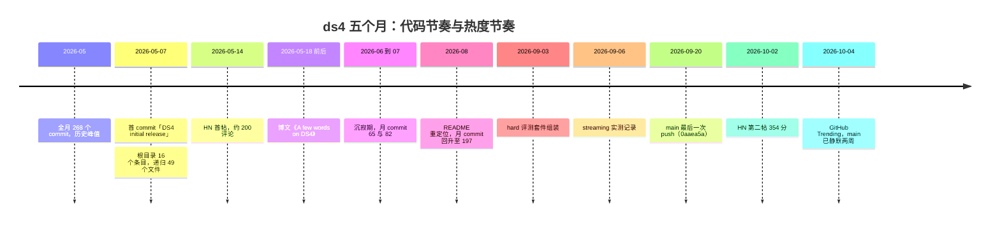
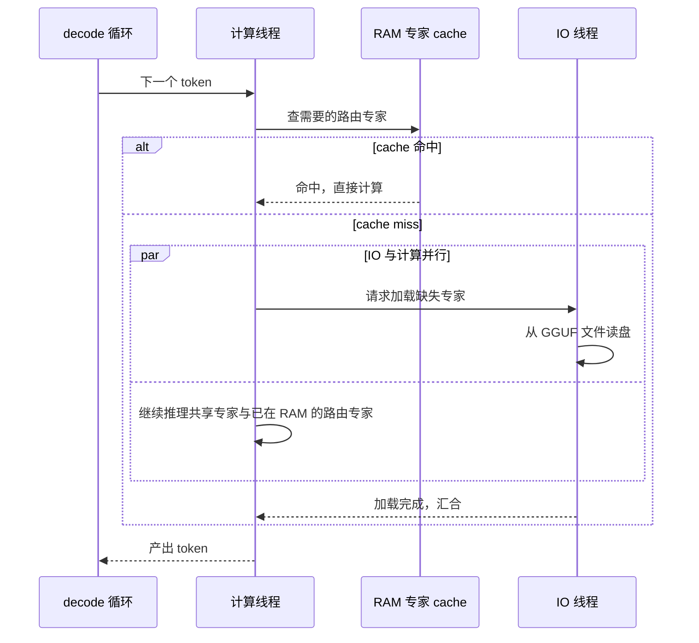
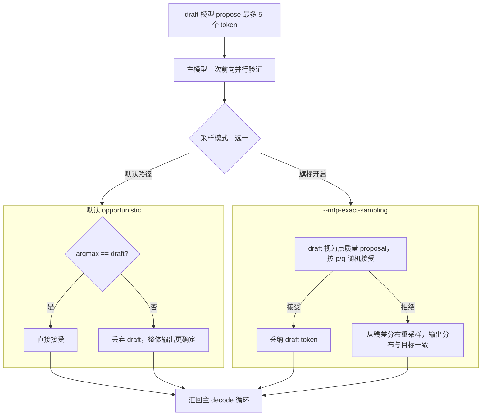
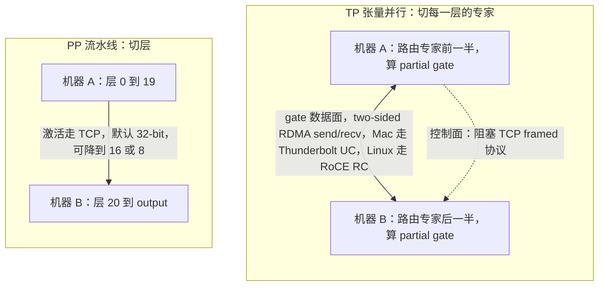

# 拆解 ds4：antirez 用 23 万行 C 回答本地推理引擎的七个问题

> 2026-10-05

打开 ds4 仓库根目录的 LICENSE，是一份再标准不过的 MIT 文本，只有版权行不太一样——整整三行：「(c) 2026 The ds4.c authors」「(c) 2023-2026 The ggml authors」「(c) 2023 DeepSeek」。一个发布刚满五个月的引擎，用三行字同时交代了三件事：代码是谁写的，kernel 是从谁那里复用的，权重是谁发布的。这恰好是本地推理引擎作者必须回答的第一个问题——东西从哪来。

ds4 的正式名字叫 DwarfStar，作者是 Redis 的创造者 antirez，2026 年 5 月 7 日首发。五个月后，797 个 commit，23,337 个 star。围绕它的说法不少——「单文件引擎」「一周写成的本地 quasi-frontier 运行时」——有真的，也有失真的。这篇不做新闻复述，而是把 ds4 当一份可读的参考实现拆开：从零写一个本地推理引擎，必须依次回答七个问题，ds4 对每一个都给出了能落到源码行号的答案。

## 一、先数文件：「单文件引擎」的第一天就有 49 个文件

先把流传最广的「单文件」处理掉。写这篇文章时我把仓库全史克隆到 /tmp/ds4-research/ds4，797 个 commit。`git ls-tree` 显示 2026-05-07 的首个 commit「DS4 initial release」在根目录就放了 16 个条目——ds4.c、ds4_cli.c、ds4_server.c、ds4_metal.m 等 14 个文件，加 metal/、tests/ 两个目录，递归展开是 49 个文件，tests/ 里另藏着 16 个文件。初始的 ds4.c 是 16,640 行；五个月后 85,327 行，是初始的 5.1 倍；全项目 C 代码约 229,454 行——ds4_metal.m 50,528 行、ds4_cuda.cu 34,039 行、ds4_server.c 23,104 行、ds4_agent.c 13,635 行。「单文件」从第一天起就不成立。

但另一个说法是真的，而且比「行数少」有意思。ds4.c 的头注释（ds4.c:1-9）自我声明：「This file is deliberately vertical: it owns GGUF loading, the fixed DeepSeek V4 tensor layouts, CPU reference kernels, the whole-model Metal graph driver, and tokenizer wiring」。这个文件刻意「垂直」——GGUF 加载、DeepSeek V4 的张量布局、CPU 参考内核、整模型 Metal 图驱动、tokenizer 接线，全栈每一层它都拥有一份。ds4 真正特别的不是行数，是「单核垂直 + 自包含」的组织方式：引擎的每一层摊在一个能从头读到尾的文件里，「把引擎当参考实现来读」才成为可能。头注释还补了一句，validation 只认已知的 Flash 和 Pro 布局，其他一律 fail early——不装通用。这个迷思本身就是失真的第一个样本——往下读之前，得先把对象校准一遍。

拆解对象也得交代：ds4 专攻 DeepSeek V4 Flash，284B 总参数、13B 激活、1M ctx。它跑得进消费机，一半功劳在注意力的压缩设计（官方叫 CSA+HCA）：每层只留最近 128 个 token 的原始 KV，更早的往下压——偶数层压 4 倍、配一个 indexer 从压缩库里检索最相关的 512 个位置，奇数层压 128 倍；43 层这么叠下来，KV 不再跟着上下文线性膨胀。其余只带 GLM 5.x、Qwen3.8 Flash Next 等少数几个权重。项目成立的前提写在 README 里：这些模型「tolerate aggressive routed-expert quantization」，路由专家压到 Q2/IQ2_XXS，共享路径保持高精度。没有这条模型特性，就没有这个项目。

读引擎之前还得校准时间，否则容易把传播的热度误读成工程的速度。commit 按月分布：5 月 268、6 月 65、7 月 82、8 月 197、9 月 185；main 分支最后一次 push 停在 2026-09-20（0aaea5a，与 git ls-remote 核对一致）。10 月初它重新上了 HN（10-02，354 分）和 GitHub Trending，可那时候 main 已经静默两周。截至 10-05，GitHub API 实测 23,337 stars、2,241 forks、758 个 open issues——所以下文一律不用「持续高速迭代中」这类现在时表述。

把代码的节奏和热度的节奏放到同一根时间轴上看：

5 月的狂飙、6 到 7 月的沉寂、8 月 README 重定位后工程投入回升、9 月攒出 hard 评测套件和 streaming 实测，然后 main 停在 9 月 20 日。10 月那波热度来临时，推着它走的是 HN 和社区站，不是新代码。

## 二、决策①：权重从哪来——自产 GGUF，和在 MIT 边界内复用 llama.cpp

第一个决策分两半：权重的容器从哪来，kernel 从哪来。

容器这半，ds4 选择自产。gguf-tools/ 是一条完整的离线量化产线：deepseek4-quantize.c 把 HF safetensors 转成 GGUF（一个纯 C 的量化器），再由按模型区分的 Python 脚本（glm53_quantize.py、qwen4_iq2.py、deepseek41_* 等）完成组装；imatrix 用 ds4 自己收集；量化产物发布在 antirez 自己的 HuggingFace 仓库（antirez/deepseek-v4-gguf、antirez/glm-5.3-flash-gguf 等），download_model.sh:4-11 直接从那里拉文件。刻意做窄的地方在格式：量化格式只有 5 种——q8_0、q8_K、q4_K、q2_K、iq2_xxs。README 不含糊：「not a general GGUF runner: you need to use the GGUF files the project produces」。

kernel 那半是一份写得明明白白的协议工程。LICENSE 三行版权，对应 ds4.c 作者、ggml 作者、DeepSeek；README 致谢节原话：「ds4.c does not link against GGML, but it exists thanks to the path opened by the llama.cpp project…Some source-level pieces are retained or adapted here under the MIT license: GGUF quant layouts and tables, CPU quant/dot logic, and certain kernels…we keep the GGML authors copyright notice in our LICENSE file」。

落到源码，「复用 kernel 却不链库」是一个三明治。cuda/mmq/ds4_ggml_stubs.h:1-27 的头注释自述：mmq.cuh、mma.cuh、vecdotq.cuh、quantize.cuh、mmid.cuh、common.cuh 这些文件「vendored verbatim from llama.cpp's ggml-cuda backend (MIT)」，原样保留；它们传递性 include 的 ggml.h、ggml-impl.h、ggml-cuda.h 在 ds4 里被换成重定向头，指向一个只声明最小 ggml API 面的桩——GGML_ASSERT 宏、21 个 ggml_type 枚举、block_q* 结构。于是这些 kernel 编译进 ds4 二进制，GGML 库根本不参与链接。量化布局的定义落在主文件：ds4.c:1040-1104 的「GGUF Quant Block Formats」定义了 block_q2_K（84 字节）、q4_K（144）、q5_K（176）、q6_K（210）、q8_K（292）、iq2_xxs（66）、mxfp4（17），每个都配 DS4_STATIC_ASSERT 防布局漂移；CPU dot kernel 在 ds4.c:3879 起；连视觉 encoder 都复用 llama.cpp 的格式（ds4.c:7494 注明「llama.cpp's Qwen3-VL mmproj」）。verbatim 保留意味着 llama.cpp 那边的修复能直接搬进来，重定向头保证这些文件一行不改也能编译——三明治的支点全在中间那层重定向。

社区对这套做法的评价是分裂的。HN 用户 pydry 说它是「a vibe coded knock off of llama.CPP」，0xbadcafebee 批评这是「fragmenting a rare commodity」——把本该集中投在同一个模型上的开发人力打散了。对立面是 verbatim vendoring 的显式声明和版权保留：法律上双方同为 MIT，干净；道义上没有共识。这个张力先按下，第七节回收。

我的看法是，这份协议工程不是免责套话，而是设计决策——它把「致敬还是分叉」这种通常靠默契维持的模糊状态，改写成显式声明的边界。量化格式只留 5 种，则是「做窄」在数据端的第一步：格式越少，量化器、kernel、评测要覆盖的组合就越少。

## 三、决策②③：单机之内——每台机器一个 make 目标，与 SSD streaming 的代价模型

第二个决策：支持哪些硬件。ds4 的答案朴素——后端即构建矩阵，每台目标机器一个 make 目标。

| make 目标 | 后端 | 定位 |
| --- | --- | --- |
| `make` | Metal | Mac 主目标 |
| `make cuda-spark` | CUDA | DGX Spark |
| `make cuda-generic` | CUDA | 含 Ada/L40S 多卡 |
| `make strix-halo` | ROCm | Strix Halo 统一内存 |
| `make cpu` | CPU | 仅编译检查，参考/调试用 |

AGENT.md 给了对应的两条铁律：「Keep the CPU backend CPU-only and use it only as reference/debug code」「Do not introduce C++」。后一条有内在张力——CUDA 后端的 .cu 文件本质是 C++，nvcc 绕不开，所以规则实际约束的是主引擎。差异化卖点是 Ada：docs/CUDA_MULTI_GPU.md:5-9 写明「Flash kernels do not require Blackwell's native FP4 instructions; Ada uses an appropriate CUDA path」，上一代数据中心卡也是一等公民。

可复现的配置长这样：8 张 L40S 上 `./ds4-agent --cuda --cuda-tensor-parallel --gpu-devices 0,2,4,6,1,3,5,7 --gpu-vram auto --ctx 100000`，16 条 decode row，约 126 t/s 聚合。Metal 侧的口径在 ds4.c:10-15：mmap 模型文件、no-copy MTLBuffer 包装切片。

性能基线（PERFORMANCE.md）：M5 Max 128GB 跑 Flash Q2，prefill 从 2K ctx 的 790.18 t/s 降到 64K 的 398.50，生成从 39.35 掉到 27.64；DGX Spark 是 825.76 到 822.98、18.05 到 13.84，prefill 几乎不吃 ctx 影响，短板在生成。批处理同样按「后端×模型」钉死（SERVER.md 的九行矩阵）：GLM 5.3 在 Metal 上 native batching 撑到 2051 个 visible token，超了退回 ordered fallback；SSD streaming 下的 V4.1 干脆整行都是 ordered fallback——没有跨模型的通用批处理策略，每个组合各走各的。

第三个决策是 ds4 最有辨识度的机制：SSD streaming。MoE 的路由专家动辄上百 GB，RAM 塞不下就从盘上按需读。机制不复杂：RAM 里维护一个有界的专家 cache，miss 的专家直接从 GGUF 文件读盘。有意思的是设计意图，AGENT.md 原话：「always try to hide loading of missing routed experts by loading them while performing the inference of the shared expert and routed experts already in RAM」。IO 线程读盘的同时，计算线程继续推共享专家和已在 RAM 的专家，用计算掩盖加载。

这套「用计算掩盖加载」的并发结构画出来是：

延迟能被「藏」住，靠的是 IO 与计算各走各的。藏不住的场合文档自己也点名了：生成阶段对 miss 更敏感——prefill 一大段一起算，好藏；decode 一个 token 一个 token 地等，不好藏。

驻留哪些专家不靠运行时猜，靠离线 profiling 定死、编译进二进制：ds4_streaming_hotlist.inc（192KB）和 ds4_streaming_hotlist_glm52.inc（94KB），文件开头写着「Generated from ds4 expert hotlist profiles; sorted by hits/weight」，一张按命中权重排序的专家优先表。

代价模型里有血泪注释：自动预算默认吃 80% 的 RAM（50-95 可调，环境变量 DS4_SSD_AUTO_CACHE_PCT），ds4_ssd.c:95-104 记录 Strix Halo 统一内存上「80% was measured safe」，再高会触发 Linux OOM killer——那段注释还解释了为什么：专家 cache 和 OS 挤同一块物理内存，pinned read 的暂存、prefill 的余量都是叠在稳态预算之上的瞬时尖峰。实测数据（M5 Max 128GB，2026-09-06，SSD_STREAMING.md）：GLM 5.3 Flash Q4_K 文件 177.77GiB，prefill 121/104 t/s，生成 11.9 到 14.9 t/s。文档里有两句少见的老实话：「Generation is usually more sensitive to cache misses than prefill」「More cache helps only while the rest of the working set still fits」——cache 开太大反而挤掉 non-routed weights，变慢。

还有一张表永远待在磁盘：Qwen3.8 的 n-gram 表（Engram，95.37GiB）。ds4_engram.h 规定它用独立的 uncached fd 加有界并发 pread，绝不 mmap——一张被随机查询的大表，mmap 只会把 page cache 搅乱。

对读者最实用的可能是这张内存档位表（docs/METAL.md）：

| 内存 | 推荐 |
| --- | --- |
| 64GB | Flash Q2 + `--ssd-streaming` |
| 96GB | Flash Q2 常驻 |
| 128GB | Flash Q2 或 GLM 5.3 Flash Q2（约 90GiB） |
| 256GB | Flash Q4/MXFP4 或 GLM 5.3 Flash Q4 |
| 512GB | PRO Q2 |

配上 MODELS.md 的尺寸，量级就有数了：ds4f-q2 约 81GiB；GLM 5.3 Flash Q2 约 90GiB；Qwen3.8 Q2 是一个 137.10GiB 的 GGUF，41.73GiB 常驻加 95.37GiB 磁盘 n-gram 表；V4.1 Q2 到了 341GiB 文件、152GiB 常驻加 189GiB 磁盘 Engram 的规模。

三个后端不是通用性，是钉死式适配；streaming 文档把收益和反直觉的负收益边界（cache 更大反而更慢）都写在明处。

## 四、决策④：--mtp 为什么在本地划算——投机解码的两种采样语义

先推演一遍。服务器场景 batch 满载，draft 模型的验证要挤占正在服务的请求的算力，投机解码未必赚；本地单用户 decode 只用掉机器一小部分算力，draft 与验证几乎没有机会成本。这就是 --mtp 在本地结构性划算的原因。antirez 博文把动机说成「single-model integration focused local AI experience」——单用户是设计前提，不是副作用。

入口分两家（SPECULATIVE_DECODING.md）：GLM 和 Qwen 用 --mtp，draft 层内置在主 GGUF 里；DeepSeek 用独立的 DSpark 支持 GGUF，约 5.6GiB，最多 propose 5 个 token，且必须与主 checkpoint 匹配。

真正该细读的是两种采样语义的分岔。默认的 opportunistic：主模型的 argmax 等于 draft 就直接接受，否则丢弃，源码里就是一句 accept = (argmax == draft)（ds4.c:73783 起）。文档自己说明后果——「deliberately more deterministic than ordinary sampling」，输出比普通采样更确定。--mtp-exact-sampling 走另一条路，标准投机解码的数学：把确定性的 draft 当成点质量 proposal，按 p/q 随机接受，拒绝时从残差分布重采样——源码是 speculative_point_accept(s->sample_probs[d], 1.0f, rng) 加拒绝时的 speculative_point_replacement。

两种模式画成图，分岔看得最清楚：

分岔发生在验证之后：opportunistic 拿「是否等于 argmax」一票裁决，整体输出比普通采样更确定；exact 走 p/q 随机接受，拒绝时从残差分布重采样，输出分布和目标模型对得上。

收益要看实测（QA_BEFORE_RELEASES.md，DGX Spark 单机，模型取 Flash 当时的 0731 快照、Q2 量化、4096 ctx、256 输出）：C 写的 hash table 代码，temp 0 下 19.72 到 31.41 t/s（1.59 倍），temp 1 下 19.53 到 29.98；不可预测的散文 19.53 到 18.81（0.96 倍），负收益。ROCm 上更干脆：16.26 普通、12.28 opportunistic、13.52 exact，文档直言「a correctness gate, not a ROCm speed claim」——在 ROCm 上它根本不指望赢，只当正确性门禁。接受率低时 scheduler 自动退避。

工程细节里还埋着一个容易踩的坑。QA 记录道：「A support model from another checkpoint can have plausible acceptance statistics while producing a different greedy continuation」——接受率看着正常，greedy 续写却是另一套。temp 0 下接受本应等于目标模型的 greedy 续写，但浮点归约顺序不同，长续写不必字节相同；要字节级 target-only，得开 --dspark-strict。Qwen3.8 还有自适应链式 draft：首 draft 连续全接受才启用第二链，用 3-row pass 验证。

这些数字合起来读：--mtp 在可预测负载（代码、工具调用）上赚，在开放生成上可能倒贴；换一个 workload，收益得重新量。ds4 把负收益场景原样写进发布 QA 文档，这一笔比任何加速比都有说服力。

## 五、决策⑤：第二台机器怎么用——RDMA 张量并行还是跨机流水线

单机塞不下，ds4 给两条路（DISTRIBUTED.md），选择逻辑从「你缺什么」出发。

TP（张量并行）切每一层的专家：路由专家 50/50 分到两台机器，各算出 partial gate 结果再交换。典型场景是两台 128GB Mac 跑 4-bit 的 Flash 或 GLM 5.3 Flash，或两台 DGX Spark 跑 V4.1 Q2。PP（流水线并行）切层：--layers 0:19 在机器 A，20:output 在机器 B，激活顺序流过边界，典型场景是两台 512GB Mac Studio 用官方 split artifacts 跑满血 PRO Q4。

TP 链路的实现全写在 ds4_tp.c:1-7 的注释里：控制面是普通的阻塞 TCP framed 协议；数据面的 gate 流量走 two-sided RDMA send/recv，Mac 上是 Thunderbolt UC，Linux 上是 RoCE RC。细节有讲究：magic 字符串「DS4T」兼作字节序检查；协议版本 14；gate 超时 750ms，理由是「Fail well before Metal's command-buffer watchdog」——宁可自己先报错，不等驱动看门狗发作。libibverbs 用函数指针表在运行时加载（ds4_tp.c:98-124），没有 RDMA 硬件也能构建，跑不了就 --transport tcp 回退。

两种切法并排看：

PP 的定位文档给了原话：capacity 和 long-prefill throughput。TP 没有对应的句子，但动机相同——路由专家对半分，一台机器只扛一半，外带 gate 的并行度。

限制也逐条写在配置旁边：CUDA 的网络 TP「stages CUDA results through host memory; this is RoCE, not GPUDirect」；PP 则是「Use pipeline mode primarily for capacity and long-prefill throughput, not as a guaranteed decode speedup」。PP 还有个少见的旋钮 --dist-activation-bits：线上激活默认 32-bit，设 16 流量减半，8 更激进——「change numerical precision on the wire, not weights or KV storage」，动的是传输精度，不动权重和 KV。另外协议无认证无加密，直连的两台机器之间无所谓，别拿来跨机房。

想复现双 Mac TP，准备三步：Thunderbolt 线缆直连两机；ifconfig alias 配出双机网段；`sudo sysctl iogpu.wired_limit_mb=120000` 解锁 Mac 的 wired 内存上限。然后按 TP 或 PP 选启动参数。

两台机器都到场才谈得上选择：缺容量、要长 prefill 吞吐，文档明说走 PP；TP 把专家对半分、两机分摊计算，decode 或许因此更快，但这层收益文档没给数字，当作机制推断看，别当承诺。

## 六、决策⑥⑦：会话怎么续、引擎怎么自证

这一节不配图，两套机制用文字讲穿。

先说 KV 落盘。ds4 的会话存在 ~/.ds4/kvcache，文件名是渲染后字节前缀的 SHA-1（41 字符）。关键的设计区分是：hash 只回答「这个文件是否代表输入 prompt 前部的字节」，payload 里带的是 exact tokens 加 graph state——匹配是前缀级的，恢复才是全量的。驱逐原因是一个枚举：COLD、CONTINUED、EVICT、SHUTDOWN、AGENT_*；命中权重按 6 小时半衰期衰减；默认预算 4GiB。CLI 的动词是 /save、/list、/switch、/del、/strip，其中 strip 保留文本、删掉 KV payload，适合想留着会话参考又不想占盘的场景。

server 侧机制相同，多了跨槽位存活：--kv-disk-dir 加 --kv-disk-space-mb 8192，KV 跨槽位、跨重启都在。匹配顺序是 live token prefix、磁盘上兼容的 rendered-text prefix、然后只 prefill 新后缀。量化变体之间可以共享前缀（--kv-cache-reject-different-quant 关掉这个行为）；DSML 工具块用 unguessable tool ID 保证精确 replay。

这套东西为谁设计？AGENT.md 的目标清单里有一句「Make long local agent sessions practical through live KV reuse and disk KV checkpoints」。HN 用户 ttoinu 的观察印证了结构上的同构：「ds4-agent is append only, never rewriting history of messages, keeping KV cache prefix reusable」。append-only 的会话模型和 KV 前缀复用天生一对：只要历史不改写，前缀永远有效；agent 会话越长，省下来的计算越多。限制也如实写在文档里：图片会话不能保存，TP 恢复需要双端重放 prefix，恢复时 expect prefill。

再说 ds4-eval。引子是社区吵不出结论——doctorpangloss 说 ds4 的量化质量差，c0rruptbytes 反驳「beating the unsloth quants」。既然吵不出，引擎自己长出回归测试。README 的定位很克制：「DwarfStar integration checks, not official leaderboard scores」。套件构成（EVAL_DATA.md）：core 92 例，25 GPQA Diamond 加 25 SuperGPQA 加 25 AIME 2025 加 17 个缩减的防御性代码审查；hard 50 例，2026-09-03 组装，30 MMLU-Pro 加 10 OlympiadBench 加 5 LiveBench 加 5 NIST Juliet。数据治理钉死 revision：MMLU-Pro 锁在 commit f418b11，NIST 档案锁 SHA-256 ada9d7e，case ID 全公开，带 Apache-2.0 再分发条款。用法 `./ds4-eval -m ds4flash.gguf --suite hard --retry-incomplete`，--regrade-trace 离线重判分。

更大的自证体系在 QA_BEFORE_RELEASES.md，131KB：warning-free 编译是硬门槛；official continuation 向量测试——Flash 100 case 的 NLL 基线 0.398181736、56/100 首 token 匹配；DSpark 接受率有 fixture；TP 必须过物理链路 QA，理由原话「a local command-parser test is not physical TP QA」。CONTRIBUTING.md 把速度立场钉死：「The only acceptable regression speed is when an important correctness bug is fixed」。

到这儿把⑥和⑦收在一起：KV 落盘让长会话不必每次从头 prefill，ds4-eval 让每次改动都有可对照的底线，两件事合起来才回答「凭什么信它」。只是这份自证有天花板：50 加 92 例对 leaderboard 没有代表性，NLL 基线和 logits 一致性断言也都出自自己之手。

## 七、刻意做窄：当写代码和读代码的都变成 agent

七个决策摆在一起，有一条贯穿的线：做窄。只跟随适合本机规模的少数开源权重，README 明言自己「not a general GGUF runner」；validation 只认 Flash/Pro 布局，其他 fail early；连产品形态都设想成模型插槽——博文里那句「You just load what you need depending on the question」，往后是 ds4-coding、ds4-legal、ds4-medical 的想象。

做窄的另一面，是这个项目最不寻常的披露。README 开头有一节「AI full disclosure」，话直白到近乎冒犯：如果你不接受 AI 开发的代码，这个软件不适合你。博文（antirez.com/news/165）给了细节：「leveraged very quickly thanks to GPT 5.5 (codex): otherwise you can't build DS4 in one week. However I believe having a clear map of what to do helps a lot: you need to know how to gently talk to LLMs」。那一周他平均每天干 14 小时。还有一句轻描淡写的自白：「It is the first time, in all my tinkering with local models, that I use a local model for serious stuff that I would normally ask to Claude / GPT」，以及定位的那句：「if small local models are A and frontier models are B, DS4 is a lot more B than A」。

AGENT.md 是这套工作方式的书面化，标题就叫「Agent Notes」，读者从人类贡献者换成了 agent，但品味和 Redis 时代一脉相承：「Keep the implementation small, sharp, easy to understand. Try to write elegant code in a state of grace」「Don't introduce slop: very fragile code that just patches specific cases, dead code, useless code…」「Prefer comments beside the implementation over separate design documents」。安全节记着真实教训：CPU path 曾因超大 mmap 触发 macOS 的内核 VM bug。

README 里「How to use this project?」把这个逻辑推到了底：AI 改变软件交付，软件应当作「a working template for the biggest use cases」——用户让 coding agent 为自己的硬件改造引擎，TP 这类实现是「a rail for implementing the same feature in specific conditions」。拿这句回看前面六节就对上了：可读的参考实现（人能审）、agent 的改造能力（机器能改）、垂直做窄（改动面可控），三件合起来是一种新的软件分发范式。七个决策都要落到可复现配置或可读源码，不是文档糖，是给下一个 agent 铺的轨道。

第二节的张力在这里收。jeffbee 那句「Apparently I'm the only person to whom 'from the creator of Redis' is a warning」，翻的是 Redlock/Jepsen 旧账——名气是双刃剑。dwarfstar.sh 落地页上那句营销文案「Compressed, not lobotomized」被 Almondsetat 直斥「pure slop」，跟 antirez 本人朴素站点和 README 文风割到两边——AI 时代文档风格的活样本。C 还是 Rust 的争论里，antirez 站 C：LLM 训练数据偏 C，Rust 冗长的编译器反馈对 AI 工作流是负项；zozbot234 反驳，Rust 的本地检查恰好补 LLM 的短板。

更硬的约束在硬件。「消费者硬件」的说法和现实有落差：没有 GPU offload，纯 CPU 约 4 t/s，128GB 加 3090 的用户是失望的；kgeist 质疑这价值主张不如 RTX 5090 上跑 dense Qwen 3.6 27B（50-60 tok/s）；darkwater 提醒一句，128GB 的 M5 Max 要 7800€。所谓人人可拥有的硬件，实际是 3 到 5 万元级的工作站。反方向的一个数据点：mudler 维护的 vllm.cpp 在 GB10 基准里把 ds4 定为 1.00x（16.33 t/s），自己用同一个 GGUF 跑出 0.997x 的 parity，开了常驻选项才到 1.144x——第三方工程已经拿它当消费机 MoE 推理的对照基准。

ds4 用三行 LICENSE 回答了「东西从哪来」，用七个决策回答了「引擎怎么立起来」，但它真正留下的，是一个 agent 时代的分工样本：antirez 的那一周里，人负责地图（「you need to know how to gently talk to LLMs」）与品味（AGENT.md 的「state of grace」和「Don't introduce slop」），GPT 5.5 负责行军。

这个样本留下两道裂缝。其一，如果软件的价值在于「被 agent 改造」——working template 论——那人类作者最不可替代的资产，就从代码本身移到了规范与品味。你手头的项目，明天作为一个 template 交给 agent 改造，它经得起吗？缺的是什么？其二，「AI is too critical to be just a provided service」的本地化愿景，今天仍以 3 到 5 万元级工作站为门槛——CPU 约 4 t/s、7800€ 的 M5 Max。antirez 打开的那扇门，多数人还站在门外。
