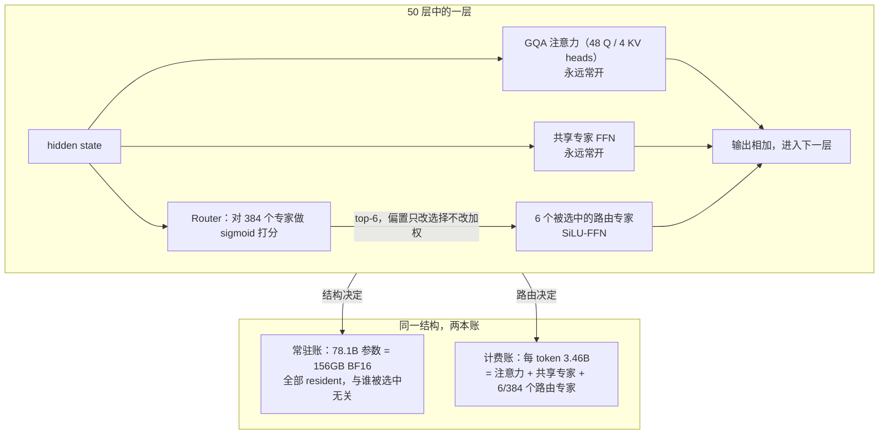
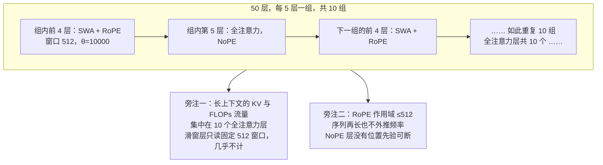
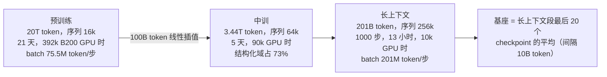
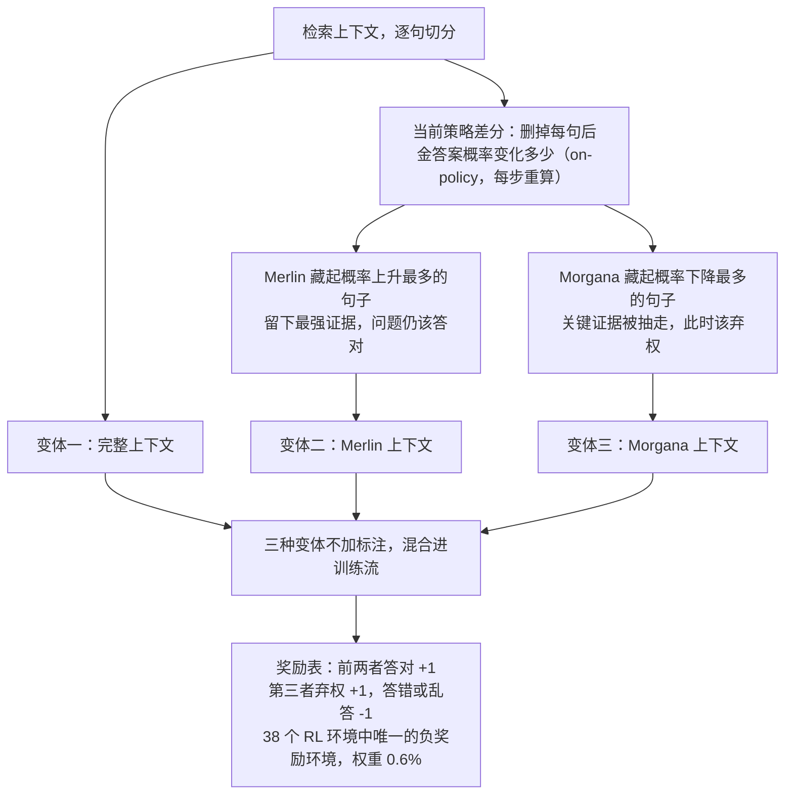
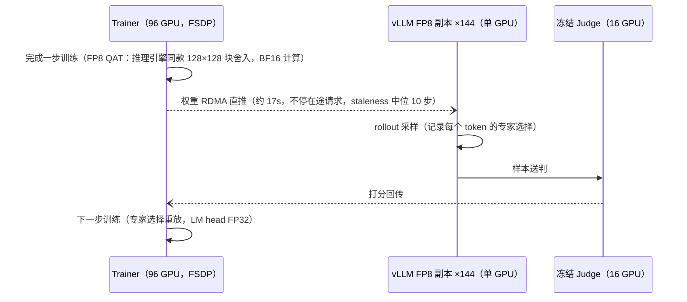

# 78B 常驻、3.46B 计费：拆开 Kolibri 极稀疏 MoE 的工程账本

> 2026-10-04

2026 年 10 月 3 日，Aleph Alpha 在德国统一日开源了 Kolibri-1。同一张模型卡上有两个看起来打架的数字："每 token 仅激活 3.46B 参数"，这是消费级显卡的量级；"BF16 权重 156GB 常驻显存"，最低 2×A100-80G 起步。HN 上有人拿这两个数字问 AA 员工 Mac 能不能跑，得到的回答是 "tough to put it on a Mac"。一只每次只扇动 4.4% 翅膀的蜂鸟，身体却重 156GB。这笔"78B 总参换 3.46B 激活"的交易为什么有人做、账怎么算平，189 页 tech report 加罕见详尽的模型卡把全本账摊开了。这篇文章逐页拆账：四个机制决策，每个都按"换来什么、付出什么、证据在哪"三问推进。

## 账本第一页：入场费 156GB，每 token 计费 3.46B

先把结构钉死。Kolibri-1 是 50 层 decoder-only MoE，每层 384 个路由专家加 1 个共享专家，专家是隐藏维 512 的 SiLU-FFN。路由取 top-6 sigmoid：router 给 384 个专家各打一个 sigmoid 分数，取最高的 6 个，选中的分数直接相加、不做重归一化；均衡偏置只改变谁被选中，不碰加权。总参数量精确到 78,103,074,560，每 token 激活 3,457,573,120。两个容易混的比率要分开：路由选择率只有 6/384≈1.56%；整体激活率却是 4.4%——注意力和共享专家永远常开，路由专家在激活参数里其实占小头（tech report pp.7-8 Table 2，及 HF 模型卡）。

一个 token 穿过一层时，钱花在哪、什么时候花，一张图说清：



两本账的读法不一样：常驻账在你部署的那一刻整个付掉，计费账跟着每个 token 走。这笔交易的本质是显存换算力，前提是 decode 阶段 memory-bound——权重读取可以被 batch 摊销，KV cache 读取不能。于是总参越大，短上下文越吃亏，长上下文反而不敏感。后面会看到，"极稀疏 MoE"和"混合注意力"是同一个经济学决策的两面（pp.14-15）。

稀疏度不是拍的，是三段实测换来的。固定 3.4B 激活，把专家数从 128 扫到 384，总参对应 42.1B / 82.3B / 122.6B：42.1→82.3B 质量（loss 和准确率）明显上涨，→122.6B 只剩微增。8×H100 实测纯解码吞吐：4k 上下文下 82.3B 和 122.6B 分别比 42.1B 慢 13% 和 32%；到 256k 收窄为 4% 和 12%，因为 KV 读取占比上升，而长上下文的流量主要来自全注意力层。部署侧更直观：2×H100 上 122.6B 只能并发 3 个 256k 请求，82.3B 能扛 18 个。于是报告把总参预算定在 80B 档，再在同预算下选专家形态（B.5.1）：384 个 hidden 512 的小专家配上 2560 的模型宽度，loss 1.847，压过 Qwen3-Next 式 512 选 12 的细粒度，更压过 256 个 hidden 1024 大专家的粗粒度——后者正是扫描里那个 82.3B 配置，1.860。最终落点 78.1B：专家数和总参是两个自由度，扫描定后者，形态消融定前者（pp.14-15、135-136 Table 31/32）。

放进 2026 年的同行里，这张账更好读（激活率均为报告 Table 28 实测口径）：

| 模型 | 激活 / 总参 | 激活率 |
| --- | --- | --- |
| Kolibri-1 | 3.46B / 78.1B | 4.4% |
| GPT-OSS 120B | 5.1B / 117B | 4.4% |
| Qwen3-Next 80B-A3B | 3B / 80B | 3.75% |
| Mistral Small 4 | 6B / 119B | 5.0% |
| Qwen3.5 35B-A3B | 3B / 35B | 8.6% |
| Nemotron 3 Nano | 3B / 30B | 10% |

Kolibri 站的是 GPT-OSS 式"大总参、低激活"路线，对面是 Qwen3.5 的"小总参"。我不认为有对错——两条路线押的是不同的显存单价和目标负载，没有普适答案。

那谁受益？FP8 版约 78GB，RL rollout 实测 FP8 权重加 FP8 KV 让吞吐翻 2-3 倍。但省下的算力要兑到账上，得靠并发：稀疏降的是每 token 要读的权重量，156GB 常驻却是笔固定入场费——大 batch 把同一段权重读取摊到更多请求上，这笔入场费才摊得平。单用户 batch 是 1，每 token 读得再少，入场费一分不少付，还被它顶到 2×A100 起步的档位。HN 的单机实测都指向这一头：ekidd 用 96GB 内存的机器量化后勉强跑起来，结论是"not competitive for hobbyists"；员工 befelix 的原话是 "tough to put it on a Mac"；用户 martianvoid 自报 RTX Pro 6000 跑 FP8 约 170 tok/s。个人的机器上，dense 27B 比它灵活得多。

## 把 RoPE 关进 512 的窗：免缩放直推 1M 的机制与账单

机制先推完。50 层按 4:1 交替：40 个滑窗注意力块，窗口 512 个 token，RoPE（θ=10000）加在 Q/K 上；10 个全注意力块，每 5 层一个，不带任何位置编码（NoPE）。Q/K 在进 RoPE 之前先做 per-head RMSNorm。训练分三段：16k 序列喂 20T，64k 喂 3.44T，256k 喂 201B——原生 256k，实测不做任何位置缩放直推 1M（pp.7-12、41-43）。

50 层的纵剖和两栏旁注如下：



长上下文的算力集中在那 10 个全注意力层上；"免缩放"的秘密也在这里——这个结构里压根没有需要外推的东西。

为什么这个反直觉的设计能工作？YaRN 一类外推法处理的是"训练时短、推理时长"的频率外推；滑窗层里的 RoPE 只需编码窗口内不超过 512 的相对位置，序列再长也轮不到它外推频率；NoPE 层则干脆没有可断的位置先验。两处都把外推问题绕开了，而不是解掉它。报告引 B. Yang et al. 2025 支持 NoPE 对长上下文的改善（pp.41-43）。

窗口选 512 同样反直觉——不是越大越好。资源对齐扫描 128 到 4096：scale M 上 w=128 在短上下文最好，但 128k 处直接崩，w=512 随长度衰减最小；scale L 验证 256k 处 w=512 领先 6.7pp，代价只是预训练精度 -0.2pp。全注意力对照（4k 预训练加 YaRN 拉到 64k）在 RULER 和 HELMET 上都输给了混合方案（pp.12-13 Table 4/Figure 7-8）。

QK Norm 在这里不是稳定器，是入场券。没有它，基准学习率直接发散；只在全注意力层去掉，训练后半段梯度范数爆掉几个数量级；换 QK-Clip 也一样爆。它还硬性保证了 FP8 KV cache 不溢出——RMSNorm 输出的范数上界乘 √d 小于 E4M3 的最大值 448（p.12、附录 B.2）。服务侧那个 `--kv-cache-dtype fp8` 选项的地基，在这里就打好了。

代价边界用 RULER 的数字划最诚实（均为 Base 模型，temp 0）：

| 上下文 | Kolibri | Qwen3.5 35B-A3B | Nemotron 3 Nano | Gemma 4 |
| --- | --- | --- | --- | --- |
| 128k | 67.9 | 89.9 | 81.0 | 87.8 |
| 256k | 69.8 | 80.1 | 72.1 | — |
| 512k | 65.5 | 72.2* | 73.1 | — |
| 1M | 63.2 | 57.5* | 58.5 | — |

（* 为静态 YaRN×4 外推；Qwen3.5 用 248k 词表，token 计数口径有噪。数据：tech report p.46-48 Table 18/Figure 18）

训练窗内全面落后——128k 差 Qwen3.5 22 个点；过了 256k 训练窗开始反转，512k 追到与领先者只差 7.6，1M 处 63.2 全场最高。任务级的细节也诚实：NIAH 随长度衰减，word extraction 在 1M 输给原生 1M 的 Nemotron。免缩放外推买的是"窗外最强加训练/服务效率"，付的是"窗内 10-22pp"。只写"直推 1M"四个字，那就成了宣传稿。

## 训练配方的三件非常规武器：优化器分治、EQB+LEI、三段预算

第一件武器，优化器按参数形态分治，这张表可以照抄（pp.18-23 Table 6）：

| 参数 | 优化器 | 关键设置 |
| --- | --- | --- |
| Q/K/V、专家 up/gate | Muon | spectral 约定；momentum 0.95 + Nesterov；update×√(dout/din)；lr 1e-3，wd 2^-12 |
| router gates、LM head | AdamW | lr 2.5e-5，wd 2^-12 |
| embedding、norm scales | Adam | lr 2e-3，无 wd |

Adam 系一律 β=0.9/0.95、ε=1e-15。ε 小到这个程度，小梯度参数（LM head、router）的更新就不再依赖梯度尺度，行为反而像 Muon。router、embedding、head 不交给 Muon 不是保守，是嵌入类、一维、输出层的参数本就不满足 Muon 的矩阵正交化假设——"按形态分治"比"全线换优化器"可迁移得多。

配套两条。µP 下 LM head 零初始化，attention output 和 expert down 也零初始化，每个块初始时是恒等映射；宽度迁移只沿宽度扫——专家数和 top-k 固定、只缩放专家尺寸以保持路由动力学，验证下来宽 1024 与宽 2048 的最优学习率只差 √2。训练 horizon 用 loss 外推（Domhan 2015 的幂律，在累积学习率坐标上）代替 scaling law 网格，500B 观测预测 20T，误差不到 1%（pp.19-22）。

第二件武器换掉了专家均衡：EQB 加 LEI，替换 Origin 用的 SMEBU+GShard（pp.16-18 公式(3)-(8)）。EQB 源自 Kimi 的 Quantile Balancing——交替更新 token 偏置 α 和专家偏置 β，而更新 β 需要整个全局 batch 的分位数，数据却散在各 rank、各 microbatch 上。三条路摆在那：开源训练框架 Marin 的做法是各 rank 各算各的分位数再平均——一般不等于全局 batch 的分位数，是错的；Kimi 用 1000-bin 直方图 all-reduce 计数，精度受 bin 宽限制；EQB 用两轮 radix 选择精确到值：第一轮 256 个桶按 bf16 键的高字节定位分位数所在桶，第二轮在桶内按低字节定位到值，每层每步只两次 all-reduce、各 256E 个 int32 计数（E 是专家数），与 token 数无关。LEI 管局部均衡：在 microbatch 上算每个专家的相对负载 fe（实载除以均值），误差 ρe = fe − 1，再把误差向量重缩放后注入每个 token 的 sigmoid 分数梯度，G ← G + λ·(tanh ξ/ξ)·ρe，其中 ξ = ‖ρ‖∞/τ 是全网最坏失衡——λ=1e-5 管修正强度，τ=1 给重缩放封顶保稳定；失衡越大 tanh ξ/ξ 越小，油门自动收。效果是全训练 MaxVio 层均 0.31，只有前两层到 2.39——那两层的路由本就是被均衡偏置覆盖的，属于设计内的例外。更有信息量的是：SFT 和 RL 阶段均衡整体关闭，RL 表里明示 load-balancing loss: none（p.182 Table 58）——均衡在今天是个吞吐问题而非性能问题，"敢关掉"本身就是证据。

第三件武器是三段预算的悬殊分配：



时间线两头差着两个数量级。预训练 20T：batch 4608×16k，264,750 步，768 块 B200（EP8+FSDP16+DP6），21 天，392k GPU 时，38 次非计划中断，约每万 GPU 时一次。中训 3.44T：math/code/reasoning/instruction，序列 64k，5 天 90k GPU 时；mix 里 EN 指令加 STEM QA 加 Code 占 73%，两个 web 域只剩 3.4%——从广度切到结构化能力。长上下文段只有 201B token、1000 步、13 小时、10k GPU 时；token batch 从每步 75.5M 涨到 201M。阶段之间用 100B token 线性插值防遗忘，预加中训合计每数据集不超过 4 个 epoch（pp.18-19、32-35）。算一下比例：1M 能力的直接训练成本只占预训练 GPU 时的 2.6% 左右——长上下文是整本账里最便宜的一行，前提是注意力结构已经把长序列的算力账算好了。

这节还有个诚实的翻案细节。去掉 leading dense 层的依据是 scale L 消融里 loss 略低（1.847 对 1.850），但全量 run 的诊断显示前两个 MoE 层的路由专家几乎不被使用——消融结论和全量行为矛盾，报告如实写了（p.18 Table 5、p.137 附录 B.6）。小规模消融要拿全量诊断复核，这条方法论比结论本身值钱。

## 后训练最值得偷的两招：弃权变成奖励，合并变成代理

第一招有个名字，Merlin-Arthur。模型是 Arthur，两个对手负责藏证据：对检索上下文逐句算"删掉这句后，金答案的概率变化多少"（用当前策略算，每步重算）；Merlin 藏"概率上升最多"的句子——留下的是最强证据，问题仍然应该答对；Morgana 藏"概率下降最多"的句子——关键证据被抽走，此时就该弃权。同一个问题以完整、Merlin、Morgana 三种变体不加标注地混进训练（pp.49-50、79-80）：



弃权由此变成策略而非默认行为：模型必须先判断证据还在不在，才知道这题该抢答还是该认怂。

效果有数字撑着：SQuAD Merlin/Arthur grounding 23.4（多数对手是 0），AA-Omniscience 非幻觉率 44.0（前代 Origin 14.8），RGB 弃权率 86% 对 74%（Table 24）。配套论文（arXiv 2512.11614）提出 EIF——上下文到答案互信息的下界，报告 1B-32B 模型上不可回答问题的错误率最多降 35pp，比 vanilla 微调多降 18-20pp；把 Merlin/Morgana 上下文复用为检索器的正负样本，Recall@1 还能加 2pp。可偷之处在于：它把"何时说不知道"从对齐口号变成可验证奖励，任何有检索的场景都能复刻这套样本构造。

第二招 MergeMix，先说省钱，再说翻车。SFT 配比搜索不再训练候选配比：57 个数据集聚成 20 簇，每簇从同一起点训一个 4.5B token 的 specialist，按簇份额加权平均参数、只评合并模型——对比 OLMix 式做法（1057B token）省 91%，只花 90B（pp.66-70 Table 22）。两轮 Dirichlet 采样评了 69 个加权：baseline 配比合并出来 50.2%、只排第 49，最优合并 61.4%，看上去很美。

翻车数据在后面：真训练 8 个候选，7 个超过 baseline（最好 56.7%，对 baseline 训练出来的 51.5%——同一配比，合并代理和真训练是两个口径，分数本就不该直接比，排名才是信号），但合并分与训练分的 Spearman 相关只有 -0.09——最优合并训练出来反而最差（50.0%），最优训练配比在合并排名里只排中游。3 簇的小验证时排序是一致的，20 簇、4.5B 时失效，原因报告原话承认未知；中训场景 ρ>0.9 没失效（配套论文 arXiv 2601.17858 在 8B/16B 模型上同样 >0.9）。最终流程是"合并找配比、训练选最终"的瀑布，两个最优 mix 各训 268B 后做 soup，63.4% 超过单模的 58.9%。偷师之前，先确认自己的簇数和规模落在可靠区。

## 服务侧验收：一条 vllm serve 命令背后的系统工程

部署路径很短：vLLM 0.29，加 Apache 2.0 插件 aleph-alpha-inference（注册 Kolibri1ForCausalLM 架构和 kolibri1 的 reasoning/tool-call parser），然后：

```bash
vllm serve Aleph-Alpha/Kolibri-1 --kv-cache-dtype fp8 \
  --reasoning-parser kolibri1 --tool-call-parser kolibri1 \
  --enable-auto-tool-choice
```

采样参数官方给的是 temp=1.0、top_p=0.97、top_k=128。硬件档位：BF16 156GB，FP8 约 78GB（128×128 块 E4M3 加 FP32 scale，动态激活量化），最低 2×A100-80G、2×H100、1×H200 或 1×B200。`--kv-cache-dtype fp8` 是设计内选项而非险招——QK Norm 的范数上界已经把溢出堵死。

更有意思的是 RL 系统可以当服务侧证据看。单个 run 256 块 B300：96 GPU 的 trainer（纯 FSDP），加 144 个单 GPU vLLM FP8 副本，加 16 GPU 冻结 judge（Qwen3.5-122B-A10B FP8）。训练和推理的数值对齐靠三件套：FP8 QAT（trainer 用与推理引擎相同的 128×128 块 FP8 舍入、但 BF16 计算，有过不用 QAT 直接发散的记录）、路由专家重放（记录推理时每个 token 的专家选择，在 trainer 重放）、LM head 用 FP32（pp.71-95、180-183）。



权重每步经 RDMA 直推到副本、不停在途请求，从 torchstore 的 221s+217s 优化到约 17s，staleness 中位 10 步。我的判断：极稀疏 MoE 的成本优势一半来自架构，另一半来自这类咬合——"3.46B 激活"要靠 144 个 FP8 副本才兑得成吞吐。

推理努力旋钮也做得干净：none/low/medium/high 四档，经 API 的 reasoning_effort 加 chat template 系统提示句实现。SFT 标签不是人工标的，是"同数据集同难度的推理长度分位"事后软分配：P30/P70 分界、log 空间插值、β=0.15 高斯抽取；另有约 9.5% 的训练数据是成对样本——同一个 prompt 配两条推理长度不同的 completion，prompt 与难度都钉死，随 effort 标签变的只剩推理长度，模型由此学到"长度听令于档位"，而不是"难题就该长答"。实测难度固定时 high 比 low 多烧 1.4-3.7 倍推理 token，难度本身造成 32.5 倍差异——effort 调的是"范围内"，不越权（pp.50-51、61-64）。

边界照实写：llama.cpp/GGUF、4-bit 量化质量、Apple Silicon 都没有官方承诺；LMSYS、Artificial Analysis 等独立第三方评测，目前一个都没有。HN 上最有信息量的一条实测（用户 tharkun__ 自报）：官方 web 界面弃权过度触发、多轮工具调用弱——恰好打在弃权协议的代价面上，那是弃权率 86% 的另一面。

## 合账：一份"愿意在哪里输"的清单

基准要连同对比集一起读。后训练总评 EN 75.5 / DE 70.8，超过所有 3B 级激活的 MoE 对手（Qwen3.5 35B-A3B 74.7/69.8，Qwen3.6 71.4/67.3），输给 dense 的 Qwen3.8 27B（80.2/79.9）；AIME2025 96.9，GPQA Diamond 84.3。但 HN 用户 spijdar 指出对比集缺 6B 激活的 Qwen3.8 Flash-Next，只比了快一年的 Qwen3-Next——报告自身透明（Table 28），基线选择仍有 cherry-pick 的空间，而质量-成本 Pareto（Figure 1）在单一总分里根本不可见。

弱点列出来，不解释：RGB Closed-Book 51.0 全场垫底；AA-Omniscience accuracy 14.8 偏低——这是答对率，弃权换来的另一面；与前文 Origin 那个 14.8（非幻觉率）同基准、不同指标，数字撞车纯属巧合。模型卡基座表里 Wahl-O-Mat 德语只剩 16.7，Origin 是 52.3——闭卷政治知识大退步，报告没解释。RL 相对 SFT 的提升（IFBench 48.2→78.1，τ3-bench 13.1→38.1，AA-Omniscience Index -68.8→-32.8）说明后训练修的是指令遵循和 agentic，不是知识。

分词器这笔也该摆进合账。自研 UniBPE（BPE 的底子，改用 Unigram 损失选 merge，词表 128k）在德语上做到 4.90 bytes/token——这个数越高，同样文本占的 token 越少——是 12 个受测分词器里压缩最好的，九个外部对手里最强的 GPT-5 是 4.35。但同语料同词表的 plain BPE 也有 4.89：压缩收益几乎全来自语料，不是算法。算法的真增益在形态学，德语形态边界切割精度 65%，外部最好 49%；下游唯一可控实验只做过 0.6B 激活的 scale M，BPB 打平、长上下文 recall 更好，更大规模未验证（pp.9-11、133）。压缩上不赢、形态学上赢，还是那句话——愿意在哪里输。

引用卫生多说一句：多份一手文档之间有版本差——德语压缩 4.90（报告）对 4.7（模型卡）；德语 organic web 0.8T（报告正文）对 1.3T（Table 9 与博客）；Qwen3.6 的 AA-Omniscience Index -15.3（报告）对 -12.5（模型卡）。引用时优先 tech report 并标注版本，免得转手一次数字就漂了。

可带走三样东西：memory-bound decode 的经济学框架——稀疏度选择是显存单价乘并发形态的函数，没有普适解；免缩放外推的代价结构——窗内 10-22pp 换窗外最强，用它之前先确认你的负载在窗外；一份可对照的开源配方——优化器分治、EQB+LEI、三段预算、Merlin-Arthur、MergeMix，每项都有论文出处和已知的失效边界。

还有一层背景：发布博客的标题写着 sovereign open-weight model，HN 评论区随即有人算账——Cohere 持股九成、运营全在多伦多，"主权"还剩几成；同一场讨论里，AA 员工确认合并将帮助 scaling、更大模型在计划中。这份账本因此也是"极稀疏路线会不会继续加注"的一枚时间胶囊。

这份账本真正值得带走的，不是任何单个数字，而是提问方式的改变：评价一个模型，别只问"它多强"，问"它愿意在哪里输"。Kolibri 在 128k 输 22 分，换 1M 处全场最强；在闭卷知识上垫底，换 44.0 的非幻觉率；在单用户本地部署上干脆不战，换高并发下每 token 的便宜。落在"花钱买赢"那一栏的负载，这份 189 页的账本是一份配方；落在"愿意输"那一栏的，它只是别人的故事。
