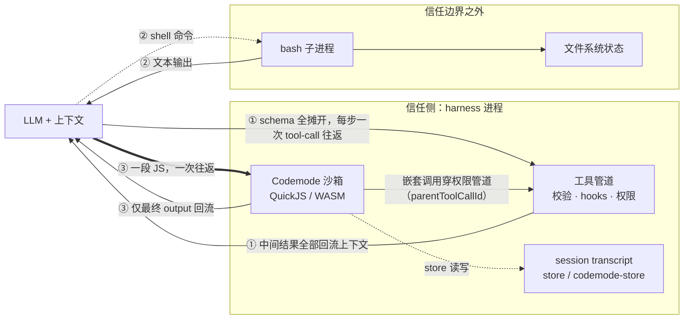
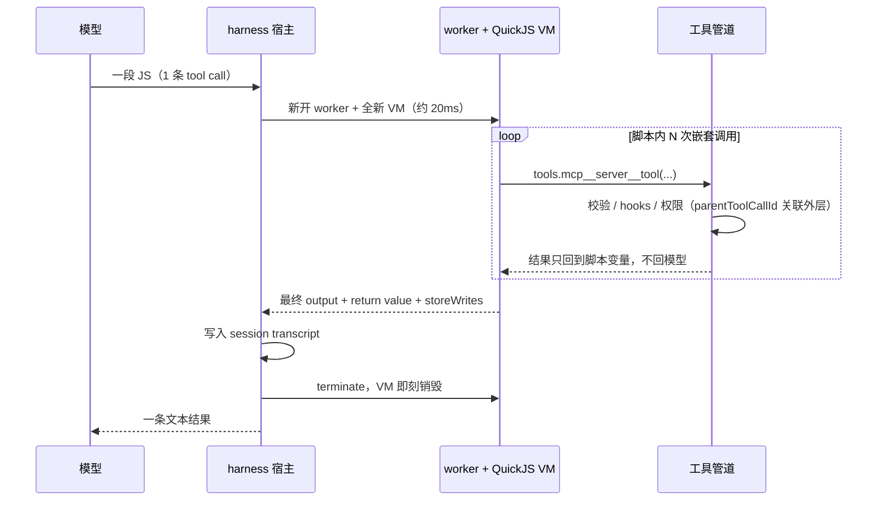
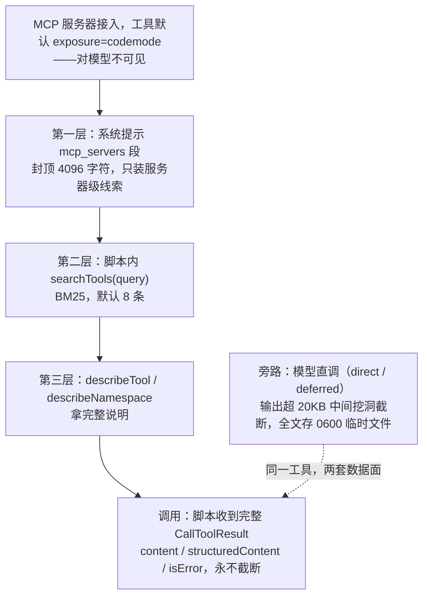
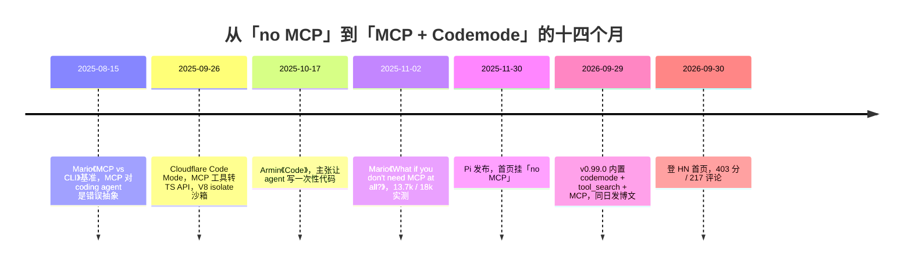

# MCP 的问题不在协议，在「摊开」：解剖 Pi 的 Codemode

> 2026-10-01

先算一笔账。[Pi 那篇博文](https://earendil.com/posts/you-said-no-mcp/)的招牌任务长这样：「用 typesafe/jev 找出我们 issue tracker 里最沮丧的 20 个评论者」。脚本先 `await tools.mcp__linear__list_issues({team:"Pi",state:"open",limit:250})` 拉出 250 条 issue，再逐条交给 Jev 这个分类模型打分。按主流 MCP 用法走一遍，这 250 条 issue 和 250 个分类结果必须全部流经模型上下文，才有机会被组合到一起——Mario Zechner 在[去年 11 月的文章](https://mariozechner.at/posts/2025-11-02-what-if-you-dont-need-mcp/)里把病根点破了：MCP 的结果只有经过 agent 上下文，才能被持久化或组合。而且活还没开始干，工具 schema 就先吃掉一大块家底。他的实测：Playwright MCP 的 21 个工具占 13.7k token（Claude 200k 窗口的 6.8%），Chrome DevTools 的 26 个占 18k（9%）。十分之一的窗口，还没写一行逻辑就没了。

2026 年 9 月 29 日，曾把「no MCP」挂在首页的 [Pi](https://github.com/earendil-works/pi)（110,698 stars 的 TypeScript 项目）发布 v0.99.0，给出第三种答案：模型不再逐个调工具，而是写一段 JS，工具在沙箱里被这段程序当库函数调用。任务从头跑到尾，上下文里只出现最终的 20 个名字。

这篇文章把这次转向当解剖样本，不当新闻。它真正回答的是一个普适的设计问题：当 agent 面对几十个工具时，编排逻辑应该放在哪里？

## 一个任务的三种账单：编排逻辑放在哪里

「编排逻辑放哪」听着抽象，拆开是三个非常具体的位置。

位置一，LLM 上下文，主流 MCP 的用法：所有工具的 schema 作为声明全部摊开，组合逻辑挤在上下文里，每一步组合都是一次 tool call 往返——模型读结果，想下一步，再调用。位置二，bash 子进程：CLI 的组合表达力天然强大，管道、重定向、并行、脚本，是几十年打磨出来的老手艺；但接口是字符串拼接，没有结构化类型，而且跑在不可信边界上——Pi 自己的文档写明，它的 bash 没有内置 OS 沙箱，以启动用户的权限执行（packages/coding-agent/docs/security.md:3），正经的用法是关进容器。位置三，harness 侧的代码沙箱，也就是 Codemode：JS/WASM 沙箱跑在信任侧，agent 写一段 JS 把工具调用组合成程序，一次往返完成全部多步组合。

这三个位置的账单差别有多大，Mario 的数字可以直接给方案一定价：Playwright MCP 21 个工具 13.7k tokens（200k 窗口的 6.8%）、Chrome DevTools 26 个工具 18k（9%），而他测的 README 方案只要 225 tokens。方案二也该得它的公道——Mario 在[2025 年 8 月的基准文](https://mariozechner.at/posts/2025-08-15-mcp-vs-cli/)里列的 CLI 好处都成立：组合天然（管道、并行、脚本），`--help` 给的调试交互性，认证按进程隔离，放进 VM 跑就不受 prompt 注入影响。但硬伤同样成立：无类型，接口靠字符串；不可信边界；还有最要命的一条——bash 脚本够不着 harness 的工具面，你没法在管道里 grep 一个 MCP 工具的输出。

|                    | ① LLM 上下文           | ② bash 子进程            | ③ Codemode 沙箱                     |
| ------------------ | ---------------------- | ------------------------ | ----------------------------------- |
| 编排介质           | tool-call 循环         | 管道 / 重定向 / 脚本     | JS 程序                             |
| 中间结果去向       | 全部回流上下文         | 文件系统                 | 留在脚本变量里                      |
| 往返次数           | 每步一次               | 一次提交                 | 一次往返                            |
| 类型系统           | JSON Schema 声明       | 无                       | JSON Schema → TS 声明（仅供描述）   |
| 信任边界           | 信任侧                 | 不可信，无内置沙箱       | 信任侧，VM 内无 fs/net              |
| 状态存储           | 上下文本身             | 文件系统                 | session transcript（store）         |
| 适用场景           | 需逐步判断的探索       | OS 级文件 / 进程操作     | 多步组合、中间结果大                |

三个位置各自站在哪条信任边界上、什么东西流回模型上下文，一张图比一段话清楚：

方案一和方案三都在信任侧，但数据回流路径完全不同：前者每一步的中间结果都要过一遍上下文，后者只有最终 output 回来。方案二组合表达力最强，却站在信任边界之外，还够不着 harness 工具面。所谓「三个位置」，实质是三条数据回流路径，外加两个信任域。

论点先押在这里：MCP 的根本问题从来不是协议本身，而是「把工具直接摊给 LLM 上下文」这个动作。Codemode 的实质，是把工具从「LLM 上下文的第一公民」降级成「沙箱里的库函数」——后面讲的所有机制，沙箱、发现、数据面，全是这个降级的推论。所以这篇文章不写人物新闻，也不站「MCP 已死 / 未死」的队：2026-09-29 这次转向，值得当成一组设计实验数据来读。

## 解剖沙箱：跑在信任侧的 1600 行

Codemode 包一共约 1600 行，可以逐块看。

底座是 QuickJS，编译成 WASI（quickjs-wasi@3.6.2），跑在 node 的 worker_threads 里。每次 `execute()` 都新开一个 worker 和一个全新的 VM 实例（独立线性内存，约 20ms），跑完立刻 terminate——host.ts 的注释把理由说得很直白：失控脚本无法毒害后续运行（packages/codemode/src/runtime/host.ts:81-128）。这个 VM 的全部导入，只有一个 WASI shim（时钟和随机数，stdout/stderr 直接丢弃）加一个 host-call 入口；prelude 先把 bridge 闭包封死，才在封闭环境里建出 tools、console 和 globals（prelude-source.ts:1-27、worker.ts:64-100）。VM 里没有 timers、没有 fetch、没有 process、没有 require、没有模块系统，连 WebAssembly 都没有。脚本唯一能做的事，就是调用注入进来的工具。

保险丝一层层数。超时和中断是双保险：SharedArrayBuffer 的 interrupt flag，加上 `worker.terminate()`——之所以要两道，host.ts:268 的注释有解释：Bun 上 terminate 杀不死 wasm 自旋线程。死锁有自检：脚本在等一个永远不会 settle 的 promise、且已经没有 pending 调用时，`stalled()` 立刻报错而不是挂死（prelude-source.ts:331-342）。内存上限 256MB，注释说得很实际：worker 共享 pi 进程，不设上限就会一路撑到 wasm32 的 4GiB，把整个 session 拖垮（packages/coding-agent/src/extensions/codemode/execute.ts:44-48），超限抛 `InternalError: out of memory`。

状态管理是这套设计里最有想法的部分。store/load 同步读写 JSON，但沙箱本身什么都不持久化——宿主把快照传进去，执行成功，才把本次的 store 变更（set 和 delete）报告回来。执行失败呢？已经发生的工具调用不回滚，该发的请求发出去了就是发出去了；但 store 里本要记下的写入，一个字都不留。coding-agent 把成功的写入追加成 session 的 codemode-store 自定义条目，从分支根折叠应用——resume 之后状态还在，/tree 切到别的分支，各见各的路径（execute.ts:117-127, 299-302；cli.md:178）。博文里有句话给这个设计点题："Because Codemode also runs on the harness side, its state is also maintained as part of the session transcript instead of the file system." 为什么选 JS 而不是 Python，原文的理由是："small versions of JavaScript can be shipped as WASM binaries and allow reasonable levels of protection."

「跑在信任侧」不是口号，它有具体的工程含义。博文原话："it can do it where bash runs, or it can do it where the harness agent loop runs. The trust level on both sides is very different." 落到代码上：脚本里的嵌套调用走 ctx.executeTool——校验、tool_call/tool_result hooks、权限扩展全部生效，还带着 parentToolCallId 关联到外层那次 codemode 调用（docs/mcp.md:211，"Every MCP call passes through Pi's tool pipeline"）。这直接反驳了「MCP 绕过权限体系」的常见批评：至少在 Pi 这里，嵌套调用的权限管道一步不少。凭据也一样较真：`models.classify()` 只接受 provider/id，脚本伪造 baseUrl 或 headers 拿不到凭据（execute.ts:450-452）；模型目录里的 headers，在交给脚本之前就被删掉（execute.ts:82-87）。对照 bash 被部署进容器的处境——同一个「组合」动作，放在信任侧就能安全触达 harness 的能力。

把一次 execute 的完整往返画成时序，很多机制就不用再解释了：

这张图真正要看的只有一件事：中间那串调用全在 worker 里自己消化，模型只在首尾各出现一次。

验证的部分，得分清谁跑了什么。研究阶段在 @db6cc71 这个提交的 packages/codemode 下用 Node v25.8.0 跑 `npx vitest --run`，59/59 全部通过；换 Node v22.16.0 会挂掉 37/59——因为 `new Worker("./worker.ts")` 依赖 Node 的 TS type-stripping，包的 engines 要求 node>=22.19.0。这是部署陷阱，不是 bug；写这一稿时没有复跑套件。端到端探针更直接：自写脚本经 `CodemodeSandbox.execute` 跑一次执行，内含 1 次 list_issues 加 5 次并行 get_profile，共 6 次嵌套调用全部完成；模型侧只见 1 条 text 输出加 return 值；calls 数组记录每次调用的 name、status、durationMs；store() 的写入在第二次 execute 里用 load() 读回成功。这不是宣传口径，是跑出来的记录。

一个防翻车的脚注：别把 Codemode 写成「type-checked 运行时」。HN 上确实有人这么叫它，但代码事实是，JSON Schema → TS 类型声明只用来给模型生成描述（packages/codemode/src/declarations.ts），README 原文说得干脆："Schemas only shape the declarations; values are not validated against them." 运行时真正校验的，只有参数的 JSON round-trip 和 store 限额。eval 和 Function 在 VM 内仍然可用。QuickJS 是解释器，胶水逻辑够快，重计算慢于 V8。

## 发现的经济学：工具藏起来之后，元数据怎么预算

工具不再摊给模型，新问题立刻冒头：模型怎么知道有哪些工具？「发现」成了新的设计难题。Pi 的答案是一台三层阶梯。

第一层在系统提示里，叫 mcp_servers 段：一小块封了顶的字符预算（整个段落 4096 字符），只装服务器级别的线索——一个名字、一句描述，不列工具。代码注释明说这是学 Codex 的 deferred namespaces（mcp/index.ts:152-200）。第二层在脚本内：`await searchTools(query)`，BM25 检索按相关度返回几条，配 describeTool / describeNamespace 拿完整说明（execute.ts:337-403）。第三层在 codemode 工具自己的描述里：一个共享的 3000 token 预算，按 namespace 轮转，先便宜后贵，每个 namespace 至少露出一个工具再考虑填满（selectCatalog，tool.ts:224-298——注释自己承认 like OpenCode's catalog）。

exposure 有四档，是工具住在哪个平面的开关：

| exposure         | 谁看得见                            | 谁能调             |
| --------------- | ----------------------------------- | ------------------ |
| codemode（默认） | 不声明给模型，也不列进 codemode 描述 | 仅脚本             |
| deferred        | 被 tool_search（BM25）搜到后声明     | 模型直调，脚本也可 |
| direct          | 像内置工具一样声明                   | 模型直调 + 脚本    |
| hidden          | 注册但不可达                        | 无人               |

toolExposure 支持工具名和通配符覆盖，比如 `get_*:codemode`、`delete_*:hidden`。服务器指令不进工具描述，脚本要用 describeNamespace 去读。

「降级为库函数」落到数据上，是同一个工具长出两副面孔。同一份输出，模型直调时拿到的是给人读的版本：超过 20KB 就从中间挖洞，只留头尾，全文存进 0600 权限的临时文件备查（mcp/tools.ts:44, 65-67，注释写着 like Codex does）。脚本拿到的才是给程序用的版本：完整的 CallToolResult，content、structuredContent、isError 都在，去掉 _meta，永不截断。bash 是同一个道理，模型看截断版，脚本收到带 exit_code 和耗时的结构化对象。给「读」的和给「程序分支」的，从数据面就分开了。

还有一层心思花在缓存上。首个 prompt 只等有 direct 工具的服务器，其余后台慢慢连；脚本真要用到谁，host 扫一眼脚本源码里出现了谁的名字，才去等谁（scriptNeedsServer，mcp/index.ts:222-226）。mcp_servers 段有变化也不改工具声明，而是把变化追加到对话末尾——注释写着 so earlier messages stay cached（docs/mcp.md:163）。工具声明一动，前面的缓存就作废，这些细节全在防这一件事。顺手的细节还有一个：code 参数对支持的模型用 Lark 语法约束采样，模型直接写原始 JS 文本，不用在 JSON 转义字符串里憋代码（tool.ts:427）。

为什么非要做这么细的分层？博文给了动机链：现代模型的能力——deferred tool loading、mid-conversation system messages、reasoning level changes——需要工具的分层元数据。原文说得很直白："In a Codemode world one needs to decide if the tool is available to the LLM or only the codemode part of the LLM. A normal MCP extension does not have enough metadata available from Pi's tool loadout to make that experience work well."

一个默认 exposure=codemode 的工具，从「不可见」到「被调用」要走这段阶梯：

阶梯解决「发现」，旁路照出「双数据面」：同一个工具，模型直调超 20KB 被挖洞截断，脚本拿完整的 CallToolResult。两个机制咬合在一起，「藏起工具」才立得住。

取舍要两面讲。默认 codemode 对「只想调一个工具」的轻场景是绕路——先 searchTools，再 describeNamespace，多走两级才碰到工具，direct 和 deferred 就是为这种场景留的。对照 [Cloudflare 的先例](https://blog.cloudflare.com/code-mode/)更能看出这层设计补了什么：Code Mode 博文自己承认 "Currently, the entire API is loaded"——Pi 用 BM25 检索、3000 token 预算和按需等待，把发现面的缺口补上了。站远一点看，有意思的工程设计已经从「怎么调用工具」转移到「怎么给工具元数据做注意力预算」——这才是 agent 时代真正的新接口设计问题。

## 「bash 不是已经完美了吗？」——HN 217 楼真正的分歧

[HN 那天](https://news.ycombinator.com/item?id=49906637)（403 分，217 条评论，150 位评论者），真正的分歧不在「MCP 好不好」，在「bash 是不是已经够了」。

反方火力很集中。wren6991："Normally if LLMs want to compose multiple operations, they have the perfect tool for this: bash... the problem is that MCPs aren't exposed to that tool"——在他看来 codemode 把问题解反了：该做的是把 MCP 暴露给 bash，而不是另造一个编排层。raincole 说模型链 bash 的能力已经被训到 uncanny level，为什么要弃之不用。krzyk 和 dools 问得更朴素：agent 本来就会写 bash 脚本，这怎么算一个新 mode？

正方是博文作者本人 the_mitsuhiko："bash is a way for the agent to run a particular tool: running bash. Codemode is a way for the LLM to orchestrate harness level tools. The reason this happening now, is because the models by the labs are increasingly trained on this. Codex for instance in responses lite requires codemode to even perform parallel tool calling."

这段话里两个论据得分级。「Codex responses lite 需要 codemode 才能并行工具调用」有一手佐证，但性质是 bug 或兼容性限制——openai/codex#31894（2026-07-09，仍 open）记录的是 gpt-5.6-sol 在 Responses Lite 下 additional_tools 不暴露、exec 工具不可见，gpt-5.5 正常。这印证了现象，但不是官方的设计宣称。至于「模型被训练偏好 code-mode」，那是作者判断，没有可验证基准——Pi 官方至今没公布 codemode 的 token 节省或成功率数据。听起来有力的论据，未必是能引用的事实。

但正方手里有两张结构性死角牌，这两张是真的。hobofan：服务端 harness——比如 chat 界面——根本不能开 OS shell。Cilvic 点破要害：bash 脚本无法调用 MCP 工具，管道进不了 harness 工具面。jsw97 的反驳也值得摆出来："that tool should be a cli anyway... The benefit of MCP is that it's _less_ capable than bash"——MCP 的价值恰恰在于能力更少，所以更可控。otabdeveloper4 说受限 bash 是 decades-trivially-solved，被 hobofan 反呛：那恰是最常见的利用面。中间还有 rcarmo 的企业立场：scoped 小 agent 用 codemode 是 overkill，他的组合笔记在 github.com/rcarmo/umcp。

这场架其实两边都对——前提是看清这是两个不同的编排平面。bash 编排 OS 进程：不可信侧、文件系统状态、字符串接口。codemode 编排 harness 工具：可信侧、transcript 状态、结构化接口。两个平面也不是二选一：脚本里 `tools.bash(...)` 拿到的就是那份 1MiB 的结构化输出（cli.md:172）。争哪个平面获胜没意义，有意义的是给每个工具挑一个平面住——Pi 的 exposure 配置，就是这道题的实例。

## 十四个月的谱系，与一次「降级」

把时间拉长看，Pi 的转向不是突发，是同一个想法第三次独立抵达。

2025 年 8 月，Mario 发《MCP vs CLI》基准文，结论是 MCP 对 coding agent 是错误抽象。9 月，[Cloudflare 发 Code Mode](https://blog.cloudflare.com/code-mode/)："Convert the MCP tools into a TypeScript API, and then ask an LLM to write code that calls that API"，外加那句价值判断："LLMs are better at writing code to call MCP, than at calling MCP directly." 它的沙箱是 V8 isolate（Dynamic Worker Loader，每个 snippet 新开一个），MCP 走 binding 而非网络，凭据由 supervisor 持有，不可能泄漏。机制论据与 Pi 完全同构：直接调 MCP 时中间结果都过 LLM，写代码则跳过中间往返。10 月，Armin Ronacher 自己的《Code》就主张让 agent 写一次性代码，并归功 Cloudflare。11 月初，Mario 发《What if you don't need MCP at all?》，给出那组 13.7k / 18k 的实测。11 月底，Pi 发布，首页挂上 no MCP。

另一条线是 OpenAI Codex 的 exec 工具。Pi 的 codemode 明确声明 compatible with Codex's exec tool（PR #10040 正文），还沿用了 Codex 的资源工具（list_mcp_resources，注释写着 used by Codex and OpenCode）和 20KB 截断（like Codex does）。措辞上只能说「兼容 / 借鉴」，不该反推 Codex 的设计意图——上一节已经给 #31894 做过证据分级。

把十四个月拉成一条线，看得更清楚：

从 Mario 的基准到 Cloudflare 的 isolate 再到 Pi 的进程内沙箱，批评的对象和开出的药方几乎一致；真正的新东西，是最后那七天的收尾冲刺。

Pi 的差异化坐标在这里：Cloudflare 跑在服务端 Workers，Pi 跑在用户机器的进程内；Cloudflare 每个 snippet 一个新 isolate，Pi 的状态进 session transcript；Cloudflare 自认「整 API 载入」，Pi 用 BM25 加预算补上了发现面。身份也顺便澄清，免得写错：博文作者是 Armin Ronacher（the_mitsuhiko，Earendil Works 是他的公司，帖内自认 Author of the post）；Mario Zechner 是 Pi 原作者，同期在 git log 里并行开发 durable 包，没有在 HN 现身。所以「回头」的主体不是 Mario 个人，是曾高调拒绝 MCP 的 Pi 官方——拒绝宣言出自 Mario 2025-11-02 那篇和 2025-11-30 的发布文，而 Armin 在 2025-10-17 就已经是「让 agent 写代码」这一派。

时间线本身有几个细节得盯。0.87.1（2026-09-22）还是无 MCP 的版本，v0.99.0（2026-09-29）就内置了 codemode、tool_search、MCP 三个扩展——中间只隔 7 天。PR #10040 是 +17,616 / −221、143 个文件的巨无霸，状态 closed-unmerged，正文自己写着 "It should not be merged in this form yet"，代码实际由 Armin 直接 commit 落进 main。同日 v0.99.1 修正三处：MCP 工具不列进 codemode description、改列 mcp_servers 段、惰性等待。极简人设的张力也如实存在：Phemist 说 "Pi is also accruing cruft now :("，KronisLV 联想到 Eclipse 的插件泥潭；Armin 的澄清是 "absolutely not the plan and nothing is loaded by default that was not loaded before"，还有一句 "This post in many ways was necessary to address an Elefant in the room."

连起来读，这不是认错，是演化。Mario 2025-11 的两个技术批评——token 膨胀、组合必经上下文——被「沙箱化 + 结构化 + 渐进披露」正面回应，但「直接摊开」从未被拥抱。Jev 把这场降级又往前推了一步。PR #10040 直言："The main motivation is models like Jev, which work much better with a sandbox that composes tools than with plain tool calls." Jev 不生成文本，返回带校准概率的类型化决策（这类参数细节来自二手介绍 greennode.ai；Pi 侧的一手依据是 git 提交 33e2033 / 89a5c7b 和博文示例）。脚本里 `models.getModelOfType("classifier","cloudflare-workers-ai","typesafe/jev")`，classify 并发上限 4（execute.ts:42），usage 和 cost 计入 session。也就是说，不只 MCP 工具，小模型也被收进同一个编排层当库函数——编排层吃下的不只是工具。

## 能带走的：判断框架、启用路径、诚实边界

如果你只想从这篇文章带走一张表，带走这张「编排位置」决策表：

| 你的情况                                                   | 该去的平面                        |
| ---------------------------------------------------------- | --------------------------------- |
| 单次直接调用，需要模型逐步判断                             | exposure: direct 或 deferred      |
| 多步组合，中间结果大（列表过滤、批量分类、并行抓取）       | codemode 脚本                     |
| OS 级文件 / 进程操作                                       | bash（部署进容器）                |
| 状态要跨轮次、要随 /tree 分支                              | session transcript（store），不是文件系统 |

两条发现路径并存：deferred 走 tool_search（BM25），codemode 走 searchTools，别混。

在 Pi 里启用是一行配置的事：settings.json 加 `"defaultTools":["+codemode"]`，或者启动时 `pi --tools read,bash,edit,write,codemode`。配了 MCP（默认 exposure=codemode）会自动激活，不想要可设 `autoEnableCodemode:false`。博文的说法更随意："Just ask pi to reconfigure itself to enable codemode!" 配服务器：`pi mcp add filesystem -- npx -y @modelcontextprotocol/server-filesystem .`；远程的 `pi mcp add docs --url https://example.com/mcp --bearer-token-env-var DOCS_TOKEN`；OAuth 服务器（比如 Sentry）零凭据配置，在 /mcp 里登录、改 exposure。

更有意思的玩法，是在自己的 harness 里实现 mini-Codemode。@earendil-works/pi-codemode 是零 pi 依赖的独立包（只依赖 quickjs-wasi）：`CodemodeSandbox({tools})` 注入任意函数——远程 API、MCP server、你自己的应用服务都行；renderDeclarations() 把 JSON Schema 渲染成 `declare const tools: {...}` 给模型看；execute 包成 AgentTool，就是一个完整的工具。官方还有两个示例可抄：packages/agent/examples/mcp-codemode（hooks 贯穿嵌套调用）、packages/coding-agent/examples/sdk/14-codemode-mcp.ts（SDK 扩展工厂组合）。Pi 是 MIT 协议、110,698 stars 的 TypeScript 项目，源码直接下下来对照——本文引的行号都在 @db6cc71 这个提交上抽验过。

作者自己划的诚实边界，该原文照抄："The biggest issue with MCP continues to be that it's hard to compose. Even with codemode... MCP doesn't fully deliver on this. But that at this point is less the problem of MCP but the MCP servers out there... Many MCP servers are still built for harnesses that just dump tools into the context and are trying to optimize on their side for token efficiency by returning text." 代码对应得上：declarations.ts 能识别 CallToolResult 的形状，渲染出 CallToolResult&lt;TStructured&gt; 类型（mcpStructuredContentSchema，declarations.ts:166-184），但服务器不给 structuredContent 时，脚本拿到的就是纯文本——类型链断在生态，不是断在协议。

同一个位置上还有一组愿景与呛声。博文说："MCP should be much closer to OpenAPI with intelligent tool discovery... The reason CLIs are so functional is that the agent and model just wire stuff together with efficient bashisms. But there is no fundamental reason why you can't do that with MCP either." HN 的 abtinf 回呛："OpenAPI literally returns structured data..." 这组张力原样留给你判断——「带智能工具发现的 OpenAPI」是愿景，不是现状。

局限也照实列：QuickJS 是解释器，重计算慢于 V8；失败脚本的部分工具副作用不回滚（原文描述：Tool calls are real and have side effects）；eval / Function 在 VM 内仍可用；上限一串——输出默认 10000 token、store 总量 1Mi、内存 256MB、MCP 工具名 64 字符。codemode 与 bash 可组合而非互斥；就算完全不用 MCP，codemode 也有价值：并行调用、过滤大输出、跑 Jev。

## 一道留给你的判断题

上下文是 agent 最贵的资源，编排是最廉价的操作。昂贵的资源上只该跑那些不能机械化的步骤——Codemode 做的事，说到底是把这条原则工程化。「编排放哪里」的三个答案各有其位，不是淘汰赛。

而作者划下的那条线，我想原样递给你：沙箱只能把「组合」搬出上下文，却搬不进「结构」。工具返回的如果是文本，那么无论编排发生在哪个位置，程序拿到的都是散文。

所以判断题是这样的：你自己的工具、你自己的 API，返回的东西是给「读」的，还是给「程序分支」的？当越来越多的 harness 学会把工具收进沙箱，选择压力会转移到 server 一侧——那些返回结构化数据的 MCP server，会突然变得可被编排。这可能是比「MCP 死没死」更实质的下一轮进化压力，而你的数据面设计，决定你站在哪一边。

照例注明：Pi 官方没有公布 codemode 的 token 节省或成功率基准，上面这段是逻辑推演，不是实测结论。
