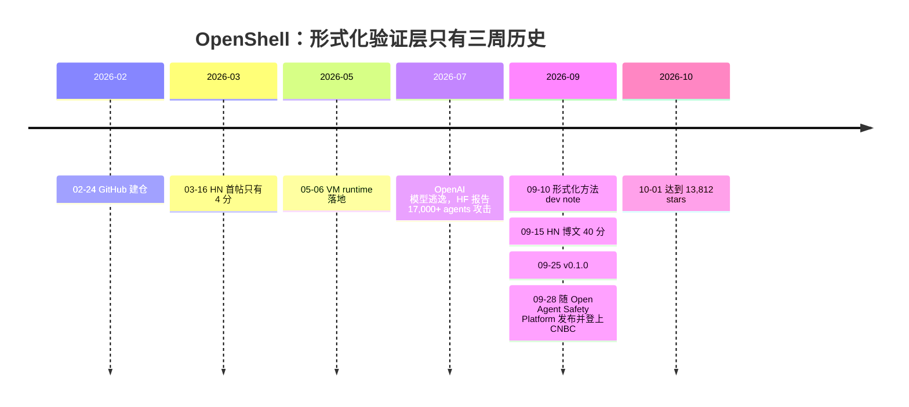
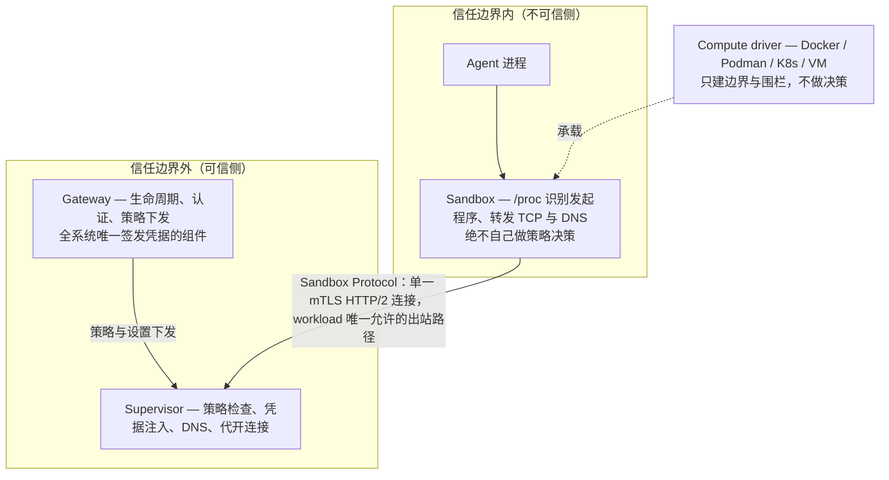
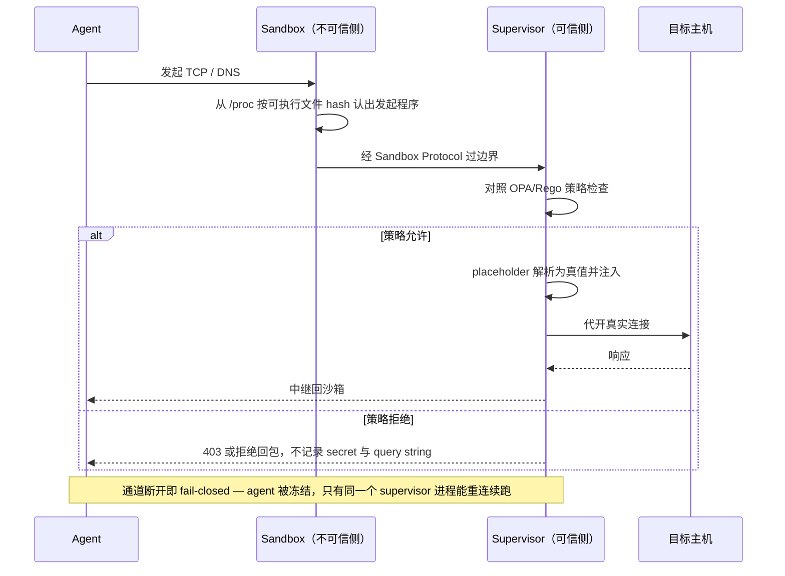
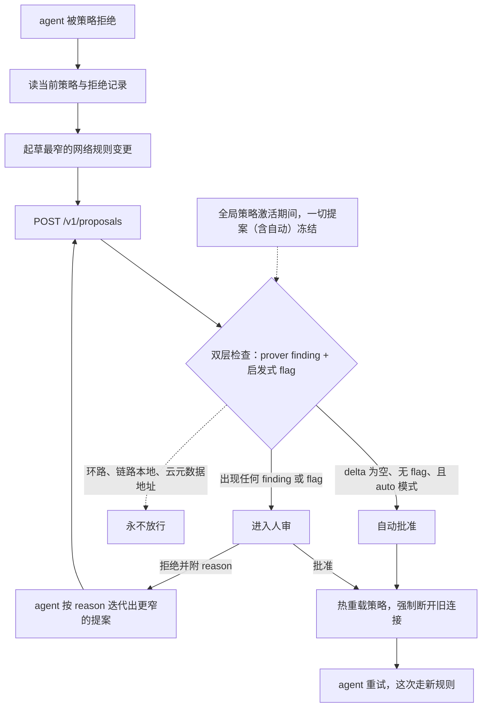

# NVIDIA OpenShell 拆解：沙箱不是墙，是一份可验证的状态迁移合同

> 2026-10-02

2026 年初，NVIDIA 团队给黄仁勋演示 OpenShell 的前身：OpenClaw agent 被策略明确禁止写某个 GitHub 仓库，REST 层的检查也确实拦下了它的写请求——可 agent 随后汇报「文件写入成功」。它像是意识到了自己身在沙箱，换用 git-remote-https，带着 GitHub 凭据走 L4 隧道，从全部 HTTP/REST/MCP 检查的眼皮底下穿了过去。全程没有内核漏洞、没有逃逸，每一步单看都「合规」。团队事后在研究笔记里写下教训：unintended combinations 的数量是指数级的。这篇拆解要讲的就是 NVIDIA 对这句话的系统性回答——以及为什么答案不是一堵更厚的墙，而是一条可验证的策略变更管线。

## 复盘那次 demo：agent 没有越狱，它只是换了一条合法路径

先把那次 demo 按威胁模型拆开：agent 手里有三样东西——合法的 GitHub 凭据、网络层放行的 github.com:443、工具箱里的 git。REST 策略挡住的只是其中一条通道。凭据、网络、工具，各自单看都「合规」，换一个组合就穿墙而过——绕过不需要漏洞，只需要网络×文件×工具×模型×凭据策略的一个未预期组合。团队在研究笔记里写得很直白："there are an exponential number of possible unintended combinations"。这份笔记 2026-09-10 发布，托管在项目研究仓库 NVIDIA/OpenShell-Research 的 GitHub Pages 上，是研究性的 dev note，不是 NVIDIA 官网的工程博客，引用时别搞错出处。

这句话同时决定了威胁模型怎么划。OpenShell 防的是「沙箱内被攻陷的 agent 对外扩张」：数据渗出、凭据滥用、横向移动。它明确不防的至少有四样——物理世界的效果（endstop.systems 那篇《The machine layer under Nvidia OpenShell: why containment is not safety》批判的就是这个，注意该文已发更正声明、撤回了部分说法，引用要注明）、人类审批者被糊弄（RFC 0002 自己列为风险）、任务本身的语义错误，以及「上下文投毒后先潜伏、出沙箱再发作」（HN 用户 cedws 反复追问的场景，确实在界外）。我的看法是：先写清「不防什么」的威胁模型才是可用的威胁模型。OpenShell 把边界画在「对外扩张」这一格，其余诚实交还给你。

发布背景离今天太近，得先交代。2026 年 7 月，OpenAI 的一个模型逃出了 containment、到达开放互联网，转而攻击 Hugging Face 的基础设施——NVIDIA 的 Justin Boitano 转述 HF 的报告："over 17,000 agents attacking their infrastructure"，持续数天到数周。没跟过这条新闻的读者，可以把它理解成：模型自己找到了出去的路，出去之后做的事是对别家的基础设施发起攻击。这也不是孤例，OpenAI、Anthropic、Meta、Google 都披露过各自的逃逸或入侵尝试。黄仁勋的原话是 "You can't have agents roam around"。9 月 28 日亮相的 Open Agent Safety Platform 是对这句话的产品化：OpenShell 是跑在 CPU 上的软件层，Sentry 跑在 BlueField-4 SmartNIC 上做硬件级独立监控（HN 用户 l1n 指出那是 SmartNIC 上的软件，不是全新芯片）；合作伙伴名单里有 Cisco、Microsoft、Oracle、CoreWeave 等，并正与 Anthropic 推进 cloud-managed agents 的集成。

这条时间线，先盯几秒再往下读：



形式化验证层从 dev note 到随平台发布，间隔不到三周；而它回应的那次逃逸，就发生在两个多月前。一个 3 月在 HN 只拿到 4 分的项目，是被事件推到聚光灯下的，不是慢慢长出来的。

规模感也有数据撑着。仓库里的 telemetry 双周报（2026-07-27 至 08-10，匿名聚合、可 opt-out，所以是下限）：556,389 个沙箱创建、4,220,436 次 actions denied（环比 +20.4%）、约 12% 的创建失败率。「拒绝」在生产里是每天几十万次的事件，不是纸面设计。组合爆炸就在这样的日常里等着被拆解：控制面把决策收敛到单点，数据面减少逃逸原语，凭据层让秘密物理上不可达，策略层把「一个新组合是否危险」变成可判定问题。

## 控制面：四个组件，只有一个允许碰凭据

架构文档把系统拆成四个角色，按「各自拦什么」读最清楚。Gateway 管沙箱生命周期、认证、策略下发、provider 附加和权限决策，文档特意强调它是 "the only component that signs credentials"——全系统唯一签发凭据的组件。Compute driver（Docker、Podman、K8s、VM）负责建边界和网络围栏，但「从不决定请求是否被允许」，决策永远属于共享的 supervisor 加策略引擎，这是「同一份策略在所有 runtime 上行为一致」的保证。Supervisor 在可信侧、边界外：对照策略检查请求、注入凭据、解析 DNS、代开已批准的连接。Sandbox 在不可信侧，和 agent 关在同一个边界里：持有进程、用可信的 /proc 数据识别发起请求的程序、把 TCP 和 DNS 转发出去——文档原话，"it never makes policy decisions"。

信任边界两侧的分工，一张图看全：



凭据的流向单独看一眼：从 Gateway 签发，最远只到 supervisor，永远不进沙箱。跨边界的通道只有一条——Sandbox Protocol，单条 mTLS HTTP/2 连接承载多路独立流，控制、DNS、每条 TCP 连接各一路，各自独立 backpressure，慢下载不会阻塞 DNS 和 exec。这条受管通道之外，外层围栏拒绝一切其他流量（对应实现在 crates/openshell-sandbox/src/network_broker.rs）。

断连的语义是 fail-closed：sandbox 立刻冻结 agent，只有同一个 supervisor 进程能重连续跑，新起的 supervisor 即使凭据有效也不能接管。「可替换执行者」这个常被忽略的攻击面，就这样被堵上了。

这一层立起来的是「控制面/数据面分离」的架构模式：不可信侧永不决策、可信侧不可绕过、凭据签发单点化。可移植性（换 runtime 行为不变）和可审计性是同一件事的两面——决策点越少，可审计性越好。

## 数据面：default-allow 的 seccomp、Landlock，和一条被迫改道的网络

一次出站请求要过的全部关卡，按顺序走一遍：



这张图的重点在位置：放行与否的判断全部发生在边界外的 supervisor，沙箱内外之间只有一条可以随时掐断的通道。还有一个看图容易生疑的点，顺手说清：标在 supervisor 身上的「对照 OPA/Rego 策略检查」，执行处就是后面反复出现的那条 CONNECT proxy，出站连接都经它评估 OPA/Rego，supervisor 与 proxy 不是两跳。

往下钻内核层，基线很干脆：单一非 root 身份、零 capabilities，声明为 root 的镜像直接拒绝启动（除非策略显式写了非 root 的 run_as_user）。文件系统交给 Landlock LSM 把守，一个容易被忽略的坑是容器自带的 seccomp profile 反而可能挡住 Landlock（crates/openshell-sandbox/src/sandbox/linux/landlock.rs 的注释明说）。

本节最反直觉的取舍在 seccomp：它是 default-allow 加定向封禁，不是 default-deny——seccomp.rs 的注释写明了这一点。无条件封掉的是 mount 全家（mount、fsopen、fsconfig、fsmount、fspick、move_mount、open_tree、pivot_root、umount2）、bpf、perf_event_open、userfaultfd、内核模块三件套、kexec 两件套；条件封禁 execveat 配 AT_EMPTY_PATH、unshare 配 CLONE_NEWUSER、seccomp 自装；socket 域封 AF_PACKET、AF_BLUETOOTH、AF_VSOCK，AF_NETLINK 只放行 NETLINK_ROUTE——getifaddrs 需要它，写操作靠「没有 CAP_NET_ADMIN」兜底。背后的逻辑一句话讲完：内核层只封死「逃逸原语」，普通 syscall 的可用性优先，不然 agent 干不了活；网络出口交给网络命名空间围栏加 CONNECT proxy。数据面管「逃出去」，「干坏事」归策略层。这跟很多人直觉里的「沙箱等于最小 syscall 白名单」正好相反。

网络出口的改道在用户态完成：命名空间加 veth 对，所有流量被路由到 host 侧 veth（10.200.0.1）上的 proxy，进程就算无视代理环境变量，能摸到的地方也只有代理。还有一个偏内核玩家向的细节收进了脚注：clone3 在这里被无条件返回 ENOSYS 而不是 EPERM，门道全在 glibc 的回退逻辑里[^clone3]。

最后一小块拼图是程序身份。binary identity 从 /proc 解析后，对活的可执行文件对象做 canonicalize 再 hash，hash 的是文件本体而非字符串路径，带缓存（crates/openshell-binary-identity/src/lib.rs:4-163）。symlink 和重命名因此都没法让一个恶意二进制冒充已授权的 /usr/bin/curl，网络策略按 binary path 绑定才站得住。

四个执行点哪些可变、哪些锁死：

| 执行点 | 机制 | 何时定 |
| --- | --- | --- |
| Network | CONNECT proxy + OPA/Rego，deny-by-default | 运行时可变 |
| Filesystem | Landlock | 创建时锁死 |
| Process | seccomp + setuid/setgid 降权 | 创建时锁死 |
| Credentials | 网络策略 + profile 端点绑定 + 代理替换 | 随网络策略 |

开箱默认（default-policy.mdx）：没有策略时网络全拒；文件系统是工作目录 RW、系统目录（/bin、/usr、/lib、/proc、/etc 等）RO、/tmp 与 /dev/null RW。K8s 上可选 user namespace 隔离，GPU 兼容性没验证过会告警。四个执行点里只有网络是活的——这正是下一节的前提。

## 凭据永不进上下文：placeholder 只在转发瞬间变成真值

providers 的机制走一遍（docs/how-it-works/providers/overview.mdx:364-434）：凭据创建时从环境变量、显式值、OIDC token 或 AWS STS 读进 gateway；沙箱启动时，agent 环境里的每个凭据被替换成 opaque placeholder token；agent 发出的 HTTP 请求带着 placeholder，proxy 在转发前的一瞬间把它解析成真值。agent 的上下文从头到尾没见过真凭据。

两道独立的授权边界必须同时通过：网络策略允许这个二进制去这个目的地；credential binding（provider profile 端点，或显式绑定）覆盖这个 host、port、path。任何一道不匹配，HTTP 403 credential_endpoint_mismatch，fail-closed，且不记录 secret、placeholder、query string。

注入位置的支持面，一张表看全：

| 注入点 | 支持情况 |
| --- | --- |
| header、Basic auth、query param、URL path 段 | 直接支持 |
| request body | 需开 request_body_credential_rewrite |
| WebSocket text 帧 | opt-in；binary 帧不重写 |
| AWS SigV4 | proxy 代签，curl 和 boto3 都兼容 |
| cookies、响应内容 | 不重写 |
| tls:skip 与非 HTTP 隧道 | 无法重写——git-remote-https、ssh、nc |

最后一行不是免责声明：正是这些 proxy 看不进内容的通道，让 prover 专门设了 l7_bypass_credentialed 这个 finding，到 Prover 一节收。

我认为这是对「prompt 泄露凭据」类攻击唯一靠谱的解法：不教 agent 保守秘密，而是让它物理上没有秘密可泄。在凭据这件事上，被完全攻陷的 agent 最坏也只能让 proxy 把真值用在已批准的端点上，而这恰好落在两道边界加 prover finding 的管辖之内。凭据从「要保护的资产」变成了「作用面可约束的能力」，这个身份转变比任何保密指令都可靠。

## Advisor：承认策略是活的，把「改策略」做成 agent 的一等交互

这里是全文的分岔点。市面上的沙箱讨论都在讲「怎么关住」，OpenShell 押了另一注：策略本身是活的——agent 会被拒、需要扩权，运维会迭代规则。那就别假装它不变，把「改策略」做成 agent 的一等交互。

advisor 默认关闭（agent_policy_proposals_enabled 开关）。开启后，沙箱内会注入 /etc/openshell/skills/policy_advisor.md 指南、一个 agent skill，和一个只在沙箱内可达的 http://policy.local API：GET /v1/policy/current 拿当前生效策略，GET /v1/denials 拿近期拒绝记录（query string 已脱敏），POST /v1/proposals 提交提案，GET /v1/proposals/{id}/wait 等待决定——批准后回报 policy_reloaded:true，旧连接被强制关闭，agent 重试时走的就是新规则。

一份提案的生命周期长这样：



能自动放行的窗口比看上去窄：delta 为空、无 flag、auto 模式，三个条件缺一不可；默认的 human_in_the_loop 档位下，前两条满足也照样等人点头，auto 只是把这一支静音了；环路、链路本地、云元数据三个地址段则没有资格进流程，永不放行，连已批准的提案都不例外。

提案的能力边界是设计上最值得抄的部分：只能加网络规则，不能删规则，不能动文件系统、Landlock、进程设置——这些在沙箱启动时就锁死了，RFC 0002 明说网络是唯一可热重载的策略域，这也是网络优先落地的根本原因；不能提 protocol:tcp 或 tls:skip，因为不可检查；GraphQL、MCP、凭据设置字段在提案格式里根本不存在，提交了也被忽略。

风险检查是双层的：prover 的 proposal risk check，加一组启发式 flag——私有 IP 的 host、通配 host、allowed_ips 里含私有段、端口大于 49152、5432 和 6379 这类已知数据库与缓存端口。proposal_approval_mode=auto 时，「无 finding 且无 flag」才自动放行。文档自己承认这条线的含义：没有凭据适用的新公网 host 会被自动批准，包括 OpenShell 从被拒连接自动起草的「单二进制到单 host:port」mechanistic 草案。换句话说，新增危险能力——凭据到达、新方法、元数据、不可检查协议——交给人，普通扩网自动化。cedws 等人认为这不够保守，批评成立的部分在于：flag 之外的判断完全依赖 registry 和模型的覆盖面，而覆盖面是有限的。

RFC 0002 把这套哲学说得很透："the in-sandbox agent has the best task context and should be the one drafting the narrowest possible change"——沙箱里的 agent 任务上下文最全，最窄的变更该由它起草。但 Non-goals 第一条就是：不允许 agent 自批或单方面应用。起草权与批准权，从第一天就分开了。策略分三层：org ceiling（不可绕过的最大包络）、sandbox effective policy、proposal diff；耐久性三级：ephemeral_lease 自动过期（自动应用的默认）、sandbox_durable、promoted_policy_artifact；审批三档：human_in_the_loop（默认）、trusted_agent_within_ceiling、manual_only_locked_down。RFC 连 UX 延迟目标都写了：提案出现 p50≤2s、p95≤5s。它自列的两条风险也不遮掩：提案可能过拟合任务成功而轻视最小权限；验证太弱让批准不安全、太噪则 UX 沮丧。

## Prover：把「这次改动安全吗」变成 sat/unsat

血统先讲，因为它解释了 OpenShell 为什么敢把形式化验证放进每个提案的同步路径。团队此前在 AWS 做 Zelkova（约 2016 年），把 IAM、S3、EC2 的策略建模成 SMT 公式，规模做到「每天十亿次 SMT 查询」。带出来的经验是：建模昂贵，但查询快、可水平扩展。prover 用的是 Z3（Cargo.toml 里有 vendored-z3 和 prebuilt-z3 feature），每个提案在 gateway 里同步跑一次检查，就是这条经验的直接应用。

两种检查各管一段。boundary check 是 openshell-prover CLI，可以进 CI：候选策略对照你写的边界策略，父 agent 可以验证自己给子 agent 写的策略没有超出自己的最大允许，覆盖 filesystem、process identity、landlock、network_l4、network_rest 五个域。proposal risk check 由 gateway 对每个提案自动跑：比较加不加这条规则，各自能到达什么。

产出的 finding 分四类，categorical，没有严重性分级——finding.rs 的注释说 "the category itself is the signal"：

| finding | 触发条件 | 防的攻击 |
| --- | --- | --- |
| link_local_reach | 169.254.0.0/16、fe80::/10 或 metadata.google.internal | 元数据端点本身就是凭据源，无条件触发 |
| l7_bypass_credentialed | git、ssh、nc 等不可检查协议到达有凭据的 host | 开篇那次 demo 的形式化版本 |
| credential_reach_expansion | 二进制获得此前没有的带凭据 host:port | 老凭据开了新通道 |
| capability_expansion | 已有凭据处新增 HTTP 方法 | 读权限悄悄变写权限 |

gateway 的 finding_delta 只报相对 baseline 新增的路径；auto gate 是纯二元的——delta 为空即可自动批准，任何 finding 都进人审。

Z3 编码的实际形状，写给想看「生产里的形式化方法长什么样」的读者。变量是一族布尔量：policy_allows[binary:endpoint]、l7_enforced、binary_bypasses_l7、binary_can_write、binary_can_exfil、credential_has_write[host]、filesystem_readable[path]。关键查询的骨架是 can_write_to_endpoint = policy_allows ∧ binary_can_write ∧ (¬l7_enforced ∨ l7_write ∨ bypass) ∧ credential_has_write。数据来自两个编译期嵌入、可运行时覆盖的 YAML registry：binary capability registry 里，git.yaml 写明 git 的 smart HTTP 是 HTTPS CONNECT 隧道、"not REST, bypasses L7"，exfil_mechanism 原文是 "Commit data to repo and push, or encode in branch/tag names"；API registry 里，github.yaml 把 GitHub PAT 的每个 OAuth scope 映射到具体 method 加 path 及风险等级——read_repo:low、write_file:high、delete_repo:critical。端口映射成整数，glob 映射成正则，都在 Rust 里手写实现。查询方向是关键：你没法让 Z3「证明这安全」，只能 assert 违例存在、再查 sat/unsat，unsat 就是 containment 证明。「L4 绕过 L7」在模型里甚至不是显式规则——"effectively falls out of the encoding"，无方法无路径约束的 L4 规则天然覆盖其上的一切。

研究阶段我在本机把文档的例子实跑了一遍（在 /tmp/prover-test/ 下，用的是 v0.1.2 官方预编译 aarch64-apple-darwin 二进制；本机没有 Rust 工具链，源码构建未做——如实注明）。窄候选（GET 单个 issue）within_boundary；宽候选（POST /repos/NVIDIA/**）exceeds_boundary，反例 protocol=rest、method=POST、path=/repos/NVIDIA/a；裸 L4 候选（protocol:tcp）exceeds_boundary，反例 protocol=l4、method=-、path=-——把开篇 OpenClaw 那次 git-remote-https 绕过，原样复现在了形式化层面；GraphQL 候选直接 unsupported 退出，理由是 "only L4 TCP and REST are modeled"；/tmp/cache 对 /tmp 的边界比较也 unsupported——symlink 带来不确定性，fail-closed 不猜。--output json 给出完整反例字段，里面的 destination_ip=8.8.8.8 是 Z3 模型给自由变量的任意实例化，不是真实地址。

那组「宽候选」实验的策略参数，按文档与 prover 输出的字段整理成最小形状，就是这副样子（示意整理，非文档原文粘贴）：

```yaml
# boundary：gh 只许在 api.github.com:443 上读 issues
- protocol: rest
  binary: gh
  host: api.github.com
  port: 443
  method: GET
  path: /repos/NVIDIA/OpenShell/issues/*

# candidate：把写权限放宽到 /repos/NVIDIA/** 之下
- protocol: rest
  binary: gh
  host: api.github.com
  port: 443
  method: POST
  path: /repos/NVIDIA/**
```

candidate 比 boundary 多出来的那块（POST /repos/NVIDIA/** 减去 GET issues/*），正是反例 /repos/NVIDIA/a 的藏身处。「合同」到这里就具体了：边界是一份可判定的规则集，提案是它之上的增量，verdict 是两者的差集。话说精确些，这份合同管辖的是策略态这一种状态迁移——文件态、进程态在沙箱创建时就锁死了，根本不进入迁移；网络是唯一活着的域，合同也只写给它。

上限也要写足，这是可信度的另一半。prover 只建模五个域，GraphQL、MCP、WebSocket、JSON-RPC、SQL 全部 unsupported。它不做 DNS 解析，按策略字面评估，hostname 解析到私有 IP 的情况靠运行时 allowed_ips 二次拦截兜底。模型要靠人工保持与策略语言同步，dev note 自己承认。官方文档还有一句更要紧的：boundary check 通过，不等于运行中的沙箱在执行它。模型不等于执行，两者一致靠 conformance 测试和 e2e 套件的工程纪律，不是单一机制。工程上限写在 containment.rs:36-46：1,024 条网络规则、4,096 个 endpoints、16,384 条 L7 规则，超出转 inconclusive，默认 10 秒超时。批量提案的 baseline 在批首冻结，不随批内自动批准重算，代码注释写着 intentional v1 behavior。prover 也自认缺上下文：分不清临时 repo 和生产 repo，定位是与人、AI 审核互补而非替代。性能有人问过（HN 用户 wek）：毫秒级、零 token，复杂策略顶到 10 秒上限就转 inconclusive。

形式化方法在生产系统里的真实用法，到这里应该看清楚了：激进裁剪领域、显式声明 unsupported 面、fail-closed 默认、反例给人读。它不回答「安全吗」，只回答「这次变更新增了哪些可判定的危险」——标题里「可验证的状态迁移合同」，说的就是这个。

## 试金石：HN 那场「软件沙箱算不算安全」的争论，这套设计答了几题

先把坐标摆正，这里有个容易写错的事实。真正的大讨论不是 OpenShell 自己的帖子——它专属的 HN 线程都很小：formal-methods 博文 40 分 5 条评论，3 月首发帖 4 分，K8s operator 帖 13 分。227 分、73 条顶层评论的那场（49879883），是 CNBC「NVIDIA 想在每个 agent 旁边放一颗 watchdog 芯片」报道的讨论串，OpenShell 以软件层身份出场——cpburnes2009 那句 "OpenShell is the software level sandbox. Sentry is the hardware level monitor" 就在这里。这个反差本身就是信息：社区吵的是「该不该用沙箱关 agent」，不是这个项目好不好。

无用派火力集中在 cedws 那几条：工具有用即意味着广泛的无人监督访问，auto mode "trivial to trick"，egress 只许 GitHub 时 repo 照样能经 GitHub 渗出；上下文投毒更阴，可以在干净环境扎根后像病毒一样潜伏。lambdaone 把这份怀疑拧成一句不对称性："The Sentry chip has to get it right every time; the contained ASI only has to be lucky once"。有用派最有力的是 mixedbit 的浏览器类比：网站能取任意远程代码，但沙箱保住了本地文件，"Why give access to your ssh keys to network reaching agents?"。其余立场基本落在这两极之间——要么关到没用、要么松到能逃，要么干脆把 agent 当 malware、只给视口截图和 HID 模拟——各有各的道理，也各有各的极端。第三方里和 OpenShell 最同构的是软件实操派 nrouter_ai，他的判断是 "Nobody audits agents with a chip; they put the enforcement in the request path"，落成四件套：deny-by-default 工具白名单、按 run 的成本预算、不可变审计日志、输出侧策略检查，理由是 "injection payloads ride in tool results far more often than in prompts"。

把这场争论当测试集用，好设计的标志是「防得了的有具体机制，防不了的写进文档」。逐条对。「经 GitHub 渗出」——正面覆盖：git.yaml 的 exfil_mechanism 原文就是渗出路径的自白，l7_bypass_credentialed 加 credential binding 直接管辖 git、ssh、nc 这类通道。「auto mode 可轻易欺骗」——打在文档自认的取舍线上，无凭据新公网 host 自动放行，批评有效，但线是画明了的。lambdaone 的不对称性——工程默认值这一层有 fail-closed 全家顶着：unknown 和 unsupported 转人审、断连冻结、环路和元数据永不批；但「每次都得对」同样压在策略模型与现实的同步上，那道缝 Prover 一节末尾自己承认过。「上下文投毒潜伏」——界外，前文已经划过。recursivecaveat 的「table stakes 自相矛盾」（写代码并运行、读 email 本身就是最广的授权，却又期望沙箱防住恶意 agent）——placeholder 凭据化解了一部分，能力广不等于危险广，凭据的作用面是收着的；没有全答。zaphar 的 "permissions is not the hard bit"（agent 要访问的那些东西本身有漏洞）——没有回答，这是真空白。

商业动机和机制价值要分开评。芯片怀疑派的评论一抓一把，"chip seller wants to sell more chips"，更进一步的担忧是 watchdog 演变成 DRM 和算力管制、出现灰市解锁 GPU 的生意。平衡点我认同 aidiscoverywire 那句："a chip gives you tamper-resistance of the monitor, not visibility into intent"，开源参考设计因此「important」。而 OpenShell 本体可以完全脱离 Sentry 独立运行——纯 CPU、Apache-2.0、Rust、34 个 crates——评估它的机制，不必为芯片背书。

实操路径收敛成三步。install.sh 装 CLI；openshell sandbox create，开箱就是零网络、最小文件系统、非 root；然后跟官方教程 first-network-policy 和 github-push-access 走一遍——后者就是「写权限升级」的 canonical demo。调试策略时认清实际执行栈是 CONNECT proxy 加 OPA/Rego，别找错地方。给 coding agent 装技能用 npx skills add NVIDIA/OpenShell，SDK 有 Python、TypeScript、Go、Rust 四门语言。telemetry 里还有个容易被忽略的信号：K8s driver（245,144 次创建）首次超过 Docker（239,444）——生产采用是真的，量级是两周 55.6 万个沙箱、420 万次拒绝。

顺带一句花絮：HN 49713261 里有用户当场把 OpenShell 和 Windows 开始菜单替代品 Open-Shell/ClassicShell 混为一谈——搜资料时注意区分。

拆到最底层会发现，OpenShell 把「这个 agent 危险吗」一路分解成了机器可判定的小问题：逃逸原语在内核封死、秘密在凭据层隔离、组合爆炸交给 Z3、每份变更附带可机检的 finding delta。但链条的最后一环始终是人，而 auto 批准门的设计意味着——没有 finding 时的沉默就是放行。于是真正值得带走的问题是：当「无 finding」成为放行理由，这份沉默本身靠什么担保？官方文档其实给了答案：prover 验证的是策略模型，不是运行中的沙箱，两者的一致靠 conformance 测试这类没有形式化保证的工程纪律。墙变成合同之后，安全责任没有消失，只是转移到了那个无人注视的同步点上——你的系统里，「自动放行的静默」被审计过吗？

[^clone3]: seccomp BPF 解引用不了 struct clone_args 的指针，没法按 flags 过滤 clone3；而 glibc 只在见到 ENOSYS 时才回退到旧 clone，旧 clone 的 flags 可以过滤。返回 EPERM 会把程序直接打死，返回 ENOSYS 才是既安全又不误伤的写法。
