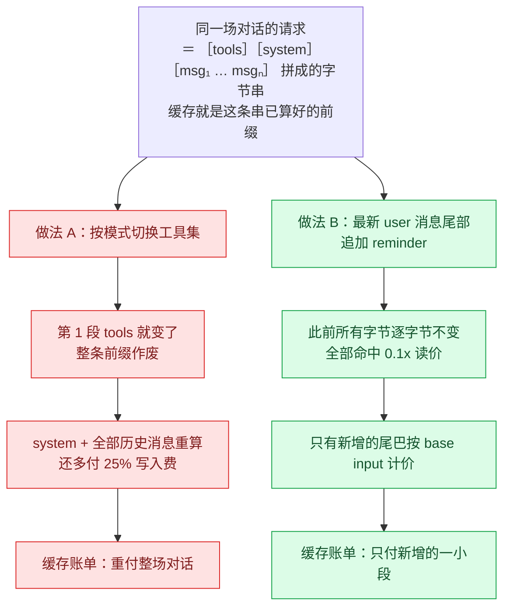
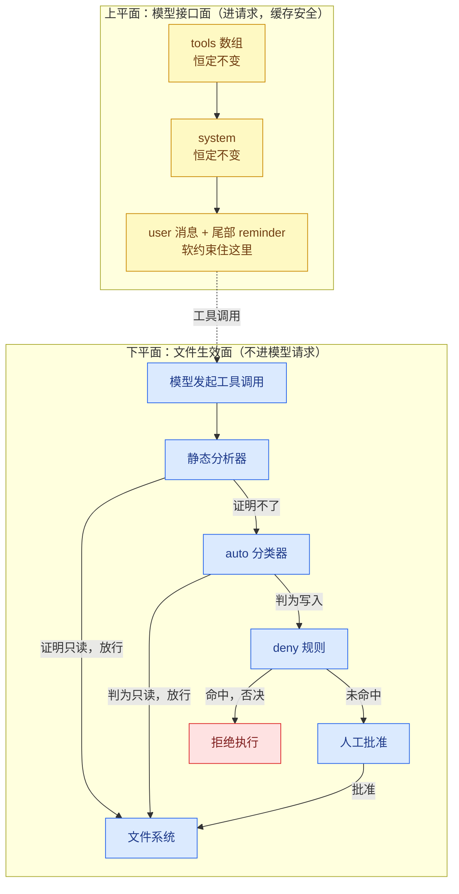
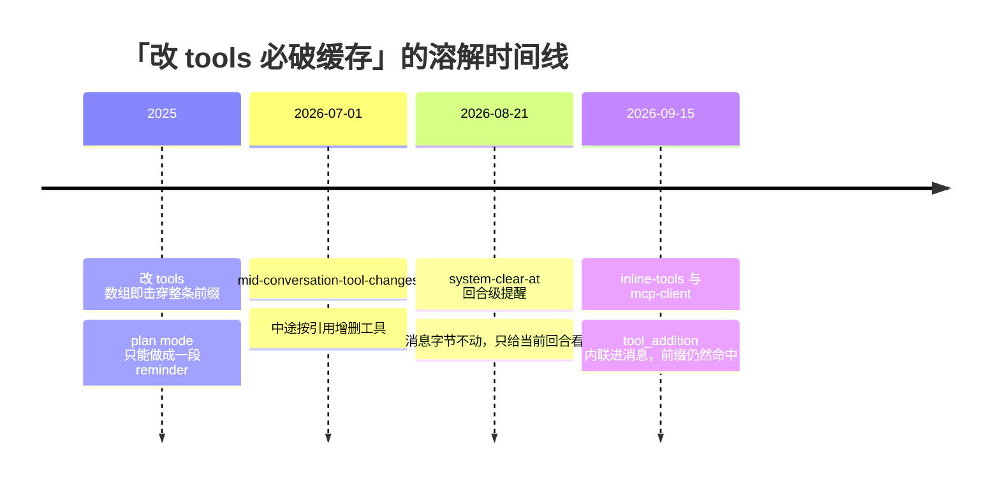

# 你的 agent 没有「模式」：plan mode 的真身与行为约束的缓存经济学

> 2026-09-26

2026-09-25 22:43 UTC，HN 帖「[Plan mode is dead](https://news.ycombinator.com/item?id=49840054)」上线约 19 小时后，一个 id 叫 bcherny 的人顶帖自曝——他是 Claude Code 负责人 Boris Cherny，plan mode 的作者。这个功能诞生于「many months ago 的一个周日深夜」，起因说出来有点好笑：他烦透了每个新会话都要先口头嘱咐 Claude「先规划再动手」，于是干脆把这句嘱咐自动化了。

然后是那句引爆评论区的话：

> plan mode has always been a prompt — it has never changed the toolset because doing so would break the prompt cache, and so would be expensive for users.

翻译过来：你以为的「模式切换」，实际是往每条用户消息末尾贴的一段提醒文字；而它不碰工具集的原因不是偷懒，是一笔缓存经济账。（写稿当日实测：该帖 234 分、212 条评论，还在涨。）

这篇文章想把两件事一次讲透。明面上，plan mode 的机制到底是什么，「劝」与「拦」怎么分工；暗地里，算一算这笔账——行为约束到底允许放进哪一层，其实是 API 的定价结构决定的。

## 前缀即账本：改一个工具，重付整场对话

要掂出 bcherny 那句话的分量，得先看 [prompt caching](https://platform.claude.com/docs/en/build-with-claude/prompt-caching) 的工作方式。发给模型的请求不是一整块，而是按固定顺序逐层构建的：先 tools，再 system，最后 messages。缓存，就是这条已经算好的前缀。官方文档把失效规则写得很死：「Changes at each level invalidate that level and all subsequent levels」——改了 tools 数组，等于 system 和全部历史消息一起作废。

命中条件苛刻到字节级：「Cache hits require 100% identical prompt segments」，序列化层面「any divergence halts the search」，遇到第一个不一致的字节，匹配就地停止；TTL 分 5 分钟和 1 小时两档，每次命中都会刷新计时器。另一篇 [mid-conversation 文档](https://platform.claude.com/docs/en/build-with-claude/mid-conversation-system-messages)把因果讲得更直白：「The tools array sits even earlier in the hashed request prefix than the top-level system field, so editing it invalidates the prompt cache for the entire conversation.」bcherny 那句『would break the prompt cache』的官方出处就在这里。

然后是价格。缓存写入比基价贵 25%（5 分钟档），1 小时档直接 2 倍；缓存读只要 0.1 倍。放到具体模型上，Opus 5.5 基价 $4/$20 per Mtok，缓存读 $0.20/Mtok——读缓存比重新当输入算便宜 20 倍。速度同样是官方 GA 公告实测的：10 万 token 的上下文，首 token 延迟从 11.5 秒降到 2.4 秒，成本降 90%。外加一个隐藏杠杆：缓存命中不计入 rate limit。

把这些规则拼起来，可以做一次纸面推演。把请求想象成三段拼成的字节串：［tools 序列化］［system 序列化］［msg₁ … msgₙ］，缓存就是这条串已经算好的前缀。现在你要给自己的 agent 实现一个「规划模式」，有两条路可走，画成图是这样的：

一眼就能看出取舍：做法 A 给了硬保证，但每切换一次就重付整场对话；做法 B 几乎免费，但只是「劝」。bcherny 那个周日深夜选 B，不是品味问题，是算术问题。

这套字节级匹配还有个容易踩的坑。官方文档专门提醒：重建历史消息时，「a fresh token count, a timestamp, a re-worded instruction」都算改动，缓存从该点开始 miss；而且在 Fable 5.1 和 Opus 5.5 上，编辑早期消息还会连带废掉其后所有 thinking 块。你以为只是「重新组织了一下措辞」，账单上是一场静默的重算。

所以我的判断是：在 coding agent 里，缓存不是优化项，是经济基础。Claude Code 自己 `/cost` 的一次会话输出长这样：claude-sonnet-4-6，1.2k input，5.3k output，940.0k cache read，50.0k cache write（见 [costs 文档](https://code.claude.com/docs/en/costs.md)），整场会话 94 万 token 走的是缓存读，真正的裸输入只有 1.2k。命中率掉十个百分点，成本结构就变形。理解了这一点，「plan mode 为什么只是一段提示词」就不再神秘：在一个九成 token 都押在缓存命中上的系统里，任何会击穿前缀的设计，都是在跟自己的账单作对。

## plan mode 的真身：一层在劝，一层在拦，工具数组纹丝不动

先把「劝」的那层拆开。bcherny 原话：「all plan mode does is add a little reminder to every user message」。这段 reminder 长什么样？2025 年 12 月的版本（Armin [Ronacher](https://lucumr.pocoo.org/2025/12/17/what-is-plan-mode) 和 mihaileric 两个独立来源互证过）开头是：「Plan mode is active. The user indicated that they do not want you to execute yet — you MUST NOT make any edits … run any non-readonly tools … This supercedes any other instructions you have received.」往下还有一整套流程编排：先派最多 3 个并行的 Explore 子代理理解请求，再做设计、向用户提问，把最终计划写进 plan file，全程唯一允许写的文件，每个回合只应该终于 AskUserQuestion 或 ExitPlanMode 两个工具之一。

时效得标注清楚：tweakcc 项目的追踪显示，2.1.81 到 2.1.88 之间提示文件已经改名为 …-iterative.md，当前生产版的提醒词是「迭代式」变体，最新原文我没有取到。但 bcherny 2026-09-25 的自述是对现状的权威概括：它的本质仍然是「每条 user 消息加一段提醒」。

真正给保证的是第二层，住在 harness（包裹模型的那层执行器）里。Claude Code [权限文档](https://code.claude.com/docs/en/permission-modes)写得很清楚：plan mode 下「edits stay blocked until you approve the plan」，计划批准之前，编辑被拦在工具调用落地的地方。模式表里 plan 的定义是「Reads, plus classifier-approved commands when auto mode is available」。Bash 命令走双保险：先过静态分析器，静态分析器证明不了只读的，再交给 auto-mode 分类器判断（changelog v2.1.218）。deny 规则在所有模式下生效，「including bypassPermissions」。官方自己也说得很克制：「Auto mode reduces permission prompts but does not guarantee safety.」

这里有个极易被误读成「翻车」的表面矛盾，必须拆干净。bcherny 说 plan mode「从不限制任何工具」，官方文档说 plan mode「edits stay blocked」——两句都真。前者说的是发给模型的 tools 数组，也就是接口面：模型从头到尾看得见所有工具，所以它知道可以试探、可以读代码、可以跑只读命令，同时也知道自己被嘱咐了别动手。后者说的是工具调用落地时的 harness 拦截，也就是生效面：模型真的去调 Edit，这一层把它拦下来。两层各住一个平面：

劝说的住在上平面：进模型请求、碰缓存，但没有保证。拦截的住在下平面：不进模型请求、有保证，但不碰缓存。留意下平面的形状：只读命令在静态分析器或分类器那里就被放行，写操作才走到人工批准，deny 规则是一票否决的终点而不是通道。两层互不干扰，也互不担保。把「给模型的接口面」和「对文件系统的生效面」分开看，评论区那些「看吧，官方自相矛盾」的抓包就都不成立了。

软约束没保证，那硬的那层呢？翻 changelog 会发现权限层自己也有失效史：v2.1.212 修了「plan mode 自动执行 touch、rm 这类改文件的 Bash 命令而不弹权限提示」；v2.1.136 修了「存在匹配的 Edit(...) allow 规则时 plan mode 不拦写文件」；v2.1.199 修了浏览器状态变更工具不询问。换句话说，「有保证」的那层自己也击穿过三次。保证强度取决于最弱一层——这个安全领域的朴素原则，在这里同样成立。

反方向的证据同样有力：Anthropic 把「tools 块不许中途变」当成正经 bug 一个一个修。v2.1.267 修了后台 worker 中途往会话工具块里加 EnterWorktree 导致 prompt-cache 复用被破坏，MCP 和插件工具改成 deferred definitions 发送；v2.1.281 修了 MCP server 断连重连丢缓存；v2.1.280 修了切换模型导致缓存 miss。bcherny 当年「贴字符串」的选择，有整部工程史背书。

所以，你的 agent 没有「模式」。所谓 plan mode，是「提示层追加的一段话」与「权限层的一组规则」的组合物，模型看到的接口自始至终没变过。常驻到什么程度？连 ExitPlanMode 这样的模式专属工具也不随模式进出数组，按 Ronacher 的机制侧写，进出 plan mode 本身就是模型可调用的工具，等价于你按 shift+tab；变的只是 reminder 的措辞，和 harness 的放行策略。这场「该不该死」的争吵谁也没说服谁，两边的话都值得听一句：顶层热评 tcdent 说如今「you can just conversationally instruct the agent to not make changes」，靠工具选择来强制的年代已经过去了；theholygrail 站在另一头，动 auth、支付、共享 schema 之前仍要先把计划写下来，理由是「The mode was never really about making the model smarter. It was about making the human stop and look」。两边拥护和抛弃的，其实是同一段 reminder 加同一组权限规则。吵「死没死」吵错了对象，该问的是这两层各自兜什么、兜到什么程度。

## 三层设计空间：谁给保证、谁付缓存

把视角再拉高一层。当一个 coding agent 的经济基础是缓存复用时，「行为约束」的实现方式其实有三档可选，而缓存经济学把它们的排序重新洗过了牌：

| 约束机制 | 保证强度 | 对 prompt cache | 上下文成本 | 对探索能力 | 代表实现 |
|---|---|---|---|---|---|
| 提示级软约束 | 无，靠模型自觉 | 零伤害，append-only | 每条消息多一段 reminder | 不受限 | plan mode 的 reminder |
| 工具集过滤 | 有，模型根本看不见该工具 | 击穿整条前缀，每切换重付全场 | 无额外文本 | 探索期致盲 | Gemini CLI 式工具过滤 |
| 独立权限/沙箱层 | 有，落地前拦截 | 零伤害，不进模型请求 | 无 | 不受限 | Claude Code 权限层 + Bash 沙箱 |

表格往下读有一行是关键：三层里只有最底下那层能「保证与缓存兼得」：它不进模型请求，所以既给出保证又不碰前缀。这也解释了 Claude Code 的组合解为什么长那样：工具全保留（保住探索），分类器放行只读命令（v2.1.218 的双保险），权限层在工具调用落地处兜底。把权限层放在工具过滤之外，不是随意排布，是三层里唯一两头都占的位置。

工具集过滤的代价不是理论推演。原帖里有位 Gemini CLI 用户 biimugan 的抱怨很具体：「the harness can't run commands, even exploratory ones … it can't experiment and is either blind or relying on its training data」——连跑一行 Python 验证一下 SVG 坐标都做不到，模型只能靠训练数据里的记忆猜，猜错了也没法用现实检验。保证换来了探索期的盲人摸象。

但也别把中间层一棍子打死。另一位用户 digitaltrees 的自建 harness 就用工具过滤限制写盘范围，「so it can't go rogue and write documents outside of a specific folder」，小规模、自控的场景下，工具过滤依然可行。这是取舍，不是对错。

更有意思的是，这个矛盾正在被 API 本身溶解。2026 年的 beta 时间线：7 月 1 日，mid-conversation-tool-changes 上线，可以中途按引用增删工具；8 月 21 日，mid-conversation-system-clear-at 支持回合级系统提醒：官方文档举的 harness 场景「nudges the model after each batch of tool results」，就是 plan-mode reminder 的原型，只是这次消息数组字节不动、渲染时只给当前回合看；9 月 15 日，inline-tools 让 tool_addition 按值内联进消息，官方原句是「The cached prefix still matches」，同一天 mcp-client 支持中途挂载 MCP server。再配合 defer_loading，可以在 tools 里预声明超过一万个延迟工具：「The tools array itself never changes, so the cached prefix stays intact」。官方甚至出了个实战页 Build an orchestration mode，把三者拼成「standing orchestration mode without invalidating the prompt cache」（这个页面我抓取时通道不稳，细节以现取为准）。

换句话说，bcherny 当年受的是 2025 年 API 的约束，不是什么永恒的设计真理。设计空间正被 API 演化逐月重新打开——今天自建 harness 的人已经可以三层全要。Claude Code 什么时候迁移到这些新原语上，是观察它架构演进最好的风向标。

## 实操：实测你的缓存命中率，把「模式」设计成 append-only

讲完机制，给当天就能跑的东西。

先量命中率。messages.create 的返回里有三个关键字段：cache_read_input_tokens（缓存读）、cache_creation_input_tokens（缓存写）、input_tokens（最后一个断点之后的未缓存部分）。命中率 = cache_read ÷ (cache_read + cache_creation + input)。官方还给了个快速判定：两个缓存字段同时为 0，就是完全没缓存上。

miss 了别瞎猜，问 API。[缓存诊断](https://platform.claude.com/docs/en/build-with-claude/cache-diagnostics)是个 beta 功能：带上 beta header，在请求里传 diagnostics.previous_message_id 填上一条响应的 id，API 会对比两次请求，直接告诉你分歧出在哪一层：model、system、tools 还是 message history。官方有句金句把分工说得很清楚：「diagnostics answers 'did my request change?' while usage.cache_read_input_tokens answers 'did the cache hit?'」他们做这个功能的原因也很真实：「A reordered tool, a timestamp interpolated into your system prompt, or an edit to an earlier message can silently invalidate the cache」，静默失效，唯一信号是命中率掉零，你根本不知道自己改了什么。诊断只报告最早的分歧点，报告里带的是请求指纹（哈希），不泄漏内容。

如果你用的是 Claude Code，观测已经内置。`/usage` 会给你一行真实输出：「Prompt cache (main): 14 requests · 91% of input tokens from cache · 2 misses (last 6m 10s ago, 310.2k tokens re-cached)」；它的 miss 判定标准是重算超过本可读缓存部分的 5% 且不少于 2,000 tokens；`/cost` 在 v2.1.260 之后甚至会标注「likely cause: tool definitions changed」。还有个很多人不知道的现实：缓存 TTL 在订阅下是一小时，走 API key 或 credits 只有五分钟。走 API key 的话，挂机十分钟回来第一枪必 miss，这不是 bug，是定价。

如果你自己在写 harness，把「模式」设计成 append-only，五条可以直接搬走：

1. 首请求把全量 tools 和 system 定死，永不改：官方最佳实践「Place static content first」。
2. 模式开关走消息通道：mid-conversation system message，配合 defer_loading 预声明，增删工具用 tool_addition / tool_removal，不碰 tools 数组。
3. 每回合的提醒用 clear_at: "next_user_message"：留在消息数组里、渲染时只给当前回合看，字节稳定也不堆积。
4. 历史消息重发必须逐字节原样：不重算 token 数、不插时间戳、不改写措辞。
5. 权限判定留在 harness 的工具调用处（canUseTool 回调、PreToolUse hooks、deny 规则），绝不进模型请求。权限层管「能做什么」，缓存层管「重算多少」，两层由此分工。

另有个尾延迟技巧：正式请求前先发一次 max_tokens: 0 的预热请求，把缓存 miss 的重算延迟挪到用户感知之外。首 token 延迟 11.5 秒和 2.4 秒的差距，人是能感觉出来的。

三字段公式、诊断 API、五条清单，当天就能在自己 agent 上跑一遍，量出自己的缓存账。

## 约束的下一个住址：从拦住模型，到改变呈现面

回到那个帖子。bcherny 没有停在「plan mode 是一段提示词」这个自曝上，他讲了自己现在怎么做：规划已经变成 interactive and iterative 的事，他让 Claude 生成 artifact、画 diagram、甚至做交互式 demo 来解释变更和备选方案，再挂到 PR 上——「so others can understand and future Claudes have the context」。这个转向的形状值得琢磨：约束不再是「不许动手」，而是把模型的产出变成可审阅的解释物。拦的方式，从限制模型能做什么，挪到了改变你看见什么。

巧的是，[原博客](https://www.aymannadeem.com/artificial/intelligence,/developer/tools/2026/09/24/plan-mode-is-dead.html)作者从另一头走到了同一个结论。Ayman Nadeem，前 GitHub 工程师、Nuanced 创始人，自述造过一个以计划为中心的产品并失败。她的反思原话值得抄下来：「I think the biggest mistake I made was turning the plan into an artifact instead of designing a process for improved human understanding」。还有句更短的：「Planning != Plan」。她提的新循环是 understand → act → inspect → clarify → adjust → act again（HN 读者当场指出这就是 OODA loop），她在回帖里也说「an interactive, iterative workflow is closer to how people actually build understanding」。一个做产品失败过的创业者，和一个做了 plan mode 的工程负责人，在「交互式迭代优于一次性文档」上独立收敛。

顺带一个历史注脚（二手，X 帖转述）：plan mode 的退化早有迹可循：「clear context and implement」被藏进了 showClearContextOnPlanAccept 开关，Boris 给的理由是「with 1m context window, most users don't need it anymore」。至于 plan mode 本身，bcherny 在帖子里说得很清楚：「plan mode isn't going away」，顶多把 shift+tab 的默认键位重映射掉。

当然，原帖的核心质疑，「模型根本不遵守约束」，并没有被这次自曝解决。akersten 说得实在：plan mode 让他在模型浪费一大段时间去实现之前，先看到它准备做的决定；deprave 的例子更具体：用 Fable 5.1 写 Go 的 TLS 函数，模型仍自作主张要求私钥文件参数、调 tls.LoadX509KeyPair，而不是用 crypto.Signer 接口去兼容 HSM 和 KMS。bcherny 的回应只到「Are you using Opus 5.5/Fable 5.1?」，没给数据；有人当场提出该做 A/B 实验，「we're all guessing unless we have data」，同样没人接。分歧真实存在，至今没有被数据裁决，我不打算替任何一方宣布胜利。

但我愿意给一个观察框架：软约束的失效率，恰恰是这套设计的代价面，而不是它的否定。Claude Code 把最弱的一层（提示）放在前面劝，把真正兜底的一层（权限）放在后面拦，而权限层自己也修过 v2.1.212 / 136 / 199 三个击穿 bug：「模型不遵守约束」的批评者和「权限层会兜底」的维护者，其实都在给同一套分层设计记代价账。约束没有消失，只是换了住址。

## 回到那个周日深夜

Boris Cherny 没有做架构决策，他只是贴了一段字符串——因为那晚唯一不破坏缓存的选择就是贴字符串。这件事值得记住的形状是：你看到的每个产品按钮，都是底层基础设施定价结构的投影。「模式」退化成一段提示词，不只是模型变强，而是缓存经济学从第一天起就规定了约束允许放进哪一层、谁为它付钱。

所以下一次某个 agent 给你亮出「安全模式」「只读开关」「规划模式」时，别先问它有没有用，先问三个问题：它住在哪一层——提示、工具集，还是 harness 权限？它破不破缓存，破了谁付钱？最弱的一层由谁兜底？

plan mode 之死不是一次产品失误的曝光，而是一张分层设计的 X 光片：约束的保证强度永远等于最弱一层的强度，而缓存，在决定哪一层必须最弱。
