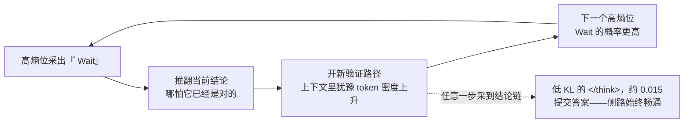
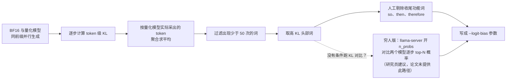
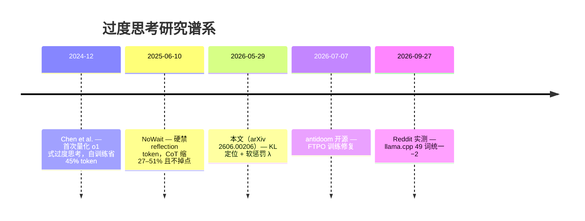

# 量化杀死的是刹车，不是引擎：推理模型的过度思考与一行 --logit-bias 的修复

> 2026-09-29

一道题：最大的 8 位无符号整数是多少？答案 255。DeepSeek-R1-Distill-Qwen-1.5B 的 BF16 版用约 5.2K 个 token 算完、提交、收工；把同一组权重压成 3-bit AWQ 再问一遍——它在解题中途已经白纸黑字写下 "Answer: 255"，紧接着却来一句 "Wait, maybe 11111111 is 8 bits, so 2^8 means 256... no, it's 255."，然后是 "But what if the phrasing means 2^9-1?"、"Hmm, let me reconsider."——连 2^8=256 都重新怀疑了一遍，推翻、重算、再怀疑，一路游荡到约 23.4K 个 token，直到上下文窗口见底。它没算错，答案早就在纸上，它只是停不下来。

这是 Meta FAIR 论文《Quantized Reasoning Models Think They Need to Think Longer, but They Do Not》（arXiv 2606.00206）的核心案例，点题句直白：量化推理模型不是败于不会思考，而是败于停不下思考。大众直觉是量化 → 精度损失 → 算错题；论文在 MATH-500 上的实测恰恰相反：3-bit AWQ 的 265 个错误里，139 个（52%）属于「中途已算对却没输出」。量化杀死的不是引擎，是刹车——而读到机制层你会发现，这个比喻还得再修正一次：刹车踏板甚至没坏。

## 噪声不撒雨，打狙击：误差为何恰好落在 wait 上

先看「误差」是怎么被测出来的。论文 §4.3 让 BF16 和 3-bit AWQ 在 MATH-500 上以完全相同的生成前缀并行解码，逐步算 token 级的 KL(p_t‖q_t)，再把每个位置的 KL 归到量化模型在该位置实际采出的那个 token 头上，对出现至少 50 次的 token 求平均。后文所有结论都踩在这套「同前缀对比」上——你看到的是同一条路上两次驾驶的分岔，而不是两场不同的考试。

第一个数字就够扎眼：位置级 KL 与 BF16 next-token 熵的 Spearman 相关 ρ=0.92。量化扰动最大的位置，恰好是模型本来就不确定的位置。误差不是均匀撒下的雨，是沿着犹豫地图逐点落位的狙击。

为什么会这样？论文 §6 借了 Yayla & Kumar（2026）的 logit margin 论证：top-1 与 top-2 的 logit 差大时，权重扰动几乎翻不动采样；差小时，中等噪声就足以改写输出。推理模型的 CoT 里这两类位置泾渭分明——饱和区是数学 token，领先幅度大，噪声推不动；决策区是「该下结论还是该 Wait」的岔路口，结论 token 与「 Wait」的 logit 本就贴着，谁来推一把都可能改变方向。同一个路口两条命运：饱和区里噪声连边都摸不到，决策区里同样大的噪声直接改道。落到数据上是三条硬证据：overthinking 标记在高熵位（按模型熵分布 80 分位阈值，沿用 NoWait 的设定）进入 top-20 预测的频率是低熵位的 2–4 倍；高 KL 犹豫词与低 KL 数学词的单位 CoT 密度比，从 BF16 的 0.57 翻转为 3-bit AWQ 的 1.15；最高 KL 的 20 个词清一色是 Wait、But、Alternatively、if、maybe、verify、think，最低 KL 的 20 个词清一色是数学与格式 token。

附录 C Table 10 的低 KL 50 词清单里还躺着一个细节：`</think>`、`<EOS>`、boxed、sqrt、frac 和一堆数字都在其中——「停止思考」这个动作本身在量化下几乎不受影响，刹车没坏。作者博客给了量级：最低 KL 约 0.015，最高约 1.30，差 100 倍。所以精确的说法是：刹车踏板完好，被噪声砸坏的是开到踏板之前的每一个岔路决策。

论文自己也留了余地，§6 原话说这套 logit margin 论证只为「一个特定失败模式提供直觉，不是 PTQ 所有退化的完整因果解释」。但这已经足够推翻大众直觉：把量化误差当成均匀噪声，就会预期「到处错一点」；实测它是非均匀的、专门砸在采样最敏感的决策点上。死的不是计算能力，是收敛能力——不是引擎，是开向刹车的导航。

## 一个 Wait 的雪崩：从 5.2K 到 23.4K 的采样动力学

52% 这个数需要拆开看。MATH-500 上 1.5B 模型的 3-bit AWQ 错了 265 题，其中 139 题归入 overthinking。错误分成四类——overthinking、逻辑、算术、格式/幻觉——先人工标注子集，再用 GPT-5 当 judge 扩展到全量，judge 与人工一致性超过 95%，judge prompt 就附在附录 D。「中途已对却没输出」是个有操作定义、可复核的类别，不是修辞。

放大倍数更说明问题。BF16 的 72 个错误里 19 个（26%）是 overthinking；AWQ 3-bit 下这个数变成 139，绝对数 7.3 倍。GPTQ 3-bit 是 19→39，FlatQuant W4A4KV4 是 19→64——退化越狠，这类错误越多。

全景数据指向同一个方向。实验覆盖 R1-Distill 系列加 QwQ-32B 共 5 个模型、3 种量化方法、5 个基准；单看 MATH-500 上的 1.5B：BF16 85.6% 准确率、5.2K token，AWQ W3 掉到 47.0%、CoT 涨到 23.4K，正好 4.5 倍，LiveCodeBench 的准确率更是从 17.5% 跌到 4.5%。而同样吃 AWQ W3 的 14B 模型平均只掉 4.0 分——规模是缓冲垫。把 28 个模型-量化组合摆在一起，「准确率退化」与「CoT 变长」的 Spearman ρ=−0.73：掉分最狠的档恰是想得最长的档，overthinking 是量化共性问题，不是某一家量化方法的怪癖。

一个 Wait 是怎么滚成 23.4K 的？antidoom 项目（Liquid AI，2026 年 7 月开源，后面还会出场）的 README 独立给出了同款解释，可以当直觉补充：其一，Wait/But/Alternatively 这类词在重度合成推理训练后被过度强化，模型一不确定，它们就主导 next-token 分布，却不推进任何推理；其二，上下文是自强化的，序列里一旦出现这些词，重复概率逐轮爬向 1；其三，低温采样没有自然逃逸路径。三力合力，一个 Wait 把 5.2K 滚成 23.4K：

图里那条虚线值得多看一眼：通往提交的侧路一直畅通，`</think>` 的 KL 低到几乎不受量化影响，只是主循环一次次把车导离出口。我的判断由此而来：过度思考不是模型的「性格」，是采样动力学——岔路 token 一旦被采出，就进入自强化轨道。这个视角也预告了修复为什么可以便宜到只在岔路口轻推一下，完全不用动权重。

## 50 个词、一行参数：惩罚的数学与 llama.cpp 实操

论文的修复（§5）简单到不像一篇论文的方法：解码每一步，对 50 个 overthinking 标记的 logit 减一个固定值，z′(v)=z(v)−λ（v∈S），无条件施加，零额外前向开销，唯一超参就是 λ，从 0.5 扫到 4.0。所有 λ 都把 CoT 砍 12–23%，准确率维持或提升——λ 高度鲁棒，基本拧不坏。

效果数字（Table 1）：1.5B AWQ W3 平均分 29.0→35.2（+6.2），CoT 从 28.0K 降到 21.6K（−23%）；其中 MATH-500 从 47.0 拉到 61.2，一口气 +14.2 分；overthinking 错误 139→58（−58%），总错误 265→194。FlatQuant W4A4KV4 的 overthinking 错误 64→34。BF16 也能省 5.6–10% 的 CoT。GSM8K（1319 题）复现同一模式：AWQ 3-bit 的 overthinking 错误 197→128（−35%），准确率反涨 6.1。开头那道 255 的题，加惩罚后在约 12.9K token 处止住——作者博客放出的轨迹里，犹豫词被一个个剪在半截（Wait, maybe ✂、But what if ✂），模型随即提交。

但方法不是重点，词表才是灵魂。同为 50 个词，四份清单的消融（§5.2）结果天差地别：

| 词表 | 结果 |
| --- | --- |
| overthinking 标记 | 最优 Pareto：CoT 缩短，准确率不降反升 |
| 高 KL 词 | 低 λ 有效，高 λ 掉分——混进了 _So、_Then、_Therefore 这类收尾必需词 |
| 随机 50 词 | 无效，天然的安慰剂对照 |
| 低 KL 数学词 | 灾难：CoT +41%，准确率 −9.5% |

反过来给 overthinking 词做 λ=−3.0 的 boost，CoT +395%、准确率 −31%。双向可控，说明这组 token 因果地控制着推理长度。这组消融也回答了「凭什么是这几个词」：不是拍脑袋禁词，是 KL 分析定位出来的岔路词——而选错词表，比不修还糟。

50 词清单的来历顺带澄清一个讹传：选词看的是「高 KL 位置高频采样的 token」，选出来的结果与 Zhao et al.（2025）的犹豫 token 清单一致；全部是带前导空格的形（_wait、_Wait、_Hmm……），so 因为帮助收尾被刻意排除。论文摘要点名的三个词是 wait、but、alternatively；Reddit 标题里流传的 wait/maybe/perhaps，只是以讹传讹的代表选取。

想给自己的模型找词表，论文 §4.3 就是现成的挖掘路径：

整个流程里唯一没有算法答案的一步是人工剔除：KL 不会告诉你 _So 正在帮模型收尾，得自己读轨迹判断。

到了 llama.cpp 这边，一行参数落地。CLI 是 `-l TOKEN_ID(+/-)BIAS`（common/arg.cpp:2242-2263），应用层就是纯加法：`cur_p->data[token].logit += bias`（src/llama-sampler.cpp:3902-3932），没有任何范围限制——OpenAI API 那套 −100..100 的约定在这里不适用。它在采样链上的位置在 grammar 之后、温度与 penalties 之前；`--ignore-eos` 的内部实现就是给 EOS 打 −inf，可见「硬禁一个词」本就是 logit bias 的官方用法。不想查 token ID 的话，llama-server 的逐请求 JSON 支持字符串形式 `"logit_bias": [["Wait",-2.0]]`，自动展开成该字符串对应的全部 token（tools/server/README.md:577）——跨 tokenizer 迁移时的首选写法。

λ 填多少，有一步换算要心里有数（这是基于论文公式与 llama.cpp 代码顺序的推导，论文没直接给）：bias 作用在温度缩放之前，p∝exp((z−λ)/T)，概率乘数是 exp(−λ/T)。T=0.6（论文与 Qwen 的默认）时 λ=2 的乘数约 0.036，即约 28 倍压制——同一个 λ 在低温下远比 T=1 严酷。社区 OP 给 49 个词统一上 −2，作为粗调是合理的。

工程坑三条。其一，重复传 `--logit-bias` 会打 DEPRECATED 警告，但对 vector 型参数实际全部生效（common/arg.cpp:807-830 那句警告文案是误导，逐行读码可证）。其二，逗号连写 `37201-2,13428-2` 会被 stof 截断、静默丢掉后半截——这一条我把 arg.cpp 的解析段原样抽出来编译实测过，输入 `37201-2,13428-2` 只产出 {37201, −2} 一条，不报任何错；要么重复传 flag（无视警告），要么走 server API。其三，vLLM 开投机解码时 logit_bias 直接 400 拒绝（issue #42744，2026 年 5 月开到现在）。

token ID 另有一层坑：它是 tokenizer 特定的。社区证据互相矛盾——有人说那组 ID 在 27B 上「似乎有效」；有人用 tokenizer 逐个查，27B 的 wait=11158、Wait=13784，两个都不在那 49 个 ID 里；还有人报告必须补上无前导空格与大小写变体才见效。HF 在调研环境不可达，没能独立验证。跨模型之前，先用 llama-tokenize 核对一遍，别抄作业。

## 惩罚的反面：63% 的犹豫在干正事

论文 Table 1 里有几行不那么体面的数字：Qwen-7B GPTQ W4 掉 1.4，14B GPTQ W4 掉 0.2，14B FlatQuant W4A4KV4 掉 0.2，Llama-8B AWQ W3 的 MATH 从 80.4 掉到 77.6。CoT 仍在缩短、Pareto 仍占优，但准确率不是免费的。

更大的边界证据来自社区。eightone-81 拿 2.2M token 的真实 agent 思考日志做了再分析：85 个编码/重构/调试/运维会话、6851 个 thinking block，模型是 Qwen3.8-Flash-Next W4A16，vLLM 加投机解码。结论：只有 Hmm、wait、actually（含大小写与行首变体）值得罚，上限也只省 1.6–7% 的 thinking token，约合全部生成的 1–4%。

为什么数学词表在 agent 场景失灵，日志里写得明明白白。论文那 50 个词是为数学定制的，but、or、still、could、error、whether 在工具调用与代码里多是普通语法——' or' 一个词就出现约 2600 次；清单只收了前导空格形，约 25% 的 Wait/Hmm 是行首变体，全部漏网；而最贵的浪费，也就是真循环，恰恰用清单外的词绕圈，flat per-token 惩罚根本打不中。

更根本的一层：犹豫本身有价值。这份日志里 63% 的真实犹豫有用，29% 抓到了真 bug。「浪费率」连测量都困难——双 judge 分歧巨大，Qwen3.6-35B 判 37% 是浪费，模型自评只认 8%，两个 judge 一致的仅 12%，诚实区间只能写成 12–37%。

社区实操的共识方向大致收敛成：agent 场景只罚那 3 个词、λ 压到 0.5–1、只在 thinking block 内生效、从第 N 次犹豫之后才开罚。已经有人给 vLLM 打 patch 只罚 think block，拿到 18–30% 的 thinking 缩减；也有人在 27B 上试 bias=3，结论是「深插冰锥」，编码任务明显受伤。

任务结构决定适配度，我把它整理成一张表：

| 任务域 | 回溯的真实价值 | 惩罚建议 |
| --- | --- | --- |
| 数学、可验证推理 | 低——答案能在中途出现、能验证 | 最适配，λ 可以到 2 以上 |
| 一次性代码生成 | 中 | 小 λ，限制在 think block 内 |
| agent 编码、调试 | 高——回溯常在抓 bug | 只罚 Hmm/wait/actually，λ≤1，第 N 次犹豫后再罚 |
| 开放域、长程规划 | 未知，论文未测 | 没数据，别拍脑袋上硬惩罚 |

还有一个社区提出、完全没人研究的开放问题：压制自我怀疑 token，会不会顺带压制安全迟疑？Express_Quail_1493 观察到 abliterated（去审查）模型天然少 wait 循环，怀疑一部分「过度思考」其实是模型在反复确认「我该不该这么做」；一句玩笑把这个担忧钉死了——「But wait, maybe I shouldn't actually launch the warhead」。我把它作为开放问题放在这里，不给结论。

所以「CoT 缩短 12–23% 且准确率不降」是有条件的，条件是任务的正确答案真能在中途出现。把这个条件讲清楚，比推销一行参数重要。

## BF16 也涨分：量化是放大器，不是病根

如果 overthinking 只是量化弄出来的病，惩罚不该对 BF16 起作用。它起了：CoT 省 5.6–10%，而且 BF16 的 72 个错误里本来就有 19 个（26%）是 overthinking。§7 原话说得直白：Quantization amplifies a failure mode already present in reasoning models。过度思考是 RL 训练留下的原生缺陷，量化是放大器，不是病原体。论文还自认这套 KL 诊断不限于量化——剪枝、蒸馏、低秩近似，大概率同样砸在高熵位。

把这个发现放进谱系看，位置就很清楚。往前有 Chen et al.（2024）首次量化 o1 式过度思考、用自训练省 45% token，Hassid et al.（2025）发现模型本就偏好短链，NoWait（2025 年 6 月）硬禁 reflection token 拿下 27–51% 的 CoT 缩减；往后有 antidoom 的训练修复和 Reddit 上的真机实测：

软惩罚是对 NoWait 硬禁词的直接升级：不硬禁，只在岔路口把「往回走」这个方向调贵一点。

社区实测把论文推到了真机上。2026 年 9 月底，有人拿 bartowski/Qwen3.5-4B-GGUF 在 MATH-500 随机抽 50 题上做对照，对 49 个 token ID 统一 −2（论文 50 词清单少一个 recheck，正好 49 个）：

| 量化档 | 准确率 | reasoning tokens |
| --- | --- | --- |
| BF16 | 74% → 84% | −19.4% |
| Q8_0 | 76% → 80% | −11.0% |
| Q4_K_M | 60% → 66% | −14.8% |
| Q3_K_M | 52% → 66% | −17.5% |
| Q2_K | 12% → 24% | −11.5% |

顺带纠个讹传：流传甚广的「Q4_K_M 74→83」「IQ4_XS 68→77」「GSM8K 普涨」都与原帖不符——原帖没有 IQ4_XS 这一行，没测 GSM8K，Q4_K_M 的基线是 60。这篇文章以原帖数据为准。

证据等级也得诚实标。n=50、单模型，样本噪声 ±7%——无惩罚时 Q8_0 的 76 比 BF16 的 74 还高，这就是噪声量级；好处是复算门槛低到租一块 5090 花约一美元跑一小时。论文才是统计支撑（500 题全基准、5 模型 5 基准），但用的是 DeepSeek-R1-Distill 系列，社区指出这是较旧的模型，Qwen3.8 已大幅优化 thinking 行为，结论未必迁移到 frontier。

最尖锐的质疑是：涨 10–14 点，是变强还是基准偏好短答案？评论区一句刻薄的讽刺说，这绕了一圈回到「让模型更莽地猜、测试分数反而涨」。论文手里的反驳是：收益主要来自 overthinking 错误 139→58 的转化——中途已经对了、这次终于肯提交——且最狠的 λ 下平均准确率仍不降。但论文没测非数学场景（自己认了的开放问题），基准偏好无法完全排除。Liquid AI 员工另给了一个「可解析性」解释：压制 doom looping 让更多回答跑完、产生可解析的答案——涨分可能部分来自可解析，而非变强。两个解释未分胜负，我摆在一起。

还有个对照组提醒我们短 CoT 的收益不止一条路径：有人实测 27B 生成 Snake 游戏，普通 prompt 用 24164 token，加个 quickly 只省下 600 来个，加一句「otherwise a baby will die」直接砍到 11780。但论文的消融恰好构成这组对照的反面——随机词无效、低 KL 词是灾难、boost 反向恶化。logit 惩罚不是随便什么催促都等价，它精确打击被量化噪声放大的那组 token，这是它与提示词暴力的本质区别。

我的定位：logit 惩罚是对推理模型「自我怀疑回路增益」的推理时调谐。增益是 RL 训练拧上去的，量化又拧大了一格，惩罚只是往回拧。往回拧多少，论文给了数学域的答案，其他域仍是空白。

## 把机制换成决策：量化选型与干预梯度

机制讲完，可以换成一张决策表了：

| 轴 | 结论 |
| --- | --- |
| 精度档 | W8A8KV8 最稳，常打平 BF16；4-bit weight-only 轻伤；3-bit 与 W4A4KV4 是 overthinking 放大区，也是惩罚收益最大区（AWQ W3 +6.2 分）——惩罚可当 Q3/Q4 档的免费补偿器；Q2_K 惩罚后 12→24 仍不可用，惩罚救不了极端量化 |
| 方法与规模 | 同为 3-bit，GPTQ（MATH 71.6%）显著稳于 AWQ（47.0%）；模型越大越抗，14B 只掉 4 分。小模型加狠量化是重灾区 |
| 任务敏感度 | LiveCodeBench 对量化最敏感（1.5B 从 17.5% 掉到 4.5%）；AIME/GPQA 是惩罚边际收益最大的场（AIME 7B BF16 45.6→52.2） |

干预手段存在一条从轻到重的梯度。什么都不做——W8 档往往就够了；然后是 logit 惩罚——Q3/Q4 档加可验证任务时的最优解；再是 llama.cpp 原生的 `--reasoning-budget N` 硬预算——−1 无限、0 立即停、N 给定预算，另有 `--reasoning-budget-message` 在预算耗尽时注入一句提示。硬截断治标于末端，软惩罚治因于岔路，两个现成工具正好构成一组对照。再往重走是训练修复，antidoom 的 FTPO LoRA 是代表；社区三派一句话带过——微调派说「烤进权重不可能更差」，惩罚派说「编辑权重必然扭曲，只动采样才是正道」，而第三种声音来自实践：惩罚再狠也压不住 27B 的循环，最终重训了模型。梯度尽头是换更大的模型。

生态位也在成形：late-cli（434 星）内置默认的 overthinking 词表惩罚，OpenCode 有插件注入 chat.param，甚至把词表写进 system prompt 也有缓解。推理时干预正在变成 harness 的标配件。

这张表把前四层机制压成了三个轴：量化档位 × 任务域 × 干预强度。先定位自己在哪个格子，再决定拧不拧那颗旋钮——而不是把一行参数当银弹。

文章收在一个对称性上。RL 训练用奖励把「犹豫」焊进权重——wait/but/alternatively 是被奖励出来的行为；推理时惩罚则按步付费把它买回来，λ 就是这笔账的汇率，量化噪声只是把汇率调到离谱。顺着这个对称性往下想，会碰到一个没人测过的问题：eightone-81 的日志里 29% 的犹豫抓到真 bug、63% 在做有用的事；Express_Quail_1493 观察到 abliterated 模型天然少 wait 循环——如果一部分「过度思考」其实是模型在反复检查「我该不该这么做」，那我们调低自我怀疑的增益时，调掉的可能是 bug，也可能是那个「等等，也许我不该发射弹头」的瞬间。我们有一堆基准量模型想得多不多，却没有一个基准量它怀疑得对不对。这篇文章讲的是一半答案：不该犹豫时犹豫会失败；至于该犹豫时不犹豫会怎样——在你把那 50 个词的 logit 压下去之前，这个问题值得先想一想。
