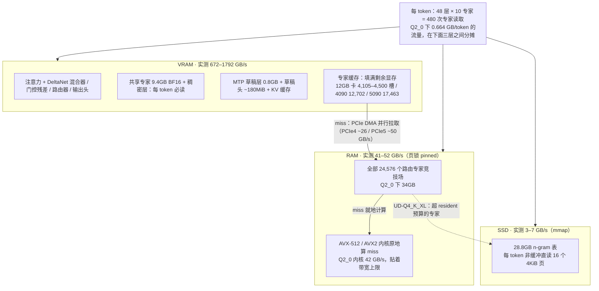
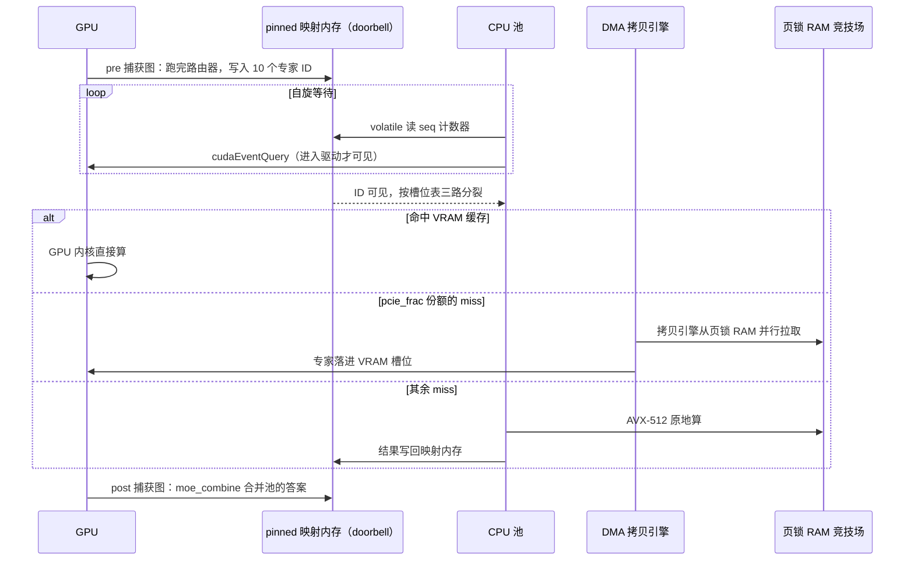
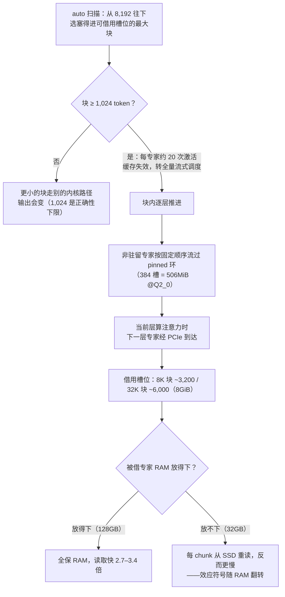

# 一张 RTX 4090 的带宽账本：Strata 如何把 125B MoE 写成一个缓存调度问题

> 2026-10-06

Strata 是 2026 年 9 月底开源的推理引擎，而且整个引擎只为一个模型而写：Qwen3.8-Flash-Next，125B 参数的稀疏 MoE。它要干的事说出来不复杂——把一个量化后仍有 66GB 的模型塞进一张 24GB 显存的消费级显卡，剩下的重量摊给内存和 SSD。做到的程度也不含糊：RTX 4090 上，几十万 token 的提示词以每秒三千出头的速度读入，512K 上下文的深处解码还稳在 122 t/s。仓库在 github.com/Niko1221/Strata，这些数字的原始记录都在它的 bench/results/ 目录里。

它的核心头文件 `expert_cache.hpp` 开头 22 行不是代码，是一道除法题：663.6 MB/token ÷ ~40GB/s = 16.2ms，落在一个 ~53ms 的 token 上。下一行不给退路——流水线只能藏掉 1.055ms/19.035ms，残差链严格串行，约 95% 的 CPU 时间裸露在外。结论就写在注释里：缓存不是优化，是唯一出路（include/strata/core/expert_cache.hpp:1-22）。

一个推理引擎拿除法题当开场白，说明作者动手前把问题翻过面来看了一遍：模型大到任何一层存储都装不下时，你要解决的不是"怎么算得快"，是"怎么搬得少"。这篇文章就把这道除法题当入口，反推 Strata 的全部设计——为什么最热的几千个专家要驻 VRAM、全部 24,576 个专家要页锁进 RAM、28.8GB 查找表敢留在 SSD 上，每一步都是这笔带宽账的一个解。有件事先交代：下文引用的系统实测多数在一块 RTX 5070 上做的，那是论文作者的实验机；4090 是这本账的目的地，第六节的决策表会把每一笔换算回去。

## 先算账：三层存储的容量与带宽

除法题的分子分母都值得拆开。分子 663.6 MB 是每个 token 需要的专家权重流量：48 层 × 每层激活 10 个路由专家 × 单专家字节数。单个专家是 2560×640×3 = 4,915,200 个权重，Q2_0 量化下每个权重 2.25 bit，单专家 1,382,400 字节——这个数在源码 pool.hpp:49 里就是 blob 大小，乘上每 token 的 480 次激活，恰好等于论文 Table 1 的 0.66 GB/token，账本在论文和代码之间精确闭环（这篇九页的论文随仓库发布，docs/paper/Strata-Paper.pdf，下文的 Table 和 Finding 都出自它）。换档位只是换分子：IQ2_XS 0.69、IQ3_XXS 0.84-0.90、IQ3_S 0.98 GB/token。

分母要用实测值，别用规格值，算这类账最容易翻车就在这。论文 Figure 1 在 RTX 5070 + 64GB DDR5-5200 上量出来：VRAM 672GB/s（等于规格，这层不骗人）；系统内存读 41-52GB/s，DDR5-5200 双通道理论 83.2GB/s，实测落在五成到六成出头；PCIe 4.0 的 DMA 拷贝 ~26GB/s。换平台这套数就变：5090 的 PCIe 5 实测 50GB/s，MI50 的 PCIe 3 只有 13.8GB/s。

三层各住什么，一张图说清：

带宽差三个数量级，分层的原则因此直白得近乎粗暴：每 token 必读的东西全部塞进 VRAM——混合器、门控、路由器、共享专家、输出头、草稿层、KV，剩下的空间全部拿去填专家缓存；RAM 页锁全部 24,576 个专家，CPU 用 AVX-512 内核原地算 miss；SSD 上只放 n-gram 表。还有个换算后文反复要用：每多 1GB VRAM ≈ 多驻 ~700 个 Q2_0 专家，等于这部分流量免掉 CPU 一趟。

模型本身一段话带过：Qwen3.8-Flash-Next，125B 总参 / A6B 激活，原生 262K 上下文，51B 参数的 N-gram 表加 4B 的 MTP 层（架构深拆见我另一篇）。本文只需要这几组数字：48 层 × 512 专家/层 = 24,576，每 token 每层激活 10 个，稠密层 3.5GB 加共享专家 9.4GB BF16，每 token 必读但都住在 VRAM。前两组定义了 RAM/SSD 层要承担的 0.66-0.98 GB/token 流量，最后一组保证这部分纯读显存、不进账本分母。

卸载推理的第一性约束是带宽，不是算力。这笔账算死之后，后面每一节都是它的一个解：缓存改写它，投机解码摊薄它，量化档位改它的参数，分块借它的容量。

## 把调度写成页面问题：命中率如何买回带宽

把除法的分子砍小，靠的是路由倾斜。把专家按路由频率排序，质量随秩的 -1.2 次幂衰减，这个幂律对 sweep 命中率的拟合误差小于 1%。翻译过来：71% 的专家按数量就能捕获 98% 以上的路由事件。这和 CPU cache 遇到的访问局部性、OS 页面调度遇到的地址空间局部性是同一件事——少数页面承载多数访问。"热专家驻 VRAM、全量进内存"的类页面调度，敢做的前提只有这一个。

命中率买回多少带宽，一条公式可以复算：每 token 时间 ≈ 0.664GB × (1−命中率) ÷ ~40GB/s + GPU 时间。命中率 0.5 时 CPU 项约 8.3ms；0.95 时约 0.8ms。命中率从一半提到九五，等效于系统内存带宽翻了十倍，你一根内存条都没动。实测锚点也齐：12GB 卡 4,105-4,500 个槽位，静态 profile 命中率 0.50（论文留出集）到 0.6447（头文件十折留一，差异来自 profile 版本与语料）；自适应换入拉到 0.72，比静态高出 22 个百分点；4090 的 12,702 槽（按数量 52%）到 94-99%；5090 的 17,463 槽（71%）到 97.8-99.7%。

容量怎么分，比容量有多少更重要。仓库里一场编号 R4.2g 的修复战例把这个教训钉死了：早期按全局到达序填充缓存（共享一个 next_free_ 计数器），前 n_slots 个槽位全被前 26 层的专家占满，256 槽实测命中率 2.97%（1781/60000）。而离线评分说，每层只给 8 个槽就值 21.4%，给 64 个就值 70.4%。修复是分层配额：每层拥有自己的槽位区间 [l·q,(l+1)·q)（expert_cache.hpp:145-165）。一句话总结这场修复：缓存从来不缺容量，它把全部容量给了两三层。

静态 profile 之外，策略还在对话内学习：每 4 轮在 GPU 跑草稿的空档，换入最多 96 个当前对话最常路由的缺失专家，逐出立即生效、新拷贝落地后才承认，实测 91.7→94.4 t/s，消掉了 130-200MB 的下一轮拷贝等待。配套工作流是 --dump-routing 导出迹线、tools/make_profile.py 排序、--expert-cache auto 按序填充。Coder 那次映射验证很能说明问题：2,537 个槽位命中 72%，换错误索引的对照组只剩 21%，正好等于槽位份额，索引错一个数字，缓存就退化成随机。

调度真正跑起来，是每层两张捕获图加一次三路分裂：

图里每个 miss 都要在三层之间流动一次，而每层之所以需要 pre/post 两张图，是因为 moe_combine 等池的答案、池等路由器的输出、专家 ID 要运行时才知道，整层塞不进一张捕获图。

为什么是三路，而不是"逐层分组一把算完"？头文件里一个数字堵死了那条路：h_layer = 0.0456，只有 4.6% 的 (layer,token) 对能让全部 10 个专家同时驻留 VRAM（expert_cache.hpp:11-17）。三路分裂是结构性必需，不是优化。

doorbell 那段踩坑史值得单独讲。GPU 每层跑完路由器，把 10 个专家 ID 写进 pinned 映射内存，CPU 自旋 volatile 读加 cudaEventQuery。团队做了三轮实验才发现：把轮询节流到 1/64 会破坏可见性，加 __threadfence_system 也没用——设备对映射 pinned 内存的写，只有在 host 进入驱动时才可见。同步原语的语义在异构内存上，比手册写的窄。

三路之间的份额又是一道带宽账。Q2_0 的 AVX-512 VNNI 内核跑 42GB/s，几乎贴着内存并发的 41GB/s，CPU 带宽受限，DMA 引擎挤的就是 CPU 的带宽，所以默认份额只有 0.20。i-quant 档位反过来：码本解码是表查找加符号处理，每核 ~5GB/s、六核 23-26GB/s，算力远低于带宽，内存有富余，于是 55% 的 miss 走 DMA（IQ2_XS 70→78 t/s、IQ3_XXS 56→65，+10-16%）。份额还按实测链路带宽自适应，base×min(1,gbps/20)；早期版本这个台阶不连续，链路带宽从 19.9 测到 20.0 GB/s，份额就从 0.42 跳到 0.55，后来才抹平。这条线第四节会回来：换量化档位，改写的是"CPU 受限的是什么"这个前提。

有一处设计上的悬置要诚实交代：ExpertCache 类内刻意不放 LRU/LFU，理由写在注释里——"占位策略会设定一切下游据此设计的命中率"，换入被推到更高层去做。理论上每轮换入可能更优，最优换入频率是否该随命中率曲线的斜率自适应，仓库没有答案。

这一节回答的是"为什么敢把 24,576 个专家当页面调度"：幂律倾斜给了免费的命中率，但容量必须按层公平分配、策略必须在对话内学习，而"CPU 是带宽受限还是算力受限"这一行账，直接决定 DMA 份额。

## 投机解码的反转：摊薄的是传输，不是算力

全 VRAM 部署的引擎做投机解码，收益 2.5-3x，省的是算力：草稿便宜，验证批量。Strata 实测 1.6-1.8x（朴素 47-57 t/s → 82-92 t/s@4K）。数字不稀奇，稀奇的是收益的性质整个变了。

拆开验证窗口的钱袋子。GPU 每 token 要读 3.5GB 稠密权重，这一项要 14.6ms，是窗口里的大头。投机解码的妙处在于这 3.5GB 一次读进窗口，后面 3-4 个 token 的边际成本极低——传输被摊薄了。但草稿 token 不白来：每个草稿 token 路由到自己的 CPU 专家，共享有限，所以窗口成本形状是 kShape = {1.0, 1.35, 1.7, 2.05, 2.45...}，每多一个草稿 token，CPU 专家流量加 35%（全 miss 走 CPU 时）。收益因此两头封死：上不去，因为草稿各自新增专家流量；下不来，因为稠密权重读取被摊薄。

论文 Table 5 把这笔账落到了毫秒（5070，4K 上下文，≤4 token 窗口）：Q2_0 一个窗口 34.3ms = GPU 14.6 + CPU 专家 13.4 + 草稿 2.0 + 其他 4.3，窗口均摊 3.23 个 token，94.2 t/s——自己动手复算 1000/34.3×3.23 = 94.2，对得上。IQ2_XS 的 CPU 项 21.1ms，比带宽下限 11.5ms 高出近一倍，算力受限的信号再次出现。这份分解还说明引擎双侧平衡，没有单一组件升级能让速度翻倍。另一个依赖：上下文越长接受率越低，窗口均摊在 2.4-3.2 个 token 之间下滑（Q2_0 从 1K 的 2.71 掉到 262K 的 2.46），长上下文下投机收益递减。

草稿器是模型自带的 MTP 层，GGUF 文件里没有，Strata 直接从 BF16 checkpoint 拉那 5GB 张量，0.8GB 驻 VRAM。50% 置信阈值在源码里就一行：for(j=1;j<max_steps&&pj>=0.5;++j)。草稿词表按语言切子集：英语 40,525 个 id，CJK 106,299（中日韩答案快 15-38%），西里尔 58,963（俄语 83→109 t/s），法语补 5,686 个 token 覆盖 99%（141→158），草稿头 ~180MiB。这里藏着一个漂亮的副产物：每个草稿或被接受的 token 落地时，立即预取它的 16 个 n-gram 行——SSD 层的"提前一步"调度器，就是草稿循环本身。

还有一路 prompt lookup 起草，管回复复述上文的场景（代码编辑、引用文本）。它的决策器是个可复算的工程样本：接受率先验按匹配后缀长度分桶 {<6: 0.75, <12: 0.88, <24: 0.93, ≥24: 0.96}，期望 token 数按几何级数 1+q+q²+… 算，收益用 EMA(α=0.1) 实测成本插值，超过 MTP 基线×1.03 才切换，没测过的大窗口最多试探 3 次（kProbes=3）。实测只在代码编辑场景 +6-11%，不算大，但验证保证输出与朴素逐 token 完全一致，策略选择只影响速度不影响输出，探索性试探因此几乎无成本。把策略选择完全关在输出之外，是这套机制敢到处试探的底气。

两种部署摆在一起，省什么、卡在哪一目了然：

| | 纯 GPU 部署 | 卸载到三层存储 |
|---|---|---|
| 投机解码省的是 | FLOPs：草稿便宜，验证吃批量 | 传输：3.5GB 稠密权重一次读入摊给整个窗口 |
| 加速上限 | 2.5-3x | 1.6-1.8x |
| 卡住上限的原因 | 验证算力随窗口线性涨 | 每个草稿 token 新增自己的专家流量（kShape 每级 +35%） |

卸载场景的投机解码，本质是用一次 3.5GB 的读入，换 3-4 个 token 的专家流量豁免。

## 档位即瓶颈选择：量化与剪枝在交换什么

到这里歇一口气，换个方向：前两节在算怎么把 0.66GB 搬得更快，这一节算怎么让要搬的东西本身变小。量化档位因此不只是"质量-体积"的滑杆，更是"让哪一层带宽当瓶颈"的选择器。

| 档位 | 专家体积 | RAM+VRAM | 实测速度（5070，短对话/128K） | 质量锚点 | 瓶颈所在 |
|---|---|---|---|---|---|
| Q2_0 | 34GB | 37.6GB | 94 / 76 t/s | 同 2-bit 级 IQ1_M 79.7（Q2_0 无直接测量） | RAM 带宽 |
| IQ2_XS | 35.5GB | 39.2GB | 79 / 63 t/s | — | CPU 码本解码算力 |
| IQ3_XXS | 43GB | 47.0GB | 62 / 49 t/s | 85.4 | CPU 码本解码算力 |
| IQ3_S | 50GB | 54.8GB | 53 / 46 t/s | 与全量相当 | CPU 码本解码算力 |
| Coder（剪枝） | 23GB | 32GB | 55 / 43 t/s | SWE-bench 91.3% | 剪枝未覆盖的维度 |
| UD-Q4_K_XL | 77GB | ≥48GB+NVMe | 7-8.5 t/s（40GB 预算） | Q4_K_XL 92.3 | SSD 与 resident 预算 |

RAM 适配规则一行：RAM ≥ 专家体积 + ~10GB（Windows 系统开销）。

档位还牵动 CPU 内核的选择，这正好呼应第二节的 pcie-frac。Q2_0 的 {-1,0,1,2}×scale 网格，恰好适合 AVX-512 VNNI 一次展开加一次点积处理 64 个权重，所以能跑满带宽；i-quant 的码本解码是表查找加符号处理，算力受限。换档位不只是换质量，是换整套调度参数——最优 DMA 份额从 0.20 跳到 0.55 就是这么来的。

Coder 剪枝是另一枚硬币。正面：91.3% SWE-bench Verified、98.7% LiveCodeBench v6，ISTA 用代码加 agentic 加视觉的校准数据做 RCO 专家选择；快也有硬理由——token 成本与 IQ3_S 相当但专家减半，23GB 可以整页锁进 RAM，12GB 卡的驻留率从 ~10% 提到 ~20%，prefill 流量减半。反面：中文答案错误或无限循环的报告，README 官方承认；MLX 侧的独立佐证更扎眼：REAP-288 用 686K token 的纯代码校准，日语 32 题对 12 题、常识 16 题对 1 题，把三重县厅所在地答成"不存在"。教训一句话：校准数据决定剪枝边界，代码之外的能力不在保赔范围，非英语使用者必须把这个风险写在显眼处。

2-bit 质量在 HN 吵得很凶。怀疑方有信息论论证（2-bit 最多保留 ~80% 的模型记忆、FP4 是实用下限）和 arXiv 2608.08188（4-bit 通常无损、2-bit 往往广泛退化）；支持方有 DeepSWE 实测（3-bit 与全量差 ≤1 分，与 Opus 4.7、Sonnet 5 并驾齐驱）。我认为 kennywinker 的框架最能落地：-10% 精度的代价，只有在你能跑 100% 的时候才是代价——对比对象应该是同一台机器跑得动的 27B@Q4，不是满血 125B。压个脚注：Strata 与 llama.cpp 同文件逐位置对比 KL 0.022，低于 llama.cpp 自己 CPU 与 GPU 构建之间的 0.058，引擎没引入额外误差。社区真实经验则朴素得多：Q1 乱码，IQ2 偶尔在 webfetch 的 URL 上出错，IQ3_XXS 是"不出问题的最大压缩"。

选档时还有一笔容易漏的显存账：MTP 草稿层 0.8GB 加草稿头 ~180MiB 叠在所有档位之上，小显存卡先从 VRAM 预算里扣掉再选。

SSD 在这本账里是一等公民，不只放 n-gram 表。UD-Q4_K_XL 的 77GB 专家塞不进 64GB RAM，--resident-budget-gib 40 之后还能跑 7-8.5 t/s，轮内时间分解彻底换位：SSD 550-750ms、CPU 专家 ~75ms、GPU ~13ms——九成时间在等盘。STRATA_LOOKAHEAD 路由感知预取（CPU 算本层时，另一线程用下一层的路由器预读预测专家的页）能命中约一半 SSD 读，+14%（6.9→7.9 t/s）。加到 2×3090+165GB RAM 分层加载，同一档位 31→64-78 t/s。

## 8192 分块：预填充流水线为什么这样切块

预填充面对的是另一个极端：一次性来几万 token，热冷分别失去意义。1,024 这个阈值可以自己算——块不小于 1,024 token 时，1,024×10 次激活摊到每层 512 个专家上，平均每个专家被激活 20 次，缓存调度退化为全量流式调度。而低于 ~1,000 token，更小的块会走别的内核路径，输出会变。1,024 因此同时是缓存失效线和数值正确性下限（0.1.30 版从 2,048 下调到这）。

块内怎么流，一张图看完：

图里最关键的分叉在最后一层判断：分块大小表面上是 prefill 的参数，实际上由 RAM 总量决定。auto 扫描从 8,192 往下找缓冲区塞得进可借用槽位的最大块，一次借用 3,020-3,421 个槽位。这里有个战例：Q8_0 的单专家 blob 5.2MB，固定 384 槽的环就是 1,912MiB，把 8GB 卡钉死在 1,024 分块；改成字节预算后分块提到 6,144，prefill 87→402 t/s，4.6 倍。同一个机制，参数写死还是写活，差出一个数量级。

0.1.13 那次 572→1,290 t/s 的消融也值得看，因为叙事结构就是一本账：共享 scratch 腾出 1.06GiB 借用 → PLE 行预读线程 → auto 分块 → helper 线程拷贝 → 整块两 GEMM → llama.cpp MMQ 量化内核 → 流式环，每一步都有数。还有一个被丢弃的案例值得记下：cuBLAS 分组 GEMM 在孤立单测里更快，进引擎反而慢（770 vs 790 t/s），孤立内核基准会误导，账要在系统里算。

速度不是免费的。质量代价有标尺：在 32K 位置，连分块大小从 6,144 变到 8,192（同一份代码）都会移动预测，top-1 一致率 89.8%、KL 0.33；MMQ 内核 85.9%、PPL 8.63 对参考 9.21。prefill 优化与质量衰减在同一量级上讨价还价，这件事文档没有藏。

这一节真正的核心发现是 RAM 的符号翻转。auto:32768 在 5090+128GB 上把长 prompt 读取加快 2.7-3.4 倍，到 4090+32GB 上反而更慢——32K 分块要借 ~6,000 个缓存槽（8GiB），31GB RAM 放不下被借的 2,292-3,974 个专家，每个 chunk 都得从 SSD 重读；默认 auto(8,192) 借 ~3,200 槽，262K 以内全部保在 RAM。报告原话是"该效应的符号是 RAM 依赖的"：分块大小、RAM 预算、SSD 重读，通过借用机制三方耦合。在别人机器上消融出的最优分块，到你的机器上可能连方向都是反的。

## 一张可复算的部署决策表

前面五节各记各的账，这一节合总，压成一张能直接照着配的表。

先给 RAM 适配（docs/MODELS.md 一手）：32GB→Coder（24GB 卡可用低 RAM 模式跑 Q2_0/IQ2_XS）；48GB→Q2_0/IQ2_XS；64GB→全档（推荐 IQ2_XS，IQ3_XXS 需 ≤128K 上下文）；96GB+→IQ3_S 或 UD-IQ4_XS（≥80GB 起全部专家驻 RAM）。GPU 侧缩放规则：GPU 部分按显存带宽、CPU 部分按命中率曲线随 VRAM 的覆盖率、prefill 按张量吞吐，估算误差 ±20%——4090 对 3090 就是 1,008/936 GB/s 的 +7.7% 外推。

4090 的锚点每个数字都要锁完整配置。PR#834：IQ2_XS，14900K（没有 AVX-512，走 AVX2 路径 23 worker）+ 32GB RAM + SATA SSD + q4_0 KV + 512K yarn，476,820 token 提示词 3,411 t/s 读入、深处解码 122 t/s、命中率 94-99%@12,702 槽。PR#624：IQ3_S + 7950X + 46.5GB RAM，decode 77.5/97.2/84.4 t/s @4K/32K/128K，配置里开着 ESP 向量和 cyrillic 草稿表。ESP 值得岔开一句，因为它的名字在撒谎：所谓 "experimental speed projection"，实为一个 480KB 的控制向量，第 4 到 44 层每层从超连接流里投影掉一个方向，实测效果是把测试集上 50/50 的拒答压到 1/50；对逐 token 计算它反而是 0.2-0.4% 的减速项，代码困惑度 +15%，默认关闭。名为加速、实为拒绝方向投影，还顺手拖慢一点。开着它跑的基准必须标注，不然你比较的吞吐里，藏着一份没写进规格表的交易。128GB RAM 用户报的 110-124 t/s 连量化档都没标，只能当弱证据。不同基准开着不同的 ESP/草稿词表/KV 档位/上下文长度，横向不可比；给区间不给配置脚注，"4090 能跑 100-124 t/s"就是在误导。

| 显存 | RAM | 推荐 | decode 实测 | 配置脚注 |
|---|---|---|---|---|
| 8GB（RTX 2060） | ≥48GB | Q2_0 | ~33 t/s@128K | llama.cpp 同卡 IQ3_XXS 21 t/s |
| 12GB（5070） | 64GB | Q2_0 / IQ2_XS | 47-94 t/s | 含朴素与投机解码；命中率 0.5-0.72 |
| 16GB（RX 9070 XT） | 47GB | Q2_0 | 48-60 t/s | Ryzen 3900X |
| 24GB（4090） | 32GB | IQ2_XS | ~122 t/s@512K 深处 | SATA SSD，RAM 地板见下 |
| 24GB（4090） | 46.5GB | IQ3_S | 77-97 t/s | ESP 开 + cyrillic 草稿表 |
| 32GB（5090） | ≥48GB | IQ2_XS | 165-179 t/s | 命中率 97.8-99.7%@17,463 槽 |
| 2×16GB（MI50） | DDR4 四通道 | Coder | 45-50 t/s | 全部 12,288 专家驻双卡 VRAM |
| V100 | ≥48GB+NVMe | UD-IQ4_XS | 38-51 t/s | 4-bit 档也能上 40 t/s |

RAM 列里带 ≥ 的三行是按档位适配下限推的推荐值，其余是实测机器的配置，两种数别混着比。

RAM 地板要单独警示：PR#834 实测 headroom 4 时 MemAvailable 只剩 1.41GiB，有 swap 风险；headroom 6 到 3.53GiB 才稳。"专家体积+10GB"是下限，不是舒适线。

长上下文单开一列，因为 262K 的真实代价是 VRAM 不是算力：KV 加索引器键加缓冲 ≈4GB，专家缓存自动缩到 ~1,600 槽（4K 时 ~4,500），加上草稿接受率下降，Q2_0 解码从 95 掉到 56 t/s。KV 流式（64K+ 默认）把最常读的 32,768 个 cell 留在 VRAM，50.9→62.6 t/s，代价 ~13.7KB RAM/上下文 token；q4_0 KV（困惑度 +8-12%）和 k8v4（省 23%）是继续换 VRAM 的旋钮。

这张表的可复算性来自前五节：每个推荐都能用"命中率 × 各层带宽"倒推验证。换硬件时应该重算而不是照抄——表是公式的速查形式，不是权威配置。

---

Strata 公开 12 天发了 40 个版本，里面任何一组配置数字都过期得很快。真正可带走的是一个方法：任何"放不下"的问题，第一步算带宽账本，第二步找访问分布的局部性——因为局部性就是免费的带宽。命中率从 0.50 提到 0.95，等效于把系统内存带宽翻了十倍，而你没有动一根内存条。从 OS 的页面调度、CPU 的 cache 到 CDN，计算机系统几十年一直在重复这门课：当数据大到任何一层存储都装不下，吞吐上限就不再由硬件规格决定，而由"负载的访问分布 × 缓存策略"共同决定——命中率是新的显存。

反面的提醒同样值钱。RAM 符号翻转证明这本账里每个参数都通过硬件总量隐藏耦合，别人的最优配置是这个系统里最不值钱的信息。下一代的"放不下"——更长的上下文、更大的 N-gram 表、agent 的持久记忆——还会反复考同一道题，而答案永远是：先算你自己的那本账。
