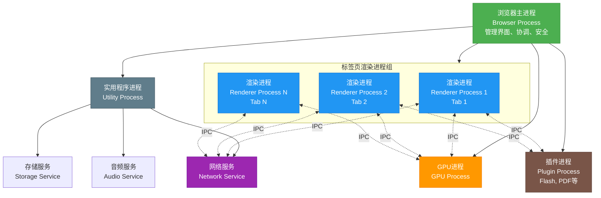
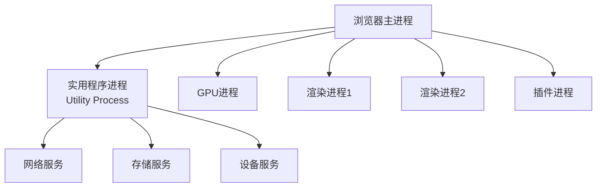
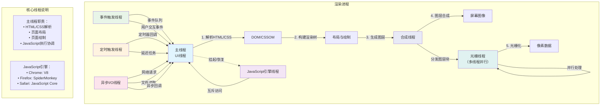
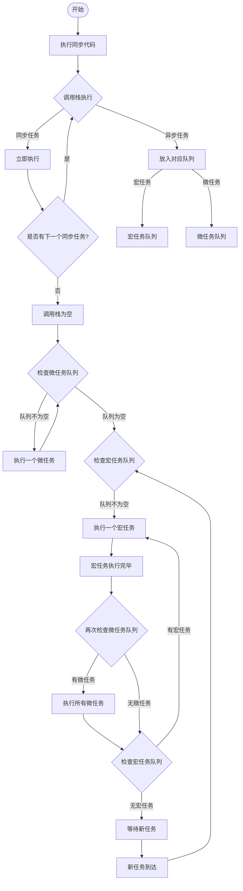

# JavaScript线程模型、微任务和宏任务深度解析

## 1. JavaScript 线程模型基础

### 1.1 单线程架构设计理念

JavaScript 从诞生之初就被设计为单线程语言，这一特性与其核心应用场景和设计目标密不可分。所谓单线程，是指 JavaScript 在同一时间只能执行一个任务，所有代码都在一个执行线程上运行。这种设计理念源于 JavaScript 最初的设计目标 —— 作为浏览器的脚本语言，主要用于与用户交互和操作 DOM。

单线程架构的设计理念体现在多个方面。首先，它确保了 **DOM 操作的一致性和可预测性**。如果 JavaScript 允许多线程同时操作 DOM，可能会导致不可预测的冲突，比如一个线程删除节点，另一个线程同时修改它，使页面行为混乱。因此，JavaScript 被设计为单线程，确保同一时刻只有一个线程能操作 DOM，从而保持操作的一致性和可预测性。

其次，单线程模型大大简化了编程模型。开发者无需处理线程同步、死锁、竞态条件等复杂的并发问题，代码执行顺序清晰可预测。这种 "极简" 设计让 JavaScript 在处理用户交互和 DOM 操作时无需考虑复杂的同步问题，新手也能快速上手。

此外，单线程设计还减少了上下文切换的开销。在多线程环境中，CPU 需要频繁在不同线程间切换，这会带来性能损耗。而单线程避免了这种频繁的上下文切换，在 I/O 密集型应用中尤其有优势。

然而，单线程模型也带来了一些限制。最大的问题是阻塞风险高，一旦有耗时操作（如大数据计算、死循环等），会卡住主线程，导致页面卡顿或无响应。同时，由于 JavaScript 本身的单线程性质，它无法充分利用多核 CPU，限制了并行处理能力。

为了弥补这些限制，JavaScript 引入了异步编程机制和事件循环模型，使得单线程的 JavaScript 能够高效地处理大量并发操作而不会阻塞主线程。

### 1.2 浏览器多进程架构

现代浏览器采用复杂的多进程架构来提高稳定性、安全性和性能。以 Chrome 浏览器为例，其多进程架构包含以下主要进程：

**浏览器主进程（Browser 进程)** 是整个浏览器的核心，负责控制地址栏、书签栏、返回和前进按钮，同时提供存储功能。它还负责管理各个子进程，包括创建、销毁和监控渲染进程等。浏览器主进程中有绘制浏览器按钮和输入框的 UI 线程，网络线程来处理网络堆栈从网络中获取数据，存储线程控制文件的权限等。

**网络进程**主要负责页面的网络资源加载。在早期版本中，网络功能是作为一个模块运行在浏览器进程里的，最近才独立为一个进程。网络进程会发起真正的 URL 请求，包括 DNS 解析、建立 TCP 连接、接收返回信息、解析响应头等操作。

**GPU 进程**用于 3D 绘制和页面渲染加速。驱动 Chrome 利用 GPU 的最初动力是 3D CSS，对页面渲染进行加速。GPU 进程可以独立于其他进程运行，即使其他进程出现问题，GPU 进程也能继续工作，提高了系统的稳定性。

**渲染进程（浏览器内核）** 是浏览器的核心组件，负责界面渲染、脚本执行、事件处理等。每个标签页通常对应一个独立的渲染进程，这样可以确保一个页面的崩溃不会影响其他页面。渲染进程内部是多线程的，包含了多个专门的线程来协同工作。

**插件进程**用于运行第三方插件，每种插件一个进程，插件运行时才会创建。由于第三方插件很容易导致页面崩溃或安全问题，使用沙箱机制运行插件可以提高浏览器的安全性。

这种多进程架构的优势在于：首先，提高了系统的稳定性，一个进程的崩溃不会影响其他进程；其次，增强了安全性，不同进程之间通过 IPC（进程间通信）机制进行通信，避免了直接访问带来的安全风险；最后，提高了性能，可以充分利用现代计算机的多核 CPU 资源。

### 1.3 渲染进程内线程分工

在渲染进程内部，包含了多个专门的线程来协同完成页面的渲染和交互工作。这些线程分工明确，各司其职，共同确保页面的高效渲染和流畅交互。

**主线程（UI 线程）**是渲染进程中最核心的线程，负责解析 HTML、CSS、执行 JavaScript、页面布局与绘制等工作。它是整个渲染流程的控制中心，协调其他线程的工作。需要特别注意的是，**JavaScript 引擎线程与 GUI 线程是互斥的**，当 JavaScript 执行时，GUI 线程会被挂起；反之亦然。这是因为 JavaScript 可以操作 DOM 和 CSSOM，如果两者并行执行，可能导致渲染结果不一致，例如 JavaScript 删除 DOM 时 GUI 正在渲染。

**JavaScript 引擎线程**负责解析和执行 JavaScript 代码。主流浏览器使用不同的 JavaScript 引擎，如 Chrome 使用 V8 引擎，Firefox 使用 SpiderMonkey 引擎，Safari 使用 JavaScript Core 引擎。这些引擎都是**单线程**工作的，它们**负责将 JavaScript 代码编译成机器码并执行。**

**事件触发线程**归属于浏览器而不是 JavaScript 引擎，用来控制事件循环。当对应的事件符合触发条件被触发时，该线程会把事件添加到待处理队列的队尾，等待 JavaScript 引擎的处理。例如，当用户点击按钮、滚动页面或输入内容时，这个线程会生成相应的事件，并将事件放入队列中等待处理。

**定时触发线程**负责处理定时器任务的触发和执行。当我们使用 setTimeout 或 setInterval 时，定时触发线程会在指定的时间到达后，将回调函数添加到任务队列中。需要注意的是，定时器的执行时间可能会因为前一个任务的执行时间而延迟，并不是精确的。

**异步 I/O 线程**负责处理各种异步 I/O 操作，如网络请求、文件读取等。当发起一个异步请求时，该线程会在后台处理请求，完成后将结果通过回调函数的形式通知主线程。

**合成线程**负责将页面的各个图层合成为最终的屏幕图像。在现代浏览器中，页面被分成多个图层，合成线程会将这些图层按照正确的顺序和位置组合起来，生成最终的渲染结果。

**光栅线程**将合成线程拆分的图层转化为屏幕可显示的 "像素数据"，支持多线程并行处理，提升渲染速度。光栅化是将矢量图形转换为位图的过程，这个过程可以并行处理，大大提高了渲染效率。

这些线程之间通过复杂的协作机制来确保页面的正常渲染。例如，当 JavaScript 需要修改 DOM 时，它会通知主线程，主线程会重新计算布局并触发重绘或重排。如果是 CSS 动画等不需要改变布局的操作，可以直接在合成线程中处理，避免阻塞主线程。

### 1.4 主流浏览器引擎实现差异

虽然所有现代浏览器都遵循相同的 Web 标准，但在具体的实现细节上存在一些差异。这些差异主要体现在线程模型的实现方式、任务调度策略以及性能优化方法等方面。

**Chrome（Chromium 内核）** 的实现特点包括：使用多类型消息循环，主线程使用 MessageLoop::TYPE_UI 处理 UI 事件、定时器和渲染；I/O 线程使用 MessageLoop::TYPE_IO 处理网络请求。在 Android 平台上，Chromium 通过 MessagePump 抽象层整合 Android 的 Looper 和 Handler 机制，实现与 Java 层事件循环的协同。Chromium 还通过优先级任务队列（如高优先级处理用户输入）和微任务批量执行来优化性能。

**Firefox（Gecko 引擎）** 遵循相同的任务 / 微任务模型，但使用自有框架 nsThread 管理事件循环，通过 Scheduler 模块优化任务调度。Gecko 引擎在处理事件循环时，采用了与 Chromium 不同的底层实现，但在核心逻辑上保持一致。

**Safari（WebKit 引擎）** 的核心逻辑与标准一致，但依赖 macOS/iOS 的底层 API（如 Grand Central Dispatch）实现任务队列。WebKit 在处理渲染和 JavaScript 执行时，采用了与其他浏览器不同的架构设计，但都确保了相同的事件循环行为。

这些差异在实际应用中可能会导致一些细微的行为差异。例如，setTimeout 的最小延迟在不同浏览器中可能有所不同，Chrome 为 4ms，而 Firefox 和 Safari 可能有所不同。MutationObserver 的调度及时性在旧版 Edge 中可能不如现代浏览器，requestAnimationFrame 的触发策略在帧率控制和页面可见性处理上也略有差异。

尽管存在这些差异，但所有浏览器都遵循相同的核心规则：每个事件循环执行一个宏任务后清空微任务队列，微任务的执行优先级高于宏任务。开发者可以依赖这些统一的行为，而不必担心浏览器兼容性问题。

## 2. 事件循环机制深度剖析

### 2.1 事件循环基本概念与原理

事件循环（Event Loop）是 JavaScript 实现异步编程的核心机制，它使得单线程的 JavaScript 能够高效地处理异步任务、I/O 操作和用户交互。事件循环的本质是一个永不停歇的循环过程，它不断地检查并处理任务队列中的事件。

事件循环的基本工作原理可以概括为：当调用栈为空时，事件循环会从任务队列中取出一个事件，并将其对应的回调函数放入调用栈中执行。这个过程会一直重复，形成一个循环，因此被称为 "事件循环"。

在浏览器环境中，事件循环负责协调执行栈（Call Stack）、宏任务（Macrotask）队列和微任务（Microtask）队列之间的协作。其核心流程包括以下几个步骤：首先执行所有的同步代码，这些代码会立即进入调用栈并被逐个执行；当遇到异步任务时，这些任务不会立即执行，而是被放入相应的任务队列中；当所有同步任务执行完毕，调用栈为空时，事件循环会优先检查并执行微任务队列中的所有任务；在微任务队列清空后，事件循环从宏任务队列中取出下一个宏任务并执行。每次执行完一个宏任务后，事件循环会再次检查微任务队列，依此反复进行。

事件循环的一个重要特性是它的非阻塞性。当遇到耗时操作（如网络请求、定时器）时，主线程不会等待这些操作完成，而是将它们交给浏览器的其他线程处理，然后继续执行后续的代码。当这些异步操作完成后，它们的回调函数会被添加到任务队列中，等待事件循环的处理。

需要特别注意的是，事件循环是由宿主环境（如浏览器或 Node.js）实现的，而不是 JavaScript 引擎本身。JavaScript 引擎（如 V8）只负责执行 JavaScript 代码，而事件循环机制则由宿主环境提供。

### 2.2 事件循环阶段详解

浏览器中的事件循环遵循 HTML5 规范，主要包括以下几个阶段：

**执行同步代码阶段**：这是事件循环的起始阶段，所有的同步代码都会在这个阶段被执行。这些代码会按照编写的顺序依次进入调用栈，并被立即执行。在执行过程中，如果遇到函数调用，会将函数的执行上下文压入调用栈；函数执行完毕后，再将其弹出调用栈。

**执行所有微任务阶段**：当同步代码执行完毕，调用栈为空时，事件循环会立即执行微任务队列中的所有任务。这个阶段会一直执行，直到微任务队列为空。需要特别注意的是，在执行微任务的过程中，如果产生了新的微任务，这些新的微任务也会被立即执行，不会等到下一轮事件循环。

**渲染阶段**：在微任务执行完毕后，浏览器会判断是否需要进行页面渲染。这里有一个 "rendering opportunity" 的概念，也就是说不一定每一轮事件循环都会对应一次浏览器渲染，要根据屏幕刷新率、页面性能、页面是否在后台运行等因素共同决定。通常来说，这个渲染间隔是固定的，大约为 16.6ms（60Hz 刷新率）。

**执行一个宏任务阶段**：在完成渲染后，事件循环会从宏任务队列中取出第一个任务并执行。需要注意的是，每次事件循环只会执行一个宏任务，而不是执行所有的宏任务。执行完这个宏任务后，会再次进入下一轮循环，重复上述过程。

这种循环机制确保了 JavaScript 能够在单线程环境中高效地处理各种异步任务。每次循环都遵循 "一个宏任务 → 所有微任务 → 渲染 → 下一个宏任务" 的顺序，形成了一个完整的事件循环周期。

### 2.3 事件循环与线程模型的协作

事件循环与浏览器的多线程模型之间存在着密切的协作关系。虽然 JavaScript 引擎是单线程的，但浏览器本身是多线程的，这种协作机制使得 JavaScript 能够在单线程环境中实现高效的异步操作。

在渲染进程中，JavaScript 主线程负责执行代码和处理事件。当遇到异步操作时，主线程会将这些任务交给相应的后台线程处理。例如，当调用 setTimeout 时，定时任务会被交给定时触发线程处理；当发起网络请求时，会被交给网络线程处理；当进行文件操作时，会被交给 I/O 线程处理。

这些后台线程在处理异步任务时，不会阻塞主线程的执行。当异步任务完成后，后台线程会将回调函数添加到相应的任务队列中。例如，定时器线程在时间到达后会将回调函数添加到宏任务队列，网络线程在接收到响应后会将回调函数添加到相应的事件队列。

事件循环的作用就是协调这些任务的执行顺序。它不断地检查调用栈是否为空，当调用栈为空时，就会从任务队列中取出任务执行。这种机制确保了即使有多个异步任务同时完成，它们的回调函数也会按照顺序执行，不会出现竞态条件。

需要特别注意的是，GUI 渲染线程与 JavaScript 执行线程是互斥的。当 JavaScript 执行时，GUI 线程会被挂起；反之亦然。这是因为 JavaScript 可以修改 DOM 结构，如果两者同时执行，可能导致渲染结果不一致。因此，浏览器需要等待 JavaScript 执行完毕后再继续渲染流程，避免状态冲突。

这种协作机制的优势在于：一方面，它保持了 JavaScript 单线程模型的简单性，避免了复杂的线程同步问题；另一方面，通过多线程的后台处理，实现了高效的异步操作，使得 JavaScript 能够处理大量的并发任务而不会阻塞主线程。

### 2.4 HTML5 规范中的事件循环定义

事件循环的机制由 WHATWG 的 HTML Living Standard 明确定义，用于协调用户交互、脚本执行、渲染、网络请求等任务。这是一个跨浏览器的统一标准，所有现代浏览器都必须遵循这个标准来实现事件循环机制。

HTML5 规范中定义的事件循环具有以下核心要求：

首先，每个浏览器的 "代理"（如标签页或 Worker 线程）必须拥有独立的事件循环，包含任务队列（Task Queue）和微任务队列（Microtask Queue）。这意味着每个标签页都有自己独立的事件循环，相互之间不会干扰。

其次，规范明确规定了事件循环的执行顺序。每次事件循环必须执行一个宏任务，然后执行所有的微任务，接着可能进行渲染，最后进入下一轮循环。这个顺序是严格固定的，不能改变。

第三，规范定义了多种类型的任务源。包括定时器任务源（setTimeout、setInterval）、I/O 任务源（网络请求、文件操作）、事件任务源（用户交互事件）、以及一些特殊任务源（如 postMessage、MessageChannel 等）。每种任务源都有自己的优先级和执行规则。

第四，规范还定义了微任务的执行规则。微任务必须在当前宏任务执行完毕后立即执行，而且要执行完所有的微任务（包括在执行微任务过程中产生的新微任务），才能进入下一个事件循环阶段。

HTML5 规范还对一些具体的实现细节做了规定。例如，setTimeout 的最小延迟不得低于 4 毫秒，这是为了防止过于频繁的定时器回调导致性能问题。规范还规定了 requestAnimationFrame 的执行时机，它应该在浏览器准备好绘制下一帧之前执行，通常与屏幕刷新率同步。

需要注意的是，虽然规范定义了事件循环的核心行为，但具体的实现细节可以由浏览器厂商自行决定。这就导致了不同浏览器在一些细节上可能存在差异，如任务的优先级、调度策略、性能优化方法等。但这些差异不会影响事件循环的基本行为，开发者可以依赖规范定义的统一行为来编写代码。

## 3. 微任务与宏任务全面解析

### 3.1 微任务与宏任务的定义与区别

在 JavaScript 的异步编程模型中，任务被分为两大类：**宏任务（Macrotask）**和**微任务（Microtask）**。理解这两类任务的区别和执行顺序是掌握 JavaScript 异步编程的关键。

**宏任务（Macrotask)** 是由宿主环境（如浏览器或 Node.js）发起的任务，每次事件循环开始时执行。宏任务代表的是一些较大粒度的任务单元，通常包括需要较长时间完成的操作。常见的宏任务包括：setTimeout 和 setInterval 的回调函数、I/O 操作（如网络请求、文件读写）、DOM 事件（如 click、keydown 等）、postMessage 和 MessageChannel（用于跨窗口通信）、requestAnimationFrame（浏览器动画帧回调）等。

| 宏任务类型                    | 描述                                                                                           | 常见来源/API                                      |
| ----------------------------- | ---------------------------------------------------------------------------------------------- | ------------------------------------------------- |
| **脚本执行**                  | 整体同步脚本（`<script>`标签）的执行本身就是一个宏任务。                                       | 初始脚本加载、内联脚本                            |
| **UI 渲染**                   | 浏览器在每次事件循环中可能执行的渲染步骤（尽管渲染时机有特定规则，但常被视为宏任务的一部分）。 | 浏览器渲染管线（重排、重绘、合成）                |
| **I/O 操作回调**              | 输入/输出操作完成后的回调，如文件读写、网络请求等。                                            | Node.js 的 `fs`模块、`fetch`/`XMLHttpRequest`回调 |
| **setTimeout**                | 定时器回调，在指定延迟后执行。                                                                 | `setTimeout(callback, delay)`                     |
| **setInterval**               | 周期性定时器回调，按指定间隔重复执行。                                                         | `setInterval(callback, interval)`                 |
| **setImmediate**              | Node.js 特有的立即执行宏任务，在 I/O 回调之后执行。                                            | Node.js 的 `setImmediate(callback)`               |
| **UI 事件回调**               | 用户交互事件触发后的回调，如点击、键盘、鼠标事件。                                             | `click`, `keydown`, `resize`, `scroll`等          |
| **MessageChannel**            | 消息通道通信的回调，用于跨上下文通信（如 iframe、Web Worker）。                                | `MessageChannel.port1.onmessage`                  |
| **postMessage**               | 跨窗口/跨线程消息传递的回调。                                                                  | `window.postMessage`, Worker 的 `postMessage`     |
| **网络事件回调**              | 网络请求状态变更的回调，如 AJAX 完成、WebSocket 消息。                                         | `XMLHttpRequest.onload`, `WebSocket.onmessage`    |
| **History API 操作**          | 历史记录变化触发的回调，如 `pushState`、`popstate`事件。                                       | `popstate`事件回调                                |
| **IndexedDB 操作回调**        | 数据库异步操作完成后的回调。                                                                   | IndexedDB 请求成功/失败回调                       |
| **requestAnimationFrame**     | 浏览器动画帧回调，在下一帧渲染前执行（通常视为与渲染相关的宏任务）。                           | `requestAnimationFrame(callback)`                 |
| **IntersectionObserver 回调** | 元素交叉观察器的回调，异步触发。                                                               | `IntersectionObserver`的回调函数                  |
| **Node.js 专用任务**          | Node.js 环境特有的异步任务，如 `fs`、`crypto`模块回调。                                        | 文件系统回调、加密操作回调等                      |
| **事件循环阶段任务**          | Node.js 事件循环各阶段的任务，如 `idle/prepare`、`poll`、`check`、`close`阶段。                | Node.js 事件循环各阶段回调                        |

**微任务（Microtask）** 是由 JavaScript 引擎内部发起的任务，在当前宏任务执行结束后、下一个宏任务开始前立即执行。微任务通常是一些较小粒度的任务，用于处理需要尽快执行的操作。常见的微任务包括：Promise 的 then、catch、finally 回调函数、MutationObserver（用于监听 DOM 变化）、queueMicrotask（显式添加微任务的 API）等。

| 微任务类型                         | 说明                                                               | 常见示例/API                                                                      |
| ---------------------------------- | ------------------------------------------------------------------ | --------------------------------------------------------------------------------- |
| **Promise 回调**                   | Promise 状态变更（fulfilled 或 rejected）后触发的异步回调          | `promise.then()`、`promise.catch()`、`promise.finally()`                          |
| **async/await**                    | `async`函数中，`await`之后的代码或隐式返回的 Promise 回调          | `async function() { await ... }`                                                  |
| **queueMicrotask**                 | 显式将函数加入微任务队列的 Web API                                 | `queueMicrotask(callback)`                                                        |
| **MutationObserver**               | 监听 DOM 变化并触发回调（浏览器环境）                              | `new MutationObserver(callback)`                                                  |
| **Object.observe**（已废弃）       | 监听对象变化（已从标准移除，部分旧环境曾支持）                     | `Object.observe(obj, callback)`                                                   |
| **process.nextTick**               | Node.js 中类似微任务的机制（优先级高于 Promise 微任务）            | `process.nextTick(callback)`（Node.js 环境）                                      |
| **IntersectionObserver**           | 监听元素相交状态变化，回调在微任务队列执行                         | `new IntersectionObserver(callback)`（浏览器环境）                                |
| **ResizeObserver**                 | 监听元素尺寸变化，回调在微任务队列执行                             | `new ResizeObserver(callback)`（浏览器环境）                                      |
| **PerformanceObserver**            | 监听性能度量事件，回调在微任务队列执行                             | `new PerformanceObserver(callback)`（浏览器环境）                                 |
| **ReportingObserver**              | 监听报告信息（如废弃 API 使用），回调在微任务队列执行              | `new ReportingObserver(callback)`（浏览器环境）                                   |
| **Promise 静态方法**               | 某些 Promise 组合方法返回的新 Promise 回调                         | `Promise.all()`、`Promise.race()`等返回的 Promise 回调                            |
| **IndexedDB 事务回调**             | IndexedDB 操作完成后的成功/错误回调                                | `transaction.oncomplete`、`request.onsuccess`（浏览器环境）                       |
| **MessageChannel**（微任务时机）   | 通过 `MessageChannel`触发的回调在某些实现中可能进入微任务队列      | `port.postMessage()`配合 `port.onmessage`（非标准微任务，但可能被视为微任务调度） |
| **window.postMessage**（部分情况） | 在特定实现中，同源窗口间的消息事件可能以微任务形式触发（依赖实现） | `window.postMessage()`事件回调（非标准，仅部分环境）                              |

两者的主要区别体现在以下几个方面：

首先是发起者不同。**宏任务由宿主环境发起，而微任务由 JavaScript 引擎自身发起**。这意味着宏任务通常涉及与浏览器或操作系统的交互，而微任务则是 JavaScript 语言层面的异步机制。

其次是执行时机不同。**宏任务在事件循环的每个周期开始时执行，每次事件循环只执行一个宏任务**。而**微任务在当前宏任务执行完毕后立即执行，并且要执行完所有的微任务（包括在执行过程中产生的新微任务）才能进入下一个事件循环**。

第三是任务队列的处理方式不同。**宏任务队列是先进先出（FIFO）的，按照添加的顺序执行。而微任务队列在每次执行时都会被清空，即使在执行过程中添加了新的微任务，也会立即执行这些新任务。**

第四是优先级不同。**微任务的优先级高于宏任务，这意味着在当前宏任务执行完毕后，会立即执行所有微任务，然后才会执行下一个宏任务**。即使有多个宏任务已经准备好执行，也必须等待微任务队列清空。

### 3.2 微任务与宏任务的具体分类

为了更好地理解和使用微任务与宏任务，我们需要对它们进行详细的分类和说明。

**宏任务的分类**：

1. **定时器任务**：包括 setTimeout 和 setInterval，这是最常见的宏任务类型。需要注意的是，定时器的执行时间并不精确，可能会因为前一个任务的执行时间而延迟。
2. **I/O 操作**：包括网络请求（如 fetch、XMLHttpRequest）、文件读写（在 Node.js 环境中）、数据库操作等。这些操作通常由浏览器或 Node.js 的底层线程处理，完成后将回调函数添加到宏任务队列。
3. **事件处理**：包括 DOM 事件（如 click、mouseover、keypress 等）、UI 事件（如 resize、scroll 等）、以及各种自定义事件。这些事件的回调函数会在事件触发时被添加到宏任务队列。
4. **跨文档通信**：包括 postMessage 和 MessageChannel，用于在不同窗口或 iframe 之间进行通信。当收到消息时，相关的回调函数会被添加到宏任务队列。
5. **UI 渲染**：在某些浏览器实现中，UI 渲染被视为一个宏任务。但需要注意的是，requestAnimationFrame 并不属于宏任务，而是一个独立的机制。
6. **requestAnimationFrame**：这是一个特殊的 API，它既不属于宏任务也不属于微任务，而是浏览器专门为动画设计的机制。它会在浏览器准备好绘制下一帧之前执行，通常与屏幕刷新率同步。

**微任务的分类**：

1. **Promise 相关回调**：包括 Promise 的 then、catch、finally 方法的回调函数。当 Promise 状态改变时，这些回调函数会被添加到微任务队列。需要注意的是，Promise 的构造函数是同步执行的，只有 then 方法的回调才是异步的。
2. **MutationObserver**：这是一个用于监听 DOM 变化的 API，当 DOM 结构发生变化时，会触发相应的回调函数。这些回调函数会被作为微任务执行。
3. **queueMicrotask**：这是 ES2018 引入的 API，允许开发者显式地将一个函数添加到微任务队列。它的作用类似于 setTimeout (fn, 0)，但优先级更高，会在当前宏任务结束后立即执行。
4. **process.nextTick**：这是 Node.js 环境特有的微任务，它的优先级比普通微任务更高，会在当前操作完成后立即执行。在 Node.js 中，它不属于事件循环的任何阶段，而是在每个阶段结束后立即执行。

### 3.3 执行顺序规则与优先级

微任务和宏任务的执行顺序遵循严格的规则，理解这些规则对于编写正确的异步代码至关重要。

**基本执行顺序**遵循以下原则：

1. 执行栈（Call Stack）中的同步代码按顺序执行，遇到异步任务时将其放入对应队列。
2. 当前宏任务执行完毕后，立即清空微任务队列中的所有任务。这个过程会一直持续，直到微任务队列为空。
3. 微任务队列清空后，从宏任务队列中取出下一个任务执行。
4. 重复上述过程，形成 "一个宏任务 → 所有微任务 → 渲染 → 下一个宏任务" 的循环。

**具体执行流程**可以分为以下几个步骤：

1. 首先执行宏任务队列中的第一个任务（通常是最老的或最先入队的）。
2. 在执行宏任务的过程中，遇到微任务就将其放入微任务队列；遇到宏任务就将其放入宏任务队列。
3. 当前宏任务执行完毕后，立即清空整个微任务队列（执行所有微任务）。
4. 如果需要进行页面渲染，在微任务执行完毕后进行渲染。
5. 从宏任务队列中取出下一个宏任务，开始新一轮的循环。

**优先级规则**：

微任务的优先级明显高于宏任务。这种优先级体现在以下几个方面：

1. 在当前宏任务执行完毕后，会立即执行微任务，而不会等待下一个宏任务。即使下一个宏任务已经准备好，也必须等待微任务队列清空。
2. 在微任务执行过程中，如果产生了新的微任务，这些新微任务会被立即执行，而不会等到下一轮事件循环。这可能导致微任务队列不断增长，形成 "微任务饥饿" 现象，影响宏任务的执行。
3. 微任务的执行是原子性的，即一旦开始执行微任务，就会一直执行到微任务队列为空，中间不会被打断。这确保了微任务中的操作能够连续执行，不会出现竞态条件。

**特殊情况的处理**：

1. **async/await 的处理**：async 函数中的 await 表达式会暂停函数执行，并将 await 后面的表达式包装成一个 Promise。当 Promise 解决后，await 后面的代码会被包装成一个微任务，添加到微任务队列中。
2. **Promise 链的处理**：当链式调用 then 方法时，每个 then 方法的回调都会被添加到微任务队列中。这些回调会按照添加的顺序执行，形成一个微任务链。
3. **微任务中的同步代码**：在微任务的执行过程中，如果有同步代码，这些代码会立即执行，可能会产生新的微任务或宏任务。这些新产生的任务会按照相应的规则处理。

### 3.4 浏览器环境下的特殊实现

在浏览器环境中，微任务和宏任务的实现有一些特殊之处，这些特殊实现反映了浏览器的复杂性和多样性需求。

**requestAnimationFrame 的特殊地位**：requestAnimationFrame 是浏览器提供的一个特殊 API，它既不属于宏任务也不属于微任务，而是一个独立的机制。它的设计目的是为了优化动画性能，确保动画的平滑性。requestAnimationFrame 的回调函数会在浏览器准备好绘制下一帧之前执行，通常与屏幕刷新率同步（60Hz，约 16.6ms）。这种机制的优势在于：如果页面处于不可见状态（如在后台标签页），requestAnimationFrame 会暂停执行，节省系统资源；它能够自动优化绘制时机，避免不必要的重绘；它与浏览器的渲染流程紧密集成，能够获得最佳的性能表现。

**渲染时机的优化**：浏览器的渲染时机并不固定在每个事件循环之后，而是有一个 "rendering opportunity" 的概念。浏览器会综合考虑多个因素来决定是否进行渲染：屏幕刷新率（通常为 60Hz）、页面是否在可见区域、页面的性能状况、是否有动画在运行等。这种优化机制可以避免不必要的渲染，提高性能。例如，如果在短时间内有大量的 DOM 更新，浏览器可能会将这些更新合并，只进行一次渲染。

**微任务对渲染的影响**：由于微任务在每个宏任务之后立即执行，并且会一直执行到队列为空，这可能会影响页面的渲染时机。如果微任务执行时间过长，会延迟下一次渲染，导致页面卡顿。因此，在编写微任务时应该注意：避免在微任务中执行耗时操作；将复杂的操作分解为多个步骤，使用 setTimeout 或 requestAnimationFrame 来分批执行；合理使用微任务，不要过度使用，以免造成 "微任务饥饿"。

**跨浏览器的一致性与差异**：虽然所有浏览器都遵循相同的事件循环规范，但在具体实现上仍存在一些差异。例如：setTimeout 的最小延迟在不同浏览器中可能不同，Chrome 为 4ms，Firefox 和 Safari 可能有所不同；MutationObserver 的调度在某些浏览器中可能不如其他浏览器及时；requestAnimationFrame 在不同浏览器中的实现细节可能略有差异，但基本行为是一致的。这些差异通常不会影响正常的开发，但在进行性能优化时需要考虑这些因素。

**浏览器特有的任务类型**：除了标准的宏任务和微任务，浏览器还提供了一些特有的任务类型：

1. **Media Source Extensions (MSE)**：用于处理媒体流的 API，相关的回调函数可能作为特殊的任务类型处理。
2. **Service Worker**：作为浏览器的后台服务，Service Worker 有自己的事件循环和任务队列。
3. **WebSocket**：WebSocket 的消息处理和事件回调可能有特殊的处理机制。
4. **IndexedDB**：IndexedDB 的异步操作回调通常作为微任务处理，但在某些情况下可能有特殊的调度机制。

这些特有的任务类型都遵循基本的事件循环规则，但在具体实现上可能有特殊的优化和处理方式。开发者在使用这些 API 时，应该了解它们的异步行为，确保代码的正确性和性能。

## 4. 浏览器环境下的应用场景与实践

### 4.1 浏览器内核实现差异

尽管所有现代浏览器都遵循相同的事件循环规范，但在具体实现上仍存在一些细微的差异，这些差异主要体现在性能优化策略和底层实现机制上。

**Chrome（Chromium 内核）的实现特点**：

Chrome 采用了高度优化的多进程多线程架构。在事件循环的实现上，Chrome 使用了 MessageLoop 机制，将事件循环分为不同的类型：主线程使用 MessageLoop::TYPE_UI 处理 UI 事件、定时器和渲染；I/O 线程使用 MessageLoop::TYPE_IO 处理网络请求。这种分线程处理的方式提高了系统的并发能力和响应速度。在 Android 平台上，Chromium 通过 MessagePump 抽象层整合 Android 的 Looper 和 Handler 机制，实现了与 Java 层事件循环的无缝协同。Chrome 还实现了优先级任务队列，将用户输入事件设置为最高优先级，确保了界面的快速响应。在微任务处理上，Chrome 采用批量执行的策略，可以显著减少微任务执行的开销。

**Firefox（Gecko 引擎）的实现特点**：

Firefox 遵循相同的任务 / 微任务模型，但使用了完全不同的底层实现。Gecko 引擎使用自有框架 nsThread 来管理事件循环，通过 Scheduler 模块进行任务调度优化。Gecko 的事件循环实现强调跨平台的一致性，在不同操作系统上都使用相同的核心逻辑。Firefox 在处理事件循环时，特别注重内存管理和垃圾回收的协调，确保了长期运行的稳定性。Gecko 还实现了自己的任务优先级系统，能够根据任务的类型和紧急程度进行智能调度。

**Safari（WebKit 引擎）的实现特点**：

Safari 的 WebKit 引擎在处理事件循环时，充分利用了 macOS 和 iOS 的底层 API。特别是 Grand Central Dispatch (GCD) 框架，它为 WebKit 提供了强大的并发和任务调度能力。WebKit 的事件循环实现高度集成了系统的图形和渲染能力，能够与 Core Animation 等框架无缝协作。在 iOS 平台上，WebKit 还特别优化了与 UIKit 的集成，确保了 UI 操作的流畅性。WebKit 在处理 JavaScript 执行时，使用了 Nitro 引擎（也称为 JavaScript Core），它的 JIT 编译器能够提供优秀的执行性能。

**具体实现差异的影响**：

这些实现差异在实际应用中可能会产生一些细微的影响：

1. **定时器精度差异**：不同浏览器对 setTimeout 和 setInterval 的最小延迟处理不同。Chrome 的最小延迟为 4ms，而 Firefox 和 Safari 可能有不同的设置。这种差异在需要高精度定时的应用中可能会产生影响。
2. **微任务执行时机**：虽然所有浏览器都保证微任务在宏任务之后执行，但具体的执行时机可能略有不同。例如，某些浏览器可能会在微任务执行前进行一些额外的检查或优化。
3. **requestAnimationFrame 行为**：虽然所有浏览器都支持 requestAnimationFrame，但在处理页面可见性变化、标签页切换等情况下的行为可能有所不同。例如，某些浏览器可能会在页面不可见时暂停 requestAnimationFrame，而另一些可能会继续执行但降低频率。
4. **内存管理差异**：不同浏览器的垃圾回收机制和内存管理策略不同，这可能会影响长时间运行的应用的性能。例如，某些浏览器可能在垃圾回收期间暂停事件循环，导致短暂的卡顿。
5. **调试工具差异**：不同浏览器的开发者工具在调试事件循环时提供的信息和功能不同。了解这些差异有助于更有效地调试和优化代码。

尽管存在这些差异，但核心的事件循环行为（如微任务优先、宏任务顺序执行等）在所有浏览器中都是一致的。开发者可以依赖这些统一的行为来编写代码，而不必担心浏览器兼容性问题。

### 4.2 浏览器特有 API 与事件循环集成

浏览器提供了许多特有的 API，这些 API 与事件循环机制紧密集成，为开发者提供了强大的异步编程能力。

**requestAnimationFrame 的集成机制**：

requestAnimationFrame 是浏览器专门为动画设计的 API，它与事件循环的集成方式非常特殊。不同于宏任务和微任务，requestAnimationFrame 有自己独立的回调队列。这个队列由浏览器的合成线程管理，与 JavaScript 引擎的事件循环并行运行。当调用 requestAnimationFrame 时，回调函数会被添加到这个专门的队列中。在每个渲染周期（通常为 16.6ms）开始前，浏览器会检查这个队列，并依次执行所有的回调函数。这种机制的优势在于：它能够精确控制动画的执行时机，与屏幕刷新率同步；如果页面不可见，浏览器会自动暂停 requestAnimationFrame 的执行，节省资源；它能够自动优化重绘时机，避免不必要的渲染操作。

**MutationObserver 的工作原理**：

MutationObserver 是一个用于监听 DOM 变化的 API，它的实现与事件循环深度集成。当创建一个 MutationObserver 实例并调用 observe 方法时，浏览器会在后台监控指定 DOM 节点的变化。当检测到变化时，相关的回调函数不会立即执行，而是被包装成一个微任务，添加到微任务队列中。这种设计有几个优点：它避免了在 DOM 操作过程中频繁触发回调，导致性能问题；它确保了 DOM 变化的批量处理，提高了效率；它与事件循环机制无缝集成，不会阻塞其他任务的执行。需要注意的是，MutationObserver 的回调函数是在微任务阶段执行的，因此会在当前宏任务结束后立即执行。

**WebSocket 的异步处理机制**：

WebSocket 提供了全双工的网络通信能力，它的消息处理与事件循环紧密集成。当通过 WebSocket 接收到消息时，消息数据会被浏览器的网络线程处理，然后将相关的事件（如 message 事件）添加到事件队列中。这些事件通常作为宏任务处理，但具体的处理方式可能因浏览器而异。WebSocket 还提供了异步的 send 方法，用于发送数据。这个方法是异步的，它会将数据发送请求交给网络线程处理，不会阻塞主线程。WebSocket 的错误处理也与事件循环集成，错误事件会被添加到事件队列中，由事件循环调度执行。

**Service Worker 的事件驱动模型**：

Service Worker 是一种特殊的 Web Worker，它在后台运行，能够拦截和处理网络请求。Service Worker 有自己独立的事件循环和执行环境，与主线程的事件循环并行运行。Service Worker 通过事件来响应各种操作：install 事件在 Service Worker 安装时触发；activate 事件在 Service Worker 激活时触发；fetch 事件在拦截到网络请求时触发；message 事件在接收到来自主线程的消息时触发。这些事件的处理函数都在 Service Worker 的事件循环中执行，不会影响主线程的性能。Service Worker 的设计充分利用了浏览器的多线程架构，能够在不阻塞主线程的情况下处理复杂的网络逻辑。

**其他浏览器特有的集成机制**：

1. **IndexedDB 的异步 API**：IndexedDB 提供了异步的数据库操作能力，所有的数据库操作（如打开数据库、读取数据、写入数据等）都是通过回调函数或 Promise 来处理的。这些异步操作的回调通常作为微任务处理，确保了数据库操作不会阻塞主线程。
2. **File API 的异步处理**：File API 提供了读取文件内容的异步方法（如 readAsText、readAsDataURL 等）。这些方法会启动一个异步读取操作，当读取完成后，通过回调函数通知主线程。这些回调函数通常作为宏任务处理。
3. **Notification API**：通知 API 允许网页在系统级别显示通知。创建通知的操作是异步的，通知的显示和交互事件会通过事件循环传递给 JavaScript 代码。
4. **Battery API**：电池 API 用于检测设备的电池状态，它提供了事件监听机制（如 onchargingchange、onlevelchange 等）。这些事件会在电池状态变化时触发，通过事件循环通知 JavaScript 代码。

这些浏览器特有的 API 都与事件循环机制深度集成，它们的设计充分考虑了单线程 JavaScript 环境的特点，通过异步回调、事件监听等机制，确保了这些强大功能的使用不会阻塞主线程，从而保证了用户界面的流畅性和响应性。

### 4.3 性能优化策略与最佳实践

基于对 JavaScript 线程模型、事件循环以及微任务和宏任务的深入理解，我们可以制定一系列性能优化策略，提升 Web 应用的性能和用户体验。

**避免主线程阻塞的策略**：

1. **合理使用异步编程**：在处理耗时操作时，应该使用异步方法而非同步方法。例如，使用 setTimeout 将耗时的计算任务推迟执行，或者使用 Web Worker 在后台线程执行。避免在主线程中执行长时间的循环或复杂计算，这些操作会阻塞事件循环，导致页面失去响应。
2. **拆分大型任务**：将一个耗时的大型任务拆分成多个小任务，使用 setTimeout 或 requestIdleCallback 将它们分散到多个事件循环中执行。这种方法可以让浏览器在执行任务的间隙进行渲染和响应用户操作，提高了应用的响应性。例如，可以将一个处理 10 万条数据的任务拆分成 100 个处理 1000 条数据的小任务，每个小任务之间暂停 1ms。
3. **使用 Web Worker 处理计算密集型任务**：对于需要大量计算的任务（如数据处理、图像处理、加密解密等），应该使用 Web Worker 在后台线程执行。Web Worker 能够充分利用多核 CPU 的优势，并行执行计算任务，而不会影响主线程的性能。实测表明，合理使用 Web Workers 可将帧率从阻塞状态的 15fps 提升至 60fps，延迟降低 80% 以上。

**微任务的优化使用**：

1. **控制微任务的数量和执行时间**：由于微任务会在每个宏任务之后立即执行，并且要执行到队列为空，过度使用微任务可能导致 "微任务饥饿"，延迟宏任务的执行。因此，应该避免在微任务中执行耗时操作，将复杂的操作分解为多个步骤，使用 setTimeout 或 requestAnimationFrame 来分批执行。
2. **合理使用 queueMicrotask**：queueMicrotask 提供了一种显式添加微任务的方式，它比 setTimeout 更高效，因为它直接操作微任务队列。在需要在当前宏任务结束后立即执行某些操作时，可以使用 queueMicrotask，但要注意不要过度使用，以免影响性能。
3. **优化 Promise 链**：在使用 Promise 时，应该避免创建过长的 Promise 链，因为每个 then 方法都会创建一个微任务。可以使用 async/await 来简化 Promise 链，提高代码的可读性和性能。同时，要注意在 Promise 链中避免不必要的 then 调用。

**宏任务的优化策略**：

1. **合理设置定时器延迟**：在使用 setTimeout 和 setInterval 时，应该根据实际需求设置合适的延迟时间。避免使用过小的延迟（如 0ms），因为这会导致定时器回调过于频繁地执行，影响性能。同时，要注意不同浏览器对最小延迟的处理可能不同，Chrome 的最小延迟为 4ms。
2. **合并相似的事件处理**：对于频繁触发的事件（如 resize、scroll、mousemove 等），应该使用防抖（debounce）或节流（throttle）技术来减少事件处理函数的调用频率。例如，可以使用 lodash 的 debounce 函数来确保 resize 事件处理函数只在窗口停止调整大小后执行。
3. **优化 DOM 操作**：DOM 操作是比较耗时的操作，应该尽量减少 DOM 操作的次数。可以使用文档片段（DocumentFragment）来批量操作 DOM，或者使用虚拟 DOM 库（如 React、Vue）来优化 DOM 更新。同时，要注意在微任务中修改 DOM 不会立即触发渲染，需要等到下一个渲染时机。

**利用浏览器特性进行优化**：

1. **requestAnimationFrame 的正确使用**：在实现动画效果时，应该使用 requestAnimationFrame 而非 setTimeout。requestAnimationFrame 与浏览器的渲染流程同步，能够提供最佳的动画性能。同时，它会在页面不可见时自动暂停，节省资源。在使用 requestAnimationFrame 时，要确保动画逻辑足够简单，避免在回调函数中执行复杂计算。
2. **使用 CSS 动画和转换**：对于简单的动画效果（如位移、缩放、旋转等），应该优先使用 CSS 动画而非 JavaScript 动画。CSS 动画由浏览器的合成线程处理，不会占用主线程资源，能够提供更流畅的动画效果。只有在需要复杂交互或动态计算的情况下，才使用 JavaScript 动画。
3. **Web Worker 的高级应用**：除了基本的计算任务，Web Worker 还可以用于处理其他耗时操作：

- 大文件上传：使用 Web Worker 进行文件分片和加密处理，避免上传过程中页面卡顿。
- 实时数据处理：在 Web Worker 中处理 WebSocket 消息或其他实时数据，减轻主线程负担。
- 图像处理：使用 Web Worker 进行图像压缩、滤镜处理等操作，避免阻塞主线程。

1. **优化资源加载策略**：

- 使用 async 和 defer 属性来异步加载 JavaScript 文件，避免阻塞 HTML 解析。
- 使用 preload 和 prefetch 来预加载关键资源，提高页面加载速度。
- 对于非关键的 JavaScript，可以使用动态 import () 来按需加载。

**监控和调优工具的使用**：

1. **浏览器开发者工具**：现代浏览器的开发者工具提供了强大的性能分析功能：

- Performance 面板可以录制和分析页面的性能，显示事件循环的执行情况、渲染时间、网络请求等信息。
- Memory 面板可以分析内存使用情况，检测内存泄漏。
- Console 面板可以使用 console.time () 和 console.timeEnd () 来测量代码执行时间。

1. **自定义性能监控**：可以使用 Performance API 来实现自定义的性能监控，例如：

- 使用 performance.now () 来精确测量代码执行时间。
- 使用 performance.mark () 和 performance.measure () 来标记和测量关键代码段的执行时间。
- 使用 performance.observer 来观察性能指标的变化。

1. **自动化性能测试**：可以使用工具如 Lighthouse、WebPageTest 等来进行自动化的性能测试和优化建议。

**综合优化案例**：

以一个大数据可视化应用为例，展示如何综合运用上述优化策略：

1. **数据预处理**：使用 Web Worker 在后台处理原始数据，包括数据清洗、格式转换、计算统计信息等。主线程只负责接收处理后的数据并进行渲染。
2. **增量渲染**：将大数据集的渲染拆分成多个批次，使用 requestAnimationFrame 来逐帧渲染数据点。这样可以避免一次性渲染大量数据导致的卡顿。
3. **虚拟滚动**：对于长列表或大数据集，使用虚拟滚动技术，只渲染可见区域内的项目。当用户滚动时，动态计算和渲染新的可见项目，而不是渲染所有项目。
4. **智能更新策略**：当数据发生变化时，只更新变化的部分，而不是重新渲染整个视图。可以使用 diff 算法来比较新旧数据，只更新有变化的 DOM 元素。
5. **资源懒加载**：对于非关键资源（如图表的额外功能、详细数据等），使用懒加载策略，只有在用户需要时才加载和渲染。

通过这些优化策略的综合应用，可以显著提升 Web 应用的性能，提供流畅的用户体验。关键在于理解 JavaScript 线程模型和事件循环的工作原理，合理利用异步机制，避免阻塞主线程，充分发挥浏览器多线程架构的优势。

### 4.4 常见面试题与实践案例

1. **为什么说 JavaScript 是单线程的，但浏览器是多线程的？**

   答案要点：JavaScript 引擎（如 V8）是单线程的，它在同一时间只能执行一个任务。但浏览器本身是多线程的，包含多个专门的线程：JavaScript 引擎线程、GUI 渲染线程、网络线程、定时器线程、事件触发线程等。这些线程协同工作，使得单线程的 JavaScript 能够实现异步操作。例如，当调用 setTimeout 时，定时任务由定时器线程处理；网络请求由网络线程处理；这些操作完成后，回调函数被添加到任务队列中，由 JavaScript 引擎线程执行。

1. **微任务和宏任务的执行顺序在浏览器和 Node.js 中有什么不同？**

   答案要点：在浏览器中，事件循环分为：执行同步代码 → 执行所有微任务 → 渲染 → 执行一个宏任务。在 Node.js 中，事件循环分为 6 个阶段：timers → I/O callbacks → idle/prepare → poll → check → close callbacks。每个阶段结束后都会执行微任务。此外，Node.js 还有一个特殊的 process.nextTick，它的优先级比微任务更高，会在每个阶段结束后立即执行。

1. **什么是 "微任务饥饿"？如何避免？**

   答案要点：当微任务队列中不断有新的微任务被添加，导致微任务队列永远无法清空时，就会发生 "微任务饥饿"。这会导致宏任务无法执行，页面失去响应。避免方法包括：不要在微任务中执行耗时操作；控制微任务的数量；将复杂操作分解为多个步骤，使用 setTimeout 或 requestAnimationFrame 来分批执行；避免在微任务中递归添加微任务。

1. **requestAnimationFrame 的优势是什么？为什么它比 setTimeout 更适合动画？**

   答案要点：requestAnimationFrame 的优势包括：与浏览器的渲染流程同步，通常为 60Hz（16.6ms），能够提供最流畅的动画效果；会在页面不可见时自动暂停，节省系统资源；由浏览器自动优化，能够避免不必要的重绘；参数中提供了精确的时间戳，便于计算动画进度。相比之下，setTimeout 的执行时间不精确，可能因为其他任务的执行而延迟，导致动画卡顿。

通过这些面试题和实践案例的练习，可以深入理解 JavaScript 线程模型、事件循环以及微任务和宏任务的工作原理，并能够在实际开发中灵活运用这些知识进行性能优化。关键在于理解事件循环的基本原理，掌握微任务和宏任务的执行顺序，以及熟悉各种浏览器 API 与事件循环的集成方式。这些知识不仅是面试的重点，更是成为优秀前端开发者的必备技能。

## 5. 总结与展望

通过对 JavaScript 线程模型、微任务和宏任务的深入分析，我们可以得出以下核心结论：

**JavaScript 单线程模型的本质与优势**：JavaScript 的单线程模型是其设计哲学的核心体现。这一特性确保了 DOM 操作的一致性和可预测性，避免了复杂的线程同步问题，大大简化了编程模型。尽管它带来了阻塞风险和无法充分利用多核 CPU 的限制，但通过事件循环机制和异步编程模型，JavaScript 在浏览器环境中实现了高效的并发处理能力。现代浏览器的多进程多线程架构为单线程的 JavaScript 提供了强大的后台支持，使得各种异步操作能够高效执行而不阻塞主线程。

**事件循环机制的核心价值**：事件循环是 JavaScript 异步编程的灵魂，它通过 "一个宏任务 → 所有微任务 → 渲染 → 下一个宏任务" 的循环机制，巧妙地解决了单线程环境下的异步处理问题。理解事件循环的工作原理对于编写高性能的 JavaScript 代码至关重要。特别是要注意渲染时机的优化、微任务对渲染的影响以及不同类型任务的执行顺序，这些都会直接影响应用的性能和用户体验。

**微任务与宏任务的执行规则**：微任务和宏任务的区分和执行顺序是 JavaScript 异步编程的基础。微任务具有更高的优先级，会在每个宏任务执行完毕后立即执行，并且要执行到队列为空。这种机制确保了异步操作的及时处理，但也可能导致 "微任务饥饿" 问题。在实际应用中，需要合理使用这两类任务，避免过度使用微任务，确保宏任务能够及时执行。

**浏览器环境的特殊性**：浏览器作为 JavaScript 的主要运行环境，提供了丰富的 API 和机制。从 requestAnimationFrame 的特殊地位，到 WebSocket、Service Worker 等高级功能，这些 API 都与事件循环深度集成。理解这些集成机制，能够帮助开发者更好地利用浏览器的能力，实现更强大的 Web 应用。同时，不同浏览器在实现细节上的差异也需要在开发中予以考虑。

**性能优化的实践指导**：基于对线程模型和事件循环的理解，我们可以制定全面的性能优化策略。包括避免主线程阻塞、合理使用 Web Worker、优化 DOM 操作、利用浏览器特性等。关键在于理解各种操作对事件循环的影响，选择合适的异步机制，并通过监控工具持续优化应用性能。实践证明，这些优化策略能够显著提升 Web 应用的性能，提供流畅的用户体验。

展望未来，随着 Web 技术的不断发展，JavaScript 的运行环境也在持续演进：

**多线程能力的增强**：虽然 JavaScript 引擎本身仍将保持单线程模型，但浏览器正在提供更多的多线程能力。SharedArrayBuffer 和 Atomics API 的广泛支持使得线程间的高效数据共享成为可能。WebAssembly 的成熟为高性能计算提供了新的解决方案。这些技术的结合将使 Web 应用能够更好地利用现代硬件的多核能力。

**事件循环的进一步优化**：浏览器厂商正在持续优化事件循环的实现。包括更智能的任务调度算法、更精确的定时器实现、更好的内存管理等。这些优化将使 JavaScript 应用的性能得到进一步提升。

**新的异步原语**：随着 ECMAScript 标准的发展，新的异步编程原语不断涌现。例如，Top-Level await、Promise.any 等新特性为异步编程提供了更多选择。这些新特性与现有的事件循环机制无缝集成，将进一步简化异步代码的编写。

**边缘计算和 Service Worker 的普及**：Service Worker 作为 Web 平台的重要特性，正在获得越来越广泛的支持。随着边缘计算的兴起，Service Worker 将在网络请求处理、内容缓存、离线应用等方面发挥更大作用。理解 Service Worker 的事件驱动模型和与主线程的通信机制，将成为未来 Web 开发的必备技能。

**工具和调试技术的进步**：现代浏览器的开发者工具正在提供越来越强大的性能分析功能。从详细的事件循环监控，到可视化的任务调度分析，这些工具将帮助开发者更深入地理解和优化代码。同时，自动化的性能检测和优化建议也将成为开发工具链的标准功能。

JavaScript 线程模型、微任务和宏任务的知识不仅是前端开发的基础，更是理解现代 Web 技术的关键。通过深入学习和实践，开发者能够编写更高效、更可靠的 Web 应用，为用户提供更好的体验。随着技术的不断进步，保持对这些基础知识的深入理解和持续学习，将是每个 Web 开发者的必修课。无论是现在还是未来，掌握这些核心概念都将是构建优秀 Web 应用的基石。

## 参考资料

1. [深入理解 JavaScript 中的 Event Loop(事件循环)JavaScript 是一种单线程、非阻塞、事件驱 - 掘金](https://juejin.cn/post/7332668127530237989)
2. [关于JS单线程1.操作DOM时，单线程操控可以避免不一致性 2.避免多线程的一些缺点，例如死锁，资源竞争。调试更方便 3 - 掘金](https://juejin.cn/post/7423908438245212187)
3. [JavaScript 单线程原理与异步编程机制 - 幼儿园技术家 - 博客园](https://www.cnblogs.com/zxlh1529/p/18829778)
4. [为什么 JavaScript 被视为单线程\_js 单线程-CSDN博客](https://blog.csdn.net/black_cat7/article/details/148498828)
5. [误区:你可能理解错了JS的单线程了。\_js是单线程的模型,你同意这种说法嘛,然后你是怎么理解的?-CSDN博客](https://blog.csdn.net/qq_62914927/article/details/149101051)
6. [深入 JavaScript 执行机制与事件循环JavaScript 作为一门单线程语言，通过其独特的执行机制和事件循环模 - 掘金](https://juejin.cn/post/7501260913271291955)
7. [javascript是单线程语言 js 为什么是单线程\_mob64ca13fc5fb6的技术博客\_51CTO博客](https://blog.51cto.com/u_16213600/7323328)
8. [事件循环模型之JS运行机制一、前言 我们知道，JavaScript的运⾏顺序就是完全单线程的异步模型，也就是说，在同一个 - 掘金](https://juejin.cn/post/7348649105709809716)
9. [Java chromedriver 长图\_attitude的技术博客\_51CTO博客](https://blog.51cto.com/u_14987/11961874)
10. [前端进阶之浏览器线程详解\_前端\_weixin_41961749-天启AI社区](https://tianqi.csdn.net/68aebfbc080e555a88de83fa.html)
11. [【JavaScript】事件循环(1)1. 浏览器的进程模型 1.1 进程 程序运行需要有它自己专属的内存空间，可以把这 - 掘金](https://juejin.cn/post/7368521915152367625)
12. [浏览器架构和事件循环\_游览器 内核执行架构-CSDN博客](https://blog.csdn.net/qq_45605535/article/details/130239143)
13. [浏览器的进程与线程:从原理到前端开发实践今天聊聊浏览器 “多进程 + 多线程” 架构，解析浏览器核心进程及渲染进程内主线 - 掘金](https://juejin.cn/post/7564670558321557514)
14. [大数据最新前端开发技术-剖析JavaScript单线程 原创*前端单线程，2024年最新程序设计+大数据开发+Web+数据库+框架+分布式*前端+大数据-CSDN博客](https://blog.csdn.net/2401_84182793/article/details/138921016)
15. [看一篇文章彻底搞懂原理-事件循环-CSDN博客](https://blog.csdn.net/RD_Xiaobai/article/details/146267028)
16. [深入浅出浏览器架构\_chrome 会将很多服务整合到一个进程中,从而节省内存占用。如何实现的-CSDN博客](https://blog.csdn.net/juruiyuan111/article/details/113182697)
17. [面试题从 URL 输入到页面展示:深入解析现代浏览器的多进程架构当我们在浏览器地址栏输入一个 URL(例如 https: - 掘金](https://juejin.cn/post/7540906427840790538)
18. [浏览器多进程多线程架构:从输入URL到页面展示的奇妙之旅浏览器多进程多线程架构解析:从输入URL到页面展示，揭秘Chro - 掘金](https://juejin.cn/post/7543362371340714027)
19. [Tính năng mới trong Chrome 124](https://developer.chrome.google.cn/blog/new-in-chrome-124?authuser=0&hl=vi)
20. [《Threading and Tasks in Chrome》笔记\_base::bindonce-CSDN博客](https://blog.csdn.net/haipai1998/article/details/119323159)
21. [Chrome's 2024 recap for devs: Re-imagining the web with AI in DevTools, built-in Gemini, and new UI capabilities](https://developer.chrome.com/blog/chrome-2024-recap?authuser=5)
22. [浏览器的进程与线程:从原理到前端开发实践今天聊聊浏览器 “多进程 + 多线程” 架构，解析浏览器核心进程及渲染进程内主线 - 掘金](https://juejin.cn/post/7564670558321557514)
23. [浏览器工作原理:多进程架构和EventLoop浏览器主线程如何协调各类任务的?什么是进程和线程?同步任务、宏任务、微任务 - 掘金](https://juejin.cn/post/7526283077066358820)
24. [浏览器的多进程-CSDN博客](https://blog.csdn.net/weixin_30877227/article/details/96402249)
25. [浏览器运行机制:进程、线程与渲染解析\_线程控制的js-CSDN博客](https://blog.csdn.net/qq_41581588/article/details/128873897)
26. [现代浏览器工作原理(一)——浏览器进程\_现代浏览器是单独进程执行滚动吗-CSDN博客](https://blog.csdn.net/Tank_in_the_street/article/details/100593040)
27. [Multi-process Architecture](https://blog.chromium.org/2008/09/multi-process-architecture.html?hl=fr)
28. [可以分成这些线程进行访问吗:是否打开多线程、创建线程、打开浏览器、访问URL、线程结束 - CSDN文库](https://wenku.csdn.net/answer/2mjp7o0s1e)
29. [通过3个实例深入理解v8中的事件循环机制前言 V8是Google开发的开源高性能JavaScript引擎，被用于Chro - 掘金](https://juejin.cn/post/7380241307116732426)
30. [浏览器的进程和线程，以及V8引擎\_v8引擎 线程共享信号量-CSDN博客](https://blog.csdn.net/qq_31403519/article/details/112803402)
31. [编程深水区之并发④:Web多线程浏览器是多进程和多线程的复杂应用 在本系列的第二章节，有提到现代浏览器是一个多进程和多线 - 掘金](https://juejin.cn/post/7399984522093183003)
32. [V8 (движок JavaScript)](<https://ru.wikipedia.org/wiki/V8_(движок_JavaScript)>)
33. [现代Web应用与V8的交互-全面剖析.docx - 人人文库](https://m.renrendoc.com/paper/408910249.html)
34. [深入解析谷歌V8引擎源码与核心技术-CSDN博客](https://blog.csdn.net/weixin_42462474/article/details/148228089)
35. [深入理解 JavaScript 中的 Event Loop(事件循环)JavaScript 是一种单线程、非阻塞、事件驱 - 掘金](https://juejin.cn/post/7332668127530237989)
36. [深入 JavaScript 执行机制与事件循环JavaScript 作为一门单线程语言，通过其独特的执行机制和事件循环模 - 掘金](https://juejin.cn/post/7501260913271291955)
37. [误区:你可能理解错了JS的单线程了。\_js是单线程的模型,你同意这种说法嘛,然后你是怎么理解的?-CSDN博客](https://blog.csdn.net/qq_62914927/article/details/149101051)
38. [为什么 JavaScript 被视为单线程\_js 单线程-CSDN博客](https://blog.csdn.net/black_cat7/article/details/148498828)
39. [浏览器JS单线程机制解析-Golang学习网](https://m.17golang.com/article/303080.html)
40. [javascript是单线程语言 js 为什么是单线程\_mob64ca13fc5fb6的技术博客\_51CTO博客](https://blog.51cto.com/u_16213600/7323328)
41. [JavaScript 单线程原理与异步编程机制 - 幼儿园技术家 - 博客园](https://www.cnblogs.com/zxlh1529/p/18829778)
42. [Web Worker API - Web API | MDN](https://developer.mozilla.org/zh-CN/docs/Web/API/Web_Workers_API)
43. [Web Workers:浏览器中的多线程革命众所周知，JavaScript 作为一门单线程语言，如果让它处理一些复杂的计 - 掘金](https://juejin.cn/post/7536092563583172634)
44. [浏览器之内置四大多线程API一、为什么 Web Worker 能实现 “多线程”? 浏览器的 JS 引擎(如 V8)本身 - 掘金](https://juejin.cn/post/7571477608393572352)
45. [19_HTML5 Web Workers --[HTML5 API 学习之旅\]\_web workers 定时任务-CSDN博客](https://blog.csdn.net/weixin_42478311/article/details/144733409)
46. [2024年前端最全HTML5(四)——Web Workers(2)，2024年最新靠着这份190页的面试资料-CSDN博客](https://blog.csdn.net/2401_84433570/article/details/138755172)
47. [编程深水区之并发④:Web多线程浏览器是多进程和多线程的复杂应用 在本系列的第二章节，有提到现代浏览器是一个多进程和多线 - 掘金](https://juejin.cn/post/7399984522093183003)
48. [浏览器进程与线程浏览器的主进程通常负责调度和管理其他进程之间的通信。例如，当渲染进程需要从网络进程获取资源时，渲染进程的 - 掘金](https://juejin.cn/post/7393307982652260390)
49. [Inter-process Communication (IPC)](https://chromium.googlesource.com/playground/chromium-org-site/+/ecb8ee697ce367e3ba1e674999f3c32950fb5f83/developers/design-documents/inter-process-communication.md)
50. [浏览器渲染与GPU进程通信图解\_浏览器中的不同进程怎么通信-CSDN博客](https://blog.csdn.net/m0_55049655/article/details/150024235)
51. [揭秘现代浏览器的心脏:深入解析浏览器多进程架构引言:从脆弱的“单体”到强大的“联邦” 在信息如潮水般涌来的今天，浏览器早 - 掘金](https://juejin.cn/post/7541246432340443199)
52. [Javascript进程和线程通信\_js ipc-CSDN博客](https://blog.csdn.net/m0_55049655/article/details/149466987)
53. [【二】 Chrome的进程间通信\_chrome ipc-CSDN博客](https://blog.csdn.net/qhh_qhh/article/details/49077579)
54. [图示:浏览器、主线程、工作者线程之间的关系和通信方式(附:ArrayBuffer 详解)-CSDN博客](https://blog.csdn.net/Irene1991/article/details/155607086)
55. [深入 JavaScript 执行机制与事件循环JavaScript 作为一门单线程语言，通过其独特的执行机制和事件循环模 - 掘金](https://juejin.cn/post/7501260913271291955)
56. [JavaScript 单线程原理与异步编程机制 - 幼儿园技术家 - 博客园](https://www.cnblogs.com/zxlh1529/p/18829778)
57. [从单线程到事件循环:JS 异步编程的灵魂揭秘本文解析 JS 事件循环机制，从单线程基础讲起，理清宏任务与微任务分类及执行 - 掘金](https://juejin.cn/post/7526324030388633651)
58. [误区:你可能理解错了JS的单线程了。\_js是单线程的模型,你同意这种说法嘛,然后你是怎么理解的?-CSDN博客](https://blog.csdn.net/qq_62914927/article/details/149101051)
59. [深度剖析JS的单线程模型(前端小白必看!)🧐前言 JavaScript 是一种广泛应用于网页开发的前端编程语言，其独特 - 掘金](https://juejin.cn/post/7446234916050485299)
60. [javascript是单线程语言 js 为什么是单线程\_mob64ca13fc5fb6的技术博客\_51CTO博客](https://blog.51cto.com/u_16213600/7323328)
61. [【编程语言线程模型】单线程 vs 多线程，为什么JavaScript是“单线程”的?\_单线程语言 多线程语言-CSDN博客](https://blog.csdn.net/weixin_45037357/article/details/151712773)
62. [深入理解 JavaScript 中的 Event Loop(事件循环)JavaScript 是一种单线程、非阻塞、事件驱 - 掘金](https://juejin.cn/post/7332668127530237989)
63. [为什么 JavaScript 被视为单线程\_js 单线程-CSDN博客](https://blog.csdn.net/black_cat7/article/details/148498828)
64. [关于JS单线程1.操作DOM时，单线程操控可以避免不一致性 2.避免多线程的一些缺点，例如死锁，资源竞争。调试更方便 3 - 掘金](https://juejin.cn/post/7423908438245212187)
65. [为什么js是个单线程语言*事件循环与异步机制* - CSDN文库](https://wenku.csdn.net/answer/4s5qnfh5cp)
66. [为什么 JavaScript 到 2025 年还是单线程?-51CTO.COM](https://www.51cto.com/article/825548.html)
67. [讲透 JavaScript的EventLoop机制EventLoop JavaScript是 单线程、非阻塞 的，它通过 - 掘金](https://juejin.cn/post/7337170233604325439)
68. [JavaScript单线程的运行机制\_51CTO博客\_js是单线程](https://blog.51cto.com/c959c/5331756)
69. [js的执行原理，一文了解eventloop事件循环、微任务、宏任务javascript作为一门单线程语言，为什么能够高](https://juejin.cn/post/7450020052688404489)
70. [深入理解 JavaScript 事件循环机制(Event Loop)\_wx66cbdb0f40272的技术博客\_51CTO博客](https://blog.51cto.com/u_16977459/14252303)
71. [js事件循环机制、宏任务、微任务](https://juejin.cn/post/7394623906679668773)
72. [JavaScript中的事件循环:从零理解异步机制\_wx68ba24a61146b的技术博客\_51CTO博客](https://blog.51cto.com/u_17515669/14179963)
73. [深入理解JS(八):事件循环，单线程的“一心多用”为什么 setTimeout 总比 Promise 慢半拍?JS 单线 - 掘金](https://juejin.cn/post/7536103241194962963)
74. [深入理解JavaScript中的事件循环(Event Loop):机制与实现-阿里云开发者社区](https://developer.aliyun.com/article/1628153)
75. [深入理解JavaScript中的事件循环(Event Loop):从原理到实践-阿里云开发者社区](https://developer.aliyun.com/article/1628149)
76. [浏览器 vs Node.js:同一个 JavaScript，截然不同的事件循环1 浏览器中的事件循环 1.1 基本模型与 - 掘金](https://juejin.cn/post/7540276241644191796)
77. [浏览器和 Node.js 的 EventLoop，原来差别这么大在 JavaScript 中，Event Loop 是处 - 掘金](https://juejin.cn/post/7524175079073808419)
78. [面试必问之 JS 事件循环(Event Loop)，看这一篇足够!!!-CSDN博客](https://blog.csdn.net/2401_83384536/article/details/140587927)
79. [面试官最爱问的JS事件循环Event Loop，这次让你彻底搞懂!一、引言 如果你是一名 JavaScript 开发者， - 掘金](https://juejin.cn/post/7527484168843837481)
80. [浏览器事件循环彻底搞懂!前端进阶必须掌握的核心机制\_wx686cd5c9715ce的技术博客\_51CTO博客](https://blog.51cto.com/u_17464865/14091860)
81. [事件循环 (Event Loop)\_colddawn的技术博客\_51CTO博客](https://blog.51cto.com/u_13303/14246892)
82. [事件循环(Event Loop)机制对比:Node.js vs 浏览器\_浏览器和node事件循环区别-CSDN博客](https://blog.csdn.net/m0_72953597/article/details/148933032)
83. [面试官最爱问的JS事件循环Event Loop，这次让你彻底搞懂!一、引言 如果你是一名 JavaScript 开发者， - 掘金](https://juejin.cn/post/7527484168843837481)
84. [浏览器的事件循环(eventloop)](https://blog.csdn.net/weixin_45987920/article/details/125833333)
85. [javascript事件循环:异步世界的指挥家](https://juejin.cn/post/7553455885156171814)
86. [深入解析 EventLoop 和浏览器渲染、帧动画、空闲回调的关系-CSDN博客](https://blog.csdn.net/frontend_frank/article/details/106309066)
87. [浅析浏览器的Event Loop\_谈谈你对浏览器的event loop理解-CSDN博客](https://blog.csdn.net/lee_slly/article/details/109316052)
88. [浏览器事件循环机制、宏任务和微任务\_浏览器宏任务-CSDN博客](https://blog.csdn.net/u012613251/article/details/136661993)
89. [H5新Api | requestIdleCallback - requestAnimationFram-CSDN博客](https://blog.csdn.net/qq_41370833/article/details/134038243)
90. [浏览器事件循环](https://juejin.cn/post/7553472970909220904)
91. [彻底搞懂浏览器事件循环:从宏任务到消息队列的真相!作为前端开发者，你是否曾被“事件循环”这个概念困扰?网上众说纷纭，甚至](https://juejin.cn/post/7473037727753175080)
92. [【前端精进之路】JS篇:第14期 Event Loop(事件循环机制)\_前端event loop-CSDN博客](https://blog.csdn.net/weixin_52834435/article/details/125815160)
93. [宏任务和微任务在浏览器渲染过程中的执行顺序-阿里云开发者社区](https://developer.aliyun.com/article/1641947)
94. [浏览器 vs Node.js:同一个 JavaScript，截然不同的事件循环1 浏览器中的事件循环 1.1 基本模型与 - 掘金](https://juejin.cn/post/7540276241644191796)
95. [requestanimationframe 宏任务\_网猴儿的技术博客\_51CTO博客](https://blog.51cto.com/u_14126/13287845)
96. [彻底搞懂 Event Loop!这篇文章帮你一次性吃透宏任务、微任务、执行顺序Event Loop(事件循环) 是 Ja - 掘金](https://juejin.cn/post/7525619784928313380)
97. [JS事件循环和浏览器一帧的关系是什么样JavaScript 的事件循环(Event Loop)和浏览器的帧(Frame) - 掘金](https://juejin.cn/post/7414805157025824783)
98. [浏览器中的 Event Loop:如何协调 JS、DOM 与渲染的「三角关系」?深入理解 Event Loop:Java - 掘金](https://juejin.cn/post/7526534033342201910)
99. [深入理解 JavaScript 事件循环机制(Event Loop)\_wx66cbdb0f40272的技术博客\_51CTO博客](https://blog.51cto.com/u_16977459/14252303)
100. [深入解析 EventLoop 和浏览器渲染、帧动画、空闲回调的关系-CSDN博客](https://blog.csdn.net/frontend_frank/article/details/106309066)
101. [前端:事件循环/异步-阿里云开发者社区](https://developer.aliyun.com/article/1641943)
102. [浏览器和nodejs事件循环(Event Loop)有什么区别?*javascript*乐辞-魔乐社区](https://modelers.csdn.net/68f87bb24b11580edfa4d0e0.html)
103. [HTML Standard 浅析与实践 — 事件循环机制在HTML文档解析与首屏渲染中具体体现本文旨在介绍浏览器的事件循 - 掘金](https://juejin.cn/post/7323017937752719369)
104. [彻底搞懂浏览器事件循环:从宏任务到消息队列的真相!作为前端开发者，你是否曾被“事件循环”这个概念困扰?网上众说纷纭，甚至](https://juejin.cn/post/7473037727753175080)
105. [JS事件循环(Event Loop) 机制\_wx67ce2a80d7d3e的技术博客\_51CTO博客](https://blog.51cto.com/u_17313892/13630963)
106. [浏览器 vs Node.js:同一个 JavaScript，截然不同的事件循环1 浏览器中的事件循环 1.1 基本模型与 - 掘金](https://juejin.cn/post/7540276241644191796)
107. [事件循环 (Event Loop)\_colddawn的技术博客\_51CTO博客](https://blog.51cto.com/u_13303/14246892)
108. [宏任务和微任务在浏览器渲染过程中的执行顺序-阿里云开发者社区](https://developer.aliyun.com/article/1641947)
109. [《你不知道的 JavaScript 执行顺序:宏任务、微任务 和 事件循环全解析!》很多初学者都以为 JavaScrip - 掘金](https://juejin.cn/post/7506038750398414900)
110. [JavaScript 中的宏任务和微任务:深入理解任务队列与事件循环\_转角处的汤姆的技术博客\_51CTO博客](https://blog.51cto.com/u_17350491/14310924)
111. [js中【微任务】和【宏任务】长篇解读\_js 微任务-CSDN博客](https://blog.csdn.net/2301_79858914/article/details/142106021)
112. [事件循环 微任务 w3c 官方 的定义事件循环 微任务 w3c 官方 的定义 我知道你懂 Event Loop，但你了解 - 掘金](https://juejin.cn/post/7417630844099723302)
113. [宏任务与微任务傻傻分不清?看这篇文章就够了宏任务和微任务是两个核心概念。它们共同构成了JavaScript的事件循环(E - 掘金](https://juejin.cn/post/7346021356679921727)
114. [宏任务与微任务\_宏任务和微任务-CSDN博客](https://blog.csdn.net/liuchuan__csdn/article/details/148705974)
115. [怎么区分宏任务和微任务? - 王铁柱6 - 博客园](https://www.cnblogs.com/ai888/p/18643208)
116. [微任务和宏任务有什么区别-阿里云开发者社区](http://developer.aliyun.com:443/article/1641946)
117. [宏任务与微任务 - cheeliu - 博客园](https://www.cnblogs.com/cheeliu/p/18694738)
118. [深入解析浏览器事件循环:单线程异步的引擎(含进程/线程、任务队列、面试题)单线程是异步产生的原因 事件循环是异步的实现方 - 掘金](https://juejin.cn/post/7526727697499979802)
119. [趣学前端 | 多维度解析浏览器事件循环模型的多队列分级机制-腾讯云开发者社区-腾讯云](https://cloud.tencent.com/developer/article/2535963)
120. [浏览器 vs Node.js:同一个 JavaScript，截然不同的事件循环1 浏览器中的事件循环 1.1 基本模型与 - 掘金](https://juejin.cn/post/7540276241644191796)
121. [javascript - 宏任务和微任务 - 我的前端 - SegmentFault 思否](https://segmentfault.com/a/1190000046399183)
122. [JavaScript 中的宏任务和微任务:深入理解任务队列与事件循环\_转角处的汤姆的技术博客\_51CTO博客](https://blog.51cto.com/u_17350491/14310924)
123. [从单线程到事件循环:JS 异步编程的灵魂揭秘本文解析 JS 事件循环机制，从单线程基础讲起，理清宏任务与微任务分类及执行 - 掘金](https://juejin.cn/post/7526324030388633651)
124. [彻底搞懂 Event Loop!这篇文章帮你一次性吃透宏任务、微任务、执行顺序Event Loop(事件循环) 是 Ja - 掘金](https://juejin.cn/post/7525619784928313380)
125. [【DeepSeek帮我准备前端面试100问】(基础一):宏任务，微任务，Event LoopDeepSeek带我准备前端 - 掘金](https://juejin.cn/post/7504582322299568164)
126. [javascript - 宏任务和微任务 - 我的前端 - SegmentFault 思否](https://segmentfault.com/a/1190000046399183)
127. [通俗易懂的浏览器事件循环指南\_前端浏览器的事件循环机制 通俗易懂-CSDN博客](https://blog.csdn.net/orbit4/article/details/145764783)
128. [微任务(microtasks)与宏任务(macrotasks)详解](https://blog.csdn.net/libingjiedd/article/details/150770537)
129. [宏任务与微任务 - cheeliu - 博客园](https://www.cnblogs.com/cheeliu/p/18694738)
130. [彻底搞懂浏览器事件循环:从宏任务到消息队列的真相!*51CTO博客*浏览器 事件循环](https://blog.51cto.com/u_15785499/13400212)
131. [requestAnimationFrame(请求动画帧)-CSDN博客](https://blog.csdn.net/x550392236/article/details/146174859#_51)
132. [一文说清浏览器事件循环机制所有细节事件循环机制大致顺序:单个宏任务-》清空微任务队列-》requestAnimation - 掘金](https://juejin.cn/post/7490820182101852198)
133. [JavaScript中requestAnimationFrame属于事件循环吗-js教程-PHP中文网](https://m.php.cn/faq/1418622.html)
134. [requestAnimationFrame在EventLoop的什么阶段执行? - 王铁柱6 - 博客园](https://www.cnblogs.com/ai888/p/18598468)
135. [JavaScript的宏任务(MacroTask)和微任务(MicroTask)\_js宏任务和微任务-CSDN博客](https://blog.csdn.net/weixin_74183307/article/details/148308708)
136. [【浏览器】浏览器一帧的执行过程\_浏览器执行任务的频率是多少-CSDN博客](https://blog.csdn.net/XiugongHao/article/details/151685377)
137. [Window:requestAnimationFrame() 方法 - Web API | MDN](https://developer.mozilla.org/zh-CN/docs/Web/API/Window/requestAnimationFrame)
138. [浏览器事件循环标准与实现分析\_浏览器解析html 是否属于事件循环机制-CSDN博客](https://blog.csdn.net/teeeeeeemo/article/details/148378970)
139. [深入解析浏览器事件循环:单线程异步的引擎(含进程/线程、任务队列、面试题)单线程是异步产生的原因 事件循环是异步的实现方 - 掘金](https://juejin.cn/post/7526727697499979802)
140. [JavaScript中的事件循环机制在不同浏览器中有何差异?-js教程-PHP中文网](https://m.php.cn/faq/1561784.html)
141. [重学前端-事件循环事件循环模型 事件循环老生常谈了，社区的相关文章也非常多，但这次为了彻底搞懂，我深度查看了规范中的规则 - 掘金](https://juejin.cn/post/7400580315181531147)
142. [JavaScript 事件循环:从起源到浏览器再到 Node-CSDN博客](https://blog.csdn.net/2401_84153158/article/details/138740369)
143. [【Event Loop】浏览器与 Node.js 事件循环详解事件循环是宿主环境处理 JS 异步操作，让其能够非阻塞式运 - 掘金](https://juejin.cn/post/7326803868326592539?searchId=202504012320371113E09B2261E1F2FB92)
144. [Node.js中的事件循环和浏览器中的事件循环有什么区别?-js教程-PHP中文网](https://m.php.cn/faq/1427274.html)
145. [WebWorker 正在悄悄改变整个前端的格局-51CTO.COM](https://www.51cto.com/article/825538.html)
146. [Web Worker:前端也能多线程飙车 🚀“为什么我的页面一跑复杂计算就卡成PPT?” 这是很多前端开发者都经历过 - 掘金](https://juejin.cn/post/7483003734655287347)
147. [用Web Worker优化大文件上传——告别页面卡顿!一、从大文件上传的痛点说起 场景:你正在上传一个10GB的蓝光电影 - 掘金](https://juejin.cn/post/7487973629427925004)
148. [Web workers 是什么，它是如何提高页面性能的?\_wx67ce2a80d7d3e的技术博客\_51CTO博客](https://blog.51cto.com/u_17313892/13626222)
149. [Web多线程优化:从Web Workers到高性能前端应用-云社区-华为云](https://bbs.huaweicloud.com/blogs/457022)
150. [JavaScript性能优化实战:多线程优化——使用 Web Workers 处理密集计算\_const worker = new worker('compute.js'); 如何使用-CSDN博客](https://blog.csdn.net/qinzhenyan/article/details/153780899)
151. [🌐用 Web Worker 实现浏览器端图片压缩:不卡页面的高性能实践什么是 Web Workers? Web Wor - 掘金](https://juejin.cn/post/7537723673127829530)
152. [你真的彻底掌握了事件循环么，实战一下才知道在前端面试中，“讲讲事件循环机制”是一道超高频率的面试题，属于八股文中的经典之 - 掘金](https://juejin.cn/post/7366548334158626855)
153. [揭秘浏览器的底层:深度剖析javascript事件循环机制(附带理解测试题)js的异步到底是什么?和浏览器底层的事件循环](https://juejin.cn/post/7369897767181041664)
154. [面试率90%的js事件循环eventloop，看这篇就够了，2024年最新高级程序员面试题架构](https://blog.csdn.net/m0_57473261/article/details/137631003)
155. [JavaScript 执行机制与事件循环详解(面试必备) - 前端混子阿吉 - 博客园](https://www.cnblogs.com/jilililili/p/19050254)
156. [前端面试专栏-基础篇:2. 前端事件循环深度解析\_前端事件循环机制-CSDN博客](https://blog.csdn.net/weixin_42096448/article/details/148469766)
157. [JavaScript的单线程魔法:深入Event Loop，揭开异步编程的神秘面纱通过可视化流程+经典面试题实战，让你彻 - 掘金](https://juejin.cn/post/7519039199502565403)
158. [深入理解 JavaScript 事件循环机制(Event Loop)\_wx66cbdb0f40272的技术博客\_51CTO博客](https://blog.51cto.com/u_16977459/14252303)
159. [学习笔记五 —— 浏览器进程与线程模型 一帧内做了什么CSS渲染进程被JavaScript(JS)进程阻塞的根本原因在于 - 掘金](https://juejin.cn/post/7532842930287411254)
160. [前端黑科技:Web Worker(前端多线程)，让你的页面飞起来\_亲切远山](http://m.toutiao.com/group/7569125843885244982/?upstream_biz=doubao)
161. [浏览器JS单线程机制解析-Golang学习网](https://m.17golang.com/article/303080.html)
162. [JavaScript 运行机制详解:再谈 Event Loop本文从经典的 Promise 与 setTimeout 执 - 掘金](https://juejin.cn/post/7538701316909793299)
163. [优化JavaScript循环与DOM操作:避免UI阻塞的策略-html教程-PHP中文网](https://m.php.cn/faq/1724883.html)
164. [js阻塞执行 - CSDN文库](https://wenku.csdn.net/answer/512b0ix79x)
165. [页面JS线程阻塞如何优化?\_编程语言-CSDN问答](https://ask.csdn.net/questions/8494357)
