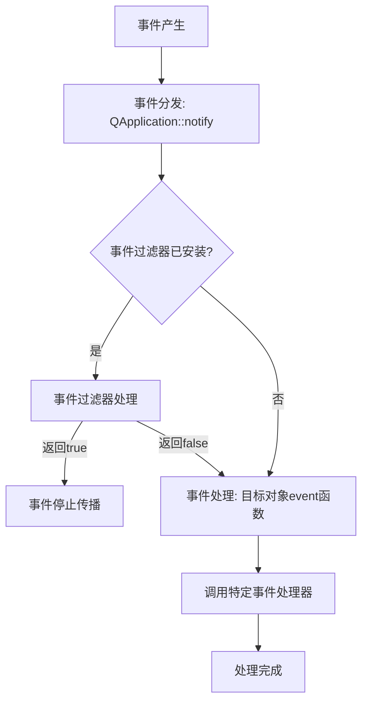

# 🙋‍♀️Qt基础

---

## main 程序

文件 `main.cpp` 中有 `main()`函数

```c++
#include "widget.h" 
#include <QApplication> 
int main(int argc, char *argv[]) 
{ 
 QApplication a(argc, argv); //定义并创建应用程序 
 Widget w; //定义并创建窗口对象 
 w.show(); //显示窗口 
 return a.exec(); //运行应用程序，开始应用程序的消息循环和事件处理 
} 
```

`main()`函数是 `C++`程序的入口。它的主要功能是定义并创建应用程序，定义并创建窗口对象 和显示窗口，运行应用程序，开始应用程序的消息循环和事件处理。  

`QApplication` 是 `Qt` 的标准应用程序类，`main()`函数里的第一行代码定义了一个 `QApplication`类型的变量 `a`，它就是应用程序对象。然后定义了一个 `Widget` 类型的变量 `w`，`Widget` 是本示例设 计的窗口的类名称，定义变量 `w` 就是创建窗口对象，然后用 `w.show()`显示此窗口。

函数里最后一行用 `a.exec()`启动应用程序，开始应用程序的消息循环和事件处理。GUI 应用程 序是事件驱动的，窗口上的各种组件接收鼠标或键盘的操作，并进行相应的处理。 

> 关键词：`QApplication` 创建应用程序、创建窗口对象 、应用程序消息循环和事件处理 

### `QApplication` 主事件循环

`Application`类中，除去启动参数、版本等相关东西后，关键就是维护了一个`QEventLoop`，`Application`的`exec`就是`QEventLoop`的`exec`。

不过`Application`中的这个`EventLoop`，我们称作“主事件循环”`Main EventLoop`。所有的事件分发、事件处理都从这里开始。

`Application`还提供了`sendEvent`和`poseEvent`两个函数，分别用来发送事件。`sendEvent`发出的事件会立即被处理，也就是“同步”执行。`postEvent`发送的事件会被加入事件队列，在下一轮事件循环时才处理，也就是“异步”执行。还有一个特殊的`sendPostedEvents`，是将已经加入队列中的准备异步执行的事件立即同步执行。

> 关键词：`QEventLoop`, `exec`, `sendEvent`, `poseEvent`, `sendPostedEvents`


## Qt 消息循环和事件处理机制

Qt 的消息循环和事件处理机制是其框架的核心，它使得 Qt 应用程序能够以**事件驱动**的方式（*什么是事件驱动方式?*）响应用户输入、系统通知或其他内部事件。

### ⚙️ 事件驱动模型与消息循环

Qt 应用程序是事件驱动的，其核心是一个持续运行的**消息循环**（Event Loop），负责监控和分发各种事件。

这个循环通常在主线程中通过调用 `QApplication::exec()`或 `QCoreApplication::exec()`启动，并贯穿应用程序的整个生命周期。事件循环在无事件处理时会高效阻塞，等待新事件，而不会空转消耗 CPU 资源。

> 关键词：事件循环，消息循环，异步事件，同步事件

事件可以分为**异步事件**和**同步事件**。大多数事件（如用户输入、窗口系统事件、定时器、网络事件）会被放入**事件队列**进行异步处理；而像 `sendEvent()`发送的事件或直接连接的**信号槽**则会同步处理，不经过事件队列。

> 关键词：事件队列

### 🔄 事件处理流程

一个事件从产生到被处理，通常经历以下阶段：

1. **事件产生**：事件可能来自窗口系统（如鼠标点击、键盘输入）、Qt 自身（如定时器超时 `QTimerEvent`）或用户程序通过 `QCoreApplication::postEvent()`提交的自定义事件；
2. **事件分发**：消息循环从事件队列中取出事件，Qt 的应用对象（如 `QApplication`）通过其 `notify()`函数将事件分发给相应的目标 `QObject`；
3. **事件过滤**（可选）：在事件到达目标对象之前，可以通过安装在该对象或其祖先上的**事件过滤器**进行拦截和处理。如果过滤器返回 `true`，事件将停止传播；
4. **事件处理**：事件最终被传递给目标对象的 `event()`函数。该函数会根据事件类型（如 `QEvent::MouseButtonPress`）调用特定的事件处理器（如 `mousePressEvent()`）。开发者通常通过重写这些特定的事件处理器来响应事件；



### 🧵 多线程与事件循环

Qt 支持每个线程拥有自己独立的事件循环。

主线程（通常是 GUI 线程）的事件循环负责处理所有界面相关的操作。

工作线程可以通过调用 `QThread::exec()`启动自己的事件循环，用于处理该线程中的网络通信、定时器等任务。

`QObject`实例具有**线程亲和性**，它在其被创建的线程的事件循环中处理事件。如果不同线程的 `QObject`需要通信，应使用 `QueuedConnection`方式的信号槽或 `postEvent`，这些请求会被异步放入接收者所在线程的事件队列，在其下一轮事件循环中处理，从而保证线程安全。可以使用 `moveToThread()`方法改变 `QObject`的线程亲和性。

### 💡 实践建议与注意事项

- **避免阻塞主事件循环**：在主事件循环中执行耗时操作（如复杂计算、文件读写、网络请求）会导致用户界面无响应。应将此类任务移至工作线程。
- **谨慎使用 `processEvents()`**：`QCoreApplication::processEvents()`会强制处理当前事件队列中的事件，可用于在长时间操作中保持 UI 响应，但过度使用可能导致递归事件处理，增加程序逻辑的复杂性，需谨慎使用。
- **合理选择事件处理方式**：**重写特定事件处理器**（如 `keyPressEvent`）：最简单直接，适用于处理特定部件上的特定事件。**重写 `event()`函数**：适用于需要集中处理多种事件类型，或在事件分发给特定处理器之前进行干预的情况。**安装事件过滤器**：功能强大，允许一个对象监控甚至拦截发送给另一个对象的事件，非常适合实现全局快捷键、输入验证等功能。


## 👨头文件 .h


```c++
#include <QWidget> 
QT_BEGIN_NAMESPACE 
namespace Ui { class Widget; } //一个名字空间 Ui，包含一个类 Widget 
QT_END_NAMESPACE 
 
class Widget : public QWidget 
{ 
 Q_OBJECT 
public: 
 Widget(QWidget *parent = nullptr); //构造函数 
 ～Widget(); //析构函数 
private: 
 Ui::Widget *ui; //使用 Ui::Widget 类定义的一个对象指针 
}; 
```

宏 **Q_OBJECT**，是使用 Qt 元对象系统的类时必须 插入的一个宏。插入了这个宏之后，Widget 类中就可以使用信号与槽、属性等功能。

> [!Tip]
>
> 对于可视化设计的主窗口对象，`MainWindow` 对应有有一个 `MainWindow.ui` 文件，这个文件是一个包含 UI 布局的 xml 对象，它会在编译阶段，由 qt 编译器编译并生成一个 `ui_MainWindow`控件，真实的控件实现
>
> 