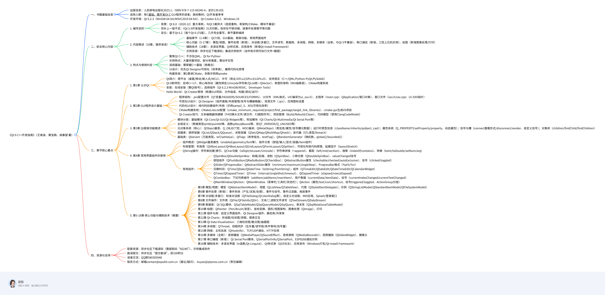

# qt 常用代码片段


## 画一条分割线

```c++
// 分隔线
QFrame* line = new QFrame(this);
line->setFrameShape(QFrame::HLine);
line->setFrameShadow(QFrame::Sunken);
line->setStyleSheet(R"(
    QFrame {
        height: 1px;
        background-color: #E5E5E5;
    }
)");
line->setFixedHeight(1);
```


## 创建带滚动条区域

```c++
QScrollArea* AnyWidget::createScrollArea() {
	QScrollArea* scrollArea = new QScrollArea(this);
	scrollArea->setObjectName("menuScrollArea");
	scrollArea->setWidgetResizable(true);
	// 禁用水平滚动条
	scrollArea->setHorizontalScrollBarPolicy(Qt::ScrollBarAlwaysOff);
	// 在需要时展示垂直滚动条
	scrollArea->setVerticalScrollBarPolicy(Qt::ScrollBarAsNeeded);
	// 设置滚动条样式
	scrollArea->setStyleSheet(R"(
		QScrollArea#menuScrollArea {
            background: transparent;
            border: none;
        }
        QScrollBar:vertical {
            width: 4px;
            background: transparent;
            margin: 0;
        }
        QScrollBar::handle:vertical {
            background: #CCCCCC;
            border-radius: 2px;
            min-height: 10px;
        }
        QScrollBar::handle:vertical:hover {
            background: #AAAAAA;
        }
        QScrollBar::add-line:vertical,
        QScrollBar::sub-line:vertical {
            height: 0;
        }
        QScrollBar::add-page:vertical,
        QScrollBar::sub-page:vertical {
            background: transparent;
        }
    )");
	return scrollArea;
}

// 调用时

// 创建滚动区域
m_scrollArea = createScrollArea();
// 将滚动条添加到主垂直布局中
m_v_main_layout->addWidget(m_scrollArea);
// 将 contentWidget 添加到滚动区域中
m_scrollArea->setWidget(m_contentWidget);
```


```

```




- 《Qt 6 C++开发指南》（王维波、栗宝鹃、侯春望 著）

  - 一、书籍基础信息

    - 出版信息：人民邮电出版社2023.1，ISBN 978-7-115-60240-4，定价139.8元
    - 适用人群：有C基础、需开发Qt C GUI程序的读者；高校教材；Qt开发者参考
    - 开发环境：Qt 6.2.3（MinGW 64-bit/MSVC2019 64-bit）、Qt Creator 6.0.2、Windows 10

  - 二、前言核心内容

    - 1. 编写目的

      - 背景：Qt 6.0（2020.12）重大革新，与Qt 5差异大（底层重构、新架构/CMake、模块不兼容）
      - 弥补上一版不足：《Qt 5.9开发指南》31次印刷，但存在不够详细、缺事件处理章节等问题
      - 定位：基于Qt 6.2（首个Qt 6 LTS版），几乎完全重写，章节重新编排

    - 2. 内容概述（18章，循序渐进）

      - 基础章节（1-4章）：Qt介绍、GUI基础、框架功能、常用界面组件
      - 核心功能（5-17章）：模型/视图、事件处理（新增）、对话框/多窗口、文件读写、数据库、多线程、网络、多媒体（全新，与Qt 5不兼容）、串口通信（新增，工控上位机实用）、绘图（新增图像处理/打印）
      - 辅助技术（18章）：多语言界面、Qt样式表、应用发布（新增Qt Install Framework）
      - 示例资源：异步社区下载源码；集成示例软件（含所有示例可执行文件+截图）

    - 3. 特点与使用约定

      - 聚焦Qt C++：不涉及QML、Qt for Python
      - 示例特点：大量完整项目，部分有难度，需动手实现
      - 适用基础：需掌握C++基础（类概念）
      - UI设计：优先Qt Designer可视化（效率高），兼顾代码化原理
      - 构建系统：第2章讲CMake，多数示例用qmake

  - 三、章节核心要点

    - 1. 第1章 认识Qt

      - Qt简介：跨平台（桌面/移动/嵌入式/MCU）、许可（商业/GPLv2/GPLv3/LGPLv3）、支持语言（C++/QML/Python-PyQt/PySide6）
      - Qt 6新特性：支持C++17、核心库改动（属性绑定/Unicode字符串/QList统一QVector）、新图形架构（RHI抽象层）、CMake构建系统
      - 安装：在线安装（需Qt账号），选择组件（Qt 6.2.3 MinGW/MSVC、Developer Tools）
      - Hello World：Qt Creator使用（新建GUI项目、文件组成、构建/调试/运行）

    - 2. 第2章 GUI程序设计基础

      - 程序结构：.pro配置文件（QT变量/HEADERS/SOURCES/FORMS）、UI文件（XML格式，UIC编译为ui_xxx.h）、主程序（main.cpp：QApplication/窗口对象）、窗口文件（xxx.h/xxx.cpp：Ui::XXX指针）
      - 可视化UI设计：Qt Designer（组件面板/布局管理/信号与槽编辑器）、资源文件（.qrc）、应用图标设置
      - 代码化UI设计：纯代码创建组件/布局（示例samp2_3，对比可视化效率）
      - CMake构建系统：CMakeLists.txt配置（cmake_minimum_required/project/find_package/target_link_libraries）、cmake-gui生成VS项目
      - Qt Creator技巧：文本编辑器快捷键（F4切换头文件/源文件、F2跟踪符号）、项目管理（Build/Rebuild/Clean）、代码模型（禁用ClangCodeModel）

    - 3. 第3章 Qt框架功能概述

      - 模块分类：基础模块（Qt Core/Qt GUI/Qt Widgets等）、附加模块（Qt Charts/Qt Multimedia/Qt Serial Port等）
      - 全局定义：（数据类型qint8/quint64等、函数qAbs/qBound等、宏QT_VERSION/Q_UNUSED等）
      - 元对象系统（核心）：QObject基类、Q_OBJECT宏、MOC编译；QMetaObject（类信息/属性/信号槽元数据）；运行时类型信息（className/inherits/qobject_cast）；属性系统（Q_PROPERTY/setProperty/property、动态属性）；信号与槽（connect重载形式/disconnect/sender、自定义信号）；对象树（children/findChild/findChildren）
      - 容器类：顺序容器（QList/QStack/QQueue）、关联容器（QSet/QMap/QMultiMap/QHash）；迭代器（STL类型/foreach）
      - 基础类：QVariant（万能类型，toT/setValue）、QFlags（枚举组合，testFlag）、QRandomGenerator（随机数，global()/bounded()）

    - 4. 第4章 常用界面组件的使用

      - 组件概述：QWidget基类属性（enabled/geometry/font等）、组件分类（按钮/输入/显示/容器/Item组件）
      - 布局管理：布局类（QVBoxLayout/QHBoxLayout/QGridLayout/QFormLayout/QSplitter）、可视化布局代码原理、延展因子（layoutStretch）
      - QString操作：字符串创建/索引、QChar功能（isDigit/toLower/Unicode）；字符串拼接（+append）、截取（left/mid/section）、搜索（indexOf/contains）、转换（toInt/toDouble/setNum/arg）
      - 常用组件：
        - QSpinBox/QDoubleSpinBox：前缀/后缀、进制（QSpinBox）、小数位数（QDoubleSpinBox）、valueChanged信号
        - 按钮组件（QPushButton/QRadioButton/QCheckBox）：QAbstractButton属性（checkable/checked/autoExclusive）、信号（clicked/toggled）
        - QSlider/QProgressBar：QAbstractSlider属性（minimum/maximum/singleStep）、ProgressBar格式（%p%/%v）
        - 日期时间：QTime/QDate/QDateTime（toString/fromString）；组件（QTimeEdit/QDateEdit/QDateTimeEdit/QCalendarWidget）
        - QTimer/QElapsedTimer：QTimer（interval/singleShot/timeout）、QElapsedTimer（elapsed/nsecsElapsed）
        - QComboBox：下拉列表操作（addItem/addItems/insertItem）、用户数据（currentData/itemData）、信号（currentIndexChanged/currentTextChanged）
        - QMainWindow/QAction：QMainWindow（菜单栏/工具栏/状态栏）；QAction（属性/text/icon/shortcut、信号triggered/toggled、ActionGroup分组）

    - 5. 第5-18章 核心功能与辅助技术（概要）

      - 第5章 模型/视图：模型（QAbstractItemModel）、视图（QListView/QTableView）、代理（QStyledItemDelegate）；示例（QStringListModel/QStandardItemModel/QFileSystemModel）
      - 第6章 事件处理（新增）：事件系统（产生/派发/处理）、事件与信号、事件过滤器、拖放事件
      - 第7章 对话框/多窗口：标准对话框（QFileDialog/QColorDialog等）、自定义对话框、MDI应用、Splash/登录窗口
      - 第8章 文件操作：文件类（QFile/QFileInfo/QDir）、文本/二进制文件读写（QTextStream/QDataStream）
      - 第9章 数据库：Qt SQL模块、QSqlTableModel/QSqlQueryModel/QSqlQuery、表关系（QSqlRelationalTableModel）
      - 第10章 绘图：QPainter（Pen/Brush/渐变）、坐标变换、图形/视图架构、图像处理（QImage）、打印
      - 第11章 插件与库：自定义界面组件、Qt Designer插件、静态库/共享库
      - 第12章 Qt Charts：折线图/柱状图/饼图、图表交互
      - 第13章 Qt Data Visualization：三维柱状图/散点图/曲面图
      - 第14章 多线程：QThread、线程同步（互斥量/读写锁/条件等待/信号量）
      - 第15章 网络：主机信息（QHostInfo）、TCP/UDP通信、HTTP应用
      - 第16章 多媒体（全新）：音频播放（QMediaPlayer/QSoundEffect）、音频录制（QMediaRecorder）、视频播放（QVideoWidget）、摄像头
      - 第17章 串口编程（新增）：Qt Serial Port模块、QSerialPortInfo/QSerialPort、ESP8266通信示例
      - 第18章 辅助技术：多语言界面（tr函数/Qt Linguist）、Qt样式表（QSS句法）、应用发布（Windows打包/Qt Install Framework）

  - 四、资源与支持

    - 配套资源：异步社区下载源码（需提取码“60240”）、示例集成软件
    - 勘误提交：异步社区“提交勘误”，获100积分
    - 读者交流：QQ群580305948
    - 联系方式：邮箱contact@epubit.com.cn（建议/疑问）、liuyasi@ptpress.com.cn（责任编辑）