# 如何使用 cmake 和 visual studio 2019 开发Qt应用

## 1. 创建基于 cmake 构建的 Qt 应用使用 QtCreator 即可

从零开始使用 cmake 构建一个 Qt 应用非常麻烦，还得从头学一下 cmake 相关知识，好多配置对于一个一直做前端开发的工程师来说确实很难搞懂，太费时间了。

不过，可以基于 QtCreator 直接创建，cmake 现在是 Qt 官方推荐的默认构建工具了。

以下是步骤（QtCreator 16.02）：

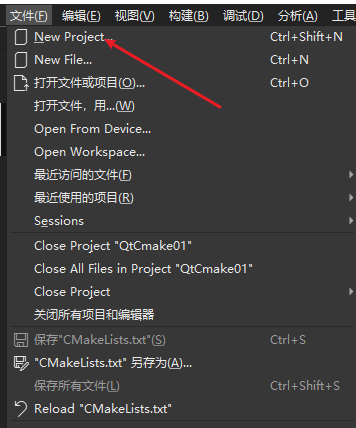

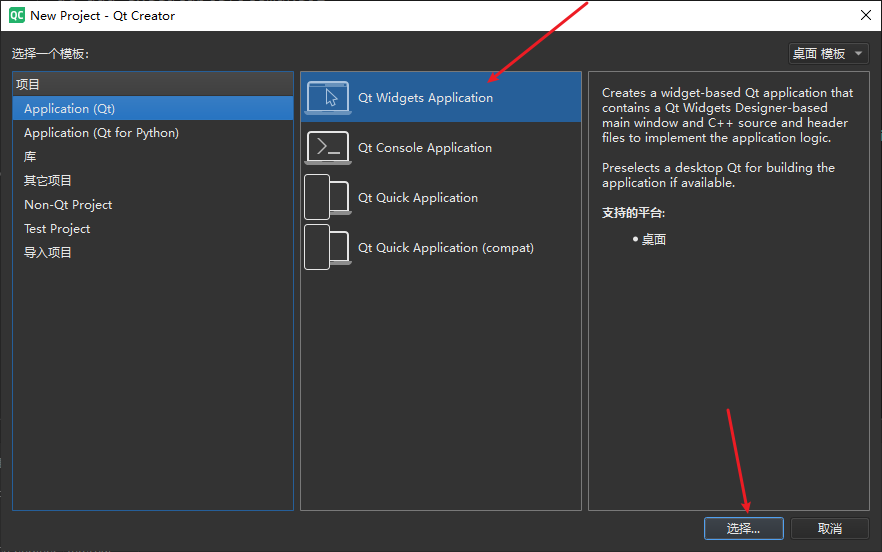

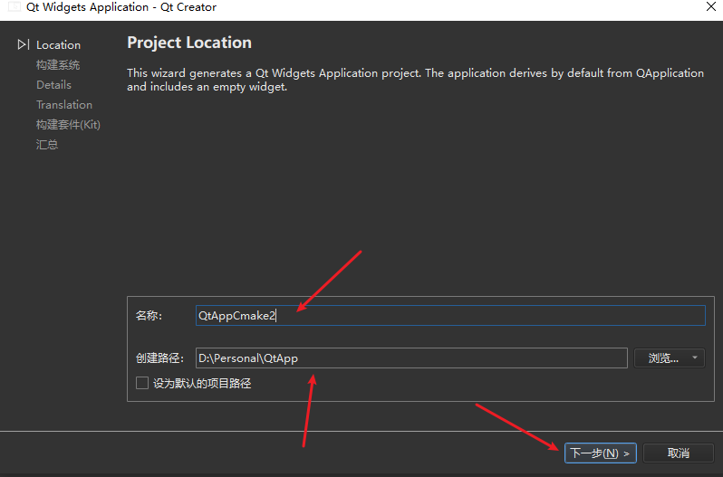

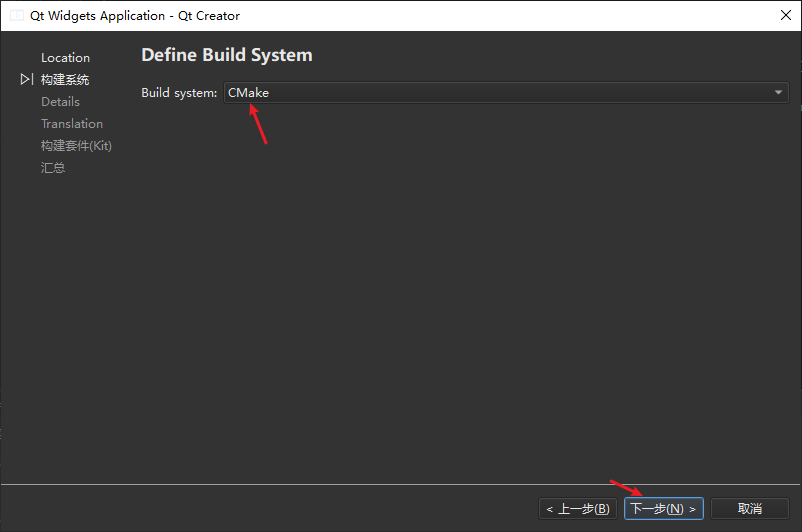

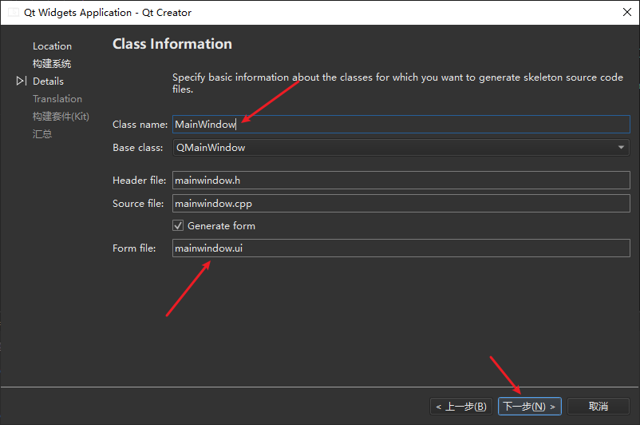

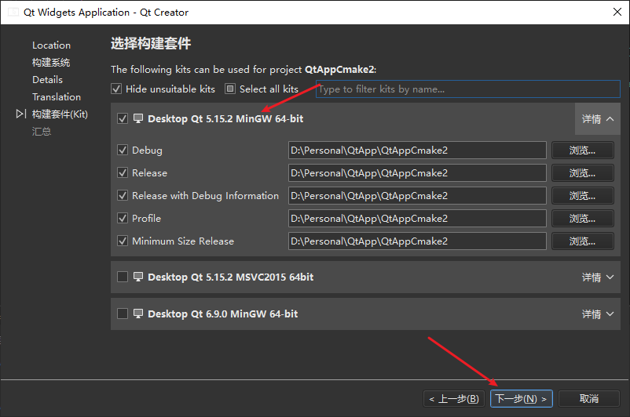

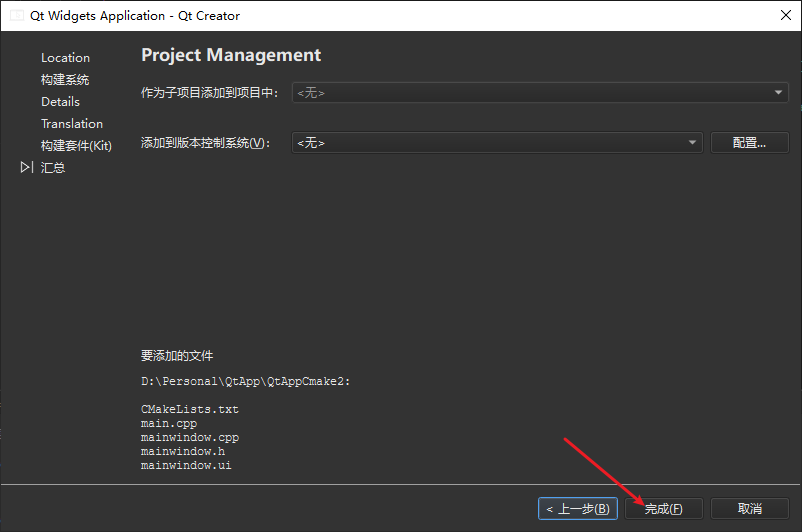

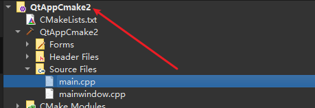

## 2. 使用 cmake-gui.exe 图形化工具可将 QtCreator 创建的项目转化为 visual studio 工程

`cmake-gui` 就是这个玩意，跟 `cmake` 工具配套的，双击 `exe` 文件即可运行。

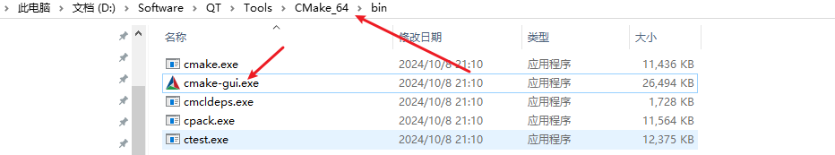

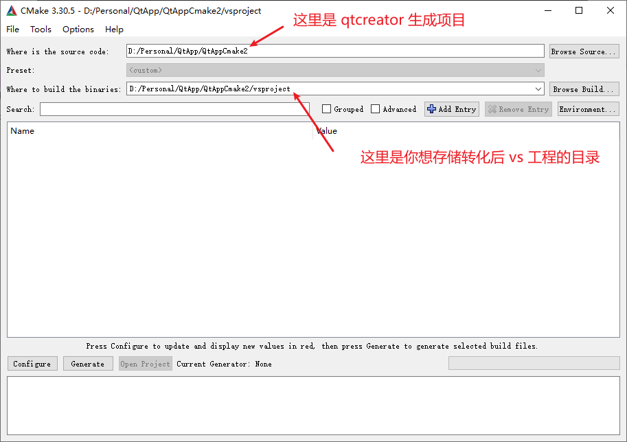

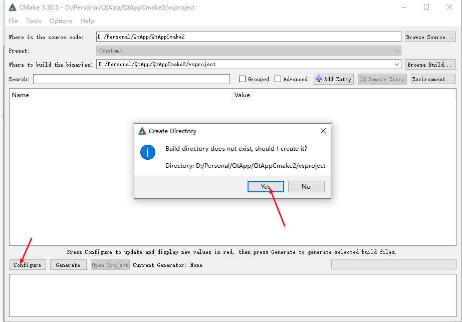

如果转存的 vs 路径不存在，会帮你创建。

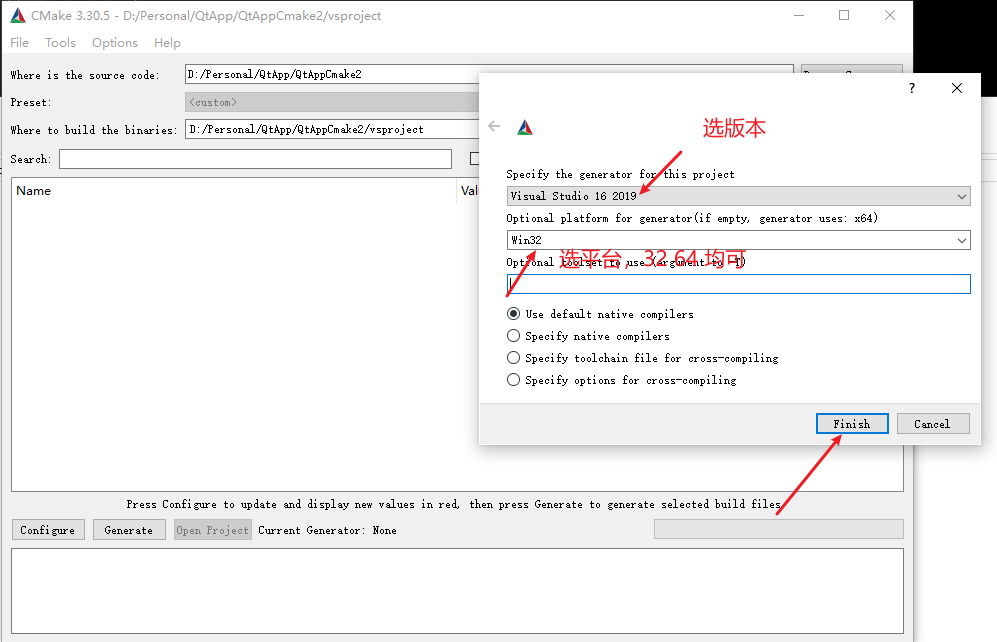

选完之后等一会，等到现实配置成功。会显示 `Configuring Done`.

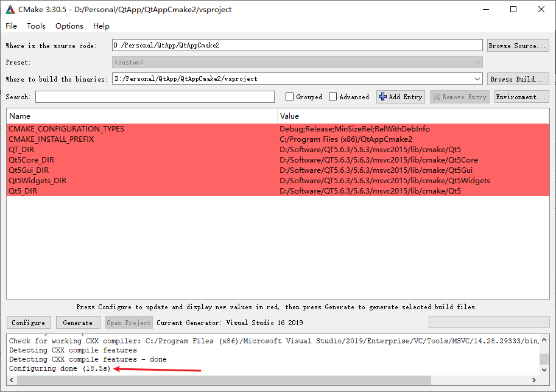

接着点击 `Generate` 按钮，再等一会，等待显示生成成功。

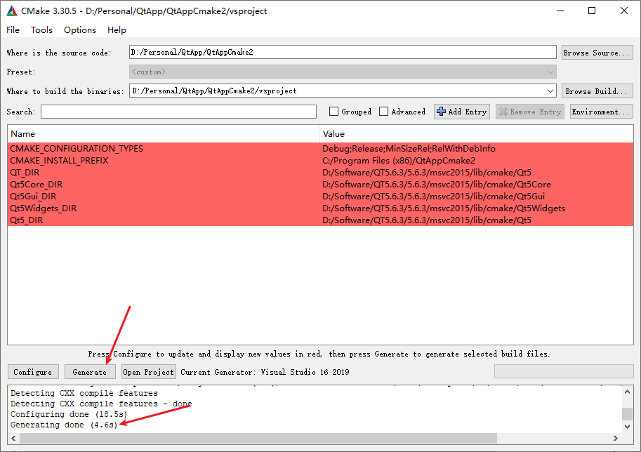

然后点击

这个 `Open Project` 可以唤醒 `visual studio` 并打开项目。

## 3. 使用 vs 运行转化后产物

打开后是这样的，但是不明白为啥有 4 个子项目（先不管了，未来也许会明白吧）。其中只有 `QtAppCmake2` 这个有用，其他三个要移除掉，不然会跑不起来。

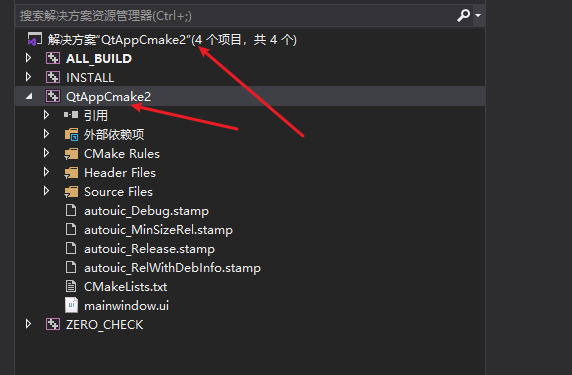

不移除时，生成解决方案之后，跑一下发现报这个错：

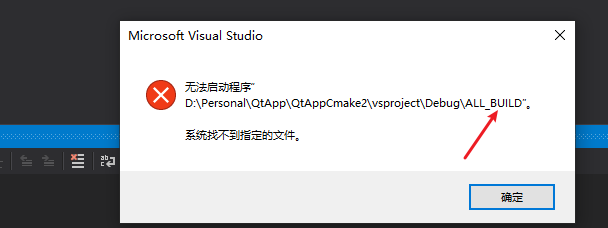

移除之后跑，一切正常：

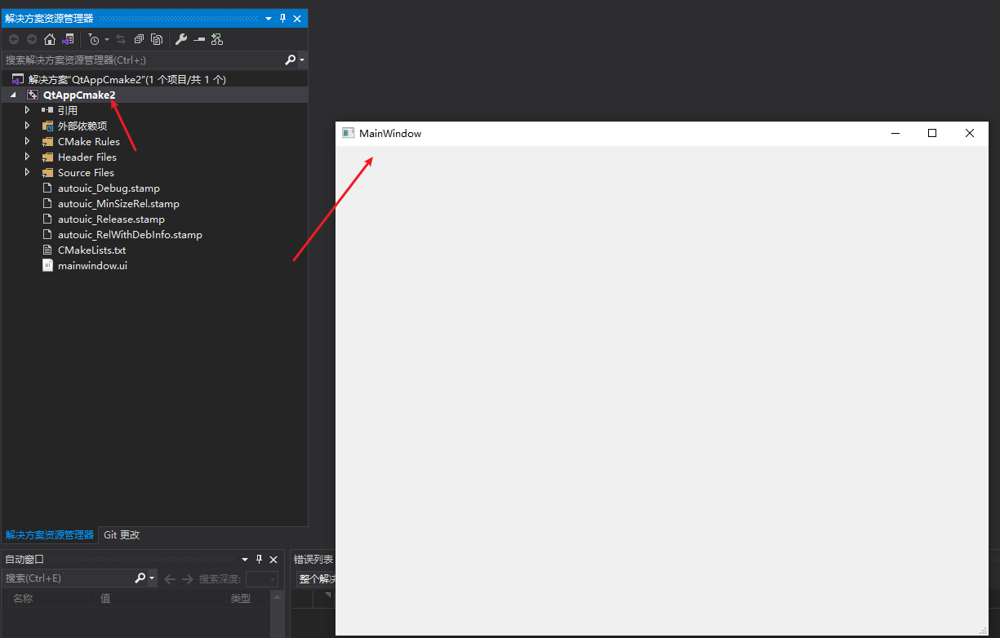

:shit: 吐槽一下，Qt 开发真的是太麻烦了，世界上怎么会有这么难用的东西，还是 web 好。
