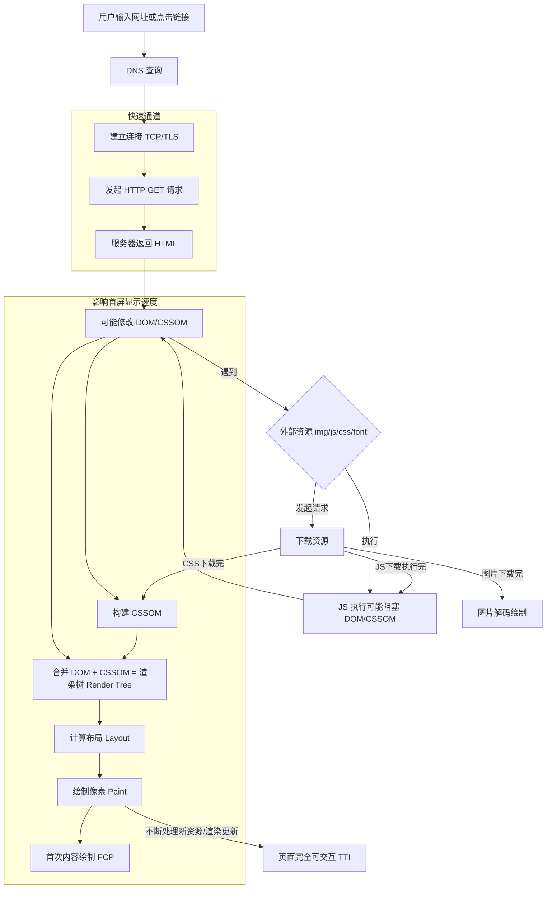
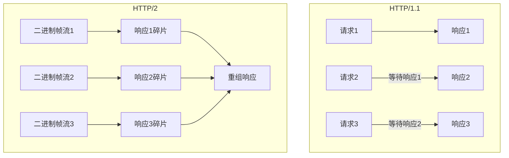
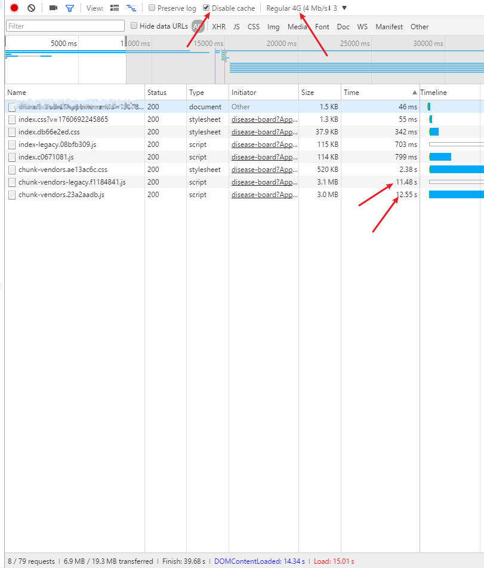
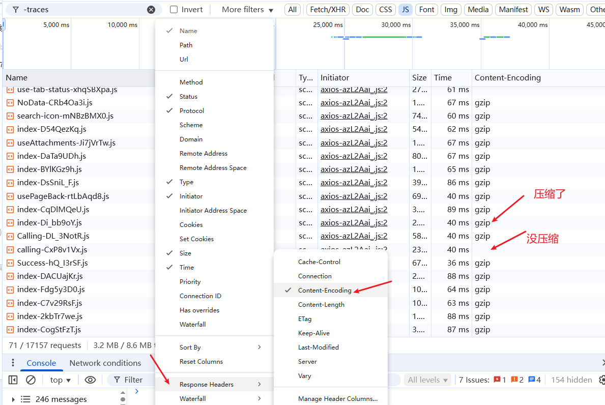
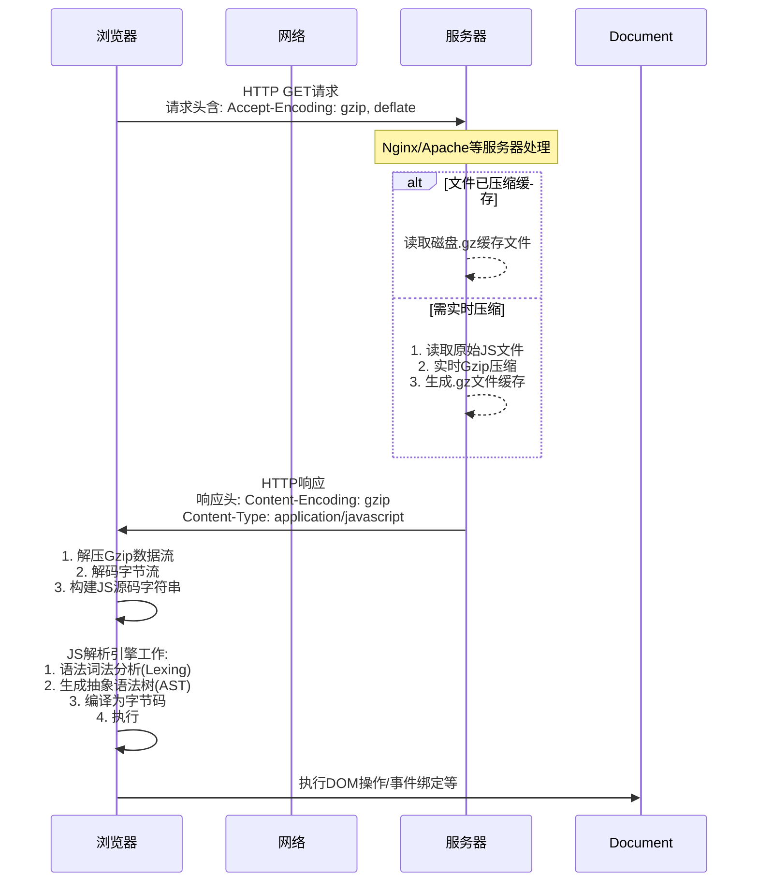
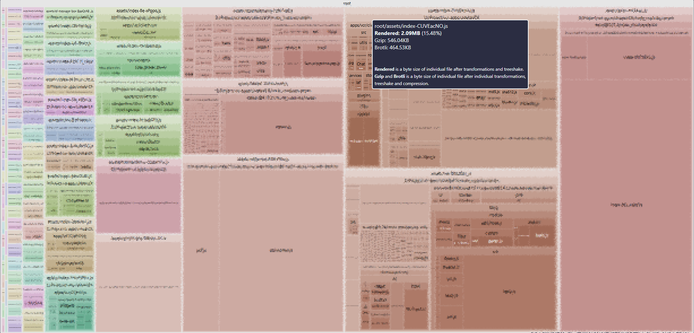
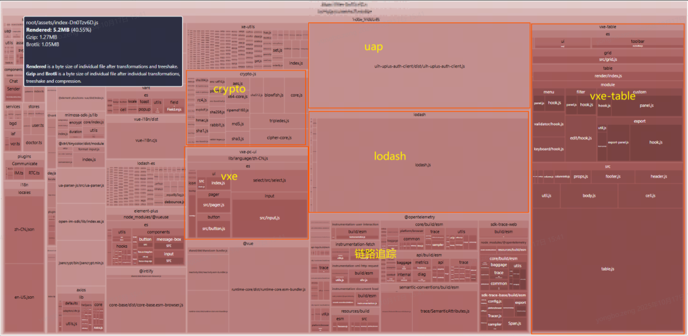
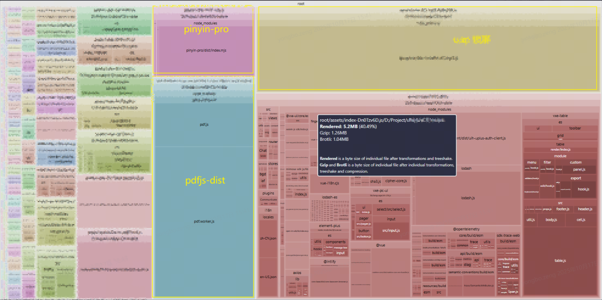
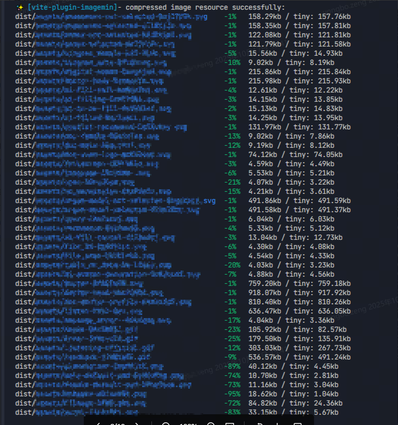

# 🎉基于Vite 的前端首屏加载优化实践


> 📌**TL、DR**
>
> 本文主要记录和阐述了我在基于 `vue3 + vite` 的前端开发过程中对项目进行首屏加载优化的一些实践。
>
> 常见优化手段有：使用 `http/2` 协议、应用资源开启 `gzip` 压缩、资源合理分片、文件懒加载、图片压缩等。根据实测，其中`gzip` 压缩、资源合理分片是优化效果最明显的两个手段。
>
> 除了上文中提到的优化手段外，还有使用 **CDN**、升级服务器配置、**浏览器缓存（默认带了）**等优化手段。


前端是用户使用应用的媒介，前端应用的性能直接影响产品的用户体验。Google研究表明，页面加载每延迟1秒，移动用户转化率下降高达20%。快速响应的界面能减少挫败感，提升粘性与忠诚度，57%的用户会因加载缓慢而放弃访问，因此前端应用性能优化对前端开发尤为重要。


## 影响首屏加载速度的因素🎆

那么影响首屏加载速度的因素有那些呢？

### 网页加载流程🔗

先来看看网页加载流程



根据以上流程，可以将网页加载的流程分为 3 个阶段：

- `https` 域名解析，建立服务链接
- 应用资源加载
- 页面渲染


### 影响因素分析🎢

其中域名 `DNS` 解析一般只要不是给墙了，速度都差不多，不会拉开太大差距。

主要耗时还是集中在应用资源加载和页面渲染两部分。而页面渲染这部分，一般影响也很小，基本只要所需材料都具备了，渲染起来是很快的，最起码到这一步了，页面就绝对不会维持白屏状态。

所以，影响首屏速度的最主要还是资源加载速度，因此这里我们仅针对资源加载优化进行深入讨论。


下面来聊一聊具体有哪些优化思路，这里仅根据我自己的项目实践经验来浅谈一下，或有不全或谬误之处，欢迎指点，虚心接受。

## 优化思路🎈

在网络带宽等因素确定的情况下，网络资源加载可从2个方面来优化。

- 优化加载资源数量
- 压缩加载资源体积

### 优化资源数量🧨

现代浏览器对同一个域名的 `http` 请求并发数一般为 **6** 个，会按照顺序依次请求，如果首页文件过多，则会导致首页请求的资源数过多，进而产生阻塞，影响首屏加载速度。

#### **使用 `http/2`**

第一个优化思路是使用 `http/2`, 以前的网络传输几乎都是使用 `http/1.1`, 对同一个域名的 `http` 请求并发数一般为 **6** 个。`http/2` 是新一代的网络传输协议，其以 **单连接多路复用** 的全新连接机制突破了 `http/1` 的并发限制，因此不会因资源数量产生阻塞。下面是 `http/1.1` 和 `http/2` 的特性对比和原理对比：

| 特性             | HTTP/1.1                                                     | HTTP/2                                                       | 性能影响                                            |
| ---------------- | ------------------------------------------------------------ | ------------------------------------------------------------ | --------------------------------------------------- |
| 传输协议         | 文本协议（明文传输）                                         | 二进制协议（二进制分帧层）                                   | ✅ 减少解析错误，提升传输效率                        |
| 连接方式         | 持久连接，但受浏览器并发连接数(通常6-8个)限制，且存在队头阻塞 | 单连接多路复用（一个连接并行传输）                           | ✅ 彻底解决队头阻塞，减少TCP握手开销（降低延迟50%+） |
| 头部压缩         | 无压缩（重复头部大量冗余）                                   | `HPACK`头部压缩                                              | ✅ 减少头部体积85%+（尤其Cookie复杂场景）            |
| 数据传输机制     | 串行响应（响应必须顺序到达）                                 | 二进制分帧 + 流优先级                                        | ✅ 关键资源优先加载（如`CSS/JS`），支持主动推送      |
| 服务器推送       | 不支持                                                       | 服务端主动推送（如`CSS/JS`），此特性需服务器主动配置，且实际应用策略需精心设计 | ✅ 减少往返次数（`RTT`），首屏加载提速30%+           |
| 依赖管理         | 无优先级控制                                                 | 流依赖树（Stream Dependencies）                              | ✅ 优先加载阻塞渲染资源（如字体文件优于图片）        |
| 请求-响应模型    | 纯“一问一答”模式                                             | 多路复用 + 全双工通信                                        | ✅ 突破浏览器并发限制，支持实时双向通信              |
| HTTP Pipelining  | 实验性支持（默认关闭，易队头阻塞）                           | 完全替代（不再需要）                                         | ⚠️ 解决Pipelining的队头阻塞问题                      |
| 安全性要求       | 可运行于HTTP明文                                             | 主流实现强制HTTPS（非协议要求）                              | 🔒 实际部署中大幅提升安全性                          |
| 协议扩展机制     | 依赖HTTP头部（如Upgrade）                                    | 内置扩展帧（`ALPN`协商）                                     | 🌐 更灵活的扩展支持（如`gRPC`基于`HTTP/2`）          |
| 典型延迟优化效果 | -                                                            | 降低50%~70%延迟（高延迟网络更显著）                          | 📊 平均页面加载时间减少30%-50%                       |



服务器默认基于 `http/1.1` 协议进行网络传输，开启 `http2`需在服务器进行配置，且需满足以下2个条件：

- 必须开启 `HTTPS`（证书要求）；
- 服务端支持（一般要求 Nginx≥1.9.5 / Apache≥2.4）

以下是一个 `nginx` 开启 `http/2` 的配置示例：

```nginx
server {
    listen 443 ssl http2;  # 👈 关键在此处添加 http2
    listen [::]:443 ssl http2;
    
    server_name yourdomain.com;
    
    # SSL 证书配置
    ssl_certificate /path/to/fullchain.pem;
    ssl_certificate_key /path/to/privkey.pem;
    
    # 推荐的安全协议套件
    ssl_protocols TLSv1.2 TLSv1.3;
    ssl_ciphers ECDHE-ECDSA-AES128-GCM-SHA256:ECDHE-RSA-AES128-GCM-SHA256;
    ssl_prefer_server_ciphers on;
    
    # HTTP/2 优化配置
    http2_push_preload on;       # 启用主动推送
    http2_idle_timeout 120s;     # 连接空闲超时

    # 其他配置...
    location / {
        root /var/www/html;
        index index.html;
    }
}
```

> [!Note]
>
> 以上示例仅供参考，未经过测试


#### **资源合并**

资源合并是另一个优化思路。

适当合并静态资源（比如 `svg` 图片），可以减少网络请求数量；

- 可以使用雪碧图替代单独的 `svg`图片；
- 对于小尺寸的`svg`图片，也可以在打包时直接内联到 `html` 或 `js` 文件中（`vite`中可配置对小于 `N kb`的`svg`图片直接内联到`html`文件中），但同时也需注意取舍，内联资源可能影响浏览器缓存；

```ts
// vite.config.ts
export default defineConfig(async ({ mode }) => {
        return {
                build: {
                  assetsInlineLimit: 4096 // 小于4kb的文件直接内联到index.html文件中，减少网络请求数量
                },
        }
	}
})
```

> [!Note]
>
> - 🎈合并资源时也需要注意合并的数量，如果合并后的文件尺寸太大，加载的时候会很耗时，需合理控制。
> - 🎃这个优化在与 `http/2` 结合使用时，可能会起反作用（`http/2` 没有并发限制，且加载小文件极快）。


#### **懒加载**

第三个优化思路是使用懒加载。

开发阶段，需注意在应用初始化的逻辑中控制依赖的加载，仅加载必要的资源，首屏非必要的资源应使用懒加载。

以下以 `vue` 项目中常见的 2 种使用场景为例来进行讲解：

1. **组件库初始化**

- 常规用法: 默认一般会在 `main.ts` 中全局导入组件。

```TypeScript
import { createApp } from 'vue'
import XXXComponent from 'XXXComponent'

// 全局加载后，不需要在组件中显式导入
createApp().use(XXXComponent)
```

全局导入时，应用加载时就会把整个组件库资源都加载进来，初始化时加载的资源数就多很多。

- **优化方案：按需加载**

即不使用全局导入，只在使用的地方按需导入即可。

```HTML
// App.vue
<template>
    <div>
        <el-input />
    </div>
</template>
<script setup lang='ts'>
import { ElInut } from 'element-plus'
</script>
```

vue 项目中基本主流组件库都提供了按需加载、自动导入的方案。配合 `unplugin-auto-import` 和 `unplugin-vue-components` 插件，可实现按需加载和自动引入，其效果和全局导入一致，不必在使用的地方进行显式 `import`.

- `unplugin-auto-import` 和 `unplugin-vue-components` 使用示例

```TypeScript
// vite.config.ts
import AutoImport from 'unplugin-auto-import/vite'
import { VantResolver } from '@vant/auto-import-resolver'
import { ElementPlusResolver } from 'unplugin-vue-components/resolvers'
import Components from 'unplugin-vue-components/vite'

export default defineConfig(() => {
    return {
        plugin: [
          AutoImport({
            resolvers: [VantResolver(), ElementPlusResolver()]
          }),
          lazyImport({
            resolvers: [
              VxeResolver({ libraryName: 'vxe-table' }),
              VxeResolver({
                libraryName: 'vxe-pc-ui'
              })
            ]
          }),
          Components({
            resolvers: [VantResolver(), ElementPlusResolver()]
          }),
        ]
    }
})
```

2. **路由懒加载**

以下是一个 `vue-router` 官方文档给出的示例，默认一般都会使用这种形式。

```TypeScript
import { createMemoryHistory, createRouter } from 'vue-router'
import HomeView from './HomeView.vue'
import AboutView from './AboutView.vue'

const routes = [
    { path: '/', component: HomeView },
    { path: '/about', component: AboutView },
]
const router = createRouter({
    history: createMemoryHistory(), routes,
})
```

这样配置，那应用初始化时，默认就会加载全部的路由组件。

```TypeScript
import { createApp } from 'vue'
import router from '@/router'

createApp().use(router)
```

所以，在配置路由时，一般都推荐组件使用按需加载的方式。

```TypeScript
import { createMemoryHistory, createRouter } from 'vue-router'


const routes = [
    { path: '/', component: () => import('./HomeView.vue') },
    { path: '/about', component: () => import('./AboutView.vue') },
]
const router = createRouter({
    history: createMemoryHistory(), routes,
})
```

这样配置，则不同页面组件仅会在切换到对应路由时才会加载，就可以避免首屏加载时加载不必要的资源文件。


### 优化资源大小🎄

单体文件尺寸过大可能是影响首屏渲染速度的最大因素。我们打开控制台观察应用加载时的网络请求，会发现一个很常见的现象：大部分资源早早的就已加载完毕，但是还剩那么一到2个 `size` 很大的 `js` 文件还在加载，导致阻塞，进而导致长时间白屏。

已知的几个主流的打包工具在打包时通常会将三方依赖打到同一个 `chunk` 文件中，这是一个默认的策略。所以使用前端开发框架的默认打包策略时，打的包都有一个显著的特点，基本生成的打包产物中都有一个 `size` 比较大的 `vendors` 文件，因此常见的一个白屏现象是，其他所有的小文件都加载完了，最后剩一个好几兆的 `js`文件还在那吭哧吭哧 `load`, 把浏览器网速调到 `4G` 模式，这个问题会变得非常明显。



一般来说 `pc` 端页面上出现这种问题的较少,即使单个文件大小好几兆,也无太大压力,基本还是 `H5` 页面居多，因为移动设备的网络受限因素比较多，很多场景下**网速波动**比较大，导致有时应用加载慢。

针对此问题，可以使用 **打包压缩、代码分割、图片压缩** 等几个手段来进行优化。


#### 打包压缩

首先是**打包压缩**。

默认情况下，打包工具 build 的包是没有压缩的。浏览器请求未压缩的资源尺寸会比较大。

可以先按下面这个操作，看下你的资源是否压缩了👇。

打开浏览器控制台，切到网络请求模块，调出下面这个菜单，找到 `Response Header` 中的 `Content-Encoding` 字段，勾选，然后在网络请求详情中会出现 `Content-Encoding` 列，这一列会列出每个资源文件的 `Content-Encoding` 值，如下图所示。




如果没有进行压缩，则可通过对静态资源进行压缩处理，以显著减小资源体积。

主流压缩方法有2种：

- `Gzip` 压缩，主流，广泛使用
- `Brotli` 压缩，较新，压缩率高

>  [!Note]
>
>  后文的讲解都以 `gzip` 压缩为例，`Brotli` 没用过，不过也是类似机制。


以下是客户端请求 `gzip` 资源的主要流程。



实现 `gzip` 压缩有2种方式：

- 动态压缩：服务器在资源请求时实时进行压缩（首次压缩后，服务器会缓存压缩文件，不会每次请求都压缩）。
- 静态压缩：服务器不压缩，应用打包时直接压缩好, 每个文件对应生成 `.gz` 文件，请求是服务器优先返回压缩好的文件。

下面以 `nginx` 服务为例进行讲解。

##### **动态压缩**

动态压缩是指 **`Nginx`**服务器在发送前端产物时，消耗自身的资源进行实时压缩，这样即便产物中不存在 **`.gz`**结尾的文件，浏览器端也能拿到 **`gzip`**格式的前端产物。其一般配置如下：

以 `nginx` 为例：

```Nginx
http {
    # 开启Gzip压缩
    gzip on;

    # 压缩级别（1-9，建议4-6）
    gzip_comp_level 5;

    # 最小压缩文件大小（小于1K的文件不压缩）
    gzip_min_length 1k;

    # 启用对代理服务器的Gzip支持
    gzip_proxied any;

    # 压缩的MIME类型（根据需求调整）
    gzip_types
        application/javascript
        application/json
        application/xml
        application/rss+xml
        application/xhtml+xml
        application/x-javascript
        font/otf
        font/ttf
        image/svg+xml
        text/css
        text/javascript
        text/plain
        text/xml;

    # 添加响应头 "Vary: Accept-Encoding"
    gzip_vary on;

    # 禁用对IE6及以下的压缩（已弃用但保留兼容性）
    gzip_disable "msie6";

    # 可选：缓冲设置（默认32 * 4k=128k）
    gzip_buffers 32 8k;

    # 可选：启用对HTTP/1.0代理的支持
    gzip_http_version 1.0;
}
```

📌 关键参数说明：

| 配置项          | 作用                                                 |
| --------------- | ---------------------------------------------------- |
| gzip on;        | 核心开关                                             |
| gzip_comp_level | 压缩级别（1最低压缩率/最快 → 9最高压缩率/CPU消耗高） |
| gzip_min_length | 低于此大小的文件不压缩（默认20字节，建议设为1K）     |
| gzip_types      | 指定压缩的文件类型（必须配置，否则只压缩默认类型）   |
| gzip_vary on;   | 添加 Vary: Accept-Encoding 响应头，利于缓存          |
| gzip_proxied    | 对代理请求启用压缩（any 表示全部启用）               |
| gzip_disable    | 禁用特定客户端的压缩（如旧版IE）                     |


##### **静态压缩**

静态压缩指服务器不对请求资源做压缩处理，而是会直接将打包产物中**预先压缩过的压缩文件**(如何预压缩👇)返回给浏览器，如果找不到 **`.gz`**文件，将会使用对应的原始文件。

开启静态压缩需要保证 **`Nginx`**存在 **`ngx_http_gzip_static_module`**模块，这个模块默认不开启，需要使用 **`--with-http_gzip_static_module`**来激活。

> [!Note]
>
> 现在都使用 docker 来部署 `nginx` 了，其内置的 `nginx` 镜像其实是默认支持此模块的，因此一般不用做上一步，当然，如果出现问题，则可向该方向排查。

激活后增加如下配置，适静态压缩生效：

```Nginx
gzip_static  on;
```

> [!Note]
>
> 静态资源压缩时可不必对所有文件都进行压缩，因浏览器需对压缩文件进行`解压`，这部分工作也会消耗浏览器计算资源，略微影响一丢丢加载速度。建议将`二者结合起来`，仅针对 `size` 比较大的资源进行压缩，比如 `> 10K` 的资源。 不过这部分的性能损耗非常非常小，微乎其微，实际在使用 `LightHouse` 进行性能测试时，优化建议都会推荐所有文件进行压缩。


##### **Vite 中如何对打包产物进行压缩？**

Vite 中可使用  [vite-plugin-compression](https://github.com/vbenjs/vite-plugin-compression) 插件对打包产物进行压缩。具体用法如下：

```TypeScript
import viteCompression from 'vite-plugin-compression';
export default defineConfig(async ({ mode }) => {
    return {
        plugins: [viteCompression(
            verbose: true, // 打印压缩信息
            disable: false, // 禁用压缩
            threshold: 1024 * 200, // 200k 以上的文件进行压缩
            algorithm: 'gzip', // 使用 gzip 算法
            deleteOriginFile: false, // 压缩后删除源文件
            filter: (fileName) => {
               // html 文件和 svg 文件不压缩
              return !fileName.endsWith('html') && !fileName.endsWith('svg')
            }
        )],
    };
});
```


#### 代码分割

**代码分割**是另一个非常有效的优化手段。

打包工具在打包时默认的产物分块策略会比较粗暴，大部分依赖可能打到一个文件里了，`vite` 打包时默认会将 `vue` 等库都打到一个大文件里，再加上`路由库`, `状态管理库`, `组件库`,还有其他各类依赖，最后就会导致有的文件尺寸超大。(`webpack`, `tubopack`,`rspack`等工具类似)。

##### **产物分析**

在做具体的代码分割前，我们可以利用 产物分析工具 来对项目打包的产物进行可视化分析，找到尺寸过大的包，分析每个包的具体组成，确定最佳的拆分路径。

Vite 项目中可使用 [rollup-plugin-visualizer](https://www.npmjs.com/package/rollup-plugin-visualizer) 插件实现此功能（其他打包工具也有类似插件）。

其配置如下：

```TypeScript
import { visualizer } from 'rollup-plugin-visualizer'

export default defineConfig(async ({ mode }) => {
        return {
            plugin: [
                  // 打包文件大小可视化插件，可对打包内容进行分析，找出大文件进行拆包
                  visualizer({
                    gzipSize: true,
                    brotliSize: true,
                    emitFile: true,
                    filename: 'report.html', //分析图生成的文件名
                    open: true //如果存在本地服务端口，将在打包后自动展示
                  }),
            ]
        }
    }
})
```

打包后，会在产物目录下生成一个 report.html 文件，打开该文件可查看具体的产物分析视图。



通过此分析报告，我们可快速找到产物中那些尺寸过大的 chunk, 可查看具体 chunk 的产物组成，其内部包含了哪些依赖，哪些依赖可以进行拆分。

##### **代码分割**

进行产物分析后，我们即可对具体的尺寸过大的包进行拆分。以我的一个项目的打包产物为例进行分析。

其中如下包占比较大

- `lodash`
- `crypto`
- `vxe`
- `pdfjs-dist`
- `pinyin`





接下来可对具体的包进行拆分处理，vite 的打包配置中开放了自定义打包钩子，可实现自定义拆包。

[产物分块策略](https://cn.vitejs.dev/guide/build.html)

不过因为拆包涉及比较复杂的产物依赖处理，如循环依赖问题，处理难度可能较大，因此推荐使用社区中的 `vite` 分包插件来进行处理。

推荐使用如下插件：

[vite-plugin-chunk-split](https://www.npmjs.com/package/vite-plugin-chunk-split)

以下是具体的配置：

```TypeScript
export default defineConfig(async ({ mode }) => {
  const env = loadEnv(mode, process.cwd())
  const { chunkSplitPlugin } = await import('vite-plugin-chunk-split')
  
  return {
      plugin: [
            chunkSplitPlugin({
                // 对不经常变更的外部依赖库拆分到单独的打包文件中，避免vite默认打包方式造成的单个打包文件过大
                strategy: 'default',
                customSplitting: {
                  axios: [/axios/],
                  lodash: [/lodash-es/, /lodash/],
                  dayjs: [/dayjs/],
                  'pinyin-pro': [/pinyin-pro/],
                  'oidc-client': [/oidc-client/],
                  opentelemetry: [/@opentelemetry/],
                  'pdfjs-dist': [/pdfjs-dist/],
                  vxe: [/vxe-pc-ui/, /vxe-table/]
                }
              }),
          ]
      }
  })
```


##### **图片压缩**

除了对 `js`、`css` 等文件尺寸进行优化外，应用中的图片资源 `size` 也需要进行优化。

项目开发中我们可能会用到大量图片资源，有时候设计师会提供一些比较高清的图片，这些图片体积也会很大，影响加载速度，因此在打包过程中可以对图片资源进行压缩。

图片压缩推荐使用 [:framed_picture: vite-plugin-imagemin](https://www.npmjs.com/package/vite-plugin-imagemin)。

以下是一个使用 `vite-plugin-imagemin` 打包的具体配置好打包结果：

```TypeScript
import viteImagemin from 'vite-plugin-imagemin'

export default defineConfig(() => {
    return {
        plugin: [
          viteImagemin({
            gifsicle: {
              optimizationLevel: 7,
              interlaced: false
            },
            optipng: {
              optimizationLevel: 6
            },
            mozjpeg: {
              quality: 20
            },
            pngquant: {
              quality: [0.8, 0.9],
              speed: 4
            },
            svgo: {
              plugins: [
                {
                  name: 'removeViewBox'
                },
                {
                  name: 'removeEmptyAttrs',
                  active: false
                }
              ]
            }
          }),
        ]
    }
})
```



> 参考资料：[Vite 如何优化项目的图片体积使用 `vite-plugin-imagemin@0.6.1` 进行图片压缩，支持 GI - 掘金](https://juejin.cn/post/7478111209222635547)

可以看到，图片资源压缩后体积优化也还是比较明显的。

因为这个操作在打包过程中进行，所以相应的，打包流程耗时会增加，在实操过程中需要根据项目情况进行取舍。


## 总结📚

本文主要记录和阐述了我在基于 `vue3 + vite` 的前端开发过程中对项目进行首屏加载优化的一些实践。

常见优化手段有：使用 `http/2` 协议、应用资源开启 `gzip` 压缩、资源合理分片、文件懒加载、图片压缩等。根据实测，其中`gzip` 压缩、资源合理分片是优化效果最明显的两个手段。

除了上文中提到的优化手段外，还有使用 **CDN**、升级服务器配置、**浏览器缓存（默认带了）**等优化手段。


下面是本文的一些参考资料、开源库以及涉及相关话题的一些优质博客,对资源分享者表示感谢。

## 参考资料&扩展阅读📚

https://github.com/vbenjs/vite-plugin-compression

[Vite 如何优化项目的图片体积使用 `vite-plugin-imagemin@0.6.1` 进行图片压缩，支持 GI - 掘金](https://juejin.cn/post/7478111209222635547)

[当面试官问我前端可以做的性能优化有哪些面试过程中面试官问到前端性能优化有哪些，当我咔咔一顿输出之后面试官追问:前端可以做 - 掘金](https://juejin.cn/post/7194400984490049573)

[我救了一个网站，性能提升了1500 多倍!虽然这并不是所有的网站优化方法(还有后端优化、Web Workers、Serv - 掘金](https://juejin.cn/post/7521954333884334132#heading-5)

[一份完整的「前端性能优化」手册大家好，我是风骨，今天和大家分享一篇有关「前端性能优化」的话题。作为优秀的前端工程师，我们 - 掘金](https://juejin.cn/post/7429128606749949978#heading-14)

[📈 Vue首屏优化终极指南:10大黑科技让加载速度飙升300%(附实战代码)为什么你的Vue应用首屏总在转圈? 20 - 掘金](https://juejin.cn/post/7482265923919822875)

[前端性能优化——包体积压缩82%、打包速度提升65%压缩项目打包后的体积大小、提升打包速度，是前端性能优化中非常重要的环 - 掘金](https://juejin.cn/post/7186315052465520698#heading-7)

[前端性能优化之雅虎35条军规本文主要考虑客户端性能、服务器端和网络性能，内容框架来自Yahoo Developer Ne - 掘金](https://juejin.cn/post/6844903657318645767#heading-1)


> [!important] 
>
> 文章首发于 `Robert Zeng` 的 [个人博客](https://upthen.me), 转载请注明出处