# 五代十国历史发展大纲

## 引言

五代十国（907 年 - 979 年）是中国历史上继唐朝之后的大分裂时期，这一称谓出自《新五代史》，是对五代（907 年 - 960 年）与十国（902 年 - 979 年）的合称。从 907 年朱温废唐哀帝建立后梁开始，到 979 年宋太宗灭北汉为止，前后绵延 72 年。这一时期中原地区政权更迭频繁，短短 53 年间先后出现了 14 个皇帝，平均在位时间仅 3.8 年。

五代十国本质上是中晚唐藩镇割据的延续和扩大，同时也是中国走向统一的过渡时期。唐朝灭亡后，藩镇割据的局面仍然存在，各地藩镇或名义上臣服中原王朝，或公开割据，其中统治时间较长的有十个主要政权，合称为 "十国"。

本大纲将从五代十国的历史背景开始，系统梳理五代更替轨迹和十国发展脉络，详细分析关键历史事件和重要历史人物，最后简要介绍这一时期的经济文化发展。

## 一、五代十国的历史背景与起源

### 1.1 唐朝中后期的政治危机

唐朝的衰落是一个漫长的过程，其根源早在安史之乱（755 年 - 763 年）后便已种下。安史之乱是唐朝由盛转衰的转折点，这场持续八年的内战对政治、经济、社会和文化造成了深远影响。

**安史之乱的爆发与影响**

天宝十四载（755 年）十一月，身兼范阳、河东、平卢三镇节度使的安禄山以 "忧国之危"、奉密诏讨伐杨国忠为借口，在范阳（今北京）起兵反叛，率 15 万大军南下。由于唐朝内地久无战事，军备废弛，叛军一路势如破竹，仅 33 天便占领东都洛阳，安禄山在洛阳称帝，国号 "大燕"。

经过七年多的战争，广德元年（763 年），史朝义众叛亲离，逃至范阳时被部将李怀仙追杀，自缢而死，安史之乱正式结束。这场叛乱虽然被平定，但却带来了严重后果：唐朝的社会生产力遭到严重破坏，人口大量丧失，国力锐减；更重要的是，**藩镇割据势力在战乱中越来越强大**，严重削弱了中央集权。

**藩镇割据的形成与发展**

为了尽快平定安史之乱，唐朝不得不承认安史旧将田承嗣、李怀仙等人为河北三镇节度使。唐朝为了笼络河北降将，先后任命张忠志为成德军节度使（统恒、赵、深、定、易五州），田承嗣为魏博节度使（统魏、博、德、沧、瀛五州），李怀仙为幽州卢龙节度使（统幽、营、平、蓟、妫、檀、莫七州）。

这些原属安史的叛将名义上归顺朝廷，实际上并不服从中央，自己署置将吏官员，各握强兵数万，租赋不上供，形成地方割据势力。河朔三镇（幽州、成德、魏博）成为唐朝中后期盘踞在河北地区的三个强大藩镇势力，形成 "虽称藩臣，实非王臣" 的割据格局。

**唐朝后期的政治腐败**

除了藩镇割据，唐朝后期还面临着严重的政治腐败问题。在朝堂之上，以牛僧孺和李德裕为首的两大官僚集团展开了长达四十年的 "牛李党争"。宦官专权问题也日益严重，宦官不仅掌握了宫廷禁军，还干预朝政，甚至废立皇帝。

均田制与租庸调制的瓦解是唐朝经济基础崩溃的标志。土地兼并严重，大量农民失去土地，社会矛盾激化。到了 873 年，皇位传到唐僖宗手里时，大唐帝国已然是风雨飘摇，时刻面临倾覆的危险。

### 1.2 黄巢起义与唐朝的灭亡

**黄巢起义的爆发与发展**

在唐朝内部腐败不堪、贪腐盛行、百姓陷入水深火热的背景下，爆发了黄巢起义。乾符五年（878 年）至中和四年（884 年），由黄巢领导的这场民变，是王仙芝起义的后续，也是唐末民变中历时最久、遍及最大、影响最深远的一场农民起义。

黄巢起义采用流动作战的方式，避实攻虚，走遍今天山东、河南、安徽、浙江、江西、福建、广东、广西、湖南、湖北、陕西等省广大地区，动摇了唐朝的统治。广明元年（880 年）十一月，黄巢军进入长安，在含元殿即皇帝位，建立了大齐政权，年号金统。

**黄巢起义的失败与影响**

中和二年（882 年），齐军将领朱温在同州与王重荣交战中投降唐军，被任命为右金吾大将军，赐名全忠。中和三年（883 年），黄巢被迫撤出长安。中和四年（884 年），黄巢在泰山狼虎谷兵败自杀，历时九年的黄巢起义最终失败。

黄巢起义虽然失败了，但它对唐朝的打击是致命的。长安、洛阳等核心城市遭到严重破坏，经济彻底崩溃。更重要的是，在镇压起义的过程中，**黄巢旧将朱全忠（朱温）以及沙陀贵族李克用等人被授予节度使等官职，地方军阀权力的不断扩张，使唐朝中央的权威进一步削弱，加深了唐朝藩镇割据的政治状况，唐朝的统治名存实亡**。

**朱温篡唐与唐朝灭亡**

黄巢起义失败后，唐朝又勉强维持了二十三年统治。这期间，朱温凭借镇压起义的战功，被封为宣武节度使，盘踞汴州（今河南开封）。他逐步控制了唐昭宗，并最终利用内乱将唐昭宗弑杀，扶持唐哀帝上位。

天祐二年（905 年）六月，朱温在滑州白马驿悍然屠杀宰相裴枢、独孤损等朝臣 "清流" 三十余人，投尸黄河，史称 "白马驿之祸"。这一事件彻底扫除了唐朝政府的势力。天祐四年（907 年）四月，梁王朱晃（本名朱温，唐僖宗赐名朱全忠）接受唐哀帝李柷禅让，在中原地区建立 "后梁"，定都东京开封府（今河南开封），改元开平，唐朝正式覆灭，中国历史进入 "五代十国" 时期。

## 二、五代更替轨迹（907-960 年）

### 2.1 后梁（907-923 年）

**建立背景与过程**

后梁是五代十国时期的第一个朝代，由朱温（朱全忠）建立，标志着唐朝的正式灭亡。朱温出身宋州砀山（今安徽砀山）的贫苦家庭，父亲早逝，母亲改嫁，年轻时 "不事生业，以雄勇自负"。唐僖宗乾符年间，朱温参加黄巢农民起义军，中和二年（882 年），因黄巢军势衰弱、军心涣散，归降唐朝，被唐僖宗赐名 "朱全忠"，任命为左金吾卫大将军、河中行营副招讨使。

因镇压黄巢起义有功，中和三年（883 年）朱温被封为宣武军节度使。此后，朱温以宣武镇为基本盘，开始了大规模的兼并战争。他采用灵活的策略，攻打一方拉拢一方，鲜有两面受敌的情况，而且打下一地稳定一地，因此实力越打越强。

**后梁的建立与统治**

经过多年征战，朱温逐渐成为唐末最大的割据势力。天祐四年（907 年）四月，朱温逼迫唐哀帝李柷禅位，正式登基称帝，国号 "大梁"（史称后梁），改元开平，定都开封（称东都），以洛阳为西都。

后梁建立后，与各地割据藩镇的战争仍在继续。朱温称帝期间，主要对手是晋王李克用。两人都是因剿黄巢而崛起，有深仇大恨，开启了五代乱世 "梁晋争霸" 格局。然而，朱温在与李克用父子的作战中屡遭失败，逐渐处于劣势。

**后梁的灭亡**

乾化二年（912 年），朱温因继位问题，被次子朱友珪谋杀，在位仅六年，享年六十一岁。朱友珪弑父后自立，改元凤历，但很快被其弟朱友贞（后梁末帝）所杀。朱友贞在位期间，后梁的统治更加腐败，国力日益衰弱。

龙德三年（923 年），晋王李存勖在魏州称帝，国号唐，史称后唐。同年十月，唐军攻陷开封，后梁末帝朱友贞见大势已去，命部下皇甫麟将其杀死，后梁灭亡，仅存 16 年，传 2 世 3 帝。

### 2.2 后唐（923-936 年）

**李存勖灭梁建唐**

后唐是五代十国时期由沙陀族建立的第二个中原王朝，由李克用之子李存勖建立。李存勖继承了父亲李克用的遗志，致力于消灭后梁。李克用去世前给李存勖三支箭，说："梁，是我的仇人；燕王（刘仁恭）是我拥立的，契丹和我结拜兄弟，两人都背叛了我。给你三支箭，你一定要替我报仇"。

同光元年（923 年）四月，李存勖在魏州称帝，定国号为唐，史称后唐，并于同年十二月灭亡后梁，定都洛阳。李存勖采用了一个巧妙的策略：他抓住后梁主力在西线作战的漏洞，率轻骑奇袭后梁都城大梁（今河南开封），仅用十几天便攻破大梁，后梁末帝朱友贞自杀，后梁灭亡。

**后唐的鼎盛与衰落**

后唐建立后，李存勖成为五代时期最具传奇色彩的君主。他善于运用沙陀骑兵的机动性和冲击力，战术灵活多变，常能以少胜多。在他的统治下，后唐一度统一华北，包括河南、河北、山西、陕西、山东及湖北北部，疆域涵盖今山西、河南、河北、山东、陕西大部及四川东部，是五代时期疆域最辽阔的政权。

然而，李存勖未能完成从将领到统治者的角色转换。他听信谗言，大肆诛杀有功之臣，郭崇韬、朱友谦等开国元勋相继被害。更荒唐的是，他沉迷于戏曲，任用伶人为刺史，破坏了唐末五代的军功授官传统。短短两年，后唐就陷入 "府库空虚、民不聊生" 的困境，根源在于李存勖与刘皇后的疯狂敛财。

**邺都兵变与李存勖之死**

同光四年（926 年）二月，后唐发生了魏州兵变。魏博戍守瓦桥关的唐军到期换防，行至贝州时，李存勖突然下令军士就地驻防不得返回邺都。魏州军愤怒不平，在皇甫晖煽动下举旗叛唐，占领了邺城。

李存勖慌忙派义兄李嗣源率兵平叛，谁知李嗣源走到中途，被士兵们强逼着也造了反，倒戈回攻洛阳。四月初一，李存勖从伶人中提拔起来的亲军将领郭从谦发动兵变，进攻皇宫，李存勖在混战中被流矢射中身亡，年仅 42 岁，从 923 年登基到 926 年被杀，皇帝梦只做了短短 3 年。

**李嗣源的统治**

李嗣源入洛阳后，被群臣拥戴监国，不久即帝位，改元天成，是为后唐明宗。李嗣源（867-933 年）是李克用的养子，代北沙陀人，生于应州金城（今山西应县）。他在位 8 年，为政宽厚，是五代少有的贤君，被称为 "五代第一明君"。

李嗣源在位期间，推行了一系列改革措施，减轻百姓负担，与民休息，使后唐的国力有所恢复。然而，晚年因皇子争位受惊去世，后唐再次陷入内乱。

**后唐的灭亡**

清泰三年（936 年），河东节度使石敬瑭与后唐末帝李从珂矛盾激化，石敬瑭起兵造反。后唐军兵围太原，石敬瑭向契丹求援，以割让幽云十六州、每年进贡绢三十万匹、认契丹主耶律德光为父皇帝等条件换取契丹出兵援助。

同年十一月，契丹主耶律德光册封石敬瑭为大晋皇帝。在契丹大军协助下，石敬瑭灭掉后唐，后唐末帝李从珂自焚而死，后唐灭亡。

### 2.3 后晋（936-947 年）

**石敬瑭的 "儿皇帝" 政权**

后晋是五代十国时期的第三个中原王朝，由沙陀族的石敬瑭建立。石敬瑭为了夺取皇位，不惜出卖国家利益，向契丹求援。他在降书中承诺：若契丹能助他推翻李从珂，他愿将幽云十六州（今北京、天津、河北北部、山西北部一带）永久割让给契丹，且今后以 "儿子" 的身份侍奉契丹主耶律德光，契丹使者来后晋需以 "皇帝之礼" 相待。

天福元年（936 年）十一月，石敬瑭在契丹的扶持下于太原称帝，国号大晋，史称后晋，改元天福，定都开封。他信守承诺，把幽、涿、蓟、檀、顺、瀛、莫、蔚、朔、云、应、新、妫、儒、武、寰十六州割让给契丹，后契丹改幽州为南京。

**"儿皇帝" 的屈辱统治**

石敬瑭对于契丹百依百顺，非常谨慎，每次书信皆用表，以此表示君臣有别，称太宗为 "父皇帝"，自称 "臣"，为 "儿皇帝"。他不仅自称 "儿皇帝"，对契丹言听计从，甚至允许契丹使者在汴京直接干预朝政，使得后晋的独立性大大削弱。

石敬瑭在位期间，中原百姓遭受契丹的残酷统治，民不聊生。他的卖国行径不仅让自己背负了千古骂名，更为中原王朝埋下了巨大隐患。幽云十六州的割让使中原失去了北方屏障，自秦始皇以来构建的农牧分界线彻底失效，同时让中原王朝彻底失去养马基地。

**后晋的灭亡**

天福七年（942 年），石敬瑭去世，其侄石重贵即位，是为后晋出帝。石重贵不愿再向契丹称臣，与契丹断绝关系，引起了后晋和契丹的战争。

开运三年（946 年）十二月，契丹主耶律德光率军南下，后晋将领杜重威叛变降辽，引契丹军直捣开封。次年正月，契丹军攻入开封，后晋灭亡，石重贵被俘北上。

### 2.4 后汉（947-951 年）

**刘知远建立后汉**

后晋灭亡后，中原大乱。开运四年（947 年）二月，时任后晋河东节度使的刘知远在太原称帝，仍用后晋高祖石敬瑭年号，称天福十二年。刘知远（895-948 年），沙陀族，太原府太原县人，是五代十国时期后汉开国皇帝。

刘知远审时度势，一面佯装臣服契丹，一面在太原称帝。他称帝后改国号为 "汉"，既迎合汉人认同，又延续沙陀军事传统（沙陀李氏自称汉裔）。同年六月，刘知远进入开封，改国号为汉，史称后汉，改元乾祐。

**后汉的短命统治**

刘知远在位不到一年就去世了，其子刘承祐（后汉隐帝）继位。隐帝在位期间（948-950 年），猜忌大臣，与权臣矛盾激化。乾祐三年（950 年）十一月，隐帝不甘傀儡地位，联合亲信诛杀杨邠、史弘肇等重臣，并密诏诛杀邺都留守郭威。

**后汉的灭亡**

郭威得知皇帝要杀死自己和所有部下的消息后，对心腹们说："皇帝让我把你们都处死了"。于是，郭威在部下的拥戴下发动兵变，率军攻入开封。隐帝在混乱中被杀，后汉灭亡，仅存在 4 年时间。

### 2.5 后周（951-960 年）

**郭威建立后周**

广顺元年（951 年）正月，郭威正式称帝，国号大周，定都汴京（今河南开封），史称后周，是为后周太祖。郭威（904-954 年），字文仲，邢州尧山县（今河北省隆尧县）人，是五代时期后周开国君主。

郭威在位期间，推行了一系列改革措施，减轻百姓负担，改革弊政，使后周的国力有所恢复。然而，他在位仅 3 年就去世了，由其养子柴荣（郭威内侄）继位，是为周世宗。

**周世宗柴荣的改革**

柴荣（921-959 年）是五代时期最有作为的皇帝之一。显德元年（954 年），柴荣即位后，在郭威改革的基础上，进一步将改革引向深入。

**政治改革**：柴荣重用文臣，整顿科举，严惩贪官污吏，加强中央集权；制定法典，修订《大周刑统》，一改过去法制紊乱、刑法滥酷的状态。

**经济改革**：他奖励耕织，招抚流亡，颁布均田图，取消两税外的苛捐杂税；兴修水利，治理黄河，整顿漕运；限制剃度出家，悉毁铜佛以铸钱。

**军事改革**：柴荣提出 "凡兵务精不务多" 的原则，裁汰老弱，选择精壮，武艺精湛者选为 "殿前诸班"，即皇帝禁军。他整顿禁军，淘汰老弱，建立 "殿前司" 直属皇帝指挥，彻底打破唐末以来节度使掌控军权的传统。

**统一战争**：柴荣的终极目标始终是 "统一天下"。他在位期间，先后进行了北伐契丹和南征南唐的战争。显德二年（955 年），后周进攻后蜀，夺取秦、凤、阶、成四州。显德三年至五年（956-958 年），柴荣三次亲征南唐，夺取其淮南十四州富庶之地，南唐从此一蹶不振，向中原称臣。

显德六年（959 年），柴荣北伐契丹，收复瀛、莫二州，正准备乘胜进取幽州时，不幸因病去世，年仅 39 岁。

**后周的灭亡与北宋建立**

柴荣去世后，其子柴宗训（后周恭帝）即位，年仅 7 岁。显德七年（960 年）正月初一，后周朝廷风闻契丹和北汉联兵南下。正月初二，殿前都点检赵匡胤率领大军离开汴京北上御敌。

大军行至陈桥驿（今河南封丘东南陈桥镇）时，在赵普、石守信等策划下，发动兵变。次日清晨，赵匡胤假装醉酒未醒，士兵们强行将一件黄袍披在他身上，高呼 "万岁"，这就是历史上著名的 "陈桥兵变"。

赵匡胤随即率军返回开封，守将石守信（赵匡胤的心腹）打开城门，兵变顺利完成。正月初五，柴宗训 "禅位" 于赵匡胤，赵匡胤正式登基称帝，改国号为宋，定都开封，史称北宋，后周灭亡。

## 三、十国发展脉络

### 3.1 南方九国概况

五代十国时期，在中原地区之外，南方先后存在九个割据政权，加上北方的北汉，统称为 "十国"。这九个南方政权分别是：吴、南唐、吴越、闽、楚、南汉、荆南（南平）、前蜀、后蜀。

十国的建立大多与唐朝末年的藩镇割据有关。唐朝灭亡后，各地藩镇或自立为王，或向中原王朝称臣，形成了相对独立的政权。与北方五代相比，南方十国的政治环境相对稳定，经济发展较快，为中国经济重心南移做出了重要贡献。

### 3.2 前蜀与后蜀（891-965 年）

**前蜀（891-925 年）**

前蜀是十国中最早称帝的政权。唐朝末年，王建任西川节度使，逐渐兼并东川、汉中。907 年，朱温建梁后，王建不服后梁统治，在成都称帝，国号 "大蜀"，史称 "前蜀"，定都成都。

王建在位 12 年，他励精图治，注重农桑，兴修水利，扩张疆土，实行 "与民休息" 的政策。前蜀拥有沃地千里、丰饶五谷的成都平原，又因长年没有战争，因此前蜀的经济、文化、军事得以迅速发展，成为强国。

然而，918 年王建死后，继承人王衍奢侈无度，残暴昏庸。925 年，后唐庄宗李存勖派郭崇韬等人率军攻蜀，蜀军战败，成都沦陷，前蜀灭亡，共历二主，存在 23 年。

**后蜀（934-965 年）**

后蜀的建立者孟知祥，原是李克用麾下将领。后唐建立后，曾任太原尹、北京留守。后唐攻灭前蜀后，孟知祥被任命为西川节度使。934 年，孟知祥趁后唐内乱，在成都称帝，国号 "蜀"，史称 "后蜀"。

孟知祥称帝当年七月便病死，其子孟昶即位。孟昶统治初期，后蜀经济繁荣，文化发达。广政十年（947 年），后晋被契丹所灭，后晋雄武军节度使何重建杀死契丹使者后投降后蜀，后蜀达到全盛时期。

但好景不长，广政十八年（955 年），后周进攻后蜀，新得到的秦、凤、阶、成四州又被后周攻占。宋朝建立后，后蜀后主孟昶非常担忧，试图联合北汉一同攻宋。广政二十七年（964 年），后蜀派往北汉的使者被宋朝截获，宋朝以此为借口攻蜀。次年正月，宋军逼近成都，后主见大势已去，选择投降，后蜀灭亡。

### 3.3 吴与南唐（892-975 年）

**吴（892-937 年）**

吴国创立者杨行密早年为盗，后从军，不久又起兵叛唐，转战庐州、扬州等地。唐景福元年（892 年），杨行密被任命为淮南节度使。天复二年（902 年），唐昭宗封杨行密为吴王。

905 年，杨行密病死，其子杨渥继任。杨渥统治期间骄奢淫逸、刚愎自用，908 年被部将徐温杀死，徐温拥立杨渥之弟杨隆演。杨隆演统治期间大权为徐温所掌握，这一时期淮南军先后攻占了袁州、吉州、饶州、信州等地，达到全盛时期。

919 年，杨隆演被拥立为吴国王，建元武义，定都扬州。927 年，杨溥称帝，改元乾贞，是为吴睿帝。此时徐温已死，吴国大权为徐温养子徐知诰所握。937 年，杨溥被迫禅位给徐知诰，吴国灭亡。

**南唐（937-975 年）**

南唐创立者徐知诰（后改名李昪）原是杨吴权臣。937 年，徐知诰废吴帝杨溥，自立为帝，建立齐国，建元昇元，定都金陵。昇元三年（939 年），徐知诰恢复其本姓李，改名李昪，自称为唐朝宗室之后，改国号为唐，史称南唐。

南唐是十国中最强盛的政权，鼎盛时期包括江苏、安徽、江西、湖北东部及福建西部。李昪在位期间，推行 "崇文抑武" 政策，重视教育，在金陵建太学，上千学生挤破头想进；科举每年招 30 个进士，比北宋初年还多；又建 "文房" 藏书三万卷。

李昪还建立了中国第一个官方画院 ——"金陵画院"，顾闳中、周文矩等大师都在这里待过。他在金陵设 "文房四宝所"，专门研究笔墨纸砚。

昇元七年（943 年），李昪病死，其子李璟即位。李璟与李煜两父子在中国文学上是有名的词人。李璟、冯延巳、李煜硬生生把 "词" 从歌女唱的小调，变成了能抒发大情怀的文学。

保大三年（945 年），南唐趁闽国内乱，出兵伐闽，基本吞并了闽国领土。保大七年（949 年），南唐又趁楚国内乱，出兵灭亡了楚国，南唐达到全盛时期。

然而，保大十三年（955 年），后周进攻南唐，经过三年的战争，交泰元年（958 年）三月，南唐向后周投降，割让江北土地，自去帝号，称国主，对外使用后周年号。

961 年，李璟病死，其子李煜即位，是为南唐后主。李煜精书法、工绘画、通音律，诗文均有一定造诣，尤以词的成就最高。他的词继承了晚唐以来温庭筠、韦庄等花间派词人的传统，又受李璟、冯延巳等的影响，语言明快、用情真挚，风格鲜明，其亡国后词作更是题材广阔，含意深沉，在晚唐五代词中别树一帜，对后世词坛影响深远。

宋开宝七年（974 年），宋太祖派曹彬、潘美率军攻江南，次年十一月，宋军攻克金陵，后主李煜投降，南唐灭亡。

### 3.4 吴越（893-978 年）

吴越的建立者钱镠（852-932 年），唐末为杭州刺史董昌部将。乾宁二年（895 年），董昌叛唐称帝，钱镠受封彭城郡王、浙东招讨使，讨伐董昌。次年，董昌败亡，钱镠占据两浙。

后梁建立后，钱镠向朱温称臣，被封为吴越王。923 年，钱镠受封为吴越国王，正式建国，使用皇帝仪仗，并设立朝廷。

**吴越的经济发展**

钱镠倡导并坚持 "以民为本，民以食为天" 的政策，大兴水利，奖励垦荒，广种桑麻，发展农业和工商业。他设立都水营使，主管水利事业，统领撩浅军，专管治河筑堤，发展了太湖一带的圩田。

吴越国官营织造业特别发达，设有少府监负责丝锦织造，在杭州西府设立王室丝织作坊，罗致北方来杭避乱的技艺高超的织锦工多达三百余人。到北宋乾德五年（967 年）以后，南方上贡中原王朝的丝织品已占全国上贡数的 75% 左右，而吴越上贡的约占 65% 左右，吴越实际上已成为全国丝织业最发达的地区，成为中国的 "丝绸之府"。

吴越的制瓷业也很发达，所制的秘色瓷是瓷器中的精品，专供王室使用。仅钱弘俶时，供奉北宋太祖、太宗两朝的金银饰陶瓷器即达 14 余万件。

**纳土归宋**

吴越国从 907 年后梁封钱镠为吴越王到 978 年钱弘俶纳土归宋，共历时 72 年，传五主，是五代十国中存续时间最长的政权。在天下趋于一统、百姓思安之际，978 年，钱俶顺应大势、民心纳土归宋，完成了政权的交接，让吴越国继续保持了安定、繁荣的发展环境。

### 3.5 闽国（893-945 年）

闽国创立者王审知与其兄王潮在唐昭宗年间逐渐控制福州一带。898 年王潮去世，由王审知继承。909 年王审知被后梁封为闽王。

王审知出身贫苦，故能节俭自处，在位时省刑惜费，轻徭薄赋，与民休息，并称臣于中原，使闽国迅速发展，被誉为 "开闽王"。

925 年王审知去世后，闽国陷入内乱。933 年，王审知次子王延钧称帝，改元龙启，国号闽，是为闽惠宗。此后闽国时常发生内乱，惠宗、康宗、景宗先后被杀。943 年，景宗王曦的弟弟王延政在建州称帝，国号大殷。945 年，王延政改国号为闽，定都建州。同年，闽国再次发生内乱，南唐趁机发兵攻闽，八月，南唐攻克建州，王延政投降，闽国灭亡，共历六主，存在 37 年。

### 3.6 楚国（896-951 年）

楚国（又称马楚、南楚）的创建者马殷，许州鄢陵（今河南鄢陵）人。乾宁三年（896 年）四月，武安军节度使刘建峰被亲兵所杀，马殷被推举为节度留后。光化元年（898 年），马殷被正式任命为武安军节度使，随后在湖南不断扩张。

907 年后梁建立，马殷主动向中央称臣，被封为楚王。927 年，后唐正式封马殷为楚国王，马殷改潭州为长沙府，作为国都，并在长沙城内修宫殿，置百官，建立了一个名符其实的独立王国。

马殷统治时期，采取了 "上奉天子，下抚士民" 的政策，与中原王朝保持良好关系，同时致力于发展经济。楚国大力发展茶叶生产和贸易，不征商税，利用处于南北通道的地理优势，积极发展与中原王朝和南方诸国的中转贸易。

930 年，马殷去世，活了 79 岁。他死后，楚国陷入了严重的内乱。马希范在位 15 年（932-947 年），把马殷留下的家底霍霍了一大半。951 年，南唐趁楚国内乱，派大将边镐率兵攻占长沙，一举灭楚。

### 3.7 南汉（905-971 年）

南汉的奠基者是唐清海军节度使刘隐。唐亡后，刘隐臣服后梁。911 年刘隐卒，其弟刘岩（后改名刘龑）继位。917 年，刘龑在番禺（今广州）称帝，国号大越，次年改为汉，史称南汉。

南汉统治区域包括今广东、广西、海南。南汉君主多暴虐无道，统治黑暗。971 年，宋太祖派潘美率军进攻南汉，南汉灭亡。

### 3.8 荆南（南平）（907-963 年）

荆南（又称南平）创立者高季兴，原名高季昌，避后唐讳而改名。高季兴早年为朱温养子朱友让的养子，唐末任荆南军节度观察留后，后梁建立后任荆南节度使，受封渤海王，遂割据荆南，以江陵为首府。

荆南是十国中最小的政权，仅有荆州一地。高季兴及其后继者为了生存，采取了向所有强国称臣的策略，同时依靠收取商税和掠夺过境使者的财物维持统治。963 年，荆南为北宋所灭。

### 3.9 北汉（951-979 年）

北汉是十国中唯一在北方的政权，也是唯一由非汉族（沙陀族）建立的政权。951 年，后汉高祖刘知远之弟刘崇（后改名刘旻）在太原称帝，国号汉，史称北汉。

北汉依附契丹，与后周、北宋对抗。979 年，宋太宗赵光义亲率大军攻破太原，北汉灭亡，是十国中最后一个灭亡的政权。

## 四、关键历史事件详析

### 4.1 白马驿之祸（905 年）

白马驿之祸是唐朝末期朱温诛杀朝官的一次历史事件，发生在天祐二年（905 年）六月二十三日。朱温在亲信李振的鼓动下，将裴枢、独孤损等 30 余名朝臣集中在滑州（今河南省滑县境内）的白马驿中杀害，并将死尸投入黄河，史称 "白马驿之祸"。

李振在 "咸通"、"乾符" 二十年间屡次科举不第，因此痛恨士大夫，他对朱温说："这些官僚自命不凡，说自己是什么清流，现在将他们杀后投入黄河，让他们永远成为浊流"。朱温笑而从之。

这次事件的背景是朱温为了扫除妨碍他篡唐称帝的社会势力。此前，朱温已经在天佑二年（905 年）二月，指使蒋玄晖邀请唐昭宗诸子：德王裕、棣王祤、虔王禊、沂王禋、遂王祎、景王祕、祁王祺、雅王禛、琼王祥，在九曲池设宴，将他们全部缢杀。

白马驿之祸后，唐朝政府的势力基本被扫除。两年后的天祐四年（907 年），朱温废唐哀帝自立为皇帝，改国号 "梁"，史称后梁，唐朝正式灭亡。

### 4.2 后唐灭梁（923 年）

后唐灭梁是五代十国时期的一个重要转折点。龙德三年（923 年）四月，晋王李存勖在魏州称帝，国号唐，史称后唐，改元同光。

李存勖采用了一个大胆的战略：抓住后梁主力在西线作战的漏洞，率轻骑奇袭后梁都城大梁（今河南开封）。他采纳大将李嗣源的建议，亲率精锐骑兵，绕过梁军重兵把守的防线，长途奔袭直扑汴州。

同年十月九日，李存勖率军抵达汴州，由大梁门进入，后梁末帝朱友贞见大势已去，命部下皇甫麟将其杀死，后梁正式灭亡。这场战役仅用了十几天时间，充分展现了李存勖卓越的军事才能。

### 4.3 石敬瑭割让燕云十六州（936 年）

石敬瑭割让燕云十六州是中国历史上影响深远的事件。清泰三年（936 年），河东节度使石敬瑭与后唐末帝李从珂矛盾激化，石敬瑭起兵造反。后唐军兵围太原，石敬瑭向契丹求援。

石敬瑭在降书中承诺：若契丹能助他推翻李从珂，他愿将幽云十六州（今北京、天津、河北北部、山西北部一带）永久割让给契丹，且今后以 "儿子" 的身份侍奉契丹主耶律德光，每年进贡绢三十万匹。

天福元年（936 年）十一月，契丹主耶律德光册封石敬瑭为大晋皇帝。石敬瑭信守承诺，把幽、涿、蓟、檀、顺、瀛、莫、蔚、朔、云、应、新、妫、儒、武、寰十六州割让给契丹，契丹改幽州为南京。

这一事件的影响极其深远：

- 使中原失去了北方屏障，自秦始皇以来构建的农牧分界线彻底失效

- 让中原王朝彻底失去养马基地，失去河套、山西两大优质马场

- 契丹以幽州（今北京）为基地，时常派兵南下劫掠，河北、山西一带的百姓饱受战乱之苦

- 影响了此后四百年中国南北政治格局，直到明朝才收回燕云十六州

### 4.4 陈桥兵变（960 年）

陈桥兵变是五代十国结束、北宋建立的标志性事件。显德七年（960 年）正月初一，后周朝廷风闻契丹和北汉联兵南下。正月初二，殿前都点检赵匡胤率领大军离开汴京北上御敌。

大军行至陈桥驿（今河南封丘东南陈桥镇）时，在赵普、石守信等策划下，发动兵变。初三清晨，赵匡胤假装醉酒未醒，士兵们强行将一件黄袍披在他身上，高呼 "万岁"，拥立赵匡胤为皇帝。

赵匡胤随即率军返回开封，守将石守信（赵匡胤的心腹）打开城门，兵变顺利完成。正月初五，后周恭帝柴宗训 "禅位" 于赵匡胤，赵匡胤正式登基称帝，改国号为宋，定都开封，史称北宋，后周灭亡。

陈桥兵变以 "不流血革命" 的方式完成了政权更替，避免了战乱对百姓的伤害，开创了宋朝三百年基业。

## 五、关键历史人物

### 5.1 朱温（852-912 年）

朱温是五代十国时期的关键人物，他终结了唐朝 289 年的统治，开启了五代十国的乱世。朱温出身宋州砀山的贫苦家庭，年轻时 "不事生业，以雄勇自负"。

**早期经历**：唐僖宗乾符年间，朱温参加黄巢起义军，因作战勇猛，几年就成为黄巢的一员大将。中和二年（882 年），朱温判断黄巢会败，在同州投降唐朝，被唐僖宗赐名 "朱全忠"，任命为左金吾卫大将军、河中行营副招讨使。

**崛起与扩张**：因镇压黄巢起义有功，朱温被封为宣武军节度使，治所在汴州（开封）。此后，朱温以宣武镇为基本盘，开始了大规模的兼并战争。他采用灵活的策略，攻打一方拉拢一方，先后击败秦宗权、朱瑄、朱瑾等割据势力，逐渐成为唐末最大的割据势力。

**篡唐建梁**：天祐元年（904 年），朱温弑杀唐昭宗，立其子李柷为帝（唐哀帝）。天祐二年（905 年），朱温在白马驿诛杀裴枢等 30 余名朝中重臣，投尸黄河，史称 "白马驿之祸"。天祐四年（907 年），朱温逼迫唐哀帝禅位，在汴州称帝，国号 "大梁"，史称后梁，改元开平，唐朝正式灭亡。

**统治与灭亡**：朱温称帝后，主要对手是晋王李克用，两人展开了长期的战争。乾化二年（912 年），朱温因继位问题，被次子朱友珪谋杀，终年 61 岁。

朱温的历史影响：

- 终结了唐朝 289 年的统治，开启了五代十国时期

- 首次打破了自周秦汉唐以来以长安、洛阳为中心的 "关中本位" 传统，将政治中心东移至开封，深刻影响了后世（尤其是北宋）的政治格局

- 其残忍暴虐的统治方式和弑君篡位的行为，为五代时期的政治混乱埋下了伏笔

### 5.2 李存勖（885-926 年）

李存勖是五代时期最具传奇色彩的君主，他是晋王李克用的长子，沙陀族。

**早期经历**：李存勖年轻时英勇善战，11 岁就随父亲出征，受到唐昭宗的赏识。李克用去世前，给了他三支箭，让他完成三个遗愿：消灭仇人朱温、讨伐背叛的刘仁恭、抗击背信弃义的契丹。

**军事成就**：李存勖继承晋王后，致力于完成父亲的遗愿。他善于运用沙陀骑兵的机动性和冲击力，战术灵活多变，常能以少胜多。通过柏乡之战（910 年）、魏州之战（917 年）重创后梁，最终在 923 年灭梁建唐。

**灭梁建唐**：同光元年（923 年）四月，李存勖在魏州称帝，国号唐，史称后唐。同年十月，他采用奇袭战术，率轻骑直捣汴州，仅用十几天就灭掉了后梁，完成了父亲的第一个遗愿。

**统治危机**：然而，李存勖未能完成从将领到统治者的角色转换。他沉迷于戏曲，任用伶人为刺史，破坏了军功授官传统；大肆诛杀功臣，如郭崇韬、朱友谦等，导致军心涣散；与刘皇后疯狂敛财，导致 "府库空虚、民不聊生"。

**身死国灭**：同光四年（926 年），魏州发生兵变，李存勖派李嗣源前往平叛，不料李嗣源被部下拥立反戈。四月初一，李存勖在兴教门之变中被流矢射中身亡，年仅 42 岁，后唐仅维持 3 年便陷入内乱。

李存勖的历史影响：

- 军事才能卓越，灭梁之战展现了高超的军事指挥艺术

- 未能处理好从武将到皇帝的角色转变，导致身死国灭

- 其失败教训为后世君主提供了深刻警示

### 5.3 石敬瑭（892-942 年）

石敬瑭是五代时期最具争议的人物，因割让燕云十六州而背负千古骂名。

**早期经历**：石敬瑭年轻时沉默寡言，喜读兵书，与刘知远同为后唐明宗李嗣源的部将。他娶了李嗣源的女儿为妻，深得李嗣源信任。

**建立后晋**：清泰三年（936 年），石敬瑭与后唐末帝李从珂矛盾激化，起兵造反。被围太原后，石敬瑭向契丹求援，承诺割让燕云十六州、每年进贡绢三十万匹、认耶律德光为父皇帝等条件。

天福元年（936 年）十一月，石敬瑭在契丹的扶持下称帝，国号大晋，史称后晋。他信守承诺，将燕云十六州割让给契丹，成为中国历史上著名的 "儿皇帝"。

**屈辱统治**：石敬瑭在位期间，对契丹百依百顺，每次书信皆用表，称耶律德光为 "父皇帝"，自称 "臣" 和 "儿皇帝"。他的卖国行径不仅让自己背负了千古骂名，更使中原失去了北方屏障，为后世留下了巨大隐患。

石敬瑭的历史影响：

- 割让燕云十六州使中原失去北方屏障，影响了此后四百年的中国历史

- 开创了向异族称臣纳贡的先例，严重损害了中原王朝的尊严

- 其卖国行径成为 "汉奸" 或 "卖国贼" 的典型代表，被钉在历史耻辱柱上

### 5.4 赵匡胤（927-976 年）

赵匡胤出身官宦世家，祖父赵敬曾任后唐营州刺史，父亲赵弘殷为后周铁骑第一军都指挥使，擅长骑射。赵匡胤早年曾游历四方，后投奔后汉枢密使郭威，因作战勇猛，逐步晋升。柴荣继位后，赵匡胤参与高平之战（954 年）、攻南唐之战（956-958 年），屡立战功，由殿前都虞候升至殿前都点检，成为禁军最高将领之一。

**建立北宋与巩固政权**

赵匡胤称帝后，面临两大核心问题：一是如何结束五代以来 “兵骄逐帅、帅强叛上” 的恶性循环，二是如何统一南方十国与北方北汉。为此，他推行了一系列关键政策：

1. **杯酒释兵权（961 年）**：建隆二年七月，赵匡胤在宫中设宴，邀请石守信、高怀德、王审琦等禁军高级将领赴宴。席间，赵匡胤以 “君臣相疑” 为由，劝说将领们 “释去兵权，出守大藩，多置田宅，为子孙永业”，众将被迫主动上交兵权。随后，赵匡胤撤销殿前都点检、侍卫亲军都指挥使等职位，将禁军分为殿前司、侍卫马军司、侍卫步军司（合称 “三衙”），互不统属，直接归皇帝指挥，彻底解决了禁军将领专权的隐患。

1. **改革中央官制**：以 “分化事权” 为原则，设中书门下省掌行政（宰相）、枢密院掌军事、三司掌财政，三者互不统属，均对皇帝负责，削弱相权，加强中央集权；地方上则派文官任知州，设通判监督，废除节度使兼领地方行政的权力。

1. **制定统一战略**：在与赵普等谋士商议后，确立 “先南后北、先易后难” 的统一方针 —— 先消灭南方实力较弱的荆南、后蜀、南汉、南唐，再北上解决北汉与契丹，避免两线作战。

**统一十国的军事行动**

赵匡胤在位 17 年（960-976 年），亲自策划并主导了统一南方的四大战役：

1. **灭荆南（南平）（963 年）**：荆南是十国最小政权，仅占荆州一地，且位于长江中游，战略位置重要。963 年正月，赵匡胤以 “援助湖南周行逢之子周保权平叛” 为由，派慕容延钊、李处耘率军南下，途经荆南时，逼迫荆南节度使高继冲投降，仅用 20 天便灭荆南，得 3 州 17 县。

1. **灭后蜀（964-965 年）**：后蜀后主孟昶奢侈腐败，且曾暗中联络北汉，意图联合抗宋。964 年十一月，赵匡胤派王全斌、崔彦进率北路军从陕西入蜀，刘光义、曹彬率东路军从湖北入蜀，两路夹击。蜀军因长期无战事，战斗力低下，次年正月，东路军攻克成都，孟昶投降，后蜀灭亡，得 45 州 198 县。

1. **灭南汉（970-971 年）**：南汉君主刘鋹残暴无道，朝政混乱，且多次骚扰北宋边境。970 年九月，赵匡胤派潘美率军从湖南出发，进攻南汉。南汉军因缺乏训练，且将领多为宦官，屡战屡败。971 年二月，宋军攻克广州，刘鋹投降，南汉灭亡，得 60 州 214 县。

1. **灭南唐（974-975 年）**：南唐是南方最强大的政权，后主李煜虽擅长文学，但不懂军事，且对北宋采取 “称臣纳贡” 的妥协政策，错失备战时机。974 年九月，赵匡胤派曹彬、潘美率军进攻南唐，宋军先以 “浮桥” 渡过长江，包围金陵（今江苏南京）。975 年十一月，金陵城破，李煜投降，南唐灭亡，得 19 州 108 县。

**历史影响**

赵匡胤通过 “杯酒释兵权” 和制度改革，彻底终结了唐末以来 200 余年的藩镇割据局面，奠定了北宋 “重文抑武” 的政治基调；其 “先南后北” 的统一战略，为后续宋太宗灭北汉、完成统一奠定了基础。他在位期间，重视农业生产，减轻赋税，整顿吏治，使北宋初期社会经济逐步恢复，为 “建隆之治” 的出现创造了条件。

### 5.5 其他重要人物

**李克用（856-908 年）**：沙陀族首领，唐末河东节度使，晋王。他是五代时期的重要军阀，与朱温长期对抗，开启了 "梁晋争霸" 的格局。李克用军事才能卓越，但晚年被朱温压制，含恨而死。临终前给儿子李存勖三支箭，留下了消灭朱温、讨伐刘仁恭、抗击契丹的遗愿。

**李嗣源（867-933 年）**：李克用养子，后唐明宗。他是五代时期少有的贤君，在位 8 年，为政宽厚，推行了一系列改革措施，使后唐的国力有所恢复。但晚年因皇子争位受惊去世，后唐再次陷入内乱。

**刘知远（895-948 年）**：沙陀族，后汉高祖。他是后晋的河东节度使，在契丹灭晋后，于 947 年在太原称帝，建立后汉。但在位仅一年就去世，其子刘承祐继位后引发内乱，后汉仅存 4 年便灭亡。

**郭威（904-954 年）**：后周太祖，五代时期后周开国君主。他在位期间推行改革，减轻百姓负担，为后周的发展奠定了基础。

**柴荣（921-959 年）**：后周世宗，郭威养子。他是五代时期最有作为的皇帝，推行了全面的改革：政治上整顿吏治、完善科举；经济上均定田赋、兴修水利；军事上整顿禁军、建立精锐的殿前军。他的改革为后周的统一战争创造了条件，并为北宋的统一和改革奠定了基础。

**赵匡胤（927-976 年）**：北宋开国皇帝。他原为后周殿前都点检，通过陈桥兵变夺取政权，建立北宋。在位期间，他通过 "杯酒释兵权" 等措施，加强中央集权，结束了五代十国的分裂局面，开创了宋朝三百年基业。

## 六、经济文化发展概况

### 6.1 经济发展

五代十国时期是中国经济重心南移的关键加速期，其核心动力在于战乱驱动的人口迁移与技术南传、南方政权的主动开发以及海洋贸易的崛起。

**北方经济的衰落**

五代时期，北方战乱频繁，社会经济遭到严重破坏。据《旧五代史》记载，河南、河北等传统农业核心区因战乱导致耕地荒废率高达 60% 以上，人口大规模南迁。战争不仅直接破坏了农业生产，还造成了大量人口死亡和流离失所，严重影响了社会经济的发展。

**南方经济的繁荣**

与北方形成鲜明对比的是，南方诸国战乱较少，社会经济发展迅速。各割据政权为了增加财政收入，多采取鼓励贸易的政策，促进了商业的发展。

**农业发展**：南方大规模兴修水利，如吴越国钱镠治理太湖流域，推广水稻种植，江南地区逐渐成为全国粮仓。圩田模式经北宋范仲淹 "范公堤" 升级，成为江南农业基石。

**手工业发展**：南方手工业呈现专业化趋势：

- 蜀地（今四川）的丝织业以 "蜀绣" 闻名，产品远销中亚

- 越窑（今浙江）的秘色瓷成为皇家贡品，后传入日本、朝鲜

- 南平（今湖北荆州）的造船业发达，扬州成为全国最大造船中心，年造漕船 200 艘

- 吴越国的丝织业尤其发达，成为全国的 "丝绸之府"，到北宋初期，南方上贡的丝织品已占全国的 75%，其中吴越占 65%

**商业贸易**：南方各国利用优越的地理位置，开拓海外贸易。吴越明州（今浙江宁波）、闽国福州和泉州、南汉广州等都是重要的外贸港口城市。越窑青瓷通过泉州港外销至波斯、大食，单件瓷器贸易利润高达成本的 10 倍。

**货币经济**：由于铜钱短缺，各国采取了不同的货币政策。南方形成区域性货币圈，楚国使用铅钱、闽国使用铁钱、南唐使用铜钱，各国的铸钱活动推动了商业发展。

### 6.2 文化发展

五代十国时期虽然政治动荡，但在文化方面仍有重要发展，特别是在文学、艺术、宗教等领域取得了显著成就。

**文学成就 —— 词的兴起**

五代时期最重要的文学成就是词的发展。自从温庭筠以香艳柔美的主体风格奠定了 "词为艳科" 的基本格局之后，五代时期的词遂以分处长江两端的西蜀和南唐为两大创作基地。

**花间派**：西蜀的花间派词人以温庭筠、韦庄为代表，词作内容多写美女和爱情，风格香艳柔美，被称为 "花间词"。

**南唐词派**：南唐词派的成就更高，以李璟、李煜、冯延巳为代表。李煜的词尤其值得关注，他的词继承了晚唐以来花间派词人的传统，又受李璟、冯延巳等的影响，语言明快、用情真挚，风格鲜明。其亡国后词作更是题材广阔，含意深沉，在晚唐五代词中别树一帜，对后世词坛影响深远，被称为 "千古词帝"。

李煜前期词作多写宫廷生活与男女情思，后期转为亡国哀痛，意象如 "春花秋月"" 流水落花 " 广为流传。他的代表作《虞美人》《浪淘沙》《相见欢》等，成为中国文学史上的经典之作。

**艺术成就**

**绘画**：南唐的绘画艺术成就突出。李昪建立了中国第一个官方画院 ——"金陵画院"，顾闳中、周文矩等大师都在这里待过。顾闳中的《韩熙载夜宴图》是中国美术史上的杰作，生动反映了当时贵族的生活场景。

**书法**：五代时期的书法艺术继承了唐代传统，同时又有新的发展。杨凝式的书法被誉为 "五代第一"，对宋代书法产生了重要影响。

**宗教发展**

**佛教**：五代时期，佛教继续发展，但也受到政治因素的影响。后周世宗柴荣为了增加财政收入和劳动力，于显德二年（955 年）进行了大规模的灭佛运动，废除无敕额寺院 30,336 所，强制 20 余万僧尼还俗，没收寺院土地，这是中国历史上 "三武一宗" 灭佛的最后一次。

**道教**：道教在蜀地、南唐等地有较大影响，一些君主如前蜀的王衍、后蜀的孟昶都崇信道教。

**科技教育**

**印刷业**：五代时期，雕版印刷技术得到进一步发展。后唐国子监刻印儒家经典《九经》，开创了官府刻印书籍的先例。吴越国的印刷业尤其发达，钱弘俶与延寿所印佛教经像、咒语，有数字可考者就有六十八万二千卷（或本），数量巨大。

**教育**：南唐重视教育，在金陵建太学，科举每年招 30 个进士，比北宋初年还多。南唐还建立了庐山国学（白鹿洞书院），为国家培养了大批人才。

**史学**：后晋刘昫等人编纂了《旧唐书》，这是现存最早系统记录唐朝历史的史籍，具有重要的史学价值。

### 6.3 政治制度的演变

五代十国的政治制度大体沿用唐朝制度，但各朝均有变化，官职时常废置不常，制度比较混乱。

**中央官制**：五代沿唐制设三省六部，中书门下为宰相办公之处。中央行政机构主要设有主管行政的三省六部、主管财政的三司与主管军事的枢密院，这个制度后由宋朝继承。

**军事制度**：五代时期军事制度的最大变化是枢密院地位的提升。后梁将枢密使由内朝官改为外朝官，使其成为正式的行政部门，开始掌握全国最高军政大权。

五代的兵制承袭唐末藩镇体系，核心为 "弱干强枝"，呈现 "兵骄逐帅，帅强叛上" 的混乱特征。后唐时期重建枢密院作为最高军事机构，设蕃汉马步总管统辖多民族军队。后周世宗通过整编禁军、组建殿前诸班强化中央军力，为宋代军事制度奠定基础。

**地方官制**：五代十国的地方官制继承唐朝后期的形式，即道、州、县三级行政。重要城市设府，与州同级。

## 七、赵匡胤统一十国与北宋统治奠基

### 7.1 统一战略的制定与实施

赵匡胤建立北宋后，面临的核心任务是结束分裂。960 年，他召赵普入宫商议，提出 “欲收太原（北汉）” 的想法，赵普则认为：“太原当西北二边，若一举而下，则边患我独当之，不如先取南方诸国，俟其削平，再图太原”，这一建议被赵匡胤采纳，正式确立 “先南后北、先易后难” 的战略。

该战略的核心逻辑的是：

- **先易后难**：南方十国中，荆南、后蜀、南汉国力较弱，且内部矛盾重重，易于攻克；南唐、吴越虽较强，但南唐后主李煜昏庸，吴越钱弘俶倾向归附，可逐步瓦解；

- **先南后北**：北方北汉依附契丹，军事实力较强，且若先攻北汉，需同时应对契丹援军，风险较高；先统一南方，可获得江南富庶之地的财政支持，再集中力量北上。

从 963 年灭荆南到 975 年灭南唐，赵匡胤用 12 年时间，基本统一了南方，为后续统一北方奠定了物质基础与军事优势。

### 7.2 统一过程中的关键策略

1. **政治诱降与军事打击结合**：对吴越、漳泉（陈洪进）等政权，赵匡胤采取 “恩威并施” 策略 —— 既以军事压力威慑，又承诺 “纳土归宋后保全其家族与财富”，最终吴越钱弘俶（978 年）、漳泉陈洪进（978 年）主动归附，避免了战争；

1. **严明军纪，争取民心**：赵匡胤对出征将领严格要求 “不得滥杀无辜、劫掠百姓”，如灭南唐时，曹彬因 “约束士兵，不扰金陵”，战后被封为枢密使；反观灭后蜀时，王全斌因纵容士兵劫掠，回朝后被降职，这一举措使宋军在南方获得了当地百姓的支持；

1. **利用地理优势，分割包围**：灭南唐时，宋军先控制长江中游的荆南，再从湖北、安徽、江西三路出兵，形成对金陵的包围；灭后蜀时，则从陕西、湖北两路夹击，切断蜀军退路，均取得事半功倍的效果。

### 7.3 统一的完成与历史意义

赵匡胤于 976 年去世时，北宋已统一南方除吴越、漳泉外的所有政权，北方仍有北汉与契丹占据的幽云十六州。其弟宋太宗赵光义继位后，继续推进统一：

- 978 年，逼迫吴越钱弘俶、漳泉陈洪进纳土归宋，南方彻底统一；

- 979 年，宋太宗亲率大军北伐，击败契丹援军，攻克太原，北汉灭亡，至此，五代十国时期正式结束。

赵匡胤主导的统一战争，具有重要历史意义：

1. **结束分裂，稳定秩序**：终结了自安史之乱以来 200 余年的分裂局面，使中原与南方重新归于统一政权统治，为社会经济发展创造了稳定环境；

1. **经济重心南移的巩固**：北宋统一后，继续推行鼓励南方农业、手工业与商业的政策，进一步巩固了自唐代以来的经济重心南移趋势，江南地区成为全国经济核心；

1. **制度传承与创新**：赵匡胤确立的中央集权制度（如三衙分权、文官知州、三司理财）被后世沿用，奠定了两宋 300 余年的政治格局，也为后世明清的制度建设提供了借鉴。

## 结语

五代十国时期是中国历史上一个承前启后的重要阶段。它既是唐朝藩镇割据的延续和深化，又是宋朝统一的前奏和准备。

从政治军事角度看，五代十国是一个政权更迭频繁、战乱不断的乱世。短短 53 年间，中原地区先后出现了 14 个皇帝，平均在位时间不足 4 年。这种频繁的政权更迭，反映了当时政治制度的不稳定性和军事力量的决定性作用。五代的更替，本质上是不同军事集团之间的较量，后梁、后唐、后晋、后汉、后周的建立者都是凭借军事力量夺取政权。

从历史发展趋势看，五代十国又是中国走向统一的过渡时期。后周世宗柴荣的改革，特别是在政治、经济、军事方面的全面整顿，为统一奠定了基础。赵匡胤建立北宋后，通过 "杯酒释兵权" 等措施，彻底解决了藩镇割据问题，实现了中国的再次统一。

从经济文化角度看，五代十国时期虽然政治动荡，但在经济重心南移、文化艺术发展等方面却取得了重要成就。南方相对稳定的政治环境，促进了经济的快速发展，中国经济重心南移的趋势在这一时期基本完成。文化方面，词的兴起、绘画艺术的发展、印刷术的进步等，都为宋代文化的繁荣奠定了基础。

五代十国的历史给我们留下了深刻的教训：

- 政治稳定是经济发展的前提，战乱只会带来破坏和倒退

- 过度的军事割据必然导致国家分裂，加强中央集权是维护统一的关键

- 统治者的个人素质和政策选择对国家命运有决定性影响

- 文化的发展需要相对稳定的社会环境，同时也能在一定程度上超越政治动荡

五代十国虽然是一个乱世，但它在中国历史上的地位不可忽视。它不仅是唐宋变革的关键时期，也是中国历史发展链条中不可或缺的一环。通过对这段历史的研究，我们可以更好地理解中国历史发展的规律，为今天的社会发展提供借鉴。

五代十国的分裂局面，最终由赵匡胤建立的北宋终结。从朱温篡唐到陈桥兵变，53 年间中原政权更迭频繁，而南方十国则在相对稳定的环境中发展经济文化；赵匡胤通过 “先南后北” 的战略与制度改革，不仅结束了乱世，更开创了宋代 “重文抑武”“经济繁荣” 的独特历史风貌。这段历史既是唐末藩镇割据的延续，也是中国历史从 “唐型帝国” 向 “宋型帝国” 转型的关键过渡，其制度遗产与历史教训，对后世中国政治、经济、文化的发展产生了深远影响。

```mermaid
timeline
    orientation horizontal
    title 五代十国历史详细时间线（755-979年）
    section 唐朝中后期（五代十国背景）
    755年 : 安史之乱爆发（安禄山起兵范阳）
    763年 : 安史之乱结束，藩镇割据格局初步形成
    875年 : 王仙芝起义爆发
    878年 : 黄巢起义爆发（王仙芝死后，黄巢继领义军）
    880年 : 黄巢率军攻入长安，建立大齐政权
    882年 : 朱温（朱全忠）降唐，被唐僖宗赐名“全忠”
    884年 : 黄巢起义失败（黄巢在泰山狼虎谷自杀）
    905年 : 白马驿之祸（朱温诛杀唐朝朝臣30余人，投尸黄河）
    907年 : 朱温废唐哀帝，建立后梁，定都开封，唐朝灭亡
    section 五代（中原政权更替）
    907-923年 : 后梁时期（朱温、朱友珪、朱友贞在位）
    912年 : 朱温被次子朱友珪谋杀
    923年 : 李存勖在魏州称帝，建立后唐；同年灭后梁，定都洛阳
    923-936年 : 后唐时期（李存勖、李嗣源、李从厚、李从珂在位）
    926年 : 邺都兵变，李存勖被杀；李嗣源继位（后唐明宗）
    933年 : 李嗣源去世，后唐陷入内乱
    936年 : 石敬瑭引契丹兵灭后唐，建立后晋，割让幽云十六州
    936-947年 : 后晋时期（石敬瑭、石重贵在位）
    942年 : 石敬瑭去世，侄石重贵继位（后晋出帝）
    947年 : 契丹灭后晋，石重贵被俘；刘知远在太原称帝，建立后汉
    947-951年 : 后汉时期（刘知远、刘承祐在位）
    948年 : 刘知远去世，子刘承祐继位（后汉隐帝）
    950年 : 刘承祐诛杀权臣杨邠、史弘肇，密令杀郭威
    951年 : 郭威发动兵变，灭后汉，建立后周，定都开封
    951-960年 : 后周时期（郭威、柴荣、柴宗训在位）
    954年 : 郭威去世，养子柴荣继位（后周世宗）
    955年 : 柴荣开始改革（整顿禁军、修订法典、限制佛教）；后周攻后蜀，取秦、凤等四州
    956-958年 : 柴荣三次亲征南唐，夺取淮南十四州
    959年 : 柴荣北伐契丹，收复瀛、莫二州；同年柴荣去世，子柴宗训继位（后周恭帝，年仅7岁）
    960年 : 陈桥兵变（赵匡胤被拥立为帝），北宋建立，后周灭亡
    section 十国（南方及北方割据政权）
    891-925年 : 前蜀（王建、王衍在位；925年被后唐所灭）
    892-937年 : 吴国（杨行密、杨渥、杨隆演、杨溥在位；937年被徐知诰取代）
    893-945年 : 闽国（王潮、王审知、王延钧等在位；945年被南唐所灭）
    896-951年 : 楚国（马殷、马希声等在位；951年被南唐所灭）
    907-978年 : 吴越（钱镠、钱元瓘等在位；978年钱弘俶纳土归宋）
    907-963年 : 荆南（南平）（高季兴、高从诲等在位；963年被北宋所灭）
    917-971年 : 南汉（刘龑、刘玢等在位；971年被北宋所灭）
    934-965年 : 后蜀（孟知祥、孟昶在位；965年被北宋所灭）
    937-975年 : 南唐（李昪、李璟、李煜在位；975年被北宋所灭）
    951-979年 : 北汉（刘崇、刘钧等在位；979年被北宋所灭，十国结束）
    section 北宋统一
    960年 : 赵匡胤建立北宋，定都开封
    963年 : 北宋灭荆南（南平）
    965年 : 北宋灭后蜀
    971年 : 北宋灭南汉
    975年 : 北宋灭南唐（李煜投降）
    978年 : 吴越钱弘俶纳土归宋
    979年 : 宋太宗灭北汉，五代十国时期正式结束
```

