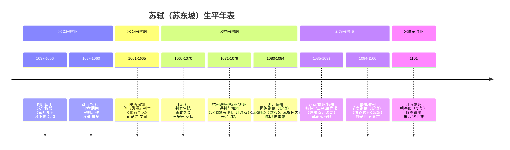
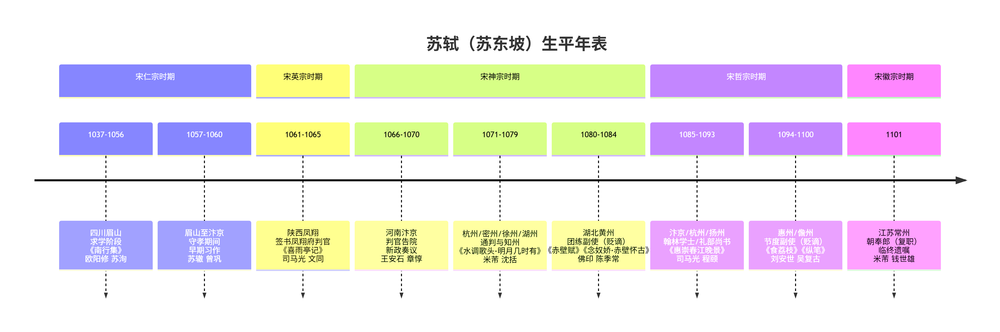

# 苏东坡

---

> 苏轼（1037—1101），字子瞻，号东坡居士，北宋著名文学家、政治家。其一生跌宕起伏，足迹遍及南北，创作与仕途紧密交织。

## 生平

| **时间段**      | **在位皇帝** | **年号**   | **所处位置**        | **所任官职**                 | **代表作品**                                                 | **同时期历史名人**           |
| --------------- | ------------ | ---------- | ------------------- | ---------------------------- | ------------------------------------------------------------ | ---------------------------- |
| **1037-1056年** | 宋仁宗       | 景祐至嘉祐 | 四川眉山            | 无（求学）                   | 早期习作（无传世名篇）                                       | 苏洵、欧阳修、梅尧臣         |
| **1057-1060年** | 宋仁宗       | 嘉祐       | 眉山→汴京           | 无（守孝）                   | 《南行集》                                                   | 苏辙、曾巩                   |
| **1061-1065年** | 宋英宗       | 治平       | 凤翔                | 签书凤翔府判官               | 《喜雨亭记》《凌虚台记》                                     | 司马光文同                   |
| **1066-1070年** | 宋神宗       | 熙宁       | 汴京                | 判官告院                     | 上书反对新法奏议                                             | 王安石、章惇、沈括           |
| **1071-1079年** | 宋神宗       | 熙宁至元丰 | 杭州→密州→徐州→湖州 | 杭州通判、密州知州、徐州知州 | 《江城子·乙卯正月二十日记梦》《水调歌头·明月几时有》《江城子·密州出猎》 | 王安石（变法派）、苏辙、米芾 |
| **1080-1084年** | 宋神宗       | 元丰       | 湖北黄州            | 黄州团练副使（虚职）         | 《赤壁赋》《念奴娇·赤壁怀古》《定风波·莫听穿林打叶声》《寒食帖》《记承天寺夜游》 | 张怀民、陈季常、佛印         |
| **1085-1093年** | 宋哲宗       | 元祐       | 汴京→杭州→颍州→扬州 | 翰林学士、礼部尚书           | 《惠崇春江晚景》《西江月·平山堂》                            | 司马光（旧党）、程颐（洛党） |
| **1094-1100年** | 宋哲宗       | 绍圣至元符 | 惠州→儋州           | 宁远军节度副使（贬谪）       | 《食荔枝》《纵笔》《汲江煎茶》《答谢民师书》                 | 刘安世（贬谪同僚）、吴复古   |
| **1101年**      | 宋徽宗       | 建中靖国   | 常州                | 复任朝奉郎（虚职）           | 临终遗嘱                                                     | 米芾、钱世雄                 |

### 重要说明：

1. **书籍引用规范**：苏轼作品集统一标注为《东坡七集》《东坡乐府》等。单篇诗词（如《水调歌头》）因无单行本，不适用书籍标签。
2. **关键事件**：**乌台诗案（1079年）**：政治转折点，贬谪黄州后创作达巅峰。**元祐更化（1086年）**：旧党复起，苏轼卷入“洛蜀党争”后自请外调。**晚年绝笔**：“问汝平生功业，黄州惠州儋州”总结贬谪生涯。
3. **地域与官职关联**：地方官任上政绩突出（如徐州抗洪、杭州筑苏堤）；贬谪期官职均为虚职（如黄州团练副使、儋州节度副使）。
4. **历史名人关系**：师友：欧阳修（科举赏识者）、王安石（政敌但晚年和解）；同辈：黄庭坚（“苏黄”并称）、苏辙（胞弟）。

