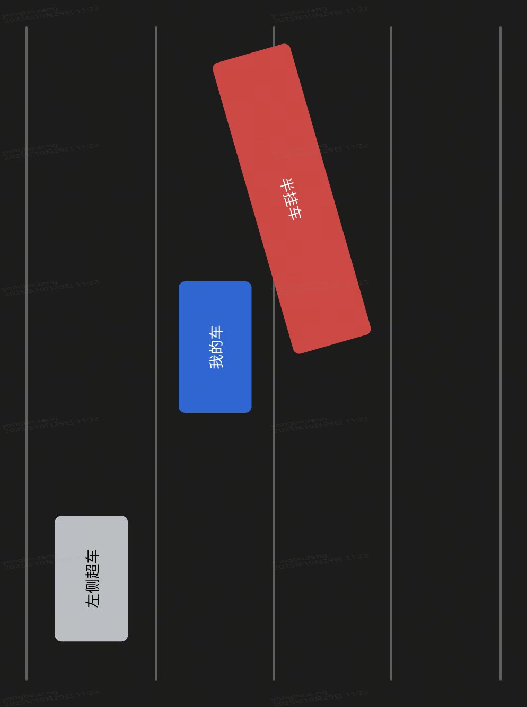

# 三环上的惊险瞬间，即将触发的名刀司命

> 十月廿七日于武汉

记录一下昨天晚上在三环上开车的惊险经历。这是我开车以来遇到的最危险的一次突发状况，险些酿成重大交通事故。

事情发生在三环。

我晚上跟凯归、钊两个发小一起在光谷六路**创新天地 kic park** 吃晚饭，饭后我开车回家，途径三环线。

武汉的三环大部分是四车道快速路。当时路上的大车比平时要多，小轿车相对少一些。大货车一般都行驶在右侧两车道，而昨晚小轿车又比较少，所以左侧两车道相对空旷。因此我一路以比较快的速度从左侧第二车道往前开，不断超越一些大货车。

事发前，我前面有一辆小轿车刚刚超过右侧一辆半挂车（也就是我即将讲到的准事发车），而我紧随其后，也在加速前进，随即准备超车。

我的车已至准事发车的车尾位置，右侧的准事发车无任何征兆（未打转向灯），突然向左变道，待我反应过来时，准事发车车头已有半个车身完成了变道，而我也已行驶到准事发车车身长度一半的位置，继续加速前进，一定会撞上准事发车前半个车身，而刹车则准事发车的后半车身大概率会扫到我车身上（因为准事发车已有半个车身完成了变道，另外半个车身必然很快进入我的车道，我的车即使瞬间刹停，也很难避免碰撞，触发我的车能往后瞬移一段距离）。

情急之下，我选择向左变道，大概偏移半个车身行驶，避开了准事发车车头，加速超车。

但是，这还不是全部，还有更惊险的剧情。

我左变道的同时，左后视镜中观察到左后方有一辆 **suv** 正在高速接近，准备对我进行超车，从后视镜中的画面估算我们之间的距离，大概三米。三米，在快速路上也是一瞬间的事儿。

幸而，后车及时踩了一脚刹车，而我也深踩了一脚油门，伴随着一股推背感，我的车瞬间飞窜出去，拉开了与后车的距离，这才避免了一场事故。我想，后车一定在事后咒骂了很久吧。

我相信，以上任何一个环节有丝毫的偏差，一场大的事故一定无法避免。不左变道则势必高速与右侧准事故半挂车相撞，而左变道又正好遇上后方车辆超车，如果后方车辆速度再快一些，可能我左变道正好与之高速相撞。

**如果开车是一场5v5的王者荣耀峡谷对战，团战爆发时，或许我会庆幸我有一辆自带“名刀司命”的沃尔沃座驾，但是，现实生活中，没有“复活甲”。**

买车以来，对于开车这件事，我一直不是很自信，一直秉持宁慢必稳的原则，有时有点谨小慎微。最近可能是开车的次数多了，有些飘了，开车总没有之前谨慎，反而有些显出急燥。

虽然这次是因为前方的准事故车无征兆左变道，但是，事故面前，没有赢家，都是受害者。这件事给我了一个深刻的教训，我在防御性驾驶方面还有很多需要学习。晚上开车时，视线本就很差，大车司机长期开车，自身疲劳驾驶也是常态，**任何时候在靠近大货车时，一定要谨慎，思虑再三**，不能把自身及家人的安全寄托在别人都正常驾驶上。具体来说，**开车时尽量远离大车**，如果需要超越前方大车，超车前不能求快，一定**先在大车后方稳定跟车行驶三至五秒，观察清楚大车的行驶意图，然后加速超过，必要时需要鸣笛或者双闪提醒，甚至每次超车尽量都鸣笛提醒，一定确保安全，不要也不能怕麻烦**。

总之，**安全第一，生命至上**。

