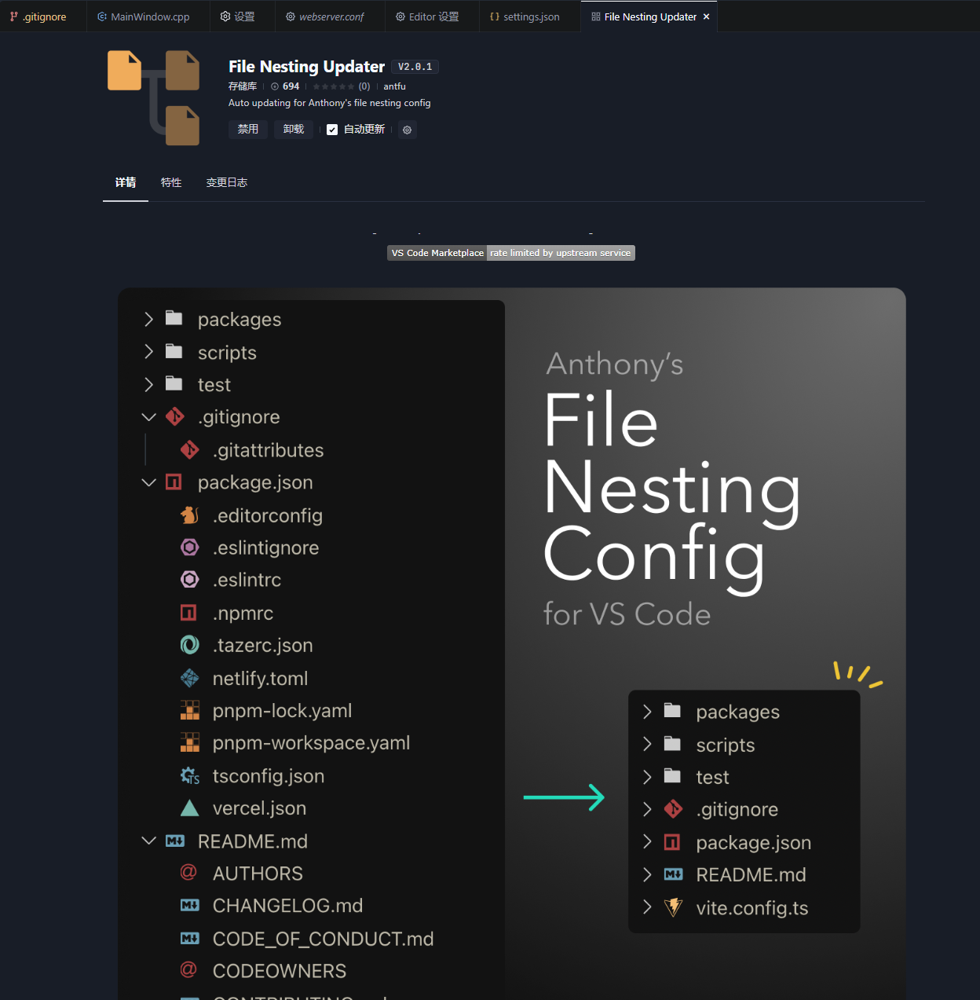

# 常用 VSCode 插件

## Auto Close Tag

自动闭合标签

## Auto Rename Tag

自动重命名标签

## Better Comments

优化注释

## Code Spell Checker

英文拼写检查

## Draw.io Integration

draw.io 插件

## Error Lens

行内展示错误信息

## Eslint

eslint

## i18n Ally

国际化插件

## Import Cost

导入包大小

## Live Server

静态服务器

## prettier

格式化代码

## Version Lens

代码插件

## GitLens

行内查看 git 提交记录

## File Nesting Updater

[vscode-file-nesting-config](https://github.com/antfu/vscode-file-nesting-config)

这个插件可以把你的项目文件，同类型的文件折叠到一块，让文件树看起来更加整洁。

## Markdown All in One Not recommended

vscode 内置的 markdown 编辑器无法支持快捷键添加格式，可安装此插件支持
(纠结了一下，还是卸载了，这个插件覆盖了太多默认快捷键，改变了很多默认输入行为，让人使用很不习惯，还是回归最本质的手动输入体验吧)

## FnMap 要收费，弃了

函数地图
