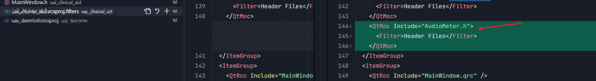

# Qt 开发FAQ

## 1. Qt 依赖包地址配置


## 2. 报对某文件的访问被拒绝

```bash
>C:\Program Files (x86)\MSBuild\Microsoft.Cpp\v4.0\V140\Microsoft.CppClean.targets(76,5): warning : 对路径“d:\project\xxx\bin\debug_x86\xxx.exe”的访问被拒绝。
```

这个错误提示在 Qt 项目编译过程中很常见，通常是由于目标文件被占用或权限不足导致的。

- **关闭正在运行的程序**

- **检查文件权限**

  - 右键`xxx.exe`文件，选择 "属性"

  - 切换到 "安全" 选项卡，确保当前用户有 "修改" 和 "写入" 权限

- **清理并重建项目**

- **以管理员身份运行**

- **检查是否被其他程序占用**

- **修改输出目录权限**

  - 右键`debug_x86`文件夹，选择 "属性"

  - 在 "安全" 选项卡中给当前用户添加完全控制权限

## 3. visualStudio 添加新的.cpp 和 .h 文件时，需要在工作空间点击菜单添加，或修改项目下的 .vcxproj 文件添加

- visualStudio 添加


- .vcxproj 文件添加


- .vcxproj.filters 添加




:warning:不添加会报这个错误：

```tex
错误 LNK2019 无法解析的外部符号 "public: __thiscall AudioMeter::AudioMeter(class QWidget *)" (??0AudioMeter@@QAE@PAVQWidget@@@Z)，该符号在函数 "public: __thiscall MainWindow::MainWindow(class QWidget *)" (??0MainWindow@@QAE@PAVQWidget@@@Z) 中被引用 uai_clinical_aid 
```


## 关于 qt 里 margin 的方向写法

已 `setContentsMargins` 为例

```c++
mainLayout->setContentsMargins(16,40, 16, 24);
```

方向依次为：`(left, top, right, bottom)`

与 `css` 里的 `(top, right, bottom, left)` 不同


## QBoxVLayout 和 QBoxHLayout 中使用 **`addStretch()`** 的时机问题

元素集中在底部的原因是在添加任何实际控件**之前**，就在垂直主布局 `v_main_layout`中先添加了一个拉伸项 (`addStretch()`)。这会占据所有可用空间，把后续内容都“推”到底部。


### 如何修复

要让元素从顶部开始排列，你有两个主要方法：

1. **移除先前的拉伸**：将 `v_main_layout->addStretch();`这行代码**移动到**你所有需要顶部对齐的控件都添加到布局**之后**。
2. **使用对齐方式**：确保设置了布局的整体对齐方式为 `Qt::AlignTop`，但这通常需要与正确的拉伸项位置配合使用。

**修改后的代码片段可能如下：**

```
// ... (play_panel 的初始化代码不变)

// 添加一个垂直主 layout
QVBoxLayout* v_main_layout = new QVBoxLayout(play_panel);
v_main_layout->setContentsMargins(16, 16, 16, 16);
v_main_layout->setSpacing(10);
// 设置元素顶部对齐 【setAlignment 的作用是设置布局内控件整体的对齐方式，但需与拉伸因子配合】
v_main_layout->setAlignment(Qt::AlignTop); // 先保留着，但核心问题不在这

// 先添加你的实际内容（例如 h_line1_layout）
QHBoxLayout* h_line1_layout = new QHBoxLayout();
// ... 设置 h_line1_layout 的属性 (spacing, alignment 等) ...
// ... 向 h_line1_layout 添加 lb_recording 和 audioControlBar ...
v_main_layout->addLayout(h_line1_layout); // 先把内容布局加进去

// ！然后！再添加拉伸，这样拉伸会占据剩余空间，将之前的内容推向顶部
v_main_layout->addStretch();

// ... (可能还有其他要添加到 v_main_layout 的内容，都应加在 addStretch() 之前)

// dialog 默认不显示
play_panel->hide();
```

**关键修改说明：**

- **调整了 `addStretch()`的位置**：在所有你希望被“顶”到顶部的内容**之后**再添加拉伸项。这样，拉伸项会填满剩余空间，从而确保之前添加的控件集中在布局顶部。
- `v_main_layout->setAlignment(Qt::AlignTop);`这行代码保留了，它对布局内控件的整体对齐方式有影响，但解决这个特定问题的核心是调整拉伸项的位置。

### Qt 布局技巧

- **`addStretch()`的位置至关重要**：在添加控件**之前**调用 `addStretch()`，它会在控件**上方**（或左侧，对于 `QHBoxLayout`）创建弹性空间；在添加控件**之后**调用，则空间会在控件**下方**（或右侧）。:do_not_litter:这个特性确实要慎用，用对时机和位置很重要
- **`setAlignment`**：用于设置布局内控件**整体**的对齐方式（如所有控件都左对齐、顶部对齐），或者通过 `setAlignment(widget, alignment)`设置**特定控件**在布局单元格内的对齐方式。但它通常无法克服由拉伸项或大小策略决定的整体布局分配。


## QWidget 设置背景颜色时，需启用此特性，否则设置不会生效

```c++
    this->setObjectName("AudioStatusBar")
    this->setAttribute(Qt::WA_StyledBackground, true);
    this->setAutoFillBackground(true); // 需启用，否则定义 widget 的背景色不生效
    this->setStyleSheet(R"(
        QWidget#AudioStatusBar {
            background-color: #F4F4F4;
        }
    )");
```

